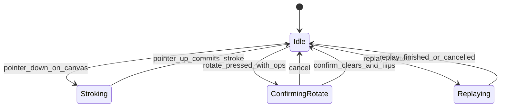

# Slice 1: Drawing Canvas & Stroke Engine
## Reusable drawing surface (brush/fill/undo/clear/rotate), the DrawingDoc op model, deterministic rasterization, and stroke replay

**Version:** 1.0
**Last Updated:** 2026-07-04
**Dependencies:**
- Skeleton (constants, theme, `Nav` routes, GdUnit4 harness — no networking, no `Save` writes in this slice)

**Provides:** `DrawingCanvas` reusable component (`ui/canvas/`), `DrawingDoc` op model + canonical JSON serialization (consistency guide §6), `DocRasterizer` (deterministic CPU raster incl. bucket fill), `ReplayPlayer` (timed, capped stroke replay), versioned palette constant table, `ConfirmDialog` shared component, save-to-collection toggle state

> This slice spans **two work sessions**: Chunk 2 (Part 1: stroke model, canvas rendering, brush, palette, undo/clear, serialization) and Chunk 3 (Part 2: bucket fill, rotate, replay renderer, save-toggle stub, golden determinism tests). The Implementation Checklist (§12) is split accordingly.

---

## 1. Overview

This slice builds the drawing engine everything else renders through: the op-list drawing model ("strokes, not pixels" — consistency guide principle 3), a deterministic CPU rasterizer, a replayer, and a reusable canvas UI component. It is **fully offline** — no RPCs, no `user://` writes. Later slices consume it: the round screens embed the canvas (Slice 3), kudos/self-save write the resulting `DrawingDoc` to the collection (Slice 4), reveal screens replay docs (Slice 5), the browser exports them (Slice 8), and the avatar editor reuses the canvas with a circular mask (Slice 11).

**Determinism is a hard requirement** (consistency guide principle 4). A bucket fill is an op replayed against the rasterized state of all prior ops at the fixed internal resolution (800×600 landscape / 600×800 portrait). The same op list must produce bit-identical pixels on every machine and platform, verified by golden image-hash tests. Consequently **all pixels are produced by CPU code** (`DocRasterizer` stamping into an `Image`); the GPU only *displays* the finished texture. The `SubViewport` exists at the fixed internal resolution to host the canvas content and give a clean letterbox/scale boundary (consistency guide §12), never to generate authoritative pixels.

### Scope

**In Scope — Part 1 (Chunk 2):**
- `DrawingDoc` / op data model (stroke, fill, clear) + JSON serialization exactly per consistency guide §6
- Versioned palette constant table: 12 base color families, each expandable to preset shades
- `DocRasterizer` stroke stamping; live drawing into an `Image` shown via `SubViewport`
- Brush tool with 3 sizes; undo (pops last op, any type); clear (recorded as an op)
- `DrawingCanvas` component + toolbar + palette picker; dev sandbox screen for playtesting
- Serialization round-trip + validation tests

**In Scope — Part 2 (Chunk 3):**
- Bucket fill op (deterministic flood fill on the raster state)
- Rotate landscape↔portrait with confirmation dialog (clears canvas)
- `ReplayPlayer` with per-op timestamp timing, speed multiplier, duration cap
- Save-to-collection toggle UI stub (state + signal only)
- `ConfirmDialog` shared component (`ui/shared/`)
- Golden determinism tests (stroke raster, fill, replay end-state)

**Out of Scope (Later Slices):**
- Writing drawings anywhere (collection write path — Slice 4; avatar file — Slice 11)
- Sending docs over the network, submission at timer end (Slice 3)
- Reveal-time replay settings (off/winner/full, per-mode speeds — Slices 5/6)
- Circular mask *behavior* (hook is added here; implementation + tests — Slice 11)
- PNG export (Slice 8)
- Eraser as a distinct tool — per brief (§6) the tool set is brush/fill/undo/clear/rotate; "erasing" is drawing in white (palette family 0)

### User Flows
1. **Draw:** pick color (tap family; long-press/expand for shades) → pick brush size → drag on canvas → stroke appears live, committed on release.
2. **Fix a mistake:** press Undo — last op (stroke, fill, *or* clear) disappears. Press Clear — canvas wipes (recorded as an op so replays show it).
3. **Rotate:** press Rotate → if the canvas has any ops, a confirm dialog warns the canvas will be cleared → confirm → orientation flips, ops reset. (Coordinate space changes; a simple destructive rotate keeps the game moving — brief §1 north star.)
4. **Replay (dev sandbox):** press Replay → drawing re-draws itself with original pacing, sped up so it never exceeds ~10 s.

---

## 2. Data Models

### DrawingOp hierarchy

**Files: `game/drawing/drawing_op.gd`, `game/drawing/stroke.gd`, `game/drawing/fill_op.gd`, `game/drawing/clear_op.gd`**

```gdscript
class_name DrawingOp
extends RefCounted
## Base class for one entry in a DrawingDoc op list.

enum Type { STROKE, FILL, CLEAR }

var type: Type
```

```gdscript
class_name Stroke
extends DrawingOp
## One continuous brush drag. Points are in INTERNAL canvas coordinates,
## quantized to 0.1 px; timestamps are seconds since drawing start,
## quantized to 1 ms. Quantization happens at capture time so
## serialize -> parse -> rasterize is bit-identical to live rasterize.

var color_index: int              # index into Palette.COLORS
var size_index: int               # 0 | 1 | 2 -> GameConstants.BRUSH_RADII_PX
var points: PackedVector2Array    # >= 1 point (a dot is a 1-point stroke)
var timestamps: PackedFloat32Array  # same length as points, non-decreasing
```

```gdscript
class_name FillOp
extends DrawingOp
## Bucket fill seeded at (x, y) in internal coordinates with palette color.
var color_index: int
var x: int
var y: int
```

```gdscript
class_name ClearOp
extends DrawingOp
## Wipes the canvas to Palette.CANVAS_BACKGROUND. Recorded (not destructive
## to history) so replays show the wipe.
```

### DrawingDoc model

**File: `game/drawing/drawing_doc.gd`**

```gdscript
class_name DrawingDoc
extends RefCounted

const FORMAT_VERSION := 1

var orientation: StringName = &"landscape"   # &"landscape" | &"portrait" (Slice 11 adds &"avatar")
var ops: Array[DrawingOp] = []

func to_dict() -> Dictionary          # canonical wire/save format below
static func from_dict(data: Dictionary) -> DrawingDoc  # null on invalid (never crashes)
func canvas_size() -> Vector2i        # from GameConstants by orientation
func natural_duration_sec() -> float  # last stroke timestamp, 0.0 for empty/stroke-less docs
```

**Fields:**
| Field | Type | Required | Description |
|-------|------|----------|-------------|
| orientation | StringName | Yes | Selects internal resolution: 800×600 / 600×800 |
| ops | Array[DrawingOp] | Yes | Ordered op list; empty = blank drawing (legal) |

### Canonical serialized format (consistency guide §6 — do not deviate)

```json
{
  "v": 1,
  "orientation": "landscape",
  "ops": [
    {"t": "stroke", "c": 4, "s": 1, "pts": [x0,y0, x1,y1, ...], "ts": [0.0, 0.016, ...]},
    {"t": "fill", "c": 7, "x": 120, "y": 88},
    {"t": "clear"}
  ]
}
```

`c` = palette color index, `s` = brush size index, `pts` = flattened point pairs (internal coords), `ts` = per-point seconds since drawing start (one per point pair). Fill/clear ops carry **no timestamps**; replay assigns them a constant nominal duration (§6 Business Logic).

**`from_dict` validation rules** (this format later arrives over the network in Slice 3, so validation is strict and silent-failing): `v` must be int ≤ `FORMAT_VERSION` (higher → null + warning); `orientation` in the known set; every op `t` known; `c` in `[0, Palette.COLORS.size())`; `s` in `[0, 3)`; `pts` even-length with `len(ts) == len(pts) / 2`; `ts` non-decreasing; fill `x`/`y` inside the canvas rect. Any violation → return `null`, `push_warning`. Callers treat null as "no drawing".

### Palette constant table

**File: `core/constants/palette.gd`**

```gdscript
class_name Palette
## Versioned palette. c indices in DrawingDocs point here FOREVER:
## the table is APPEND-ONLY — never reorder, remove, or recolor an existing
## index. A reorder would silently recolor every saved drawing.

const PALETTE_VERSION := 1
const FAMILY_COUNT := 12
const SHADES_PER_FAMILY := 5
const BASE_SHADE := 2   # middle shade of each family is the "base" swatch

# Flat table; index = family * SHADES_PER_FAMILY + shade.
# Family 0 is greyscale (shade 0 = white, shade 4 = black) so "erase" is
# just painting white. Families 1..11: red, orange, yellow, green, teal,
# blue, navy, purple, pink, brown, tan. Exact hex values chosen in
# implementation; sanity-tested (60 entries, all distinct, family 0 shade 0
# == background).
const COLORS: Array[Color] = [ ... ]           # 60 entries

const CANVAS_BACKGROUND := Color.WHITE          # == COLORS[0]

static func base_index(family: int) -> int     # family * SHADES_PER_FAMILY + BASE_SHADE
static func family_of(color_index: int) -> int # color_index / SHADES_PER_FAMILY
```

### Constants added to `core/constants/game_constants.gd`

| Constant | Value | Source |
|----------|-------|--------|
| `BRUSH_RADII_PX := PackedInt32Array([3, 7, 14])` | brush size indices 0/1/2 | brief §6 (three sizes) |
| `STROKE_MIN_POINT_DIST_PX := 2.0` | input decimation threshold | perf (§12 guide) |
| `STROKE_MAX_POINTS := 4096` | per-stroke sanity cap | network payload sanity |
| `REPLAY_MAX_DURATION_SEC := 10.0` | 30 s drawing replays in ≤ ~10 s | brief §7 |
| `REPLAY_MAX_OP_GAP_SEC := 1.0` | inter-op idle time compressed to this | brief §7 "snappy" |
| `REPLAY_NON_STROKE_OP_SEC := 0.25` | nominal fill/clear replay duration | fills have no `ts` |
| `FILL_BUDGET_MS := 50` | fill must finish within this on main thread | consistency guide §12 |

(`CANVAS_LANDSCAPE`/`CANVAS_PORTRAIT` already exist from the Skeleton.)

---

## 3. Event/Action Definitions

**RPCs: N/A** — this slice is fully offline; the canvas never touches `Net`. Docs travel over RPC starting in Slice 3 (as `to_dict()` dictionaries).

**EventBus additions: none.** All signals are local, node-level signals on the owning component (consistency guide §5 — EventBus is for cross-feature events only; nothing here crosses features yet).

### Local signals on `DrawingCanvas` (`ui/canvas/drawing_canvas.gd`)

| Signal | Params | Emitted when |
|--------|--------|--------------|
| `op_committed` | `(op_index: int)` | A stroke finishes (pointer up), or a fill/clear op is applied |
| `op_undone` | `(remaining_count: int)` | Undo pops an op |
| `doc_changed` | `()` | Any change to the op list (commit, undo, rotate reset) |
| `orientation_changed` | `(orientation: StringName)` | Rotate confirmed and applied |
| `save_toggle_changed` | `(enabled: bool)` | Save-to-collection toggle flipped (Slice 4 consumes) |
| `replay_finished` | `()` | A replay driven through this canvas completes |

### Local signals on `ReplayPlayer` (`game/drawing/replay_player.gd`)

| Signal | Params | Emitted when |
|--------|--------|--------------|
| `op_started` | `(op_index: int)` | Playhead reaches an op (Slice 5 uses for reveal beats) |
| `finished` | `()` | Playhead passes the last op |

---

## 4. Storage Schema Extensions

**No `user://` files are written by this slice.** The canvas produces an in-memory `DrawingDoc` plus the save-toggle boolean; actual persistence is owned by later slices.

What this slice *does* own is the **canonical DrawingDoc JSON format** (§2 above) that every later `user://` file containing a drawing uses verbatim:

| Future file | Written by | Content |
|-------------|-----------|---------|
| `user://collection/<uuid>.json` | Slice 4 | One DrawingDoc |
| `user://avatar.json` | Slice 11 | One DrawingDoc (`orientation: "avatar"`) |

**Versioning contract:** the doc carries `"v": 1`. Any future format change bumps `FORMAT_VERSION`, and `from_dict` migrates older versions forward (consistency guide §6). The palette table is append-only (§2) so `v` does not need to change when colors are *added*.

---

## 5. State Machines

### Canvas input state machine



### States

| State | Description | Terminal? |
|-------|-------------|-----------|
| Idle | Accepting tool/palette input and new strokes | No |
| Stroking | Pointer held; points captured + stamped live; toolbar (undo/clear/fill/rotate) disabled | No |
| ConfirmingRotate | Modal `ConfirmDialog` up; canvas input blocked | No |
| Replaying | `ReplayPlayer` owns the raster; drawing input blocked | No |

### Transition Rules

| Current | Trigger | New | Validation | Side Effects |
|---------|---------|-----|------------|--------------|
| Idle | pointer down inside canvas rect, brush tool | Stroking | position mapped to internal coords | New `Stroke` begun; first point stamped |
| Stroking | pointer up (or focus lost) | Idle | stroke has ≥ 1 point | Op appended; `op_committed`, `doc_changed` |
| Idle | pointer down, fill tool active | Idle | seed inside rect | `FillOp` applied + committed immediately |
| Idle | rotate pressed, `ops.is_empty()` | Idle | — | Orientation flips instantly, **no dialog** (nothing to lose) |
| Idle | rotate pressed, ops exist | ConfirmingRotate | — | `ConfirmDialog` shown |
| ConfirmingRotate | confirm | Idle | — | `ops` cleared, orientation flipped, raster reset, `orientation_changed` + `doc_changed` |
| Idle | undo pressed | Idle | `not ops.is_empty()` | Last op popped; **full re-raster** of remaining ops; `op_undone` |

There is **no redo** in v1 (brief §6 lists undo only).

---

## 6. Business Logic

### DocRasterizer

**File: `game/drawing/doc_rasterizer.gd`**

**Purpose:** the single source of truth for pixels. Every consumer — live canvas, replay, reveal grid (Slice 5), thumbnails/export (Slice 8), avatar chip (Slice 11) — rasterizes through this class, so identical op lists are identical images everywhere.

```gdscript
class_name DocRasterizer
extends RefCounted

## Creates the blank canvas: RGBA8 Image filled with Palette.CANVAS_BACKGROUND.
static func new_canvas_image(size: Vector2i) -> Image

## Applies one op to img in place. Deterministic: integer/fixed-step math only,
## no AA, no GPU. mask reserved for Slice 11 (circular avatar canvas); null = no mask.
static func apply_op(img: Image, op: DrawingOp, mask: Image = null) -> void

## Stamps a partial stroke segment (points[from_idx..to_idx]) — used for
## incremental live drawing and timed replay so partial == full rendering.
static func stamp_stroke_range(img: Image, stroke: Stroke, from_idx: int, to_idx: int, mask: Image = null) -> void

## Full re-raster (undo, initial display of a received doc, golden tests).
static func rasterize(doc: DrawingDoc) -> Image

## SHA-256 hex of raw pixel bytes — the golden-test primitive.
static func image_hash(img: Image) -> String
```

**Determinism rules (binding):**
1. **Brush stamp:** filled hard-edged circle of radius `BRUSH_RADII_PX[s]`, center at `Vector2i(roundi(x), roundi(y))`, per-pixel `dx*dx + dy*dy <= r*r` test. No anti-aliasing.
2. **Segments:** between consecutive points, stamp at fixed steps of 1.0 px along the segment (inclusive of both ends), computed with the same rounding everywhere. A 1-point stroke is a single stamp (dots work).
3. **Fill:** scanline flood fill, 4-connected, seeded at `(x, y)`. Target = exact RGBA at seed (exact match is safe — no AA means every pixel is an exact palette/background color). Filling with the seed's own color is a no-op. O(pixels) on an 800×600 `Image`; must stay under `FILL_BUDGET_MS` (test asserts worst case: full-canvas fill).
4. **Order:** ops apply strictly in list order; fill sees the raster of everything before it — this is what makes fill-in-replay exact.
5. Rendering is resolution-independent only at *display* time (scale the finished texture); never at raster time (consistency guide §6).

### ReplayPlayer

**File: `game/drawing/replay_player.gd`**

```gdscript
class_name ReplayPlayer
extends RefCounted

signal op_started(op_index: int)
signal finished()

## speed_multiplier >= 1.0; caller (Slice 5/6 settings, sandbox UI) supplies it.
func load_doc(doc: DrawingDoc, speed_multiplier: float = 1.0) -> void
func advance(delta: float) -> bool      # false when finished; call each frame
func get_image() -> Image               # current raster (push to an ImageTexture)
func skip_to_end() -> void              # instant finish (Slice 5 "skip" affordance)
```

**Schedule computation** (`load_doc`, precomputed per consistency guide §12):
1. Natural times: a stroke starts at `ts[0]`, ends at `ts[last]`; a fill/clear op has duration `REPLAY_NON_STROKE_OP_SEC` and starts after the previous op ends (it has no timestamps of its own).
2. **Gap compression:** the idle gap before each op (including dead time before the first op) is clamped to `REPLAY_MAX_OP_GAP_SEC`. Within-stroke pacing is kept as-is (it *is* the performance).
3. Compressed natural duration `D` = sum of op durations + clamped gaps.
4. Effective rate `rate = max(speed_multiplier, D / REPLAY_MAX_DURATION_SEC)` — so a 30 s drawing always finishes in ≤ ~10 s regardless of the requested speed (brief §7).
5. `advance(delta)` moves the playhead by `delta * rate` and stamps every point/op whose scheduled time has passed, via `stamp_stroke_range`/`apply_op` — so the **replay end-state is bit-identical to `rasterize(doc)`** (golden test).
6. Empty doc → `finished` on the first `advance`; zero-duration docs never divide by zero (`rate = speed_multiplier` when `D == 0`).

### DrawingCanvas controller logic

**File: `ui/canvas/drawing_canvas.gd`** (component script; see §7 for scene)

Key behaviors:
- **Clock:** `begin_drawing()` zeroes the internal clock; every captured point records `_clock_sec` (quantized to 1 ms). Round screens call it when the drawing phase starts (Slice 3); the sandbox calls it on open.
- **Input capture:** display → internal coordinate mapping through the letterbox transform; positions clamped to the canvas rect while stroking (dragging off-canvas keeps drawing at the clamped edge, standard paint-app behavior). Points closer than `STROKE_MIN_POINT_DIST_PX` to the previous point are dropped (decimation), except the final point on release. Points quantized to 0.1 px at capture.
- **Live raster:** each new point stamps incrementally via `stamp_stroke_range` into the working `Image`; texture updated once per frame. Full re-raster **only** on undo, rotate, or doc load (consistency guide §12).
- **Undo:** pops the last op of any type (stroke, fill, clear) and re-rasters. Undo of a clear restores the pre-clear picture — this is why clear is an op.
- **API surface** (consumed by Slices 3/11):

```gdscript
func begin_drawing() -> void                       # reset doc + clock, keep orientation
func get_doc() -> DrawingDoc                       # live doc (submission snapshot: get_doc().to_dict())
func load_doc(doc: DrawingDoc) -> void             # display an existing doc (viewer/editor reuse)
func set_tools_enabled(enabled: bool) -> void      # Slice 3 disables at timer end
var save_to_collection: bool                       # toggle state; read at submission (Slice 4)
@export var show_rotate: bool = true               # Slice 11 hides (fixed orientation)
@export var show_save_toggle: bool = true          # Slice 11 hides
@export var mask_mode: MaskMode = MaskMode.NONE    # extension point — see below
```

**Circular mask extension point (Slice 11):** `enum MaskMode { NONE, CIRCLE }` exists now; when `CIRCLE`, the canvas will (a) pass a mask `Image` to all rasterizer calls so stamps/fills never escape the circle, and (b) clip the displayed texture to the circle. In Slice 1 the enum, the `mask` parameters, and the display-clip node exist but only `NONE` is exercised or tested; Slice 11 implements and golden-tests `CIRCLE` at 512×512.

---

## 7. UI Components

### DrawingCanvas Component

**Files: `ui/canvas/drawing_canvas.tscn` + `ui/canvas/drawing_canvas.gd`**

**Purpose:** the complete, embeddable drawing surface — canvas view + toolbar + palette. Round screens (Slice 3) and the avatar editor (Slice 11) instantiate this one scene.

**Layout (landscape orientation shown):**
```
+---------------------------------------------------+
| [Sz S][Sz M][Sz L] [Brush][Fill] [Undo][Clear][Rot]|   CanvasToolbar
+---------------------------------------------------+
|            +---------------------------+          |
|            |                           |          |   AspectContainer >
|            |   SubViewportContainer    |          |   SubViewport (800x600)
|            |   (letterboxed canvas)    |          |   > TextureRect (raster)
|            |                           |          |
|            +---------------------------+          |
+---------------------------------------------------+
| [c][c][c][c][c][c][c][c][c][c][c][c]  [Save: off] |   PalettePicker + SaveToggle
+---------------------------------------------------+
```

Node structure: `DrawingCanvas (VBoxContainer)` → `CanvasToolbar`, `AspectRatioContainer` → `SubViewportContainer` → `SubViewport` (fixed 800×600 or 600×800, swapped on rotate) → `TextureRect` (displays the raster `ImageTexture`). The `AspectRatioContainer` letterboxes so the window stays freely resizable (consistency guide §8); all styling via `main_theme.tres` except the palette swatches themselves (the one sanctioned hardcoded-color exception).

**User Interactions:**
| Action | Trigger | Result |
|--------|---------|--------|
| Draw stroke | drag on canvas with brush tool | Live stamped stroke; committed on release |
| Dot | click without drag | 1-point stroke |
| Bucket fill | click on canvas with fill tool | Region flood-filled; op committed |
| Change size | click size button | `size_index` set; buttons show pressed state |
| Pick base color | click swatch | `color_index = Palette.base_index(family)` |
| Expand shades | right-click / long-press swatch (or click ▸) | Popup row of the family's 5 preset shades |
| Undo | Undo button / Ctrl+Z | Last op removed, re-raster |
| Clear | Clear button | `ClearOp` appended (undoable, replayable) |
| Rotate | Rotate button | Instant flip if empty; else `ConfirmDialog` → flip + wipe |
| Save toggle | click toggle | `save_to_collection` flips; `save_toggle_changed` (no persistence yet — Slice 4) |

### PalettePicker Component

**Files: `ui/canvas/palette_picker.tscn` + `ui/canvas/palette_picker.gd`**

> **Update (2026-07-06):** Redesigned per owner playtest — see Decision Log "Palette picker redesign". Per-family shade popups replaced by: an **"All colors" overlay grid** (all 60 presets at once, families as light→dark columns) plus **3 custom quick-slots** the player fills by dragging colors from the grid/base row (click to reuse, right-click to clear, session-only). Selection is an explicit outlined-swatch state that persists until the next pick. Supporting components: `palette_swatch.gd` (drag source + selection visual), `palette_slot.gd` (drop target).

12 base swatches (one per family, showing `base_index(family)`). Selecting any swatch selects that exact `c` index and shows it as the current-color indicator. No freeform color mixing anywhere (brief §6). Output: `color_selected(color_index: int)` signal.

### CanvasToolbar Component

**Files: `ui/canvas/canvas_toolbar.tscn` + `ui/canvas/canvas_toolbar.gd`**
Size ×3, tool (brush/fill), undo (disabled when doc empty or while stroking), clear, rotate (hidden when `show_rotate == false`). Min click targets 32×32 px (consistency guide §13). Signals: `size_selected(size_index: int)`, `tool_selected(tool: Tool)`, `undo_pressed()`, `clear_pressed()`, `rotate_pressed()`.

### ConfirmDialog Shared Component

**Files: `ui/shared/confirm_dialog.tscn` + `ui/shared/confirm_dialog.gd`**
Generic modal: `ask(title: String, body: String, confirm_label: String)` → `confirmed()` / `cancelled()` signals. Built here for rotate ("Rotating clears your drawing. Rotate anyway?"); reused by Slice 8 (delete) and beyond.

### Canvas Sandbox Screen (dev-only)

**Files: `ui/canvas/canvas_sandbox_screen.tscn` + `.gd`**, route `Routes.CANVAS_SANDBOX`, button on the main menu **in debug builds only** (`OS.is_debug_build()`). Hosts a `DrawingCanvas` plus dev controls: Replay button, speed slider (1×–8×), doc-JSON dump/load to clipboard. This is the playtest surface for the Chunk 2/3 gates until Slice 3's round screens exist.

### User Confirmation Checkpoints

**Blocking (per `workflows/testing-protocol.md` — the next chunk's work depends on the answer):**
- [ ] **End of Chunk 2 — drawing feel:** strokes track the cursor with no visible lag or gaps at fast speeds; the three brush sizes feel usefully distinct; palette expand works. (Blocks Part 2 polish and Slice 3's canvas embed.)
- [ ] **End of Chunk 3 — fill + replay correctness:** bucket fill fills the expected region (incl. after undo/clear sequences); replay reproduces the drawing with believable pacing and never exceeds ~10 s. (Blocks Slices 4/5/8 which all trust the doc + replay.)

**Batchable (queue for slice completion / session end):**
- [ ] Palette shade popup placement/feel; current-color indicator clarity
- [ ] Letterboxing looks right at odd window sizes; portrait mode layout
- [ ] Rotate confirm dialog wording/feel; instant rotate on empty canvas
- [ ] Undo button disabled-state timing; save-toggle visibility (off by default per brief §6)

---

## 8. State Management

**No new autoloads.** Per the consistency guide (§5, §8), state lives in the component and flows out via local signals; the EventBus is untouched until a cross-feature consumer exists (Slice 4).

**State shape (owned by `DrawingCanvas`):**
```
{
  doc: DrawingDoc,             # ops + orientation — the single source of truth
  raster: Image,               # derived cache of doc (+ in-progress stroke)
  current_color_index: int,    # default Palette.base_index(FAMILY_BLACK... family 0 shade 4)
  current_size_index: int,     # default 1 (medium)
  current_tool: Tool,          # BRUSH | FILL
  input_state: InputState,     # §5 state machine
  save_to_collection: bool,    # default false (brief §6)
  clock_sec: float             # since begin_drawing()
}
```

**Access pattern for consumers:** embed the scene, call `begin_drawing()` at phase start, read `get_doc()` / `save_to_collection` at submission, listen to `doc_changed` if live-reactive UI is needed. Consumers never reach into child nodes (no `get_parent()`/`get_node` reach-arounds — consistency guide §8).

`ReplayPlayer` is deliberately **not** a node: pure logic driven by `advance(delta)` from whatever node hosts it (sandbox screen now; reveal screens in Slice 5), keeping it headless-testable.

---

## 9. Integration Points

### Dependencies (What This Slice Needs)

#### From Skeleton
- `core/constants/game_constants.gd`: `CANVAS_LANDSCAPE`, `CANVAS_PORTRAIT`; this slice appends its constants there (§2)
- `core/theme/main_theme.tres`: all UI styling
- `Nav` + `Routes`: sandbox screen registration
- GdUnit4 harness: all tests below

### Provides (What This Slice Offers)

#### For Future Slices
- **`DrawingCanvas` component** — Slice 3 embeds in the drawer phase screen (`begin_drawing`, `set_tools_enabled(false)` at timer end, `get_doc().to_dict()` as the submission payload); Slice 11 embeds with `mask_mode = CIRCLE`, `show_rotate = false`, `show_save_toggle = false`
- **`DrawingDoc` + `from_dict` validation** — Slice 3's host-side submission validation calls `DrawingDoc.from_dict()` and drops nulls silently (consistency guide §4)
- **`save_to_collection` toggle state** — Slice 4 reads it at submission and performs the actual collection write
- **`DocRasterizer`** — Slice 5 (reveal grid textures), Slice 8 (thumbnails, PNG export), Slice 11 (avatar chip rendering)
- **`ReplayPlayer`** (+ `op_started` beats, `skip_to_end`) — Slice 5 reveal/winner replay, Slice 8 collection viewer
- **`ConfirmDialog`** — Slice 8 delete confirm, and any later destructive action
- **Circular mask hook** — Slice 11

### Integration Checklist
- [ ] Constants appended to `core/constants/game_constants.gd`; `core/constants/palette.gd` created
- [ ] No EventBus changes (verified — none needed)
- [ ] `Routes.CANVAS_SANDBOX` added; main menu debug button wired
- [ ] No save schema changes (format ownership documented in §4)
- [ ] Tests mirror-pathed under `tests/game/drawing/` and `tests/ui/canvas/`

---

## 10. Edge Cases

### Empty doc replay
**Scenario:** replaying a `DrawingDoc` with zero ops (player never drew).
**Handling:** `ReplayPlayer` emits `finished` on the first `advance`; image is the blank background. No error.
**Rationale:** blank submissions are legal and common (brief: whatever is on the canvas auto-submits).

### Undo on empty doc / during a stroke
**Scenario:** undo pressed with no ops, or mid-drag.
**Handling:** button disabled in both cases; a stray Ctrl+Z is a silent no-op.
**Rationale:** never mutate mid-op; keep the op list the only history.

### Fill no-ops and degenerate fills
**Scenario:** fill seeded on a pixel already the fill color; fill on untouched canvas; fill seeded on a 1-px stroke pixel.
**Handling:** same-color fill applies as a visual no-op **but is still recorded as an op** (uniform rule: every user action that targets the doc is an op; undo/replay stay predictable). Fill on blank canvas floods everything (fast path still under budget). Seeding on a stroke color fills that stroke's connected pixels.
**Rationale:** uniform recording is simpler and deterministic; "smart" op suppression invites host/client doc divergence later.

### Rotate with empty canvas
**Scenario:** rotate pressed before any op.
**Handling:** instant flip, no confirmation dialog (nothing to lose).
**Rationale:** the dialog exists to prevent loss, not to add friction (brief §1: keep the game moving).

### Very fast scribbling / point flood
**Scenario:** high-polling-rate mouse produces thousands of points in seconds.
**Handling:** decimation (`STROKE_MIN_POINT_DIST_PX`) plus `STROKE_MAX_POINTS` hard cap per stroke (points beyond the cap extend the stroke visually but the op force-commits and a new stroke begins).
**Rationale:** bounds doc size (network payload in Slice 3 targets < 50 KB) without visible quality loss.

### Focus/window loss mid-stroke
**Scenario:** alt-tab or window drag while stroking.
**Handling:** `NOTIFICATION_WM_WINDOW_FOCUS_OUT` / mouse-exit with button release commits the in-progress stroke as-is.
**Rationale:** never leave the input SM stuck in `Stroking`.

### Malformed doc from disk/network (future consumers)
**Scenario:** `from_dict` receives corrupt or hostile data (wrong types, out-of-range indices, `v: 99`).
**Handling:** returns `null` + `push_warning`; callers substitute "no drawing". Exhaustively unit-tested **now** so Slices 3/4/8/11 inherit hardened parsing.
**Rationale:** consistency guide §4/§7 — untrusted input never crashes.

### Float precision across serialize/parse
**Scenario:** JSON round-trip alters float bits, changing raster hashes.
**Handling:** points quantized to 0.1 px and timestamps to 1 ms *at capture*; `to_dict` writes the already-quantized values; golden test asserts hash(live raster) == hash(raster of parse(serialize(doc))).
**Rationale:** determinism must survive the wire, not just the session.

### Performance Considerations
- Incremental stamping only (new points per frame); `Image` → `ImageTexture.update()` once per frame, not per point.
- Full re-raster (undo/rotate/load) of a worst-case doc must stay comfortably under one frame at 800×600; measured in tests (soft assert < 100 ms headless).
- Fill budget < `FILL_BUDGET_MS` (consistency guide §12); scanline implementation, no recursion (stack overflow risk).

---

## 11. Testing Strategy

Per `workflows/testing-protocol.md`: tests written alongside each part, run before every checklist tick.

### Unit Tests

**Location:** `tests/game/drawing/`, `tests/core/constants/`

#### Model & serialization (`test_drawing_doc.gd`) — Part 1
- [ ] Round-trip: doc with strokes (+ fill/clear in Part 2) → `to_dict` → `from_dict` → deep-equal ops
- [ ] Serialized shape matches consistency guide §6 exactly (keys `v/orientation/ops`, op keys `t/c/s/pts/ts`, flattened pts, `len(ts) == len(pts)/2`)
- [ ] `from_dict` rejects: higher `v`, unknown orientation, unknown op `t`, out-of-range `c`/`s`, odd `pts` length, ts/pts length mismatch, decreasing `ts`, fill seed out of bounds, non-dict input — all return null without error
- [ ] Quantization: captured points are 0.1 px grid, ts 1 ms grid
- [ ] `natural_duration_sec` on empty doc and fill-only doc == 0.0

#### Palette & constants (`test_palette.gd`, extend `test_game_constants.gd`) — Part 1
- [ ] 60 entries, all distinct; `COLORS[0] == CANVAS_BACKGROUND`; `base_index`/`family_of` inverse relationship; brush radii strictly increasing, 3 entries

#### Rasterizer (`test_doc_rasterizer.gd`) — Part 1 (strokes) / Part 2 (fill)
- [ ] **Golden hashes:** fixed docs (dot each size; multi-stroke; stroke+clear+stroke; stroke+fill; fill-on-blank; fill-then-undo-equivalent lists) → exact expected `image_hash` values committed with the tests
- [ ] Incremental == full: stamping a stroke via successive `stamp_stroke_range` calls equals `rasterize` of the same doc
- [ ] Undo semantics: raster of `ops[0..n-1]` after popping equals raster of doc built without the last op
- [ ] Fill determinism: repeated runs, and run-after-round-trip, identical hashes; same-color fill leaves hash unchanged
- [ ] Fill performance: full-canvas flood < `FILL_BUDGET_MS` (soft assertion, logged)

#### Replay (`test_replay_player.gd`) — Part 2
- [ ] End-state hash == `rasterize(doc)` hash for every golden doc
- [ ] Duration cap: synthetic 30 s doc finishes in ≤ `REPLAY_MAX_DURATION_SEC` (+1 frame) at speed 1.0
- [ ] Gap compression: doc with a 20 s idle gap replays the gap as ≤ `REPLAY_MAX_OP_GAP_SEC` natural
- [ ] Fill/clear ops consume `REPLAY_NON_STROKE_OP_SEC`; `op_started` fires once per op in order
- [ ] Empty doc: `finished` on first advance; `skip_to_end` == final raster

### Integration Tests
- [ ] `DrawingCanvas` headless drive: inject synthetic input events → doc contains expected ops; undo/clear/rotate flows mutate doc + raster consistently
- [ ] Serialize→load into a second `DrawingCanvas` → identical raster hash

### UI/Component Tests
- [ ] Scene smoke: `drawing_canvas.tscn`, `palette_picker.tscn`, `canvas_toolbar.tscn`, `confirm_dialog.tscn`, `canvas_sandbox_screen.tscn` instantiate without errors (consistency guide §9)
- [ ] Toolbar signals fire with correct payloads; undo disabled at empty doc

### Manual Testing Required
- [ ] Drawing feel (blocking — Chunk 2 gate, §7)
- [ ] Fill + replay correctness (blocking — Chunk 3 gate, §7)
- [ ] Batchable list in §7

---

## 12. Implementation Checklist

### Part 1 (Chunk 2) — stroke model, canvas, brush, palette, undo/clear, serialization

#### Setup
- [ ] Create `game/drawing/` files: `drawing_op.gd`, `stroke.gd`, `drawing_doc.gd` (fill/clear op files stubbed or deferred to Part 2)
- [ ] Create `core/constants/palette.gd` (60-color table + helpers); append canvas constants to `game_constants.gd`
- [ ] Create `ui/canvas/` folder + scenes; register `Routes.CANVAS_SANDBOX`

#### Data Layer
- [ ] `Stroke` with quantized capture helpers; `DrawingDoc` with `to_dict`/`from_dict` (strict validation per §2)
- [ ] Serialization + validation + palette unit tests green

#### Rasterizer & Canvas
- [ ] `DocRasterizer`: `new_canvas_image`, brush stamp, `stamp_stroke_range`, `rasterize`, `image_hash`
- [ ] Golden stroke-raster tests committed and green
- [ ] `DrawingCanvas` scene: SubViewport at internal resolution, letterboxed; input mapping + decimation + clock
- [ ] Live incremental stamping; stroke commit on release/focus-loss; `op_committed`/`doc_changed`
- [ ] Undo (pop any op + full re-raster); Clear as recorded `ClearOp`
- [ ] `CanvasToolbar` (3 sizes, brush tool, undo, clear; fill/rotate buttons present but disabled with "Part 2" tooltip)
- [ ] `PalettePicker` with 12 families + shade expansion popup
- [ ] Canvas sandbox screen (draw + JSON dump/load; replay controls stubbed disabled)

#### Verification (Part 1)
- [ ] Full suite green; scene smoke tests green
- [ ] **Blocking user test: drawing feel confirmed** (Chunk 2 playtest gate)
- [ ] Update WHERE_WE_ARE + session log; note Part 2 remaining

### Part 2 (Chunk 3) — fill, rotate, replay, save-toggle stub, goldens

#### Fill & Rotate
- [ ] `FillOp` + `ClearOp` finalized; scanline flood fill in `DocRasterizer` (4-connected, exact-match, no recursion)
- [ ] Fill tool wired (tool toggle, click-to-fill, immediate commit); fill golden + determinism + budget tests green
- [ ] `ConfirmDialog` shared component (`ui/shared/`)
- [ ] Rotate flow: instant when empty, confirm-then-wipe otherwise; SubViewport size swap; `orientation_changed`
- [ ] Undo covers fill and clear ops (tests)

#### Replay
- [ ] `ReplayPlayer`: schedule precompute (gap compression, non-stroke durations, cap math), `advance`, `skip_to_end`, signals
- [ ] Sandbox replay controls live (speed slider 1×–8×)
- [ ] Replay golden/cap/gap/empty-doc tests green

#### Save-to-collection stub
- [ ] Toggle control on `DrawingCanvas` (off by default), `save_to_collection` property + `save_toggle_changed` signal; no persistence (documented pointer to Slice 4)

#### Extension hooks
- [ ] `mask_mode` export + `mask` parameters threaded through rasterizer signatures (NONE-only behavior); `show_rotate`/`show_save_toggle` exports honored

#### Verification (Part 2 / slice exit)
- [ ] Full test suite green, including all goldens; serialize→parse→raster hash-stability test
- [ ] **Blocking user test: fill + replay correctness confirmed** (Chunk 3 playtest gate)
- [ ] Batchable user tests presented (§7 list)
- [ ] User confirms slice complete

#### Documentation
- [ ] Update WHERE_WE_ARE; Implementation Notes for Slice 1; Decision Log entries (palette hex values chosen, any deviations — e.g. exact golden-hash platform verification notes)

---

## Implementation Status

**Status:** COMPLETE (core-confirmed; fine-grain items in `TDD/qa-backlog.md`)
**Completed:** 2026-07-06 (implementation session 2; sign-off session 3 under the core-flow QA process — see decision log 2026-07-06)
**Implementation Notes:** `TDD/01-drawing-canvas-stroke-engine-implementation-notes.md`

### Summary of Deviations
- Palette picker redesigned from owner playtest feedback (all-colors overlay + drag-to-pin quick slots — decision log 2026-07-06)
- CPU-only authoritative rasterization; int32-array scanline fill (decision log)
- Deferred to QA backlog: letterboxing at odd sizes, portrait layout, rotate-confirm wording, undo disabled-state timing
