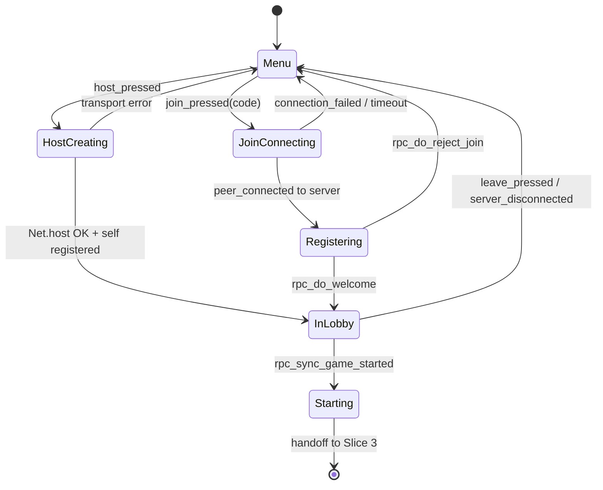

# Slice 2: Lobby & Session Roster
## Host/join over the dev transport, host-authoritative roster sync, base lobby settings, chat foundation, start gate

**Version:** 1.0
**Last Updated:** 2026-07-04
**Dependencies:**
- Skeleton (Slice 0): `Platform`/`Net`/`Save`/`Nav`/`EventBus` autoloads, `TextFilter`, constants, ENet backend room codes, multi-instance dev launch
**Provides:** `Session` autoload (lobby phase of `GameSession`), `Roster` + `Roster.PlayerState`, `GameSettings`, lobby screen, reusable `ChatPanel` component with prominence levels, registration/chat/settings RPC set, start gate

---

## 1. Overview

This slice turns the skeleton's bare peer connection into a real session: a host creates a lobby, clients join by room code over the dev ENet transport (codes `"LOCAL"`, `"LOCAL2"`, … per skeleton §3.2), everyone sees a live synchronized roster, the host tunes the basic settings, players chat, and the host starts the game once 3–8 players are connected (§3, §12 — room-code path only).

Everything is **host-authoritative**: the host (peer 1) owns the `Roster` and `GameSettings`; clients hold read-only mirrors updated exclusively via `rpc_sync_*` messages (consistency guide §4).

### Scope

**In Scope:**
- Host creates a session; clients join by room code via `Net.join(code)` (dev transport only)
- `Roster` + `PlayerState` model in `game/session/roster.gd`, host-authoritative, full-snapshot synced
- Client registration handshake (`rpc_request_register`) with reject paths (full, in progress)
- Lobby settings (`game/session/settings.gd`): number of rounds (suggested default ≈ 2× player count, §10), draw time, prompt-pool source selector **placeholder** (Built-in only until Slice 7), mode selector **placeholder** (Default only until Slice 6)
- Text chat foundation: reusable `ChatPanel` component with a `prominence` property, `rpc_request_send_chat` filtered through `TextFilter` on the host (§13)
- Start gate: host-only Start button, enabled only at 3–8 connected players (§3)
- Leave / host-quit returns everyone to the main menu cleanly

**Out of Scope (Later Slices):**
- Round loop, phases, prompts, canvas-in-session (Slice 3 — this slice ends at a `game_started` handoff signal)
- Mode presets beyond Default / full Custom surface (Slice 6); player-created pools (Slice 7 — selector renders, option disabled)
- Late join, rejoin, resilience, below-minimum pause (Slice 9 — here a disconnect simply removes the player; joining a started game is rejected)
- Steam lobbies/invites/real room codes (Slice 12); public browser, kick/blocklist (Slice 13); avatars in the player list (Slice 11 — name-only rows)

### User Flows

1. **Host:** Main menu → Host → lobby screen shows room code (`LOCAL`), self in list, settings editable, Start disabled ("Need 3 players").
2. **Joiner:** Main menu → Join → enters code → connects → auto-registers → lobby screen with current roster, read-only settings, chat.
3. **Chat:** Any player types a message → host filters and rebroadcasts → appears for everyone with sender name.
4. **Start / Leave:** At 3+ connected, host's Start enables → click → settings snapshot broadcast → all peers receive `game_started` (Slice 3 consumes; placeholder "Game starting…" here). Leavers vanish from every roster; host-quit toasts all clients back to the menu.

---

## 2. Data Models

### Roster & PlayerState

**File: `res://game/session/roster.gd`**

`PlayerState` is declared as an inner class of `Roster` (one `class_name` per file), referenced externally as `Roster.PlayerState`.

```gdscript
class_name Roster
extends RefCounted

## One entry per player who has ever been part of this session.
## Entries are NOT removed on in-game disconnect (Slice 9 relies on this);
## in the lobby phase, leavers ARE removed (no memory needed pre-game).
class PlayerState extends RefCounted:
	var peer_id: int = 0            # transport peer id (changes on rejoin — Slice 9)
	var platform_id: String = ""    # stable identity: dev uuid / SteamID64 (Slice 12)
	var display_name: String = ""   # sanitized on host before storage
	var score: int = 0              # may be negative (§11) — no floor anywhere
	var kudos_granted: int = 0      # filled by Slice 4 at game start
	var kudos_spent: int = 0        # incremented by Slice 4
	var is_connected: bool = true
	var joined_order: int = 0       # monotonic; basis for judge rotation (Slice 3)

	# Serialization: keys mirror field names exactly. from_dict applies typed
	# coercion (int()/str()/bool()) and a default for every missing key, so
	# payloads from newer/older peers never crash a mirror rebuild.
	func to_dict() -> Dictionary
	static func from_dict(d: Dictionary) -> PlayerState
```

**Fields:**

| Field | Type | Required | Description |
|-------|------|----------|-------------|
| peer_id | int | Yes | Current transport peer id (1 = host). 0 while disconnected (Slice 9) |
| platform_id | String | Yes | Stable per-install/per-account id; the rejoin key (Slice 9) |
| display_name | String | Yes | Host-sanitized name (TextFilter + length cap) |
| score | int | Yes | Session score; negative legal (§11) |
| kudos_granted | int | Yes | Total kudos ever granted this game (Slice 4 fills) |
| kudos_spent | int | Yes | Total kudos spent this game (Slice 4 fills) |
| is_connected | bool | Yes | Live connection flag; always true in this slice |
| joined_order | int | Yes | Monotonic join counter; rotation basis for Slice 3 |

**Roster API (host-authoritative; clients only call `apply_dicts`):**

```gdscript
var _players: Array[PlayerState] = []
var _next_joined_order: int = 0

func register(peer_id: int, platform_id: String, display_name: String) -> PlayerState
func remove_by_peer(peer_id: int) -> void          # lobby-phase removal only
func get_by_peer(peer_id: int) -> PlayerState      # null if unknown; also get_by_platform_id()
func connected_count() -> int                      # is_full() == connected_count() >= MAX_PLAYERS
func players_in_join_order() -> Array[PlayerState]
func to_dicts() -> Array[Dictionary]               # apply_dicts(dicts): client mirror replace
```

### GameSettings

**File: `res://game/session/settings.gd`**

```gdscript
class_name GameSettings
extends RefCounted

enum PoolSource { BUILT_IN, PLAYER_CREATED }   # PLAYER_CREATED selectable in Slice 7

var mode: int = SettingsDefaults.Mode.DEFAULT  # selector locked to DEFAULT until Slice 6
var rounds: int = 6
var draw_time_sec: float = SettingsDefaults.DEFAULT_DRAW_TIME_SEC
var pool_source: PoolSource = PoolSource.BUILT_IN
var rounds_overridden: bool = false            # host touched the spinner; stop auto-suggesting

static func suggested_rounds(player_count: int) -> int:
	# §10: "roughly enough for everyone to judge a couple of times (~2× player count)"
	return clampi(player_count * GameConstants.SUGGESTED_ROUNDS_PER_PLAYER,
			GameConstants.ROUNDS_MIN, GameConstants.ROUNDS_MAX)

func to_dict() -> Dictionary            # keys = field names
static func from_dict(d: Dictionary) -> GameSettings   # defaults for missing keys
```

Slice 6 extends this class with the full Custom surface; Slice 9 adds `is_public` and `fluid_rejoin`. New fields always get `from_dict` defaults so older payload shapes never crash a client.

### New constants

**File: `res://core/constants/game_constants.gd`** (append)

```gdscript
const SUGGESTED_ROUNDS_PER_PLAYER: int = 2   # §10
const ROUNDS_MIN: int = 1
const ROUNDS_MAX: int = 32
const DRAW_TIME_MIN_SEC: float = 15.0
const DRAW_TIME_MAX_SEC: float = 180.0
const MAX_CHAT_LEN: int = 200
const CHAT_RATE_LIMIT_COUNT: int = 5         # max messages…
const CHAT_RATE_LIMIT_WINDOW_SEC: float = 3.0  # …per window, per peer
const MAX_NAME_LEN: int = 24
const MAX_PLATFORM_ID_LEN: int = 64
const REGISTER_TIMEOUT_SEC: float = 10.0     # connected-but-unregistered peers get dropped
```

`SettingsDefaults` (skeleton stub) gains `DEFAULT_DRAW_TIME_SEC := 45.0` in its Default preset — a playtest-tunable constant per §10.

---

## 3. Event/Action Definitions

### EventBus signals (append to `res://core/events/event_bus.gd`)

```gdscript
## Roster mirror replaced on this peer. players = Array of PlayerState dicts.
signal roster_updated(players: Array)
## Lobby settings mirror replaced on this peer.
signal lobby_settings_changed(settings: Dictionary)
## A chat message cleared host filtering and was broadcast.
signal chat_message_received(sender_peer_id: int, sender_name: String, text: String)
## Host pressed Start; settings/roster are frozen. Slice 3 takes over from here.
signal game_started(start_data: Dictionary)
## This peer left or was rejected/disconnected; UI should return to menu. reason is a short key.
signal session_closed(reason: String)
```

Client-side EventBus emissions happen **only** in response to `rpc_sync_*`/`rpc_do_*` handlers (consistency guide §5).

### RPCs

All live on the `Session` autoload node (`game/session/game_session.gd`) so node paths match on every peer.

| RPC | Direction | Args | Validation | Effect |
|-----|-----------|------|------------|--------|
| `rpc_request_register` | client → host | `platform_id: String`, `display_name: String` | 5-step; sender not already registered; phase == LOBBY; not full; ids/names sanitized | Adds `PlayerState`; sends `rpc_do_welcome` to sender; broadcasts `rpc_sync_roster` |
| `rpc_do_welcome` | host → new peer | `state: Dictionary {roster: Array, settings: Dictionary, room_code: String}` | authority send only | Client builds mirrors, `Nav.goto(Routes.LOBBY)` |
| `rpc_do_reject_join` | host → peer | `reason: String` (`"full"`, `"in_progress"`, `"bad_identity"`) | authority send only | Client toasts a friendly message, `Net.leave()`, back to menu |
| `rpc_sync_roster` | host → all | `players: Array` (of PlayerState dicts) | authority send only | Replace mirror; emit `roster_updated` |
| `rpc_sync_settings` | host → all | `settings: Dictionary` | authority send only | Replace mirror; emit `lobby_settings_changed` |
| `rpc_request_send_chat` | client → host | `text: String` | 5-step; registered; non-empty ≤ `MAX_CHAT_LEN`; rate limit; `TextFilter.censor` | Broadcast `rpc_sync_chat_message` |
| `rpc_sync_chat_message` | host → all | `sender_peer_id: int`, `sender_name: String`, `text: String` | authority send only | Emit `chat_message_received` |
| `rpc_sync_game_started` | host → all | `start_data: Dictionary {settings: Dictionary, roster: Array}` | authority send only | Emit `game_started`; freeze lobby UI |

Notes: the **host's own player** registers and chats through the same internal methods the handlers call (no self-RPC), so host text is filtered identically. Settings changes need no `rpc_request_*` — only the host edits settings and the host **is** the server (`set_settings()` → `rpc_sync_settings`). All RPCs here are reliable; no unreliable channels in this slice (guide §4).

---

## 4. Storage Schema Extensions

Mapped to `user://` JSON layout (consistency guide §6). One small extension:

### `user://profile.json` — dev identity fields

The skeleton notes the dev `platform_id` comes from `profile.json`; this slice formalizes it. `EnetBackend.get_platform_id()` reads (or generates-and-writes via `Save`) this file:

```json
{
  "v": 1,
  "platform_id": "3f2b6c1e-...-uuidv4",
  "display_name": ""
}
```

| Field | Type | Nullable | Default | Description |
|-------|------|----------|---------|-------------|
| v | int | No | 1 | Schema version |
| platform_id | String | No | generated uuidv4 | Stable per-install identity (dev backend) |
| display_name | String | Yes | "" | Optional saved dev name; `--name=` CLI arg wins, then this, then `"Dev-<pid>"` |

No other `user://` changes. Nothing about the session (roster, settings, chat) is persisted — a session lives and dies in memory.

**Migration:** none (additive fields; `Save.read_json` defaults cover missing keys).

---

## 5. State Machines

The game-phase enum stays at `NetIds.Phase.LOBBY` for this entire slice; the state machine here is the **local session lifecycle** on each peer.



### States

| State | Description | Terminal? |
|-------|-------------|-----------|
| Menu | Main menu; no peer active | No |
| HostCreating | `Net.host()` in progress (near-instant on ENet) | No |
| JoinConnecting | Transport connecting to host | No |
| Registering | Connected; `rpc_request_register` sent, awaiting welcome/reject | No |
| InLobby | Registered; mirrors live; chat/settings active | No |
| Starting | `game_started` received; lobby UI frozen | Yes (handoff) |

### Transition Rules

| Current State | Trigger | New State | Validation | Side Effects |
|---------------|---------|-----------|------------|--------------|
| Menu | Host button | HostCreating | — | `Net.host(code)`; host self-registers |
| JoinConnecting | `EventBus.peer_connected` (to server) | Registering | — | Send `rpc_request_register` |
| Registering | `rpc_do_welcome` | InLobby | — | Build mirrors; `Nav.goto(Routes.LOBBY)` |
| Registering | `rpc_do_reject_join` | Menu | — | Toast reason; `Net.leave()` |
| InLobby | Leave button / `server_disconnected` | Menu | — | `Net.leave()` as needed; toast; emit `session_closed("left"/"host_quit")` |
| InLobby | `rpc_sync_game_started` | Starting | host validated gate | Emit `game_started` |

(Host side: a connected peer that never registers is dropped after `REGISTER_TIMEOUT_SEC` — see Edge Cases.)

---

## 6. Business Logic

### Session (GameSession, lobby portion)

**File: `res://game/session/game_session.gd`** — autoload **`Session`** (registered this slice; see §8). Slice 3 extends this same node with the round state machine.

**Purpose:** owns `Roster` + `GameSettings` on the host; owns the client mirrors; hosts all session RPCs.

**Dependencies:** `Net`, `Platform`, `EventBus`, `TextFilter`, `GameConstants`.

**Key methods:**

#### `host_session(room_code: String) -> Error` / `join_session(room_code: String) -> Error`
Host: `Net.host(room_code)`; on OK resets state, self-registers peer 1 with `Platform.get_platform_id()` / `get_display_name()`, applies `GameSettings` defaults with `suggested_rounds(1)` pending roster growth. Join: `Net.join(room_code)`; on `peer_connected` (to server) sends `rpc_request_register`.

#### `set_settings(settings: GameSettings) -> void`
Host-only (`assert`-free guard: silently ignores on clients). Clamps rounds/draw-time to constants, broadcasts `rpc_sync_settings`.

#### `can_start() -> bool`
True iff `Net.is_host()` **and** `phase == NetIds.Phase.LOBBY` **and** `MIN_PLAYERS <= roster.connected_count() <= MAX_PLAYERS` (§3: 3–8).

#### `start_game() -> void`
Host-only. Re-validates `can_start()` **at execution time** (roster may have changed since the button was clicked), snapshots settings + roster, broadcasts `rpc_sync_game_started`. Slice 3 hooks the resulting `game_started` signal.

#### `leave() -> void`
`Net.leave()`, resets local state, emits `session_closed("left")`, `Nav.goto(Routes.MENU)`.

**Business rules:**
1. Roster mutations happen only on the host, only inside `rpc_request_*` handlers or host-local UI actions.
2. Suggested rounds recompute on every roster change **unless** `rounds_overridden` (host touched the spinner keeps their value).
3. All broadcast text passes `TextFilter.censor()` on the host before storage/send (§13); invalid client input is dropped silently — never crashes, never echoes back (guide §4).

### Registration handler (5-step pattern)

```gdscript
@rpc("any_peer", "call_remote", "reliable")
func rpc_request_register(platform_id: String, display_name: String) -> void:
	if not multiplayer.is_server():
		return                                             # 1. authority
	var sender: int = multiplayer.get_remote_sender_id()
	if roster.get_by_peer(sender) != null:
		return                                             # 2. resolve sender: must be NEW
	if phase != NetIds.Phase.LOBBY:                        # 3. validate vs phase/state
		rpc_do_reject_join.rpc_id(sender, "in_progress")   #    (Slice 9 replaces with late-join)
		return
	if roster.is_full():
		rpc_do_reject_join.rpc_id(sender, "full")
		return
	if platform_id.is_empty() or platform_id.length() > GameConstants.MAX_PLATFORM_ID_LEN:
		rpc_do_reject_join.rpc_id(sender, "bad_identity")
		return
	var clean_name: String = _sanitize_name(display_name)
	var player: Roster.PlayerState = roster.register(sender, platform_id, clean_name)  # 4. apply
	_refresh_suggested_rounds()
	rpc_do_welcome.rpc_id(sender, _build_welcome())        # 5. broadcast
	rpc_sync_roster.rpc(roster.to_dicts())
```

`_sanitize_name()`: strip control chars, trim, truncate to `MAX_NAME_LEN`, `TextFilter.censor()`, fall back to `"Player %d" % joined_order` if empty after cleaning.

### Chat handler (5-step pattern)

```gdscript
@rpc("any_peer", "call_remote", "reliable")
func rpc_request_send_chat(text: String) -> void:
	if not multiplayer.is_server():
		return                                             # 1. authority
	var sender: int = multiplayer.get_remote_sender_id()
	var player: Roster.PlayerState = roster.get_by_peer(sender)
	if player == null:
		return                                             # 2. unknown peer — drop
	if text.strip_edges().is_empty() or text.length() > GameConstants.MAX_CHAT_LEN:
		return                                             # 3a. content validation
	if not _chat_rate_ok(sender):
		return                                             # 3b. rate limit — drop silently
	var clean: String = TextFilter.censor(text.strip_edges())   # 4. apply (filter on host, §13)
	rpc_sync_chat_message.rpc(sender, player.display_name, clean)  # 5. broadcast
```

`_chat_rate_ok(peer_id)`: sliding window — at most `CHAT_RATE_LIMIT_COUNT` messages per `CHAT_RATE_LIMIT_WINDOW_SEC` per peer; timestamps kept in a host-side `Dictionary[int, Array[float]]`.

### Disconnect handling (lobby scope)

`Session` connects to `EventBus.peer_disconnected`. Host: `roster.remove_by_peer(peer_id)` → `rpc_sync_roster` → suggested-rounds refresh. Client that loses the server: toast + `session_closed("host_quit")` + menu. Full in-game resilience is Slice 9; until then any in-game disconnect path falls back to drop-to-menu (consistency guide §7).

---

## 7. UI Components

### Lobby Screen

**File: `res://ui/lobby/lobby_screen.tscn` + `lobby_screen.gd`**

```
+--------------------------------------------------------------+
| Room code: LOCAL          Animal Quickdraw — Lobby   [Leave]  |
+-----------------------+--------------------------------------+
| Players (4/8)         |  Settings           (host-editable)  |
|  ♛ Alice (host)       |   Rounds:      [ 8 ] (suggested)     |
|  Bob, Cleo, Dana      |   Draw time:   [ 45s ]               |
|                       |   Prompt pool: [Built-in ▾] (locked) |
|                       |   Mode:        [Default ▾]  (locked) |
+-----------------------+--------------------------------------+
| Chat (prominence: NORMAL)  [type a message…         ] [Send]  |
+--------------------------------------------------------------+
|                    [ START GAME ]  (host only, ≥3 players)    |
+--------------------------------------------------------------+
```

**User Interactions:**

| Action | Trigger | Result |
|--------|---------|--------|
| Edit rounds/draw time | Host changes spinner | Clamp → `Session.set_settings` → syncs to all; rounds spinner shows "(suggested)" tag until overridden |
| Open pool/mode selector | Any click | Renders with only Built-in / Default enabled; others greyed with "(coming soon)" tooltip |
| Send chat | Enter / Send button | `rpc_request_send_chat` (host path calls `_submit_chat` directly) |
| Start | Host clicks enabled Start | `Session.start_game()`; button shows "Need N more players" hint when disabled |
| Leave | Leave button | `Session.leave()` → menu |

Non-host players see the settings panel read-only (live-updating labels, no inputs).

### ChatPanel Component (reusable — designed for in-game reuse)

**File: `res://ui/shared/chat_panel.tscn` + `chat_panel.gd`**

```gdscript
class_name ChatPanel
extends PanelContainer

enum Prominence { COLLAPSED, NORMAL, PROMINENT }  # §5: per-phase chat prominence

@export var prominence: Prominence = Prominence.NORMAL: set = _set_prominence

signal message_submitted(text: String)   # consumer forwards to Session
```

`COLLAPSED`: thin strip, last message ghosted, expands on hover/click (drawer during drawing, Slice 3). `NORMAL`: standard panel (lobby). `PROMINENT`: large font, tall history, input auto-focused (judge heckling view, Slice 3 — §1, §5). Renders from `EventBus.chat_message_received`; keeps last 100 messages; no direct `Session` coupling (consumer wires `message_submitted` → `Session.submit_chat`). Prominence is set by the owning phase screen, never globally (guide §8).

### Player List Component

**File: `res://ui/shared/player_list.tscn` + `player_list.gd`** — shared (reused by in-round and wrap-up screens later). Rows: name, host crown icon + label (never color alone — accessibility §13 of guide), count header "N/8". Rebuilds on `roster_updated`. Avatar chip slot is a placeholder `TextureRect` until Slice 11.

### Main Menu changes

**File: `res://ui/menu/main_menu_screen.tscn`** — skeleton's dev Host/Join buttons rewired: Host → `Session.host_session("LOCAL")`; Join → small dialog (`ui/menu/join_dialog.tscn`) with a code `LineEdit` (uppercased, trimmed) → `Session.join_session(code)`. Add `Routes.LOBBY := "res://ui/lobby/lobby_screen.tscn"` to `core/constants/`.

### User Confirmation Checkpoints

**Blocking (Slice 3 depends on these — request immediately when reached):**
- [ ] Host + 2 clients (via `tools/dev_run.sh`) all show the same 3-player roster; join/leave updates propagate to every window
- [ ] Join by code works; wrong code fails back to menu with a toast, app stays healthy
- [ ] Start gate: disabled at 2 players, enables at exactly 3, disables again if someone leaves before click; clicking Start shows "Game starting…" on all peers

**Batchable (queue for slice completion):**
- [ ] Chat: messages appear on all peers with correct names; a blocklisted word arrives censored as `***`
- [ ] Chat rate limit: 6 rapid messages → 6th silently absent everywhere
- [ ] Settings edits on host appear live on clients (read-only); suggested rounds updates as players join until host overrides
- [ ] Host-quit: clients land on menu with a friendly toast (no error spam in console)
- [ ] Lobby full: 9th join attempt rejected with "Lobby is full" toast
- [ ] Layout holds at 1280×720 and when window resized

---

## 8. State Management

### Session autoload

**File: `res://game/session/game_session.gd`** — registered as autoload **`Session`** (after `Save`, before `Nav` in the autoload order; record in project settings). This extends the skeleton's autoload registry — decision-log entry required.

**State shape (per peer):**

```
Session
├── phase: NetIds.Phase = LOBBY
├── roster: Roster / settings: GameSettings   # host: authoritative; client: mirrors
├── room_code: String                          # display value from welcome/host call
└── _local_state: enum LocalState              # Menu/HostCreating/JoinConnecting/Registering/InLobby/Starting
```

**Selectors/Computed:**

| Name | Purpose | Dependencies |
|------|---------|--------------|
| `Session.is_host()` | Delegates `Net.is_host()` | Net |
| `Session.can_start()` | Start-gate check | roster, phase |
| `Session.local_player()` | `roster.get_by_peer(Net.local_peer_id())` | roster |

**Actions/Mutations:**

| Name | Purpose | Payload |
|------|---------|---------|
| `host_session(code)` | Create + self-register | room code |
| `join_session(code)` | Connect + register | room code |
| `submit_chat(text)` | Client: RPC; host: direct filtered path | text |
| `set_settings(s)` | Host-only settings write + sync | GameSettings |
| `start_game()` | Host-only gate + broadcast | — |
| `leave()` | Teardown to menu | — |

UI never mutates `Session.roster`/`Session.settings` directly; it calls actions and re-renders on EventBus signals (consistency guide §3 rule).

---

## 9. Integration Points

### Dependencies (What This Slice Needs)

#### From Skeleton
- `Net` (`host/join/leave`, `is_host()`, `local_peer_id()`, connection signals via EventBus); `Platform` (`get_platform_id()`, `get_display_name()` — Slice 12 swaps in Steam identity transparently)
- `Nav` + `Routes`; `TextFilter` (chat + name sanitation); `Save` (`profile.json` identity fields)
- `GameConstants` / `NetIds` / `SettingsDefaults`: min/max players, Phase enum, draw-time default

### Provides (What This Slice Offers)

#### For Future Slices
- **`Session` autoload + `game_started(start_data)`**: Slice 3 attaches the round state machine to this node and consumes the start snapshot (settings + roster with `joined_order` as rotation basis)
- **`Roster` / `Roster.PlayerState`**: Slices 3 (rotation, scoring target), 4 (kudos fields), 9 (platform_id rejoin key, is_connected), 10 (standings)
- **`GameSettings` + settings sync channel**: Slice 6 (modes/full surface), 7 (pool_source activation), 9 (is_public / fluid_rejoin)
- **`ChatPanel` with `prominence`**: Slice 3 phase screens (judge PROMINENT / drawer COLLAPSED)
- **Registration RPC pair + room-code display**: Slice 9 adds rejoin/late-join branches to `rpc_request_register`; Slice 12 reuses the identical handshake over Steam, and its 5-char codes render in the existing code label with zero UI change

### Integration Checklist

- [ ] Constants appended to `core/constants/game_constants.gd` (no magic values in scripts)
- [ ] EventBus signals appended with doc comments
- [ ] `Session` autoload registered; order documented
- [ ] `Routes.LOBBY` added; `Nav` navigations work
- [ ] Settings flow goes through `game/session/settings.gd` + `settings_defaults.gd`
- [ ] Mirror-path tests added under `tests/game/session/`

---

## 10. Edge Cases

### Join when lobby is full
**Scenario:** 8 connected; a 9th connects at transport level and registers.
**Handling:** `rpc_do_reject_join("full")`; host then closes that peer's connection. Client toasts "Lobby is full" and returns to menu.
**Rationale:** hard max 8 (§3); reject at registration, not at transport, so the client gets a readable reason.

### Join while game in progress
**Scenario:** Registration arrives when `phase != LOBBY`.
**Handling:** `rpc_do_reject_join("in_progress")` in this slice. Slice 9 replaces this branch with late-join/rejoin logic — the branch is written as a single clearly-marked `if` for easy replacement.
**Rationale:** resilience is explicitly out of scope here; fail politely.

### Duplicate platform_id
**Scenario:** Two dev instances on one machine share `user://profile.json`, so both present the same uuid.
**Handling:** `EnetBackend` appends the `--name` arg (when present) to the platform_id (`"<uuid>#P2"`), making dev instances distinct; the host additionally suffixes duplicate display names and logs a warning.
**Rationale:** dev-only quirk (Steam IDs are unique); must not block multi-instance testing. Slice 9 depends on platform_id uniqueness and inherits this mitigation.

### Connected but never registers
**Scenario:** A peer connects at ENet level and sends nothing (buggy/hostile client).
**Handling:** Host starts a `REGISTER_TIMEOUT_SEC` timer per unknown peer; on expiry, disconnects the peer. Unknown peers' RPCs are dropped by step 2 of every handler.
**Rationale:** untrusted-client rule (§13); no ghost slots.

### Start-click race / hostile input
**Scenario:** Host clicks Start the instant a player drops to 2; or a peer sends oversized chat, control-character names, empty platform_id, out-of-order RPCs.
**Handling:** `start_game()` re-runs `can_start()` at execution (button state is UI convenience; the gate is authoritative). Every handler's steps 2–3 drop invalid input silently; names sanitized; lengths clamped by constants.
**Rationale:** guide §4 — never trust, never crash.

### Performance Considerations
Roster sync is a full snapshot (≤ 8 small dicts, ≤ ~1 KB) — trivially cheap and simpler than deltas; chat is tiny and reliable-channel. No per-frame netcode in this slice.

---

## 11. Testing Strategy

Per `workflows/testing-protocol.md`: tests written alongside code; blocking user tests requested immediately, batchable queued (see §7 checkpoints).

### Unit Tests

**Location:** `tests/game/session/`

#### `test_roster.gd`
- [ ] `test_register_assigns_monotonic_joined_order`
- [ ] `test_register_when_full_is_rejected_by_is_full`
- [ ] `test_lookups_return_null_for_unknown_peer_or_platform_id`
- [ ] `test_remove_by_peer_updates_connected_count`
- [ ] `test_to_dicts_apply_dicts_round_trip_preserves_all_fields_incl_negative_score` (§11 — no floor)

#### `test_settings.gd`
- [ ] `test_suggested_rounds_is_two_times_players` (3→6, 5→10, 8→16) and clamps to bounds
- [ ] `test_from_dict_defaults_missing_fields`
- [ ] `test_draw_time_clamped_to_min_max`

#### `test_session_validation.gd` (host-side validators as plain functions — no live network)
- [ ] `test_sanitize_name_truncates_censors_and_falls_back`
- [ ] `test_chat_rate_limit_allows_5_in_window_drops_6th`; `test_chat_rejects_empty_and_oversized`
- [ ] `test_can_start_requires_3_to_8_connected_and_lobby_phase`
- [ ] `test_register_validator_rejects_bad_platform_id`

### Integration Tests
- [ ] Host self-registration produces the same roster shape a client registration does
- [ ] `start_game()` snapshot contains frozen settings (later host edits don't mutate the snapshot)

### UI/Component Tests
- [ ] `lobby_screen.tscn`, `chat_panel.tscn`, `player_list.tscn`, `join_dialog.tscn` smoke-instantiate; ChatPanel prominence setter applies all three layout states

### Manual Testing Required
- [ ] Three-instance host/join/chat/start flow via `tools/dev_run.sh` (§7 blocking checkpoints); host-quit and client-leave flows (§7 batchable list)

---

## 12. Implementation Checklist

### Setup
- [ ] Add constants to `game_constants.gd`; `DEFAULT_DRAW_TIME_SEC` to `settings_defaults.gd`; EventBus signals with doc comments
- [ ] Add `Routes.LOBBY`; register `Session` autoload (decision-log entry for autoload order)

### Data Layer
- [ ] `game/session/roster.gd`: `Roster` + inner `PlayerState` + serialization
- [ ] `game/session/settings.gd`: `GameSettings` + `suggested_rounds` + serialization
- [ ] `EnetBackend`: platform_id from `profile.json` (uuid on first run), dev-instance disambiguation; tests `test_roster.gd` + `test_settings.gd` green

### Business Logic
- [ ] `game/session/game_session.gd`: lifecycle (`host_session`/`join_session`/`leave`), local-state machine
- [ ] `rpc_request_register` + welcome/reject path (5-step); registration timeout for silent peers
- [ ] `rpc_sync_roster` / `rpc_sync_settings` mirrors + EventBus emission
- [ ] `rpc_request_send_chat` with TextFilter + rate limit (5-step); host local chat path shares the filter
- [ ] `can_start()` / `start_game()` with execution-time re-validation; `rpc_sync_game_started`
- [ ] Lobby-phase disconnect handling (remove + resync; client drop-to-menu)
- [ ] Tests: `test_session_validation.gd` green

### UI Layer
- [ ] `ui/shared/chat_panel.tscn/.gd` with prominence property; `ui/shared/player_list.tscn/.gd`
- [ ] `ui/lobby/lobby_screen.tscn/.gd`: roster panel, settings panel (host-edit / client-read), chat, Start/Leave
- [ ] `ui/menu/join_dialog.tscn`; rewire menu Host/Join
- [ ] Placeholder selectors for pool source (Built-in only) and mode (Default only), disabled options greyed
- [ ] Scene smoke tests

### Testing, Confirmation & Documentation
- [ ] Full suite green (`godot --headless -s addons/gdUnit4/bin/GdUnitCmdTool.gd -a tests/`)
- [ ] Blocking user tests confirmed; batchable user tests presented and confirmed (§7)
- [ ] Update `WHERE_WE_ARE.md`; session log; implementation notes
- [ ] Decision log: `Session` autoload registration; any RPC/API deviations discovered

---

**End of Slice 2: Lobby & Session Roster**
