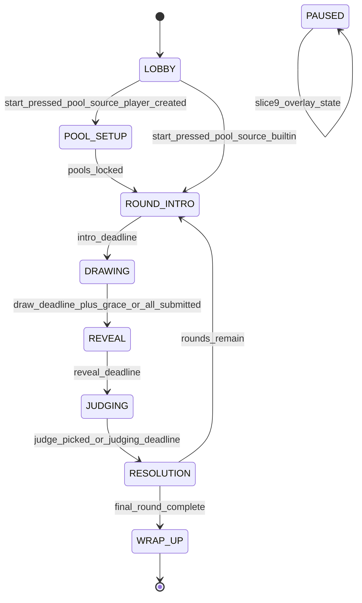

# Slice 3: Core Round Loop
## Host-authoritative round state machine, prompts, per-phase screens, and scoring core — the playable MVP

**Version:** 1.0
**Last Updated:** 2026-07-04
**Dependencies:**
- Skeleton (Net, EventBus, Nav, Save, constants incl. `NetIds.Phase`, `uuidv4`, theme, GdUnit4 harness, multi-instance dev launch)
- Slice 1 — Drawing Canvas & Stroke Engine (`CanvasPanel` drawing surface, `DrawingDoc` serialize/deserialize, rasterize-to-texture renderer)
- Slice 2 — Lobby & Session Roster (roster + `PlayerState` with `joined_order`, `GameSettings` with the three host-tunables, chat panel component, lobby start gate)

**Provides:** `GameSession` host-only round state machine; `SessionClient` RPC endpoint on all peers; data-driven prompt-pool engine + built-in Animal/Adjective content; judge rotation; host-driven phase deadlines; anonymous grid reveal; judging + winner pick; scoring core (`Scoring`); minimal standings screen; extension hooks for Slices 4/5/6/7/9/10.

Brief coverage: §4 (round flow), §5 (role views by phase), §8 (prompt pools — built-in + pool-type architecture), §11 (scoring core only).

---

## 1. Overview

This slice turns the lobby (Slice 2) and canvas (Slice 1) into a complete game: the host runs a round state machine (`LOBBY → ROUND_INTRO → DRAWING → REVEAL → JUDGING → RESOLUTION → …repeat… → WRAP_UP`), a rotating judge heckles drawers over chat while they draw a randomly drawn "adjective animal" prompt (§4), drawings are auto-submitted and revealed anonymously in a grid, the judge picks a winner, points are tallied, and after N rounds a minimal standings screen shows final scores. After this slice, the game is **playable end-to-end on LAN** (chunk plan: Chunks 5–6).

Design principles (consistency guide §1): the host is the referee — `GameSession` simulation state exists **only on the host**; clients render replicated state and send requests. Favor flow over polish: phases can end early (all drawers submitted, judge picks early), invalid input is dropped silently, and nothing a client sends can stall or crash the loop.

### Scope

**In Scope:**
- Host-only `GameSession` state machine driving `NetIds.Phase`, with `POOL_SETUP` and `PAUSED` extension hooks defined (but inert) now
- Judge rotation fixed at game start from roster `joined_order`
- Data-driven pool-type architecture (§8): `PoolType` declares which pools it draws from and how many; v1 content = Animal + Adjective (1 draw from each); built-in pools of ~100 animals + ~100 adjectives as JSON content files; no exact-combo repeats within a session
- Host-driven timers: one deadline broadcast (unix ms) per phase, clients count down locally
- Drawing phase role views (§5): drawer = canvas + prompt + timer + collapsed chat; judge = prominent prompt + prominent chat + "players are drawing…"
- Auto-submission of serialized `DrawingDoc` at timer end, early-submit, deadline + grace acceptance, blank submission for missing drawers
- Reveal v1: simple anonymous grid — randomized display order, no names, host keeps `drawing_id → author` private
- Timed judging window; `rpc_request_pick_winner` any time in window; no pick = no winner + judge −1 (§11)
- Resolution: winner highlighted with a larger view; scores tallied and shown
- Scoring core in `game/session/scoring.gd`: +2 winner, −1 judge no-pick, negative scores legal everywhere (§11)
- End after N rounds → minimal standings screen + `session_results_ready` bundle (the Slice 10 handoff)

**Out of Scope (Later Slices) — with the extension point each plugs into:**
- Reactions + kudos + kudos-as-save (Slice 4) → plugs into the REVEAL/JUDGING window via broadcast `drawing_id`s and `Scoring.add_points()`
- One-at-a-time reveal, stroke replay, winner victory-lap replay, captions (Slice 5) → reveal entries already carry full `DrawingDoc`s (replayable); `RevealJudgingScreen` selected via `settings.reveal_style`; submission payload dict tolerates a future `"caption"` key
- Mode presets + full Custom settings surface (Slice 6) → `GameSession` reads every tunable from `GameSettings`, never from literals
- Player-created pools (Slice 7) → `POOL_SETUP` phase hook + `PromptPools.set_custom_source()`
- Late join, disconnect/rejoin, below-minimum pause (Slice 9) → `PAUSED` phase hooks (`pause()`/`resume()`), roster events; **v1 behavior in this slice:** a disconnected drawer yields a blank submission; a disconnected judge lets the window lapse (no-pick penalty applies); the loop never pauses
- Real wrap-up sequence (Slice 10) → consumes the `session_results_ready` bundle; the v1 standings screen is a placeholder
- Host migration — **not supported in v1**: host quit ends the session for everyone (see Edge Cases)

### Key User Flow (one round, 4 players)

1. Host presses Start in the lobby (Slice 2) → all peers enter `RoundRoot`; host's `GameSession` fixes judge order and enters `ROUND_INTRO`.
2. Intro card: "Round 1 of 8 — Dana is judging." (short timer)
3. `DRAWING`: prompt "sleepy aardvark" is drawn from the pools and broadcast. Three drawers draw for `draw_time_sec`; Dana sees the prompt huge, plus a big chat, and heckles ("I'm looking for the *sleepiest* of boys…").
4. Timer ends (or all three submit early) → clients auto-send their `DrawingDoc`s; host accepts until deadline + grace; anyone missing gets a blank.
5. `REVEAL`: all peers receive the anonymized, shuffled entries and rasterize them into a grid.
6. `JUDGING`: window opens; Dana picks a drawing (or the window lapses → Dana −1, no winner).
7. `RESOLUTION`: winner's drawing shown large with the author's name; scores update (+2 winner).
8. Next round with the next judge, until round N → `WRAP_UP` → standings screen.

---

## 2. Data Models

### Prompt Content Files (built-in pools + pool types)

**Files: `res://game/prompts/data/animals.json`, `res://game/prompts/data/adjectives.json`, `res://game/prompts/data/pool_types.json`**

Word pools (writing the actual ~100-word lists is an Implementation Checklist task, not TDD content):

```json
{
  "v": 1,
  "pool_id": "animals",
  "words": ["aardvark", "…~100 entries total…"]
}
```

Pool types — fully data-driven per §8: a type declares which pools it draws from, how many from each, and how the drawn words compose into display text. Future types (Animal Hybrid, Famous People, Objects) are added by appending an entry here + new pool files — **no code changes**:

```json
{
  "v": 1,
  "types": [
    {
      "id": "animal_adjective",
      "display_name": "Animal + Adjective",
      "draws": [
        {"pool": "adjectives", "count": 1},
        {"pool": "animals", "count": 1}
      ],
      "template": "{0} {1}"
    }
  ]
}
```

`template` is positional over the flattened draw results in declared order (`{0}` = first adjective, `{1}` = first animal). A future `"animal_hybrid"` type would declare `draws: [{"pool": "animals", "count": 2}]` and `template: "{0}-{1} hybrid"`.

### PoolType Model

**File: `res://game/prompts/pool_type.gd`**

```gdscript
class_name PoolType
extends RefCounted
## One draw specification loaded from pool_types.json. Immutable after load.

var id: String
var display_name: String
var draws: Array[Dictionary] = []   # [{"pool": String, "count": int}]
var template: String

static func from_dict(d: Dictionary) -> PoolType:
    var t := PoolType.new()
    t.id = d.get("id", "")
    t.display_name = d.get("display_name", "")
    t.template = d.get("template", "")
    for raw: Variant in d.get("draws", []):
        t.draws.append({"pool": String(raw["pool"]), "count": int(raw["count"])})
    return t

func total_draw_count() -> int:
    var n: int = 0
    for d: Dictionary in draws:
        n += int(d["count"])
    return n
```

### Prompt Model

**File: `res://game/prompts/prompt.gd`**

| Field | Type | Required | Description |
|-------|------|----------|-------------|
| pool_type_id | String | Yes | Which type produced this prompt |
| parts | PackedStringArray | Yes | Drawn words in declared draw order |
| display_text | String | Yes | `template` applied to `parts` (e.g. "sleepy aardvark") |
| combo_key | String | Yes | `pool_type_id + ":" + "|".join(parts)` — no-repeat tracking key |

### Submission Model (host-only)

**File: `res://game/session/submission.gd`**

| Field | Type | Required | Description |
|-------|------|----------|-------------|
| drawing_id | String | Yes | uuidv4 minted by host on acceptance |
| author_player_id | String | Yes | **Host-private** — never broadcast before RESOLUTION |
| doc | Dictionary | Yes | Serialized `DrawingDoc` (consistency guide §6 format) |
| is_blank | bool | Yes | True when the host synthesized `{"v":1,"orientation":"landscape","ops":[]}` for a missing drawer |

### RoundRecord Model (host-only, feeds the results bundle)

**File: `res://game/session/round_record.gd`** — plain data: `round_index: int`, `judge_player_id: String`, `prompt: Prompt`, `submissions: Array[Submission]`, `winner_drawing_id: String` (empty = no pick), `winner_player_id: String` (empty = no pick).

### SessionResults bundle (the Slice 10 handoff)

Broadcast in `WRAP_UP` phase data and emitted via `EventBus.session_results_ready`. Slices 4/10 extend it; unknown keys must be tolerated by all readers.

```json
{
  "v": 1,
  "rounds": [
    {"round_index": 0, "judge_player_id": "…", "prompt_text": "sleepy aardvark",
     "winner_player_id": "…", "winner_drawing_id": "…", "picked": true}
  ],
  "final_scores": {"player_id": -1},
  "standings": [{"player_id": "…", "score": 5, "rank": 1}],
  "reaction_stats": {},
  "kudos_stats": {}
}
```

`reaction_stats` / `kudos_stats` are reserved empty dicts filled by Slice 4.

**Relationships:** `GameSession` owns `Scoring`, `PromptPools`, the current `RoundRecord`, and the judge order. `PlayerState` (Slice 2 roster) is referenced by `player_id` (stable platform id), never by `peer_id`, so scores survive reconnects (Slice 9).

---

## 3. Event/Action Definitions

### RPCs

All on `SessionClient` (`game/session/session_client.gd` — the node present at the same path on every peer; see State Management). Prefixes and decorators per consistency guide §4.

| RPC | Direction | Args | Validation | Effect |
|-----|-----------|------|------------|--------|
| `rpc_sync_phase(phase: int, data: Dictionary)` | host → all (`authority`, `call_local`, reliable) | `phase`: `NetIds.Phase` value; `data`: per-phase shape (table below) | Clients: sender is authority (enforced by decorator); unknown `phase` values dropped with `push_warning` | Client stores phase + data, emits `EventBus.phase_changed`; `RoundRoot` swaps the phase screen |
| `rpc_request_submit_drawing(payload: Dictionary)` | drawer client → host (`any_peer`, reliable) | `payload = {"doc": Dictionary}` (future slices may add keys, e.g. `"caption"` in Slice 5 — host ignores unknown keys) | 5-step: (1) `multiplayer.is_server()` else return; (2) resolve sender via `roster.get_by_peer()`, unknown → drop; (3) phase is `DRAWING` **or** within `SUBMIT_GRACE_MS` after its deadline, sender is a drawer this round (not the judge), `doc` deserializes as a valid `DrawingDoc` and serialized size ≤ `MAX_DRAWING_BYTES`; (4) store/replace as that player's submission (latest wins); (5) no broadcast — submissions stay private until REVEAL. If all drawers have submitted, host ends DRAWING early | Host records the submission; may trigger early phase advance |
| `rpc_request_pick_winner(drawing_id: String)` | judge client → host (`any_peer`, reliable) | 5-step: (1) server check; (2) sender resolves in roster; (3) phase == `JUDGING` **and** sender's `player_id` == current judge **and** `drawing_id` exists in the current round's reveal set; (4) record winner, apply +2 via `Scoring`; (5) broadcast by transitioning immediately to `RESOLUTION` via `rpc_sync_phase` | Ends the judging window at the moment of pick |

Notes:
- The **host's own** submit/pick actions do not go through RPC: `SessionClient` on the host calls the same validated `GameSession` entry points directly (`submit_drawing(player_id, payload)`, `pick_winner(player_id, drawing_id)`), so validation logic is shared and unit-testable without a network.
- The prompt is public (drawers and judge both see it, §4) so it rides in `DRAWING` phase data — no per-peer `rpc_do_*` is needed in this slice.
- Duplicate/late `rpc_request_pick_winner` after RESOLUTION began: dropped silently at step 3.

### `rpc_sync_phase` data shapes

`deadline_ms` is always **unix time in ms** (`int`), broadcast **once** per phase — clients render the countdown locally against their own clock; there is no per-tick timer sync.

| Phase | data keys |
|-------|-----------|
| `ROUND_INTRO` | `round_index: int`, `round_count: int`, `judge_player_id: String`, `deadline_ms: int` |
| `DRAWING` | `prompt_text: String`, `prompt_parts: PackedStringArray`, `deadline_ms: int` |
| `REVEAL` | `entries: Array[Dictionary]` — `[{"drawing_id": String, "doc": Dictionary}]`, shuffled, **no author info**; `deadline_ms: int` |
| `JUDGING` | `deadline_ms: int` (entries already held from REVEAL) |
| `RESOLUTION` | `picked: bool`, `winner_drawing_id: String`, `winner_player_id: String`, `winner_display_name: String`, `scores: Dictionary` (player_id → int), `deadline_ms: int` |
| `WRAP_UP` | `results: Dictionary` (SessionResults bundle) |
| `POOL_SETUP` | Defined by Slice 7 (hook exists now; never broadcast in this slice) |
| `PAUSED` | Defined by Slice 9 (hook exists now; never broadcast in this slice) |

### EventBus signals (appended to `core/events/event_bus.gd`)

```gdscript
## Emitted on all peers when the round phase changes. data shape depends on phase (Slice 3 TDD §3).
signal phase_changed(phase: NetIds.Phase, data: Dictionary)
## Emitted on all peers at ROUND_INTRO with the round header info.
signal round_started(round_index: int, round_count: int, judge_player_id: String)
## Emitted on all peers when the anonymized reveal entries arrive (REVEAL phase data).
signal reveal_entries_received(entries: Array[Dictionary])
## Emitted on all peers at RESOLUTION. result is the RESOLUTION phase data dict.
signal round_resolved(result: Dictionary)
## Emitted on all peers whenever authoritative scores are (re)broadcast.
signal scores_updated(scores: Dictionary)
## Emitted on all peers at WRAP_UP with the SessionResults bundle (Slice 10 consumes).
signal session_results_ready(results: Dictionary)
```

**Rule (consistency guide §5):** clients emit these only in response to host `rpc_sync_*` messages — never from local guesses.

---

## 4. Storage Schema Extensions

N/A — this slice persists nothing to `user://`. All round state is session-scoped and lives on the host in memory; drawings travel over the wire and are discarded after the round (the save-to-collection write path is Slice 4; the Slice 1 canvas save-toggle remains a stub). Prompt content ships as read-only `res://game/prompts/data/*.json` (formats in §2), which is content, not player storage.

---

## 5. State Machines

### GameSession Phase State Machine

Runs **only on the host** inside `GameSession`. Clients never transition themselves; they render whatever `rpc_sync_phase` last told them.



`PAUSED` is shown detached deliberately: it is an **overlay** state reachable from any in-round phase and returning to that same phase (Slice 9). `POOL_SETUP` is entered only when `settings.pool_source == PoolSource.PLAYER_CREATED`; in this slice that branch exists but built-in is the only selectable source, so it is exercised only by tests until Slice 7.

### States

| State | Description | Terminal? |
|-------|-------------|-----------|
| LOBBY | Pre-game; owned by Slice 2. `GameSession` does not exist yet | No |
| POOL_SETUP | Player word submission (Slice 7 defines behavior; hook only here) | No |
| ROUND_INTRO | Round header: round n of N, judge name. Short fixed timer | No |
| DRAWING | Drawers draw; judge heckles. Prompt public. Host collects submissions at end | No |
| REVEAL | Anonymized entries broadcast; clients rasterize the grid. Short fixed timer | No |
| JUDGING | Judging window; judge may pick at any moment (§4.6) | No |
| RESOLUTION | Winner (or no-pick) shown; scores broadcast. Short fixed timer | No |
| WRAP_UP | Results bundle broadcast; standings screen (real sequence in Slice 10) | Yes |
| PAUSED | Below-minimum freeze overlay (Slice 9). Never entered in this slice | No |

### Transition Rules

| Current State | Trigger | New State | Validation | Side Effects |
|---------------|---------|-----------|------------|--------------|
| LOBBY | Host presses Start (Slice 2 gate passed) | ROUND_INTRO (or POOL_SETUP) | Host only; roster ≥ `MIN_PLAYERS`; settings frozen | Judge order fixed from `joined_order`; `Scoring` initialized to 0 for all; pools loaded; combo tracker cleared |
| POOL_SETUP | `pools_locked` (Slice 7) | ROUND_INTRO | Slice 7 | Custom sources injected into `PromptPools` |
| ROUND_INTRO | `intro_deadline` | DRAWING | Timer is host's own | Prompt drawn (`PromptPools.draw_prompt`), combo recorded; `DRAWING` broadcast with prompt + deadline |
| DRAWING | Deadline + `SUBMIT_GRACE_MS` elapsed, **or** all drawers submitted | REVEAL | Host timer / submission count | Missing drawers get blank submissions; `drawing_id`s minted; author map kept host-private; shuffled entries broadcast |
| REVEAL | `reveal_deadline` | JUDGING | Host timer | `JUDGING` broadcast with window deadline |
| JUDGING | Valid `rpc_request_pick_winner` | RESOLUTION | 5-step validation (§3) | +2 to winner via `Scoring`; RESOLUTION broadcast immediately (early end) |
| JUDGING | `judging_deadline`, no pick | RESOLUTION | Host timer | −1 to judge (`Scoring.apply_no_pick_penalty`); RESOLUTION broadcast with `picked=false` |
| RESOLUTION | `resolution_deadline`, `round_index + 1 < round_count` | ROUND_INTRO | Host timer | `RoundRecord` archived; next judge = `judge_order[(round_index + 1) % judge_order.size()]` |
| RESOLUTION | `resolution_deadline`, final round done | WRAP_UP | Host timer | Results bundle built + broadcast; `session_results_ready` |
| any in-round | `pause()` / `resume()` | PAUSED / previous | Slice 9 defines triggers | Hooks exist now: `PAUSED` stores `resume_phase` + remaining deadline time; broadcast on resume re-issues a fresh `deadline_ms` |

**Extension hooks defined now (implemented later):**
- `GameSession._enter_pool_setup() -> void` — this slice's body immediately calls `_begin_round(0)`; Slice 7 replaces the body.
- `GameSession.pause(reason: int) -> void` / `GameSession.resume() -> void` — this slice implements deadline bookkeeping (capture remaining ms, reissue on resume) but nothing calls them until Slice 9.

---

## 6. Business Logic

### GameSession

**File: `res://game/session/game_session.gd`**

**Purpose:** The entire round-loop simulation. Host-only — instantiated exclusively when `multiplayer.is_server()`. Pure logic: no networking, no UI, no scene-tree dependency (RefCounted), which is what makes Chunk 5 fully headless-testable.

**Dependencies:** `Roster` (Slice 2), `GameSettings` (Slice 2/6), `Scoring`, `PromptPools`, `GameConstants`, `NetIds`.

```gdscript
class_name GameSession
extends RefCounted
## Host-only round-loop state machine. Outputs are signals; SessionClient
## translates them into rpc_sync_* broadcasts. Never exists on clients.

signal phase_entered(phase: NetIds.Phase, data: Dictionary)
signal session_finished(results: Dictionary)

var _phase: NetIds.Phase = NetIds.Phase.LOBBY
var _settings: GameSettings
var _roster: Roster
var _scoring: Scoring = Scoring.new()
var _pools: PromptPools = PromptPools.new()
var _pool_type: PoolType
var _judge_order: Array[String] = []          # player_ids, fixed at start
var _round_index: int = -1
var _round: RoundRecord
var _records: Array[RoundRecord] = []
var _authors: Dictionary = {}                  # drawing_id -> player_id (PRIVATE)
var _phase_deadline_ms: int = 0
var _now_ms: Callable                          # injectable clock for tests

func _init(settings: GameSettings, roster: Roster,
        now_ms: Callable = Callable(GameSession, "_system_now_ms")) -> void:
    _settings = settings
    _roster = roster
    _now_ms = now_ms

func start_game() -> void:
    _judge_order = _roster.player_ids_by_joined_order()
    for pid: String in _judge_order:
        _scoring.ensure_player(pid)
    _pools.load_builtin()
    _pool_type = _pools.get_type(_settings.pool_type_id)   # "animal_adjective" in v1
    if _settings.pool_source == GameSettings.PoolSource.PLAYER_CREATED:
        _enter_pool_setup()                                 # Slice 7 fills this in
    else:
        _begin_round(0)

func current_judge_id() -> String:
    return _judge_order[_round_index % _judge_order.size()]

func on_phase_deadline() -> void:
    # Called by SessionClient's host-side Timer; tests call it directly.
    match _phase:
        NetIds.Phase.ROUND_INTRO: _start_drawing()
        NetIds.Phase.DRAWING:     _collect_and_reveal()
        NetIds.Phase.REVEAL:      _open_judging()
        NetIds.Phase.JUDGING:     _finish_judging("")       # no pick
        NetIds.Phase.RESOLUTION:  _advance_round()
        _: push_error("Deadline fired in phase %d" % _phase)

func _enter_phase(phase: NetIds.Phase, duration_sec: float, data: Dictionary) -> void:
    _phase = phase
    _phase_deadline_ms = int(_now_ms.call()) + int(duration_sec * 1000.0)
    data["deadline_ms"] = _phase_deadline_ms
    phase_entered.emit(phase, data)     # SessionClient broadcasts + arms host timer

static func _system_now_ms() -> int:
    return int(Time.get_unix_time_from_system() * 1000.0)
```

**Key Methods:**

#### submit_drawing()
**Signature:** `func submit_drawing(player_id: String, payload: Dictionary) -> bool`
**Purpose:** Shared validated entry point for drawer submissions (RPC handler and host-local UI both call this).
**Business rules:** rejects (returns false, no side effect) unless: phase is `DRAWING` or within `GameConstants.SUBMIT_GRACE_MS` after its deadline; `player_id` is a drawer this round; `payload["doc"]` passes `DrawingDoc.validate()` and byte size ≤ `GameConstants.MAX_DRAWING_BYTES`. Latest valid submission per player **replaces** any earlier one (early-submit then keep-drawing is legal — the resubmission at deadline wins). When every drawer has a submission during `DRAWING`, calls `_collect_and_reveal()` immediately (flow over waiting, §1 of brief).

#### pick_winner()
**Signature:** `func pick_winner(player_id: String, drawing_id: String) -> bool`
**Purpose:** Judge's pick. Valid only in `JUDGING`, only from `current_judge_id()`, only for a `drawing_id` in the current reveal set (blanks are pickable — the judge may reward comedy). Applies +2 via `Scoring.apply_winner()`, records the winner on the `RoundRecord`, transitions to `RESOLUTION` immediately.

#### _collect_and_reveal()
**Purpose:** Ends `DRAWING`. For each drawer with no submission, synthesizes a blank (`is_blank = true`) — the blank **still appears** in the grid and is judgeable. Mints a uuidv4 `drawing_id` per submission, stores `drawing_id → author` in `_authors` (never leaves the host until RESOLUTION), shuffles entries (`Array.shuffle()` on host RNG), enters `REVEAL` with `entries` in phase data.

#### _finish_judging()
**Signature:** `func _finish_judging(winner_drawing_id: String) -> void`
**Purpose:** Empty id = window lapsed with no pick → `Scoring.apply_no_pick_penalty(current_judge_id())` (−1, §11) and `picked=false` in RESOLUTION data. Otherwise resolves the author from `_authors` and includes `winner_player_id` + display name — this is the only moment authorship is revealed, and only for the winner.

#### _advance_round() / _build_results()
**Purpose:** Archives the `RoundRecord`; if `_round_index + 1 < _settings.round_count` begins the next round, else builds the SessionResults bundle (§2), enters `WRAP_UP` with it, and emits `session_finished`. Standings ranking: sort by score descending; ties share the better rank; stable order within a tie = `joined_order`. Negative scores sort naturally — **no clamping anywhere**.

### Scoring

**File: `res://game/session/scoring.gd`**

```gdscript
class_name Scoring
extends RefCounted
## Score ledger. Negative scores are legal; there is no floor (§11).

var _scores: Dictionary = {}   # player_id -> int

func ensure_player(player_id: String) -> void:
    if not _scores.has(player_id):
        _scores[player_id] = 0

func add_points(player_id: String, delta: int) -> void:
    ensure_player(player_id)
    _scores[player_id] = int(_scores[player_id]) + delta

func apply_winner(player_id: String) -> void:
    add_points(player_id, GameConstants.WINNER_POINTS)        # +2

func apply_no_pick_penalty(judge_id: String) -> void:
    add_points(judge_id, GameConstants.JUDGE_NO_PICK_POINTS)  # -1

func get_score(player_id: String) -> int:
    return int(_scores.get(player_id, 0))

func snapshot() -> Dictionary:
    return _scores.duplicate()
```

**Extension point (Slice 4):** kudos award is exactly `add_points(recipient_id, GameConstants.KUDOS_POINTS)` — no new scoring surface needed. **Extension point (Slice 10):** title points likewise route through `add_points` when building final standings.

### PromptPools

**File: `res://game/prompts/prompt_pools.gd`**

**Purpose:** Loads pools + types from `game/prompts/data/`, draws prompts through a `PoolType`, enforces no-exact-combo-repeat per session.

**Key Methods:**
- `load_builtin() -> void` — reads the three JSON files; missing/corrupt content is a `push_error` + empty pool (session cannot start without content; the lobby start gate checks `is_ready()`).
- `get_type(type_id: String) -> PoolType`
- `set_custom_source(pool_id: String, words: PackedStringArray) -> void` — **Slice 7 extension point**: injects a session-scoped custom word list consumed before the built-in list (draw-without-replacement + silent backfill semantics defined in Slice 7).
- `draw_prompt(type: PoolType) -> Prompt` — draws `count` words from each declared pool, builds `combo_key`, retries up to `GameConstants.COMBO_REPEAT_MAX_ATTEMPTS` (e.g. 40) if the key was already drawn this session; on exhaustion of attempts, allows the repeat with a `push_warning` (favor flow — never stall the game; with 100×100 built-in combos this is unreachable in practice).

**Business rules:** the session-level drawn-combo set lives here (`_drawn_combo_keys: Dictionary` used as a set) and is cleared per session. Draw order inside a prompt follows the type's declared draw order so `combo_key` is deterministic.

### Timers — host-driven deadline scheme

1. Host computes `deadline_ms = now_ms + duration * 1000` when entering a phase and broadcasts it **once** in phase data.
2. Host arms its own local `Timer` (owned by `SessionClient`, host side) for the authoritative expiry → `GameSession.on_phase_deadline()`.
3. Clients render countdowns purely locally: `remaining = max(0, deadline_ms - local_now_ms)`. No per-tick sync traffic.
4. Early transitions are legal and common (all-submitted, judge early pick): the broadcast deadline is an **upper bound**, and clients obey whatever `rpc_sync_phase` arrives next regardless of their local countdown.
5. Clock skew is display-only (see Edge Cases); the authoritative clock is always the host's.

Phase durations (constants added to `core/constants/game_constants.gd`; draw time and judging window become mode/host tunables via `GameSettings` — Slice 6 widens the surface):

| Constant | Default | Notes |
|----------|---------|-------|
| `ROUND_INTRO_SEC` | 4.0 | Fixed |
| `DRAW_TIME_DEFAULT_SEC` | 30.0 | Host-tunable in lobby (Slice 2 setting); per-mode presets in Slice 6. Brief §13 assumes 15–30 s drawings |
| `SUBMIT_GRACE_MS` | 1500 | Acceptance window after the drawing deadline |
| `REVEAL_GRID_SEC` | 5.0 | v1 grid-look beat before judging opens |
| `JUDGING_WINDOW_SEC` | 30.0 | Mode-tunable in Slice 6 |
| `RESOLUTION_SEC` | 6.0 | Winner spotlight + scores |
| `MAX_DRAWING_BYTES` | 262144 | Wire-size cap for a submitted doc (~50 KB typical, cg §12) |
| `COMBO_REPEAT_MAX_ATTEMPTS` | 40 | Prompt redraw attempts before allowing a repeat |
| `WINNER_POINTS` / `JUDGE_NO_PICK_POINTS` | 2 / −1 | §11 (`KUDOS_POINTS := 1` also lands here now for Slice 4) |

---

## 7. UI Components

All in-round screens are children of a persistent `RoundRoot`, swapped per phase (consistency guide §8) — not full `Nav` navigations. `Nav.goto(Routes.ROUND)` happens once at game start on every peer.

### RoundRoot

**File: `res://ui/round/round_root.tscn` + `round_root.gd`**

**Purpose:** Persistent in-game container. Listens to `EventBus.phase_changed`, frees the current phase screen, instantiates the one mapped to the new phase, and passes it the phase data. Also hosts the persistent chat panel (Slice 2 component) whose prominence is set by each phase screen, and the `SessionClient` node (see State Management — this scene existing identically on every peer is what gives RPCs a matching node path).

Phase → screen map: `ROUND_INTRO → round_intro_screen`, `DRAWING → draw_screen` (drawer) / `judge_wait_screen` (judge), `REVEAL`+`JUDGING → reveal_judging_screen` (one screen, two phases), `RESOLUTION → resolution_screen`, `WRAP_UP → standings_screen`.

### Draw Screen (drawer, DRAWING phase)

**File: `res://ui/round/draw_screen.tscn`**

```
+--------------------------------------------------+
| "sleepy aardvark"                    [ 0:23 ]    |
+--------------------------------------------------+
|                                        | tools   |
|            CanvasPanel (Slice 1)       | palette |
|                                        | undo…   |
+--------------------------------------------------+
| [> chat (collapsed strip — expandable)] [Submit] |
+--------------------------------------------------+
```

Prompt banner + `PhaseTimer` + Slice 1 `CanvasPanel` with full tools + **collapsed** chat (§5) + an early **Submit** button. Submit serializes the current `DrawingDoc` and sends `rpc_request_submit_drawing`; the canvas stays editable and a resubmission at deadline replaces the early one. At local countdown zero the screen auto-submits unconditionally (§4.4) and locks input.

### Judge Wait Screen (judge, DRAWING phase)

**File: `res://ui/round/judge_wait_screen.tscn`**

```
+--------------------------------------------------+
|            SLEEPY AARDVARK           [ 0:23 ]    |
|        "players are drawing…"  (anim dots)       |
+--------------------------------------------------+
|                                                  |
|            CHAT (prominent, large)               |
|            [heckle input box________] [Send]     |
+--------------------------------------------------+
```

Prompt rendered large, no canvas, **no live strokes ever** (§5), prominent chat wired to the Slice 2 chat component in its expanded mode — this screen exists to make heckling the judge's main verb (§1).

### Reveal / Judging Screen (everyone, REVEAL + JUDGING phases)

**File: `res://ui/round/reveal_judging_screen.tscn`**

On `reveal_entries_received`, each entry's `DrawingDoc` is rasterized **client-side** to a cached `ImageTexture` via the Slice 1 renderer (grid shows textures, not live canvases — cg §12) and laid out in a grid in the broadcast (already shuffled) order, preserving each drawing's orientation (§5). No names anywhere. When phase advances to `JUDGING`: the judge sees a pick affordance on every cell (tap/click → confirm → `rpc_request_pick_winner`); non-judges see the grid + the window countdown. Chat is prominent during reveal/judging so people can riff (§5). **Extension points:** Slice 4 adds reaction/kudos controls per cell keyed by `drawing_id`; Slice 5 replaces this screen's entry animation with one-at-a-time reveal + stroke replay via `settings.reveal_style`.

### Resolution Screen

**File: `res://ui/round/resolution_screen.tscn`** — winner's drawing large and centered with author name + "+2", the rest of the grid dimmed small below, score list alongside (negative scores render with an explicit minus, same styling — no special casing). No-pick variant: "The judge couldn't decide… (Judge −1)" with no enlarged drawing. **Extension point (Slice 5):** the enlarged view is the mount point for the winner victory-lap replay.

### Standings Screen (minimal, WRAP_UP)

**File: `res://ui/round/standings_screen.tscn`** — ranked list (rank, avatar chip placeholder, name, score) from the results bundle + "Back to lobby" (host) / "Waiting for host" (clients). Deliberately bare: Slice 10 replaces it with the real wrap-up sequence consuming the same bundle.

### PhaseTimer Component

**File: `res://ui/shared/phase_timer.tscn` + `phase_timer.gd`** — `@export`-less shared widget; `start(deadline_ms: int)` renders `ceil((deadline_ms - local_now_ms) / 1000.0)` clamped ≥ 0, with a color+numeral urgency treatment under 10 s (number shown, never color alone — cg §13). Reused by every phase screen and by Slice 7's force-continue countdown.

### Round Intro Screen

**File: `res://ui/round/round_intro_screen.tscn`** — "Round n of N", judge name + "is judging" (icon + label, not color-only).

### User Confirmation Checkpoints

**Blocking (Chunk 6 playtest gate — Slice 3 cannot complete without these):**
- [ ] Full 3-player round loop on LAN via `tools/dev_run.sh`: start → intro → draw → auto-submit → grid reveal → judge pick → resolution → next judge → … → standings. Nothing stalls, no host errors.
- [ ] Judge view during DRAWING: prompt prominent, chat prominent, heckling messages arrive at drawers' collapsed chat, and no drawer strokes are ever visible to the judge.
- [ ] Judging window lapse with no pick: judge score goes to −1 and the standings display the negative score correctly.

**Batchable (queue for slice completion, per testing-protocol.md):**
- [ ] Blank submission (close one instance mid-draw pre-Slice 9 or just don't draw): blank card appears in the grid, is pickable, looks intentional not broken.
- [ ] Early-submit then keep drawing: final canvas state is what appears at reveal.
- [ ] All-drawers-submit-early ends the drawing phase early on every peer.
- [ ] Countdown displays sensible values on all peers (no negative or frozen timers).
- [ ] Portrait-orientation drawing keeps its orientation in grid and resolution views.

---

## 8. State Management

### SessionClient (all peers) + GameSession (host only)

**File: `res://game/session/session_client.gd`**

Godot's high-level multiplayer requires RPC methods to live on a node at the **same path on every peer**. `SessionClient` is that node (child of `RoundRoot`, instantiated identically everywhere at game start). It owns all `rpc_*` methods and is deliberately thin:

- **On the host:** creates the `GameSession` (`if multiplayer.is_server()` — the simulation object is never constructed on clients), connects `phase_entered` → `rpc_sync_phase(...)` broadcast, owns the authoritative phase `Timer`, and forwards validated RPC requests into `GameSession.submit_drawing()` / `pick_winner()`.
- **On clients:** receives `rpc_sync_phase`, updates its local replicated state, and re-emits typed EventBus signals. It never mutates game state on its own.

```gdscript
class_name SessionClient
extends Node
## RPC endpoint present on every peer. Host side owns the GameSession
## simulation; client side is a dumb replica store + signal relay.

var _session: GameSession = null      # non-null on host only
var _phase: NetIds.Phase = NetIds.Phase.LOBBY
var _phase_data: Dictionary = {}
var _reveal_entries: Array[Dictionary] = []
var _scores: Dictionary = {}
var _judge_player_id: String = ""

func is_local_player_judge() -> bool:
    return _judge_player_id == Net.local_player_id()
```

### Replicated client state shape (read by phase screens)

```
{
  phase: NetIds.Phase,
  phase_data: Dictionary,          # last rpc_sync_phase payload
  round_index: int, round_count: int,
  judge_player_id: String,
  reveal_entries: Array[Dictionary],   # cached through REVEAL+JUDGING
  scores: Dictionary                    # player_id -> int, updated at RESOLUTION
}
```

**Access pattern:** phase screens receive `phase_data` on instantiation from `RoundRoot`, subscribe to EventBus for mid-phase updates, and send intents only via `SessionClient` request methods (`request_submit_drawing(payload)`, `request_pick_winner(id)` — which RPC to host, or call `GameSession` directly when `is_server()`). UI never touches `GameSession` (cg §3 rule: `game/` has zero UI references; UI observes via EventBus).

**Autoloads used (no new autoloads in this slice):** `Net` (peer ids, is_host), `EventBus` (signals in §3), `Nav` (single `Routes.ROUND` navigation at start).

---

## 9. Integration Points

### Dependencies (What This Slice Needs)

#### From Skeleton
- `Net`: `is_host()`, `local_peer_id()`, peer lifecycle signals (host quit → `server_disconnected` fallback path)
- `EventBus`: carries the §3 signals
- `Nav` + `Routes`: `Routes.ROUND` registered; `Routes.LOBBY` return path
- `core/constants/net_ids.gd`: the `Phase` enum (already includes `POOL_SETUP` and `PAUSED` — this slice drives it)
- `core/constants/game_constants.gd`: §6 timer/scoring constants appended here
- `core/util/uuidv4.gd`: `drawing_id` minting

#### From Slice 1
- `CanvasPanel` embedded in `draw_screen`; produces a serializable `DrawingDoc`
- `DrawingDoc.validate()/serialize()/deserialize()` (wire format = cg §6)
- Rasterizer (doc → `ImageTexture` at internal resolution) for the reveal grid

#### From Slice 2
- `Roster`/`PlayerState` (`player_id`, `display_name`, `peer_id`, `joined_order`), `roster.get_by_peer()`
- `GameSettings` with `round_count`, `draw_time_sec`, `pool_source` (the three always-tunable settings, §10) + `pool_type_id`
- Lobby start gate: on Start, all peers navigate to `Routes.ROUND` and instantiate `RoundRoot` (which contains `SessionClient`); host then calls `GameSession.start_game()`
- Chat panel component with collapsed/expanded prominence modes

### Provides (What This Slice Offers)

#### For Future Slices
- **Slice 4:** broadcast `drawing_id`s + the REVEAL/JUDGING window to attach reactions/kudos to; `Scoring.add_points()`; reserved `reaction_stats`/`kudos_stats` keys in the results bundle; per-cell extension point in `reveal_judging_screen`
- **Slice 5:** reveal entries carry full `DrawingDoc`s (replay-capable); `settings.reveal_style` switch point in `reveal_judging_screen`; winner mount point in `resolution_screen`; submission payload tolerates a `"caption"` key
- **Slice 6:** every duration/behavior read from `GameSettings` — presets only change values, never code paths
- **Slice 7:** `POOL_SETUP` phase + `_enter_pool_setup()` hook; `PromptPools.set_custom_source()`
- **Slice 9:** `pause()`/`resume()` with deadline bookkeeping; player_id-keyed scores (reconnect-safe); blank-submission machinery doubles as the disconnect story
- **Slice 10:** `session_results_ready(results)` bundle + versioned shape

### Integration Checklist
- [ ] Constants added to `game_constants.gd` (§6 table) — no magic values in session code
- [ ] EventBus signals appended with doc comments (§3)
- [ ] RPCs live on `SessionClient` only, prefixed per cg §4, all `rpc_request_*` using the 5-step pattern
- [ ] `Routes.ROUND` registered with `Nav`
- [ ] `settings.gd` consumed, not duplicated — no session-local copies of tunables
- [ ] Mirror-path tests for all new `game/` code
- [ ] WHERE_WE_ARE + overview status updated at completion

---

## 10. Edge Cases

### Host quits mid-game (no host migration in v1)
**Scenario:** The host closes the game or loses connection during any phase.
**Handling:** The session **ends for everyone**. Clients receive `server_disconnected` (skeleton signal); the fallback from cg §7 applies — toast "Host left — game over" and return to main menu. No state is preserved.
**Rationale:** Host migration is explicitly out of scope for v1; the host's memory *is* the game state. Slice 9 improves messaging but does not add migration.

### Simultaneous / duplicate / late submissions
**Scenario:** A drawer early-submits, keeps drawing, auto-submits at deadline; or two RPCs race; or a submission arrives after deadline + grace.
**Handling:** Host keeps **the latest valid submission received before `deadline_ms + SUBMIT_GRACE_MS`** per player (replacement, not append). Anything after grace is dropped silently. RPC delivery is reliable+ordered per peer, so "latest" is well-defined.
**Rationale:** Latest-wins matches player intent (the canvas at deadline is the drawing, §4.4); the grace window absorbs transit time so a deadline-instant auto-submit is not lost.

### Clock skew on deadlines
**Scenario:** A client's system clock differs from the host's by seconds (or minutes).
**Handling:** Client countdowns are cosmetic — clamped to ≥ 0, and the client auto-submits when its **local** countdown hits zero, but the host's timer + grace window is the sole authority on acceptance and phase end. A fast client submits early (fine — latest-wins still applies); a slow client's auto-submit lands inside grace for skew up to ~`SUBMIT_GRACE_MS`. Beyond that, the drawer's last early-submit (if any) or a blank is used. Phase changes are always obeyed when `rpc_sync_phase` arrives, even if the local countdown disagrees.
**Rationale:** One broadcast + local render is simple and traffic-free; a goofy party game does not need NTP. If playtests show real-world skew problems, a one-shot host-offset estimate at join can be added without protocol changes (note in decision log if done).

### Drawer disconnects mid-draw (pre-Slice 9 baseline)
**Scenario:** A drawer's peer drops during DRAWING.
**Handling:** No submission arrives → blank submission is created, appears in the grid, is judgeable. The player's roster entry persists (Slice 2); scores are keyed by `player_id`, so a Slice 9 rejoin restores them. The loop **does not pause** in this slice, even below 3 players — the below-minimum pause is Slice 9 (`PAUSED` hooks are ready).
**Rationale:** §4.4/§9 — whatever is on the canvas ships; a submitted drawing survives its author's departure.

### Judge disconnects mid-round (pre-Slice 9 baseline)
**Scenario:** The judge drops during DRAWING/REVEAL/JUDGING.
**Handling:** Nothing special: the judging window lapses, no winner, judge takes the −1. Slice 9 adds judge-skip logic for rotation going forward.
**Rationale:** Simple, and the penalty is harmless in a game where negative scores are legal and expected (§11).

### Judge pick races the window deadline
**Scenario:** `rpc_request_pick_winner` arrives just as the host's judging timer fires.
**Handling:** Whichever the host processes first wins, atomically: once `_finish_judging()` runs, the phase leaves `JUDGING` and the loser of the race fails step-3 validation and is dropped. No double-award is possible because scoring happens inside the single transition.
**Rationale:** Host-serialized processing makes the race benign; "close enough" is acceptable per the brief's flow-over-fairness stance.

### Prompt combo space pressure
**Scenario:** No-repeat retries keep colliding (tiny custom pools in Slice 7; hostile settings).
**Handling:** After `COMBO_REPEAT_MAX_ATTEMPTS` redraws, allow the repeat and `push_warning`. Never stall the round.
**Rationale:** cg §7 — internal invariants degrade gracefully; a repeated prompt is funnier than a hung game.

### Oversized / malformed drawing payloads
**Scenario:** A modified client sends a 10 MB doc or garbage ops.
**Handling:** Step-3 validation: `DrawingDoc.validate()` (shape, op types, palette/size indices in range, point counts) + `MAX_DRAWING_BYTES` cap. Fail → drop silently; the drawer simply ends up blank at reveal.
**Rationale:** Brief §13 — untrusted input can never crash the host; blanking a cheater is self-punishing.

### Performance
Reveal broadcasts N ≤ 7 docs ≤ ~50 KB each once per round — trivial. Rasterization of ≤ 7 docs happens once at REVEAL entry on each client (cached textures thereafter, cg §12); budget < 100 ms total on the min-spec target, measured in Chunk 6.

---

## 11. Testing Strategy

Per `workflows/testing-protocol.md`: tests written alongside code; Part 1 (Chunk 5) is **entirely headless** — `GameSession` is RefCounted with an injectable clock and signal outputs, so the whole loop runs in GdUnit4 with no network, no scene tree, no UI.

### Unit Tests

**Location:** `res://tests/game/...` (mirror paths, cg §9)

#### `tests/game/session/test_game_session.gd`
- [ ] `test_start_fixes_judge_order_from_joined_order`
- [ ] `test_judge_rotation_wraps_after_last_player`
- [ ] `test_full_phase_sequence_intro_to_wrapup` (drive via `on_phase_deadline()`; assert `phase_entered` order for a 2-round game)
- [ ] `test_pool_setup_branch_taken_when_source_is_player_created` (hook fires; falls through in this slice)
- [ ] `test_drawing_ends_early_when_all_drawers_submitted`
- [ ] `test_missing_drawer_gets_blank_submission_that_appears_in_entries`
- [ ] `test_late_submission_after_grace_is_dropped`
- [ ] `test_resubmission_replaces_earlier_submission`
- [ ] `test_submission_rejected_wrong_phase_wrong_role_oversized_invalid_doc` (validation matrix)
- [ ] `test_reveal_entries_contain_no_author_info_and_are_shuffled`
- [ ] `test_pick_winner_valid_applies_plus_two_and_enters_resolution`
- [ ] `test_pick_winner_rejected_when_not_judge_or_wrong_phase_or_unknown_id`
- [ ] `test_no_pick_applies_minus_one_to_judge`
- [ ] `test_pick_after_deadline_race_is_dropped_and_scores_once`
- [ ] `test_deadline_ms_uses_injected_clock_plus_duration`
- [ ] `test_pause_resume_reissues_remaining_deadline` (hook bookkeeping only)
- [ ] `test_results_bundle_shape_rounds_scores_standings_reserved_keys`

#### `tests/game/session/test_scoring.gd`
- [ ] `test_winner_plus_two`, `test_judge_no_pick_applies_minus_one`
- [ ] `test_scores_go_negative_without_floor`
- [ ] `test_standings_sort_desc_with_negative_scores_and_shared_rank_ties`

#### `tests/game/prompts/test_prompt_pools.gd`
- [ ] `test_builtin_pools_load_and_report_ready` (uses small fixture JSONs in `tests/fixtures/`, not the real 100-word content)
- [ ] `test_pool_type_parses_draws_and_template`
- [ ] `test_draw_prompt_composes_template_in_declared_order`
- [ ] `test_no_exact_combo_repeat_within_session`
- [ ] `test_combo_key_stable_for_same_parts`
- [ ] `test_repeat_allowed_with_warning_after_max_attempts` (2×2 fixture pool, force exhaustion)
- [ ] `test_future_pool_type_two_draws_same_pool_works` (data-only "hybrid" fixture proves the architecture)

#### RPC validation
Host-side validators tested directly as functions via `GameSession.submit_drawing()` / `pick_winner()` (no live network needed — cg §9); covered by the matrix tests above.

### Integration Tests
- [ ] Headless "sim harness" test: 4 fake players, scripted submissions/picks through public `GameSession` API for a full 8-round game; asserts every player judged twice, final scores are the sum of round results, and no combo repeated.
- [ ] `SessionClient` host↔client relay smoke: two `SceneTree` peers over ENet loopback (skeleton harness) run one round with programmatic submissions; asserts client `phase_changed` sequence matches host's.

### UI/Component Tests
- [ ] Scene smoke tests: every `ui/round/*.tscn` instantiates without errors given representative phase data (including negative scores and a blank entry).
- [ ] `PhaseTimer` clamps to zero for past deadlines.

### Manual Testing Required
- [ ] The three **blocking** checkpoints in §7 (Chunk 6 gate: full 3-player LAN round; judge heckling view; no-pick −1).
- [ ] The **batchable** list in §7, presented at slice completion.

---

## 12. Implementation Checklist

Organized by chunk per the plan in `TDD/overview-of-slices.md` (Chunk 5 = headless logic, Chunk 6 = screens + integration → playable MVP).

### Part 1 (Chunk 5): headless logic — no UI, all GdUnit4-tested

#### Setup
- [ ] Add §6 constants to `core/constants/game_constants.gd` (incl. `KUDOS_POINTS` for Slice 4)
- [ ] Confirm `NetIds.Phase` matches the machine (skeleton already defines all 9 values)
- [ ] Append §3 EventBus signals with doc comments

#### Prompt engine + content
- [ ] `game/prompts/pool_type.gd` (`from_dict`, `total_draw_count`) + tests
- [ ] `game/prompts/prompt.gd` (parts, display_text, combo_key) + tests
- [ ] `game/prompts/prompt_pools.gd` (load, get_type, draw_prompt, no-repeat, retry-then-warn, `set_custom_source` stub) + tests with fixture pools
- [ ] `game/prompts/data/pool_types.json` with the `animal_adjective` type
- [ ] **Content task:** write `animals.json` (~100 words) and `adjectives.json` (~100 words) — drawable, all-ages, comedy-forward; sanity test asserts counts ≥ 90 and no empty/duplicate strings

#### Session core
- [ ] `game/session/scoring.gd` + tests (incl. negatives + standings ties)
- [ ] `game/session/submission.gd`, `game/session/round_record.gd`
- [ ] `game/session/game_session.gd`: constructor + injectable clock; `start_game` (judge order, scoring init, pool load, `POOL_SETUP` branch stub); `_enter_phase` deadline math; `on_phase_deadline` dispatch; `submit_drawing` (full validation, latest-wins, all-submitted early end); `_collect_and_reveal` (blanks, uuid `drawing_id`s, private author map, shuffle); `pick_winner` + `_finish_judging` (+2 / −1 paths); `_advance_round` + `_build_results` (bundle, standings); `pause`/`resume` deadline bookkeeping (inert)
- [ ] Test-alongside throughout; full-loop sim harness test green
- [ ] Run full suite headless; Chunk 5 exit = all §11 unit/integration logic tests passing

### Part 2 (Chunk 6): screens + integration

#### Session wiring
- [ ] `game/session/session_client.gd`: RPC surface (`rpc_sync_phase`, `rpc_request_submit_drawing`, `rpc_request_pick_winner`) with 5-step handlers forwarding into `GameSession`; host phase `Timer`; client replica state + EventBus relay
- [ ] Hook Slice 2 start gate: on Start, all peers `Nav.goto(Routes.ROUND)`; host constructs `GameSession` and calls `start_game()`
- [ ] Register `Routes.ROUND`

#### UI layer
- [ ] `ui/round/round_root.tscn/.gd`: phase→screen swap, chat prominence pass-through, hosts `SessionClient`
- [ ] `ui/shared/phase_timer.tscn/.gd`
- [ ] `ui/round/round_intro_screen.tscn/.gd`
- [ ] `ui/round/draw_screen.tscn/.gd`: CanvasPanel embed, prompt banner, collapsed chat, early submit, deadline auto-submit + input lock
- [ ] `ui/round/judge_wait_screen.tscn/.gd`: big prompt, "players are drawing…", prominent chat
- [ ] `ui/round/reveal_judging_screen.tscn/.gd`: client-side rasterization to cached textures, shuffled anonymous grid, orientation preserved, judge pick affordance + confirm, window countdown
- [ ] `ui/round/resolution_screen.tscn/.gd`: winner spotlight / no-pick variant, score list with negatives
- [ ] `ui/round/standings_screen.tscn/.gd`: minimal ranked list + back-to-lobby
- [ ] Scene smoke tests for all of the above

#### Verification
- [ ] Two-instance ENet round-trip integration test (§11)
- [ ] Full test suite green; no startup warnings
- [ ] 3-instance manual run via `tools/dev_run.sh` — full game start to standings

#### User Confirmation
- [ ] **Blocking:** full 3-player LAN round loop confirmed (Chunk 6 playtest gate)
- [ ] **Blocking:** judge heckling view confirmed (prominent prompt/chat, no live strokes)
- [ ] **Blocking:** no-pick −1 and negative score display confirmed
- [ ] Batchable list from §7 presented and resolved
- [ ] User confirms slice complete

#### Documentation
- [ ] Update `WHERE_WE_ARE.md`; session logs per chunk
- [ ] Implementation Notes for Slice 3; decision log entries for any deviations (e.g. timer constant retuning)
- [ ] Mark Slice 3 status in `TDD/overview-of-slices.md`

---

**End of Slice 3: Core Round Loop**

---

## Implementation Status

**Status:** COMPLETE (core-confirmed; fine-grain items in `TDD/qa-backlog.md`)
**Completed:** 2026-07-06 (session 3; owner played a full 3-player game — start → draw → reveal → judging + winner pick → scoring → standings; automated full-game gate `tools/verify_round.sh` PASS incl. no-pick −1)
**Implementation Notes:** `TDD/03-core-round-loop-implementation-notes.md`

### Summary of Deviations
- Round-start readiness handshake (`rpc_request_round_ready` + 3 s failsafe) added
- `rpc_sync_return_to_lobby` on Session for the standings "Back to lobby" path
- In-GdUnit ENet loopback test replaced by the multi-process `verify_round.sh` gate
- `drawing_id` minted at collect time; EventBus specific-signal-before-`phase_changed` ordering contract
- **Open design gap logged (owner):** no in-game pause/leave menu — tracked in qa-backlog + WHERE_WE_ARE Active Decisions
