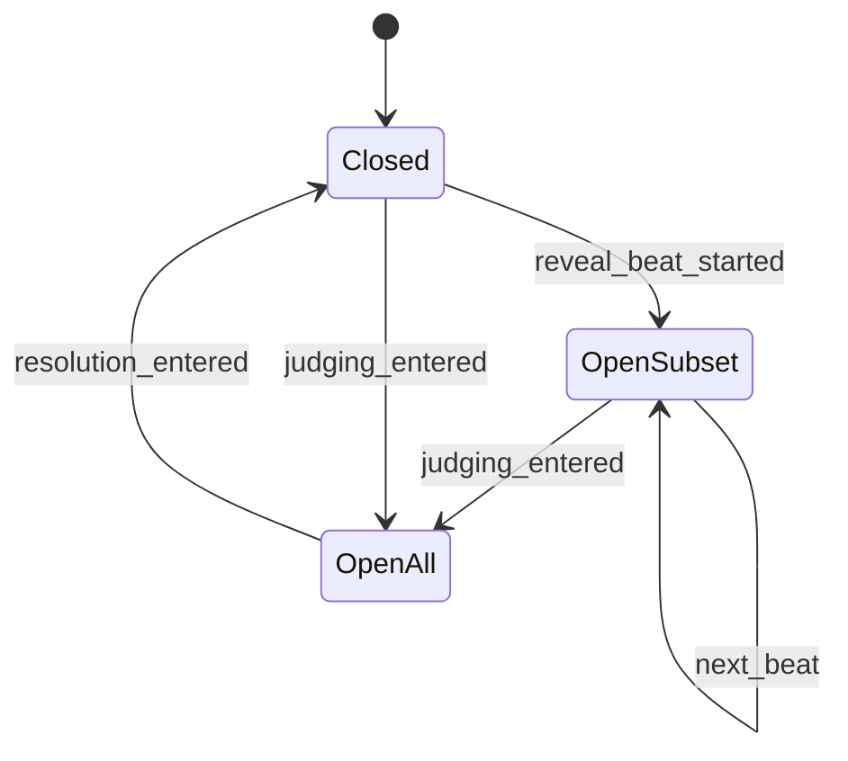

# Slice 4: Reactions, Kudos & Saving
## Anonymous emoji reactions with session stats, the kudos economy, and the kudos=save collection write path

**Version:** 1.0
**Last Updated:** 2026-07-04
**Dependencies:**
- Slice 3 (round state machine phases REVEAL/JUDGING/RESOLUTION, drawing distribution at reveal, scoring core, judging grid screen)
- Slice 1 (DrawingDoc format, save-to-collection toggle stub on the canvas)
- Slice 2 (roster / PlayerState, roster sync)
- Skeleton (Net, Save, EventBus, `NetIds.Reaction`, constants)

**Provides:** Reaction system + `SessionStats` (consumed by Slice 10 superlatives), kudos allotment math + granted/spent tracking (consumed by Slice 9 late-join/rejoin), `CollectionStore` local write path (consumed by Slice 8 browser), self-save-at-submission wiring.

---

## 1. Overview

This slice makes the reveal/judging window *social*: players fire anonymous emoji reactions at drawings, spend a scarce kudos budget (+1 point to the recipient, and the drawing is saved to the giver's local collection), and every reaction event is recorded into a host-side `SessionStats` structure that Slice 10 mines for superlatives (§11). It also completes the Slice 1 self-save toggle: a submitted drawing with the toggle active is written to the drawer's own collection (§6).

### Design principles
- **Anonymous, aggregate, honest** (§11): everyone sees counts; nobody (including the host player's UI) sees who reacted. Only the host *simulation* knows senders, for validation and stats.
- **Kudos are scarce and physical**: giving one costs budget, awards a point, and puts the drawing in your collection — one action, three effects (§11).
- **No authorship leaks**: kudos apply +1 score on the host immediately, but scoreboards only refresh at RESOLUTION (Slice 3's tally sync, §4.7). A live score bump during judging would deanonymize the author.

### Scope

**In Scope:**
- Reaction toggling (the 6-emoji `NetIds.Reaction` set) whenever reactions are active: per-drawing reveal beats (gate consumed by Slice 5) and the grid/judging window (§11)
- Rules: no reacting/kudosing your own drawing; the judge CAN react, kudos, and save (§11)
- `SessionStats` (host-only): per-drawing aggregates + full reaction/kudos event log — the Slice 10 integration contract
- Kudos allotment formula (round_count/4, half rounds up), computed at game start from the settings snapshot; granted/spent on `PlayerState`
- Kudos → local collection save on the **giver's** machine (`user://collection/` per consistency guide §6)
- Self-save toggle honored at submission (final submitted doc saved locally, never networked as a separate copy, never points, §6)
- Judging-grid UI additions: reaction bar + kudos button per cell; kudos wallet indicator

**Out of Scope (Later Slices):**
- Per-drawing reveal beats & choreography — Slice 5 (this slice provides the reaction gate it opens/closes)
- The `kudos_allotment` lobby setting UI and presets — Slice 6 (this slice defines `KUDOS_AUTO` resolution)
- Collection browser / export / delete — Slice 8
- Late-join half-allotment and rejoin memory — Slice 9 (consumes granted/spent fields defined here)
- Superlative computation — Slice 10 (consumes `SessionStats`)

### Key user flows
1. **React:** Judging grid is up → player taps 😂 on a cell → host validates, updates counts, broadcasts → all clients see the cell's 😂 badge tick. Tapping again un-reacts.
2. **Kudos:** Player taps kudos on someone else's cell → host validates budget + not-own + not-already-given → broadcasts new total, confirms privately to giver → giver's client writes DrawingDoc + prompt to `user://collection/`, shows a "Saved to your collection" toast; wallet decrements.
3. **Self-save:** Drawer had the Slice 1 toggle on at submission → their client writes the final doc to their collection locally (no network round-trip).

---

## 2. Data Models

### PlayerState extension (Slice 2 model, extended here)

**File: `res://game/session/roster.gd`**

```gdscript
# Added to PlayerState (replicated via Slice 2 roster sync):
var kudos_granted: int = 0   # allotment at game start (Slice 9: half for late joiners)
var kudos_spent: int = 0     # incremented on each accepted kudos; never reset on rejoin
```

`kudos_remaining` is derived (`granted - spent`), never stored. Both fields are keyed to the player's stable `uid` (platform id), not peer id, so Slice 9 rejoin restores them (§11 "re-joiners are not topped up").

### KudosLedger

**File: `res://game/session/kudos_ledger.gd`** — host-only.

```gdscript
class_name KudosLedger
extends RefCounted

var _kudos_by_drawing: Dictionary = {}   # drawing_id: String -> total: int
var _givers_by_drawing: Dictionary = {}  # drawing_id: String -> Dictionary[uid: String, true]

static func compute_allotment(round_count: int) -> int:
    # round_count / 4, rounded to nearest, .5 rounds UP, min 1 (§11).
    return maxi(1, floori(round_count / 4.0 + 0.5))
```

| Field | Type | Required | Description |
|-------|------|----------|-------------|
| `_kudos_by_drawing` | `Dictionary` | Yes | Public aggregate per drawing |
| `_givers_by_drawing` | `Dictionary` | Yes | Host-private; enforces one kudos per giver per drawing |

### ReactionLedger

**File: `res://game/session/reaction_ledger.gd`** — host-only. Tracks, per drawing, per `NetIds.Reaction`, the *set* of reactor uids (a player holds at most one of each reaction type per drawing — toggling keeps counts honest and spam-proof).

```gdscript
class_name ReactionLedger
extends RefCounted

var _reactors: Dictionary = {}  # drawing_id -> Dictionary[Reaction, Dictionary[uid, true]]

func set_reaction(drawing_id: String, reaction: NetIds.Reaction, uid: String, active: bool) -> bool:
    # Returns true if state actually changed (no-op toggles are dropped, not broadcast).

func counts_for(drawing_id: String) -> Dictionary:  # Reaction -> int, only nonzero keys
```

### SessionStats — **integration contract for Slice 10**

**File: `res://game/session/session_stats.gd`** — host-only; lives on `GameSession`; lost if the host quits (accepted for v1).

```gdscript
class_name SessionStats
extends RefCounted

## Per-drawing rollup. All player references are stable uids, never peer ids.
class DrawingStats:
    var drawing_id: String
    var round_index: int
    var author_uid: String
    var prompt_text: String            # display text, e.g. "sleepy aardvark"
    var reaction_counts: Dictionary = {}  # NetIds.Reaction -> int (final aggregates)
    var kudos_received: int = 0
    var won_round: bool = false        # set by Slice 3 at resolution via record_winner()

var drawings: Dictionary = {}            # drawing_id -> DrawingStats
var reaction_events: Array[Dictionary] = []  # {"round": int, "drawing_id": String,
                                             #  "reaction": int, "actor_uid": String,
                                             #  "added": bool, "t_ms": int}
var kudos_events: Array[Dictionary] = []     # {"round": int, "drawing_id": String,
                                             #  "giver_uid": String, "t_ms": int}

func register_drawing(id: String, round_index: int, author_uid: String, prompt_text: String) -> void
func record_reaction(round_index: int, drawing_id: String, reaction: NetIds.Reaction,
        actor_uid: String, added: bool) -> void
func record_kudos(round_index: int, drawing_id: String, giver_uid: String) -> void
func record_winner(drawing_id: String) -> void

# Query surface Slice 10 builds superlatives on:
func top_drawing_by_reaction(reaction: NetIds.Reaction) -> String   # "" if no reactions
func reaction_totals_by_author() -> Dictionary  # author_uid -> Dictionary[Reaction, int]
func reactions_given_by(uid: String) -> int     # count of net-active reaction adds
func kudos_received_by_author() -> Dictionary   # author_uid -> int
func to_dict() -> Dictionary                    # v-tagged, for debugging/dumps
```

**Relationships:** `GameSession` (Slice 3) owns one `SessionStats`, one `KudosLedger`, one `ReactionLedger` per game. `Scoring` (Slice 3) receives `+1` per accepted kudos.

### CollectionItem (index entry)

See Section 4 (Storage Schema Extensions).

---

## 3. Event/Action Definitions

### RPCs

All added to the session network node (`GameSession`'s RPC surface from Slice 3). Every `rpc_request_*` handler follows the mandatory 5-step validation pattern (consistency guide §4).

| RPC | Direction | Args | Validation | Effect |
|-----|-----------|------|------------|--------|
| `rpc_request_react` | client → host | `drawing_id: String`, `reaction: int`, `active: bool` | (1) is_server; (2) sender resolves to roster entry; (3) reaction gate open for `drawing_id` AND `reaction` is a valid `NetIds.Reaction` AND sender is not the drawing's author; (4) toggle actually changes state (ledger returns changed) | Update `ReactionLedger`, append `SessionStats.reaction_events`, then (5) `rpc_sync_reaction_counts` |
| `rpc_sync_reaction_counts` | host → all | `drawing_id: String`, `counts: Dictionary` (Reaction→int, nonzero only) | authority-only sender | Clients update cached counts; emit `EventBus.reaction_counts_changed` |
| `rpc_request_give_kudos` | client → host | `drawing_id: String` | (1) is_server; (2) sender in roster; (3) gate open AND not own drawing AND `kudos_spent < kudos_granted` AND sender has not already kudosed this drawing; (4) apply atomically in arrival order | `kudos_spent += 1`, ledger `+1`, `Scoring.add(author, +1)` (display deferred to RESOLUTION), `SessionStats.record_kudos`; then (5) `rpc_sync_kudos_total` to all + `rpc_do_kudos_confirmed` to giver + roster sync (spent field) |
| `rpc_sync_kudos_total` | host → all | `drawing_id: String`, `total: int` | authority-only sender | Clients update cell kudos badge; emit `EventBus.kudos_total_changed` |
| `rpc_do_kudos_confirmed` | host → giver peer | `drawing_id: String`, `kudos_remaining: int` | authority-only sender | Giver writes the drawing to local collection via `CollectionStore`, emits `EventBus.kudos_wallet_changed`, shows toast |

Invalid requests are **dropped silently** — never an error back to the client (design brief §13). A giver whose kudos was dropped simply never receives `rpc_do_kudos_confirmed`; their UI re-enables on the next sync (see Section 7, optimistic-UI rule).

### Reference handler (5-step pattern)

```gdscript
@rpc("any_peer", "call_remote", "reliable")
func rpc_request_give_kudos(drawing_id: String) -> void:
    if not multiplayer.is_server():                       # 1. authority
        return
    var sender: int = multiplayer.get_remote_sender_id()
    var player: PlayerState = roster.get_by_peer(sender)  # 2. resolve sender
    if player == null:
        return
    if not _reaction_gate.is_open_for(drawing_id):        # 3. validate vs phase + state
        return
    var stats: SessionStats.DrawingStats = session_stats.drawings.get(drawing_id)
    if stats == null or stats.author_uid == player.uid:
        return                                            # unknown drawing / self-kudos
    if player.kudos_spent >= player.kudos_granted:
        return                                            # budget exhausted (host order wins)
    if kudos_ledger.has_given(drawing_id, player.uid):
        return                                            # duplicate
    _apply_kudos(player, drawing_id)                      # 4. mutate on host
    rpc_sync_kudos_total.rpc(drawing_id, kudos_ledger.total_for(drawing_id))  # 5. broadcast
    rpc_do_kudos_confirmed.rpc_id(sender, drawing_id, player.kudos_granted - player.kudos_spent)
```

### EventBus signals (append to `res://core/events/event_bus.gd`)

```gdscript
## Emitted on all peers when a drawing's aggregate reaction counts change.
## counts: Dictionary[NetIds.Reaction -> int], nonzero entries only.
signal reaction_counts_changed(drawing_id: String, counts: Dictionary)
## Emitted on all peers when a drawing's public kudos total changes.
signal kudos_total_changed(drawing_id: String, total: int)
## Emitted locally on the giver when their kudos is confirmed by the host.
signal kudos_wallet_changed(remaining: int)
## Emitted locally on the giver alongside kudos_wallet_changed, identifying the drawing.
## Consumed by Slice 14 stats (kudos_spent_total).
signal kudos_given(drawing_id: String, remaining: int)
## Emitted locally when a drawing is saved to this player's collection (kudos or self-save).
signal collection_item_added(item_id: String)
```

(`collection_item_added` appears as the example in consistency guide §5 — this slice actually adds and owns it.)

---

## 4. Storage Schema Extensions

All writes go through `Save` (autoload); layout per consistency guide §6, extended here with the `source` field and the versioned index wrapper required by the guide's versioning rule ("every persisted dict carries `v`").

```
user://
└── collection/
    ├── index.json            # {"v": 1, "items": [CollectionItem, ...]}
    ├── <uuid>.json           # one canonical DrawingDoc per saved drawing (v1 wire format)
    └── thumbs/
        └── <uuid>.png        # regenerable thumbnail cache (consistency guide §12)
```

### CollectionItem (entry in `index.json` `items` array)

| Field | Type | Nullable | Default | Description |
|-------|------|----------|---------|-------------|
| `id` | String (uuidv4) | No | — | Filename stem of the doc + thumb |
| `prompt` | String | No | `""` | Display text ("sleepy aardvark") — pool-type-agnostic (§8) |
| `saved_at` | String (ISO 8601) | No | — | Local wall-clock save time |
| `orientation` | String | No | `"landscape"` | Mirrors the doc, lets the browser lay out without opening docs |
| `source` | String | No | `"kudos"` | `"kudos"` or `"self"` — Slice 8 may badge these differently |
| `session_drawing_id` | String | No | `""` | Session-scoped id used for duplicate suppression (see Edge Cases); opaque, meaningless after the session |

**Write pattern:** append item → `Save.write_json("collection/index.json", index)` (atomic), write `collection/<uuid>.json` (the received `DrawingDoc` dictionary verbatim), then render + write the thumb PNG (max 200 px long edge; failure non-fatal — cache only). Index read tolerates missing/corrupt per `Save.read_json`. **Migrations:** none — first version, `v: 1`.

---

## 5. State Machines

### ReactionGate (host-side; who may react/kudos right now)

Slice 3 opens the gate for all drawings when entering JUDGING; Slice 5 will additionally open it per-drawing during one-at-a-time reveal beats. This slice ships the gate + the JUDGING wiring.



### States

| State | Description | Terminal? |
|-------|-------------|-----------|
| Closed | No reaction/kudos requests accepted | No |
| OpenSubset | Only the currently-revealed drawing accepts (Slice 5) | No |
| OpenAll | All of this round's drawings accept (grid/judging window, §11) | No |

### Transition Rules

| Current | Trigger | New | Validation | Side Effects |
|---------|---------|-----|------------|--------------|
| Closed/OpenSubset | Slice 3 enters JUDGING | OpenAll | phase == JUDGING | none |
| OpenAll | Slice 3 enters RESOLUTION | Closed | — | in-flight requests arriving after close are dropped (+250 ms grace, see Edge Cases) |

API: `open_for(ids: PackedStringArray)`, `open_all(ids)`, `close()`, `is_open_for(id) -> bool`, plus `close_grace_msec` window after `close()` during which requests are still accepted.

---

## 6. Business Logic

### KudosLedger / allotment

**File: `res://game/session/kudos_ledger.gd`**

**Business rules:**
1. Allotment is computed **once at game start** from the settings snapshot: if `settings.kudos_allotment == GameSettings.KUDOS_AUTO (-1)`, use `compute_allotment(settings.round_count)`; else use the host-set value (Slice 6 owns the setting; §11). Written into every present player's `kudos_granted`.
2. Encoded brief examples (§11) are unit tests: 4 rounds → 1, 5 → 1, 6 → 2, 7 → 2, 8 → 2, 10 → 3, 14 → 4, 3 → 1.
3. One kudos per giver per drawing; kudos are for other players' drawings only; the judge may give kudos (§11).
4. `+1` score to the recipient applies to `Scoring` immediately host-side; scoreboard broadcast stays deferred to RESOLUTION (Slice 3 contract — Slice 3 must not broadcast score deltas during REVEAL/JUDGING).
5. A drawing whose author has disconnected still receives kudos and score (§9 — "stays in that round"); score lands on the remembered roster entry.

### ReactionLedger

**File: `res://game/session/reaction_ledger.gd`**

1. Toggle semantics: at most one of each reaction type per player per drawing. No-op toggles (setting an already-set state) return `changed == false` and are not broadcast or recorded.
2. Every *changed* toggle is recorded as an event in `SessionStats` (adds and removes — Slice 10 wants event volume as well as final counts).
3. Per-player-per-drawing event cap: `GameConstants.REACTION_EVENT_CAP := 24` changed-toggles; beyond it, further toggles for that (player, drawing) are dropped silently (bounds the stats array against button-mashing).

### CollectionStore

**File: `res://core/save/collection_store.gd`** (uses only the `Save` API; no direct `FileAccess` — consistency guide §6)

```gdscript
class_name CollectionStore
extends RefCounted

## Saves a drawing to the local collection. Idempotent per session_drawing_id.
## Returns the collection item id, or "" on failure (toast, never crash).
static func save_drawing(doc: Dictionary, prompt_text: String,
        session_drawing_id: String, source: String) -> String

static func has_session_drawing(session_drawing_id: String) -> bool
```

1. Duplicate suppression: if `session_drawing_id` already exists in the index, return the existing id without rewriting (see Edge Cases — kudos-save and a hypothetical future re-save cannot double-write).
2. Thumbnail rendering reuses the Slice 1 replay renderer's rasterize-to-`Image` path at internal resolution, scaled down.
3. Disk failure: `push_warning` + return `""`; caller shows the shared error toast. A failed save never rolls back the kudos (points/economy are host truth; local disk is best-effort, §14).

### Self-save at submission

In the Slice 3 drawing screen's submit path: after the doc is handed to the network layer, if the Slice 1 save toggle is active, call `CollectionStore.save_drawing(doc, prompt_text, session_drawing_id, "self")` with the locally known prompt. Never visible to others, never points (§6).

### Client-side round cache (assumed Slice 3 interface)

Kudos-save needs the doc bytes on the giver's machine. Slice 3's reveal sync already delivers every submitted `DrawingDoc` to every client; this slice requires the accessor:
`RoundClientCache.get_drawing_doc(drawing_id) -> Dictionary` and `get_prompt_text() -> String`. If Slice 3 shipped without it, add it there (it owns the cache).

---

## 7. UI Components

### ReactionBar component

**File: `res://ui/round/reaction_bar.tscn` + `reaction_bar.gd`**

Six toggle buttons (😂 ❤️ 😮 🤢 😭 🔥 = `NetIds.Reaction` order) each with a count badge.

**Props:** `drawing_id: String`, `interactive: bool` (false on own drawing / gate closed).
**Signals:** `reaction_toggled(reaction: NetIds.Reaction, active: bool)`.

Rules: counts render from `EventBus.reaction_counts_changed`; own pressed-state is local-optimistic but reconciles to host counts on each sync; buttons debounce 150 ms; **no names anywhere** — aggregate only (§11).

### KudosButton + wallet

**Files: `res://ui/round/kudos_button.tscn`, `res://ui/round/kudos_wallet.tscn`**

- KudosButton sits on each grid cell; disabled when: own drawing, wallet empty, already given to this drawing, or gate closed. Shows the cell's public kudos total.
- **No optimistic spend:** on press, the button enters a "pending" spinner state and the wallet does NOT decrement until `rpc_do_kudos_confirmed` arrives. If no confirm arrives by the next `rpc_sync_kudos_total`/phase sync, the button re-enables (the host dropped the request — e.g. lost the race for the last kudos).
- KudosWallet shows `remaining` as medal pips in the judging screen header; updates from `EventBus.kudos_wallet_changed`.

### Judging grid cell additions

**File: `res://ui/round/drawing_grid_cell.tscn` (Slice 3 component, extended)**

```
+--------------------------+
|  [ drawing texture ]     |
|                          |
|  😂3 ❤️1 😮 🤢 😭 🔥2    |   <- ReactionBar (compact)
|  [🏅 Kudos  ×2]          |   <- KudosButton with public total
+--------------------------+
```

Own cell: reaction bar + kudos button rendered disabled (visible counts, no input) with a small "yours" lock hint that does NOT appear to other players (it's local knowledge only — nothing on the wire marks authorship).

**User Interactions:**

| Action | Trigger | Result |
|--------|---------|--------|
| Toggle reaction | Click emoji on any non-own cell while gate open | `rpc_request_react`; badge updates on sync |
| Give kudos | Click kudos on non-own cell with budget | Pending → confirmed → toast "Saved to your collection", wallet −1 |
| Save toast tap | Click toast | No-op in v1 (browser opens in Slice 8) |

### User Confirmation Checkpoints

- [ ] **[BLOCKING] Kudos end-to-end:** two instances; giver's `user://collection/` gains index entry + doc + thumb, recipient score appears only at resolution. (Blocking — Slice 8 builds directly on this write path.)
- [ ] **[BLOCKING] Reaction round-trip:** reaction from client B visible on host and client C within ~1 s; un-react decrements. (Blocking — Slice 5 beats reuse this pipeline.)
- [ ] [Batchable] Emoji bar feel/legibility at 8-player grid density.
- [ ] [Batchable] Wallet pips, pending-state spinner, and toast wording.
- [ ] [Batchable] Self-save toggle produces a collection entry after a round.

---

## 8. State Management

No new autoloads (consistency guide: autoloads + typed signals only).

| Where | State | Authority |
|-------|-------|-----------|
| `GameSession` (host, Slice 3 node) | `ReactionLedger`, `KudosLedger`, `SessionStats`, `ReactionGate` | Host-only truth |
| `PlayerState` (roster, replicated) | `kudos_granted`, `kudos_spent` | Host mutates; clients read |
| Judging/reveal screens (clients) | Per-drawing count caches fed by `rpc_sync_*` → EventBus | Ephemeral, rebuilt each round |
| `EventBus` | 4 new signals (Section 3) | — |

Client caches live on the phase screens themselves and die with them — no global reaction state. Clients never emit EventBus reaction/kudos signals from local guesses, only in response to `rpc_sync_*` / `rpc_do_*` (consistency guide §5).

---

## 9. Integration Points

### Dependencies (What This Slice Needs)

#### From Skeleton
- `NetIds.Reaction` enum (LAUGH, LOVE, WOW, DISGUST, CRY, FIRE) — already in `core/constants/net_ids.gd`
- `Save` atomic JSON, `EventBus`, `uuidv4.gd`, toast component

#### From Slice 1
- `DrawingDoc` serialized format; rasterize-to-`Image` for thumbnails; the save-to-collection toggle control (stub → now wired)

#### From Slice 2
- `PlayerState` + roster sync (extended with 2 fields); stable `uid` per player

#### From Slice 3 (assumed interfaces — verify against `TDD/03-core-round-loop.md` when it lands)
- Phase enter hooks for JUDGING/RESOLUTION (gate open/close)
- `Scoring.add(uid, points)`; score broadcast **only at RESOLUTION**
- Client-side `RoundClientCache.get_drawing_doc(drawing_id)` + prompt text
- **Opaque drawing ids:** `drawing_id` must be non-author-derivable (random uuid or shuffled index), or anonymity breaks. This is a hard requirement on Slice 3.
- `SessionStats.register_drawing(...)` called at submission; `record_winner(...)` at resolution

### Provides (For Future Slices)
- **Slice 5:** `ReactionGate.open_for()` per reveal beat; ReactionBar reused on the reveal card
- **Slice 6:** `GameSettings.KUDOS_AUTO` sentinel + `KudosLedger.compute_allotment()` resolution rule
- **Slice 8:** `CollectionStore` + index/doc/thumb layout; `collection_item_added`
- **Slice 9:** `kudos_granted`/`kudos_spent` on PlayerState (half-allotment = `maxi(1, granted / 2)`; rejoin restores, never re-grants)
- **Slices 10/14:** `SessionStats` query surface (Section 2); kudos/save counts feed achievements

### Integration Checklist
- [ ] `REACTION_EVENT_CAP` + gate grace constant in `core/constants/game_constants.gd`
- [ ] 4 EventBus signals declared; 5 RPCs on the session node, documented above
- [ ] `collection/` save layout via `Save` only; `kudos_allotment` touchpoint recorded for Slice 6

---

## 10. Edge Cases

### Reacting exactly at window close
**Scenario:** Client taps 😂 as the host flips JUDGING → RESOLUTION; the request lands after `close()`.
**Handling:** `ReactionGate` honors `REACTION_CLOSE_GRACE_MSEC := 250` after close: requests inside the grace are accepted and synced (RESOLUTION UI just won't show the tick); after grace, dropped silently.
**Rationale:** Favor flow — punishing a 100 ms race feels broken; a hard cutoff exists so RESOLUTION state can freeze for stats (§1, §13).

### Kudos race — two spends of the last kudos
**Scenario:** Player double-fires kudos at two drawings with 1 remaining (double-click or two cells fast).
**Handling:** Host processes requests strictly in arrival order — **host order wins**. First succeeds; second fails step-3 validation (`spent >= granted`) and is dropped. The client's second button un-pends on next sync; wallet never went negative because there is no optimistic spend.
**Rationale:** Single-writer host authority is the only ordering that exists (consistency guide §4).

### Duplicate saves
**Scenario:** Any path attempts to save the same session drawing twice (retry after lost confirm, future re-kudos bug).
**Handling:** `CollectionStore` is idempotent on `session_drawing_id` — second call returns the existing item id, no rewrite, no duplicate index entry. Self-save and kudos-save can never collide (self-save is own drawing; kudos is others-only).
**Rationale:** Idempotency at the storage layer beats defensive checks scattered through callers.

### Author disconnected before judging ends
**Scenario:** Drawer quits mid-judging; players kudos their drawing.
**Handling:** Drawing stays reactable/kudosable (§9); score lands on the remembered roster entry (Slice 9 restores it on rejoin). Stats keyed by uid are unaffected.

### Kudos allotment 0
**Scenario:** Slice 6 lets the host set `kudos_allotment = 0`.
**Handling:** All kudos buttons render disabled ("off for this game" tooltip); reactions unaffected; the min-1 clamp applies only in AUTO mode.

### Local disk failure on kudos-save
**Scenario:** `Save.write_json` fails on the giver's machine.
**Handling:** Kudos stands (host already applied score/economy); giver sees the shared error toast. No retry queue in v1 — host truth and local persistence are decoupled (§14).

### Button-mash reaction spam
**Scenario:** Player toggles a reaction 50× in the window.
**Handling:** 150 ms client debounce; host drops no-op toggles; `REACTION_EVENT_CAP` bounds `SessionStats` growth.

### Performance Considerations
Reaction traffic is tiny (3 small args, reliable channel). Counts sync sends one drawing's dictionary, not the whole round. Collection thumb render reuses the cached reveal `ImageTexture` raster when available (consistency guide §12).

---

## 11. Testing Strategy

Per `workflows/testing-protocol.md` — tests written alongside, mirror-pathed under `tests/`.

### Unit Tests

**Location:** `res://tests/game/session/`

#### `test_kudos_ledger.gd`
- [ ] `test_kudos_allotment_rounds_half_up` — table: 3→1, 4→1, 5→1, 6→2, 7→2, 8→2, 10→3, 12→3, 14→4 (§11 examples)
- [ ] `test_second_kudos_same_drawing_rejected`
- [ ] `test_kudos_over_budget_rejected_host_order`
- [ ] `test_self_kudos_rejected`
- [ ] `test_judge_kudos_allowed`
- [ ] `test_kudos_to_disconnected_author_scores`

#### `test_reaction_ledger.gd`
- [ ] `test_toggle_on_off_counts`
- [ ] `test_noop_toggle_reports_unchanged`
- [ ] `test_own_drawing_react_rejected` (validator-level)
- [ ] `test_invalid_reaction_id_rejected`
- [ ] `test_event_cap_enforced`

#### `test_session_stats.gd`
- [ ] `test_events_and_aggregates_agree_after_toggles`
- [ ] `test_top_drawing_by_reaction_and_tie_returns_first_registered`
- [ ] `test_queries_keyed_by_uid_not_peer`; `test_to_dict_round_trip`

#### `tests/core/save/test_collection_store.gd`
- [ ] `test_save_writes_index_doc_and_thumb`
- [ ] `test_duplicate_session_drawing_id_is_idempotent`
- [ ] `test_corrupt_index_recovers_to_empty`; `test_source_field_kudos_vs_self`

#### RPC validators (as plain functions, no live network — consistency guide §9)
- [ ] `test_react_validator_gate_closed_drops`; `test_react_validator_grace_window_accepts`
- [ ] `test_kudos_validator_five_step_order`

### Integration Tests
- [ ] Host applies kudos → scoring reflects +1 → resolution payload contains it; no score broadcast during JUDGING
- [ ] Gate lifecycle across a full simulated round (JUDGING open-all → RESOLUTION close)

### UI/Component Tests
- [ ] ReactionBar / KudosButton / KudosWallet scenes instantiate without error
- [ ] ReactionBar disables on `interactive = false`

### Manual Testing Required
- [ ] 3-instance LAN round: react, un-react, kudos; verify anonymity (no sender shown anywhere); inspect `user://collection/` files
- [ ] Owner confirmation checkpoints from Section 7

---

## 12. Implementation Checklist

### Setup
- [ ] Add `REACTION_EVENT_CAP`, `REACTION_CLOSE_GRACE_MSEC` to `core/constants/game_constants.gd`; append 4 signals to `core/events/event_bus.gd` with doc comments

### Data Layer
- [ ] `game/session/reaction_ledger.gd` + tests
- [ ] `game/session/kudos_ledger.gd` (incl. `compute_allotment`) + tests
- [ ] `game/session/session_stats.gd` + tests
- [ ] Extend `PlayerState` with `kudos_granted`/`kudos_spent`; extend roster sync payload
- [ ] `core/save/collection_store.gd` + tests (index/doc/thumb, idempotency)

### Business Logic
- [ ] `ReactionGate` on `GameSession`; wire JUDGING/RESOLUTION hooks
- [ ] Allotment computed at game start from settings snapshot; grant to all present players
- [ ] 5 RPCs with 5-step validation; scoring deferral rule respected
- [ ] Self-save call in the submission path (Slice 1 toggle → `CollectionStore`)
- [ ] `SessionStats` registration hooks (submission, resolution winner)

### UI Layer
- [ ] `ui/round/reaction_bar.tscn/.gd`
- [ ] `ui/round/kudos_button.tscn/.gd` (pending/confirm flow, no optimistic spend)
- [ ] `ui/round/kudos_wallet.tscn/.gd`
- [ ] Extend `drawing_grid_cell.tscn` with bar + button; own-cell disabled state
- [ ] Save toasts (success + failure) via shared toast

### Testing
- [ ] All unit + validator + integration + scene smoke tests green headless
- [ ] Full suite green (no regressions)

### User Confirmation & Documentation
- [ ] Blocking checkpoints confirmed (kudos end-to-end, reaction round-trip); batchable list presented
- [ ] Update `WHERE_WE_ARE.md`; session log; implementation notes
- [ ] Decision log entry if index wrapper (`{"v":1,"items":[]}`) is adjusted

---

**End of Slice 4**
