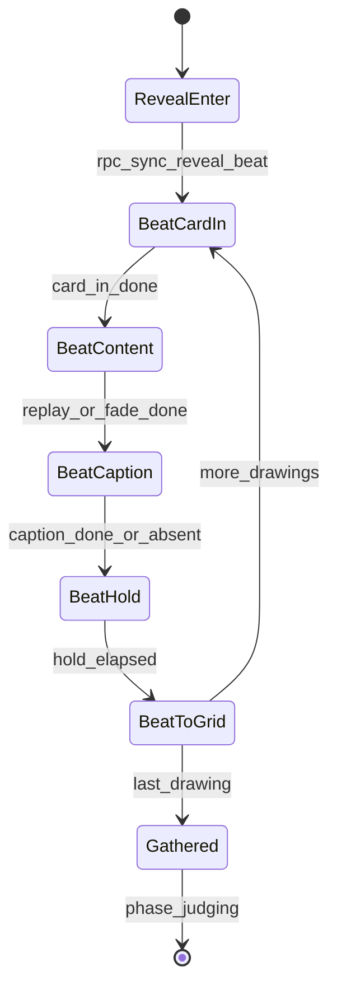

# Slice 5: Reveal Styles & Replay
## Grid vs one-at-a-time reveal, stroke replay modes/speeds, winner victory lap, and anonymous captions

**Version:** 1.0
**Last Updated:** 2026-07-04
**Dependencies:**
- Slice 3 (REVEAL/JUDGING/RESOLUTION phases, reveal drawing distribution, judging grid, resolution screen)
- Slice 1 (stroke replay renderer, DrawingDoc timestamps, drawing view component)
- Slice 4 (ReactionGate `open_for()` per-drawing, ReactionBar component, kudos during reveal beats)
- Skeleton (EventBus, TextFilter, constants)

**Provides:** Reveal choreography (the "Social" mode's soul), `ReplayPlanner` speed/cap math, caption pipeline, winner victory lap, and the reveal/replay/caption **setting keys + defaults** that Slice 6 surfaces in the lobby UI.

---

## 1. Overview

This slice turns Slice 3's utilitarian "drawings appear in a grid" reveal into the two designed reveal styles (§7): **grid** (all at once, no per-drawing moment) and **one-at-a-time** (each drawing gets an individual reveal-and-react beat — optionally animating its strokes — then all gather into the grid for judging). It adds the three stroke-replay modes (off / winner-only / full), separate capped speeds for reveal replay vs winner replay, the winner victory lap at resolution, and optional anonymous one-line captions ("comments — anonymous artist defense", §10).

**North-star rule (§1):** every duration in this slice is a named constant chosen to keep the game *moving*. The one-at-a-time flow is theatrical but must never drag — caps shrink automatically as player count grows.

### Scope

**In Scope:**
- `reveal_style` behavior: GRID and ONE_AT_A_TIME, including the gather-into-grid transition (§7)
- `replay_mode` OFF / WINNER_ONLY / FULL and the `ReplayPlanner` (speeds, caps, idle-gap compression)
- Separate `reveal_replay_speed` / `winner_replay_speed` (adjustable, capped — 30 s drawing replays in ≤ ~10 s, §7)
- **Setting keys + defaults defined now** (consumed by Slice 6's settings surface; until Slice 6 lands, values come from `GameSettings` defaults)
- Winner victory lap at RESOLUTION (large view, author reveal, optional replay)
- Canvas orientation preserved in every reveal/judging/winner view — portrait letterboxed in landscape cells (§5, §7)
- Captions: optional one-line, entered during the drawing phase, TextFiltered, shown with the drawing at reveal, per-lobby toggle (§10)
- Precise timing/choreography for the one-at-a-time flow (Section 5 + constants)

**Out of Scope (Later Slices):**
- Lobby settings UI, presets, preset locking — Slice 6 (keys defined here, surfaced there)
- Reaction/kudos mechanics themselves — Slice 4 (done; this slice opens/closes its gate per beat)
- Wrap-up replays / collection replay — Slices 10 / 8 (both reuse `ReplayPlanner`)
- Late-join mid-reveal behavior — Slice 9

### Key user flows
1. **Social reveal:** Drawing 1 slides on stage → strokes animate at capped speed → caption fades in beneath → 3 s react-and-heckle hold (reaction bar + kudos live, chat prominent) → card shrinks into its grid slot → drawing 2… → last card lands → JUDGING opens on the full grid.
2. **Streamlined reveal:** All drawings pop into the grid at once with a single 0.25 s fade; straight to judging.
3. **Victory lap:** Judge picks; at RESOLUTION the winner's drawing takes ~60 % of the screen, author's name/avatar revealed, strokes replay (WINNER_ONLY/FULL), points tally shown alongside (Slice 3's tally UI).

---

## 2. Data Models

### Setting keys defined by this slice (contract with Slice 6)

Stored in `GameSettings` (`res://game/session/settings.gd`); enum homes noted. Full lobby surface, presets, and lock rules are Slice 6's job — **these keys, types, and defaults are authoritative from this slice on** and Slice 6 must not rename them.

| Key | Type | Default | Range/Values | Consumed by |
|-----|------|---------|--------------|-------------|
| `reveal_style` | `GameSettings.RevealStyle` | `ONE_AT_A_TIME` | `GRID`, `ONE_AT_A_TIME` | this slice |
| `replay_mode` | `GameSettings.ReplayMode` | `WINNER_ONLY` | `OFF`, `WINNER_ONLY`, `FULL` | this slice |
| `reveal_replay_speed` | `float` | `4.0` | 2.0–10.0, step 0.5 (× real time) | this slice |
| `winner_replay_speed` | `float` | `3.0` | 2.0–10.0, step 0.5 | this slice |
| `comments_enabled` | `bool` | `true` | — | this slice |

```gdscript
# In res://game/session/settings.gd (class GameSettings — formalized fully in Slice 6)
enum RevealStyle { GRID, ONE_AT_A_TIME }
enum ReplayMode { OFF, WINNER_ONLY, FULL }
```

### Choreography constants

**File: `res://core/constants/game_constants.gd`** (all dev-tunable, none host-exposed — Social's "longer windows" come from preset settings, not these):

```gdscript
# --- Reveal choreography (Slice 5) ---
const REVEAL_CARD_IN_SECS := 0.35        # card slide/scale onto stage
const REVEAL_SHOW_FADE_SECS := 0.25      # non-replay content fade-in
const REVEAL_CAPTION_SECS := 0.6         # caption fade/type-in (skipped if no caption)
const REVEAL_REACT_HOLD_SECS := 3.0      # react-and-heckle hold per drawing
const REVEAL_TO_GRID_SECS := 0.45        # card shrink into its grid slot
const REVEAL_GRID_FADE_SECS := 0.25      # grid-style: all-at-once fade
const REVEAL_REPLAY_CAP_SECS := 6.0      # hard per-drawing replay cap during reveal
const REVEAL_REPLAY_BUDGET_SECS := 30.0  # total replay budget across all beats (snappiness guard)
const WINNER_REPLAY_CAP_SECS := 10.0     # victory lap cap (brief §7: 30 s drawing ≤ ~10 s)
const CAPTION_MAX_CHARS := 80
const REPLAY_MAX_IDLE_GAP_SECS := 0.35   # inter-stroke thinking pauses compressed to this (at 1×)
```

### Caption (transient, rides the submission)

No new class — the Slice 3 submission payload dictionary gains one key:

| Field | Type | Required | Description |
|-------|------|----------|-------------|
| `caption` | String | No (`""`) | ≤ `CAPTION_MAX_CHARS`, host-censored via `TextFilter`, anonymous, shown at reveal. Ignored (stripped) by the host when `comments_enabled == false`. |

Captions are session-transient: never persisted to the collection in v1 (the collection index stores prompt only — decision logged; revisit if playtests miss them).

### ReplayPlanner

**File: `res://game/drawing/replay_planner.gd`** — pure static math, no scene deps (headless-testable).

```gdscript
class_name ReplayPlanner
extends RefCounted

## Duration of the doc's drawing activity after idle-gap compression, at 1x.
static func compressed_duration(doc: Dictionary) -> float

## Timescale for a reveal-beat replay: speed setting, tightened to fit both the
## per-drawing cap and an equal share of the total reveal budget.
static func reveal_timescale(doc: Dictionary, speed: float, drawer_count: int) -> float:
    var dur: float = compressed_duration(doc)
    if dur <= 0.0:
        return 1.0  # empty/instant docs replay "instantly" (caller skips animation)
    var cap: float = minf(GameConstants.REVEAL_REPLAY_CAP_SECS,
            GameConstants.REVEAL_REPLAY_BUDGET_SECS / float(maxi(1, drawer_count)))
    return maxf(speed, dur / cap)

## Timescale for the winner victory lap (own cap, own speed setting).
static func winner_timescale(doc: Dictionary, speed: float) -> float

## Seconds a replay will actually take (for host beat scheduling).
static func replay_secs(doc: Dictionary, timescale: float) -> float
```

**Relationships:** consumes Slice 1's `DrawingDoc` (`ts` arrays drive timing); the Slice 1 replay renderer takes a `timescale` parameter (if Slice 1 shipped fixed-speed, extend it there — it owns rendering).

---

## 3. Event/Action Definitions

### RPCs

Host is the metronome: it schedules beats, opens/closes the Slice 4 `ReactionGate`, and tells clients when each beat starts. Clients animate locally from the beat message (no per-frame sync).

| RPC | Direction | Args | Validation | Effect |
|-----|-----------|------|------------|--------|
| `rpc_sync_reveal_beat` | host → all | `index: int`, `drawing_id: String`, `beat_secs: float` | authority-only sender | Clients play the beat (card-in → replay/fade → caption → hold); host opens `ReactionGate.open_for([drawing_id])`; emit `EventBus.reveal_beat_started` |
| `rpc_sync_reveal_gather` | host → all | *(none)* | authority-only sender | Clients animate all cards into grid slots; emit `EventBus.reveal_gathered`; host then advances phase to JUDGING (Slice 3's phase sync, gate → open-all via Slice 4) |
| `rpc_request_submit_drawing` *(Slice 3 RPC, payload extended)* | client → host | `doc: Dictionary` — dict gains optional `"caption": String` | Slice 3's 5-step validation **plus**: strip caption when `comments_enabled == false`; truncate to `CAPTION_MAX_CHARS`; `TextFilter.censor()`; strip control chars/newlines | Caption stored beside the submission; delivered to clients inside Slice 3's reveal-set sync |

Grid style sends no beats: Slice 3's existing reveal-set sync + phase change is enough; clients play one `REVEAL_GRID_FADE_SECS` fade. The winner victory lap needs no new RPC — clients derive it from Slice 3's resolution sync (`winner_drawing_id`) + local settings.

### Caption validation snippet (inside Slice 3's submit handler — 5-step pattern preserved)

```gdscript
# Step 3/4 addition inside rpc_request_submit_drawing on the host:
var caption: String = str(doc.get("caption", ""))
if not session.settings.comments_enabled:
    caption = ""
caption = caption.replace("\n", " ").strip_edges().left(GameConstants.CAPTION_MAX_CHARS)
caption = TextFilter.censor(caption)   # blocklist (design brief §13)
submission.caption = caption
```

### EventBus signals (append to `res://core/events/event_bus.gd`)

```gdscript
## Emitted on all peers when a one-at-a-time reveal beat starts. beat_secs is the
## host-computed total beat duration (drives client-side progress affordances).
signal reveal_beat_started(index: int, drawing_id: String, beat_secs: float)
## Emitted on all peers when the reveal gathers into the judging grid.
signal reveal_gathered()
## Emitted locally when the winner victory-lap presentation finishes (wrap-up of RESOLUTION visuals).
signal winner_lap_finished(drawing_id: String)
```

---

## 4. Storage Schema Extensions

N/A — this slice persists nothing. Captions are session-transient, reveal state is per-round, and all settings keys live in `GameSettings` (Slice 6 owns settings persistence in `user://profile.json`). Collection writes remain exactly as defined in Slice 4.

---

## 5. State Machines

### One-at-a-time reveal choreography (host-driven, inside Slice 3's REVEAL phase)

This is the "Social" mode's soul — timings are exact, host-clocked, and identical on every client.



### Beat timeline (per drawing *i*)

| Step | Duration | Reactions on this drawing? | Notes |
|------|----------|---------------------------|-------|
| Card-in | `REVEAL_CARD_IN_SECS` (0.35) | opens at step start | Card slides/scales to stage center; orientation letterboxed |
| Content | FULL: `replay_secs(doc, reveal_timescale)` ≤ per-drawing cap; else `REVEAL_SHOW_FADE_SECS` (0.25) | yes | Empty doc (0 ops): skip replay, show blank canvas immediately |
| Caption | `REVEAL_CAPTION_SECS` (0.6), skipped if `caption == ""` | yes | One line under the card, quoted, no attribution |
| Hold | `REVEAL_REACT_HOLD_SECS` (3.0) | yes — the beat's core | Reaction bar + kudos button under the card; chat prominent (§5) |
| To-grid | `REVEAL_TO_GRID_SECS` (0.45) | closes at step end (+ Slice 4 grace) | Card shrinks into its final grid slot (same layout as judging) |

`beat_secs` = sum of the applicable rows; the host computes it per drawing (replay durations differ), schedules the next `rpc_sync_reveal_beat` on its own timer, and opens/closes the Slice 4 gate at the boundaries above. **Worst case check:** 7 drawers, FULL replay → per-drawing replay cap = min(6.0, 30/7 ≈ 4.3) → beat ≈ 0.35+4.3+0.6+3.0+0.45 ≈ 8.7 s → full reveal ≈ 61 s. Long but deliberate for Social; Streamlined/Default never pay it (grid / no full replay).

### Transition Rules

| Current | Trigger | New | Validation | Side Effects |
|---------|---------|-----|------------|--------------|
| RevealEnter | host timer | BeatCardIn(0) | ≥1 submission | gate `open_for(first)` |
| BeatToGrid(i) | host timer | BeatCardIn(i+1) | i+1 < count | gate closes (i), opens (i+1) |
| BeatToGrid(last) | host timer | Gathered | — | `rpc_sync_reveal_gather` |
| Gathered | gather anim budget elapsed | JUDGING (Slice 3) | — | gate `open_all` (Slice 4) |

Clients that fall behind (hitched frame) hard-snap to the current beat on the next `rpc_sync_reveal_beat` — host never waits for client animation acks.

---

## 6. Business Logic

### RevealDirector (host)

**File: `res://game/session/reveal_director.gd`** — owned by `GameSession`, runs only on the host, no UI references.

**Key methods:**

#### `start(style, submissions, settings, drawer_count) -> void`
Orders drawings in Slice 3's shuffled (anonymity-preserving) reveal order; GRID → immediately gathers; ONE_AT_A_TIME → schedules beats.

#### `_compute_beat_secs(doc, caption, settings) -> float`
Applies the beat timeline table; uses `ReplayPlanner.reveal_timescale()` only when `replay_mode == FULL`.

**Business rules:**
1. `replay_mode == FULL` is the only mode that animates during reveal beats; WINNER_ONLY and OFF show content with the short fade (§7). FULL + GRID is a legal but pointless combo — grid style ignores replay entirely (documented for Slice 6's UI hinting).
2. Replay caps: per-drawing `REVEAL_REPLAY_CAP_SECS`, shrunk by the shared `REVEAL_REPLAY_BUDGET_SECS / drawer_count`; winner lap uses `WINNER_REPLAY_CAP_SECS` (≈ brief's "30 s drawing ≤ ~10 s", §7).
3. Idle-gap compression (`REPLAY_MAX_IDLE_GAP_SECS`) applies to every replay — long thinking pauses never count against the show.
4. Reveal and winner speeds are independent settings; presets lock them, Custom exposes them (Slice 6, §7/§10).

### Victory lap (client-side presentation)

At Slice 3's resolution sync, every client: shows the winner's drawing large (~60 % width), reveals author name + avatar chip, and if `replay_mode != OFF` replays at `winner_timescale`. `EventBus.winner_lap_finished` fires when done (Slice 3's resolution screen sequences the tally around it). No-winner rounds (judge no-pick, §11) skip the lap — Slice 3's penalty presentation runs instead.

### Caption entry

Drawing screen (Slice 3) gains a collapsed one-line caption field when `comments_enabled`; the drawer can fill it any time during the phase (§10 "during/at end"). At auto-submit it rides the payload. Client pre-censors for niceness; **host censor is authoritative** (§13).

---

## 7. UI Components

### RevealStage screen (one-at-a-time)

**File: `res://ui/round/reveal_stage.tscn` + `reveal_stage.gd`** (child of Slice 3's `RoundRoot`, REVEAL phase)

```
+--------------------------------------------------+
| Prompt: "sleepy aardvark"          [ 3 / 6 ]     |
|                                                  |
|              +----------------+       [chat]     |
|   (settled   |   DRAWING      |       [panel]    |
|    cards     |   (letterboxed |       prominent  |
|    shrink    |    if portrait)|       (§5)       |
|    to a      +----------------+                  |
|    grid      | "it's resting" |  <- caption      |
|    strip)    |  😂3 ❤️ 😮 ... [🏅]| <- Slice 4 bar   |
+--------------------------------------------------+
```

- Reuses Slice 4's `ReactionBar` + `KudosButton` targeting the staged drawing only (gate enforces server-side).
- Grid strip at the edge previews already-revealed cards in their final slots — the gather is spatially honest.
- Uses the shared `GridLayout` helper (below) so card end-positions match the judging grid exactly; the REVEAL→JUDGING swap is visually seamless.

### GridLayout helper

**File: `res://ui/round/grid_layout.gd`** — pure function `static func slot_rects(count: int, area: Rect2, orientations: Array[String]) -> Array[Rect2]`. Used by reveal stage, judging grid (Slice 3 retrofits), and gather animation. Every cell letterboxes its drawing to preserve orientation (§5): portrait docs get pillarboxed fit inside landscape-proportioned cells, never cropped or stretched.

### WinnerSpotlight component

**File: `res://ui/round/winner_spotlight.tscn` + `winner_spotlight.gd`**

**Props:** `doc: Dictionary`, `author_name: String`, `timescale: float`, `animate: bool`.
**Signals:** `lap_finished()`.
Shown inside Slice 3's resolution screen; caption (if any) displayed beneath, now with attribution (authorship is public at resolution).

### CaptionInput component

**File: `res://ui/round/caption_input.tscn` + `caption_input.gd`**

**Props:** `max_chars: int` (binds `CAPTION_MAX_CHARS`).
Single `LineEdit` + live char counter, collapsed to a "Add a caption…" chip until clicked; never steals canvas focus (Enter releases focus back to drawing). Hidden entirely when `comments_enabled == false`.

### Grid-reveal caption display
In GRID style and on the judging grid, captions render as a single truncated line under each cell with full text on hover tooltip (batchable polish).

**User Interactions:**

| Action | Trigger | Result |
|--------|---------|--------|
| React during beat | Emoji tap on staged card | Slice 4 pipeline, gated to current drawing |
| Kudos during beat | Kudos tap on staged card | Slice 4 pipeline (kudos active whenever reactions are, §11) |
| Type caption | Click caption chip while drawing | Inline edit, ≤ 80 chars |
| Watch victory lap | Automatic at resolution | Replay per settings; tally alongside |

### User Confirmation Checkpoints

- [ ] **[BLOCKING] One-at-a-time feel:** 3-instance Social-style round — beats land identically on all clients, reactions during beats work, gather flows into judging with no visual jump. (Blocking — Slice 6's Social preset is this flow; tuning constants may change based on this test.)
- [ ] **[BLOCKING] Replay caps:** a deliberately slow 60 s+ drawing replays within the cap during reveal and within ~10 s in the victory lap. (Blocking — north-star pacing, §1/§7.)
- [ ] [Batchable] Gather animation polish; grid strip previews.
- [ ] [Batchable] Caption entry ergonomics + reveal presentation; blocklisted word shows censored.
- [ ] [Batchable] Portrait letterboxing looks right in stage, grid, and spotlight.

---

## 8. State Management

No new autoloads.

| Where | State | Authority |
|-------|-------|-----------|
| `GameSession.reveal_director` (host) | Beat index, per-beat timers, computed beat durations | Host truth; clients follow beat RPCs |
| Reveal/judging/resolution screens (clients) | Local tweens/animation state, cached docs + captions from Slice 3 reveal sync | Ephemeral; hard-snaps to host beats |
| `GameSettings` (replicated read-only) | The 5 keys from Section 2 | Host edits (Slice 6); snapshot immutable in-game |
| `EventBus` | 3 new signals | — |

UI reads settings via the session's snapshot only — never from a live lobby settings object mid-game (Slice 6's snapshot rule).

---

## 9. Integration Points

### Dependencies (What This Slice Needs)

#### From Skeleton
- `TextFilter.censor` for captions; EventBus; constants file

#### From Slice 1
- Replay renderer with an externally supplied `timescale` (extend in place if it shipped fixed-speed — Slice 1 owns rendering; record in its implementation notes)
- `DrawingDoc` `ts` timestamps; drawing view with aspect-preserving letterbox fit

#### From Slice 3 (assumed interfaces — verify when `TDD/03-core-round-loop.md` lands)
- REVEAL phase entered with all submissions distributed to clients (docs + shuffled anonymous order); this slice adds `caption` to that payload
- Host hook to delay the REVEAL→JUDGING phase advance until `RevealDirector` finishes (grid: one fade; one-at-a-time: all beats + gather)
- Resolution sync carrying `winner_drawing_id` (or a no-pick marker)
- Judging grid retrofitted onto `GridLayout` for seamless gather

#### From Slice 4
- `ReactionGate.open_for([drawing_id])` / close-with-grace at beat boundaries
- `ReactionBar` / `KudosButton` components reused on the reveal stage

### Provides (For Future Slices)
- **Slice 6:** the 5 setting keys + defaults (Section 2 table is the contract); combo hints (GRID ignores FULL replay)
- **Slice 8 / 10:** `ReplayPlanner` for collection viewing and wrap-up evidence replays; `WinnerSpotlight` reusable for title cards
- **Slice 9:** beat RPCs are idempotent snapshots (`index` + `drawing_id`), so a rejoining client can resync mid-reveal

### Integration Checklist
- [ ] Choreography constants added to `core/constants/game_constants.gd` (no magic numbers in scenes)
- [ ] 3 EventBus signals declared with doc comments
- [ ] 2 new RPCs + 1 payload extension documented and validated
- [ ] Setting keys registered in `GameSettings` with defaults (Slice 6 will surface them)
- [ ] Judging grid moved onto `GridLayout`

---

## 10. Edge Cases

### Reaction fired exactly as a beat ends
**Scenario:** Player reacts to the staged drawing during the to-grid shrink; request lands after the gate moved to the next drawing.
**Handling:** Slice 4's `REACTION_CLOSE_GRACE_MSEC` (250 ms) covers the boundary; after grace, dropped silently. All drawings become reactable again seconds later in JUDGING, so nothing is truly lost.
**Rationale:** Flow over strictness (§1); the judging window is the catch-all.

### Empty drawing (0 ops)
**Scenario:** A drawer submits an untouched canvas (panicked, AFK).
**Handling:** No replay (planner returns instantly); blank canvas shows with the fade; caption still displays — a blank card captioned "it's camouflaged" is the game working as intended.
**Rationale:** Comedy is the product (§1).

### Very long or timestamp-degenerate drawings
**Scenario:** 120 s draw timer, or a doc whose `ts` arrays are non-monotonic/absurd (hostile client, §13).
**Handling:** Idle-gap compression + caps bound all replays regardless of input; `compressed_duration` clamps negative/NaN deltas to 0. Replay can never exceed the cap — host beat schedule is computed from the same math, so clients and host agree.

### Caption edge inputs
**Scenario:** 80-char caption (exact limit), emoji/UTF-8, newlines pasted in, blocklisted words.
**Handling:** Exact limit passes; `left(80)` truncates by Unicode chars (no mid-grapheme split guarantees in v1 — accepted); newlines flattened to spaces; blocklist words censored to `***` (never rejected — a censored caption is funnier than a missing one). Client mirrors the same rules pre-send.

### Author disconnects mid-reveal
**Scenario:** Drawer quits while their drawing is on stage.
**Handling:** Nothing changes — the beat plays out; the drawing remains judged/reactable (§9). Victory lap of a disconnected winner shows their remembered name.

### Judge no-pick round
**Scenario:** Window ends with no winner (§11).
**Handling:** No victory lap; `winner_lap_finished` is not emitted; Slice 3's no-pick presentation (−1 to judge) runs. `replay_mode` is irrelevant that round.

### Client hitches during choreography
**Scenario:** A slow client is mid-replay when the next beat RPC arrives.
**Handling:** Hard-snap: kill tweens, place prior cards in their slots, start the new beat. Host never waits.
**Rationale:** Host-clocked beats keep reaction windows fair and the room in sync; a stuttery client hurts only itself.

### Performance Considerations
Each beat renders one live replay at most; settled cards are cached `ImageTexture`s (consistency guide §12). Gather animates ≤ 7 textured cards — trivial. Replay rendering reuses Slice 1's incremental raster path.

---

## 11. Testing Strategy

### Unit Tests

**Location:** `res://tests/game/`

#### `tests/game/drawing/test_replay_planner.gd`
- [ ] `test_thirty_sec_drawing_capped_at_ten_secs_winner` (brief §7 example: timescale ≥ 3.0)
- [ ] `test_reveal_cap_six_seconds`
- [ ] `test_budget_shrinks_cap_with_seven_drawers` (cap = 30/7)
- [ ] `test_idle_gaps_compressed`
- [ ] `test_empty_doc_duration_zero`
- [ ] `test_degenerate_timestamps_clamped`
- [ ] `test_speed_setting_respected_when_under_cap`

#### `tests/game/session/test_reveal_director.gd` (headless — no scenes)
- [ ] `test_beat_secs_full_replay_vs_off`
- [ ] `test_beat_sequence_covers_all_drawings_once`
- [ ] `test_grid_style_skips_beats_and_gathers`
- [ ] `test_caption_step_skipped_when_empty`
- [ ] `test_gate_opened_per_beat_and_closed_between` (via injected gate stub)

#### Caption validation (validator functions, no live network)
- [ ] `test_caption_truncated_to_max`
- [ ] `test_caption_censored_and_newlines_flattened`
- [ ] `test_caption_stripped_when_comments_disabled`

### Integration Tests
- [ ] Simulated round with ONE_AT_A_TIME + FULL: host beat schedule total equals sum of computed beat durations; JUDGING entered only after gather
- [ ] WINNER_ONLY: no reveal replays, victory-lap timescale computed
- [ ] Settings defaults flow: fresh `GameSettings` produces Section 2 defaults

### UI/Component Tests
- [ ] `reveal_stage.tscn`, `winner_spotlight.tscn`, `caption_input.tscn` instantiate clean
- [ ] `GridLayout.slot_rects` golden tests for 3–8 counts incl. mixed orientations

### Manual Testing Required
- [ ] Both blocking checkpoints (Section 7)
- [ ] 3-instance grid-style round (fade, straight to judging)
- [ ] Portrait drawing through stage → grid → spotlight, orientation preserved (batchable)

---

## 12. Implementation Checklist

### Setup
- [ ] Choreography + caption constants in `core/constants/game_constants.gd`
- [ ] `RevealStyle`/`ReplayMode` enums + 5 setting keys with defaults in `game/session/settings.gd`
- [ ] 3 EventBus signals appended

### Business Logic
- [ ] `game/drawing/replay_planner.gd` + tests (write tests first — pure math)
- [ ] Extend Slice 1 replay renderer with `timescale` (+ idle-gap compression) if absent
- [ ] `game/session/reveal_director.gd` + tests; wire into Slice 3 REVEAL phase with delayed-advance hook
- [ ] Caption pipeline: payload key, host validation additions, client pre-censor

### RPC / Networking
- [ ] `rpc_sync_reveal_beat`, `rpc_sync_reveal_gather` on the session node
- [ ] Extend Slice 3 submit handler (caption steps) and reveal-set payload (captions included)

### UI Layer
- [ ] `ui/round/grid_layout.gd` + golden tests; retrofit judging grid
- [ ] `ui/round/reveal_stage.tscn/.gd` (beats, grid strip, Slice 4 bar reuse, hard-snap rule)
- [ ] `ui/round/winner_spotlight.tscn/.gd`; integrate into resolution screen
- [ ] `ui/round/caption_input.tscn/.gd`; mount on drawing screen behind `comments_enabled`
- [ ] Grid/judging caption line + tooltip

### Testing
- [ ] All unit/integration/scene tests green headless; full suite green

### User Confirmation
- [ ] Blocking: one-at-a-time feel on 3 instances; replay caps honored
- [ ] Batchable list presented at slice end

### Documentation
- [ ] Update `WHERE_WE_ARE.md`; session log; implementation notes
- [ ] Decision log: captions-not-persisted-to-collection; any Slice 1 renderer extension

---

**End of Slice 5**
