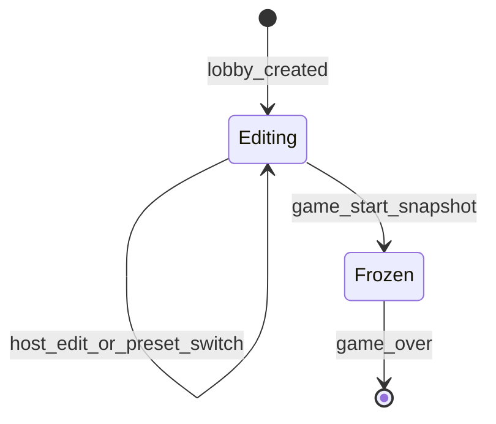

# Slice 6: Game Modes & Settings
## GameSettings formalized, Default/Streamlined/Social presets + Custom, lobby settings UI, immutable game-start snapshot

**Version:** 1.0
**Last Updated:** 2026-07-04
**Dependencies:**
- Slice 3 (game start flow + start payload, `judging_window_secs`/`draw_time_secs`/`round_count` consumers)
- Slice 5 (reveal/replay/caption setting keys + defaults — authoritative, defined there)
- Slice 2 (lobby screen, host/client roles, roster size signals)
- Touchpoints: Slice 4 (`KUDOS_AUTO` allotment resolution), Slice 10 (`title_points_enabled`), Slice 7 (`pool_source`)
- Skeleton (`settings_defaults.gd` stub, EventBus, Save)

**Provides:** The complete `GameSettings` surface (every key, type, default, range, consumer), three concrete presets + Custom, preset lock rule, round-count suggestion, lobby settings UI with read-only client broadcast, and the immutable settings snapshot every in-game system reads.

---

## 1. Overview

This slice formalizes everything host-configurable into one typed `GameSettings` object (§10): three preset modes (**Default** — playtested happy medium; **Streamlined** — grid reveal, replay off, quick judging, fewer theatrics; **Social** — one-at-a-time + full replay, longer windows, more chat time) plus **Custom**, which exposes the full surface including the title-points toggle (§11). Presets lock every setting except the always-tunable three: **draw time, round count, prompt-pool source** (§10). The lobby gets a mode selector and a conditional settings panel; clients see settings read-only via broadcast; at game start the settings are snapshotted immutably and that snapshot is the only thing in-game systems ever read.

All preset values below are **v1 proposals as code constants** — deliberately easy to tune in playtesting (§10 "draw-time defaults are per-mode code constants").

### Scope

**In Scope:**
- `GameSettings` (`game/session/settings.gd`): full key enumeration, types, defaults, valid ranges, validation/clamping, serialization, lock rule, frozen snapshot
- Presets in `core/constants/settings_defaults.gd` (skeleton stub → real values)
- Round-count suggestion: default divisible by player count (~2× players), host-overridable, recomputed as lobby size changes pre-start (§10)
- Lobby UI: mode selector + conditional settings panel (preset view vs Custom full surface); host-only editing
- `rpc_sync_settings` broadcast; full sync to newly joined lobby members
- Settings snapshot into Slice 3's game-start payload; `kudos_allotment` AUTO resolution at snapshot time (Slice 4 math)
- Host convenience: last-used settings persisted to `user://profile.json`

**Out of Scope (Later Slices):**
- Player-created pool submission flow — Slice 7 (`pool_source` selects it; the flow itself is 7)
- Title points *consumption* — Slice 10 (the toggle lives here)
- Mid-game settings changes — never (snapshot is immutable by design)
- Per-player client preferences (UI scale, etc.) — not game settings; separate profile concern

### Key user flows
1. **Preset pick:** Host taps "Streamlined" → locked values apply instantly, panel shows the always-three editable + a read-only summary of what Streamlined means → all clients' lobby views update within a beat.
2. **Custom tuning:** Host taps "Custom" → full surface unlocks (seeded from the currently applied values) → host drags judging window to 45 s, toggles title points off → broadcast, clients see read-only values.
3. **Lobby grows:** 4th player joins pre-start → suggested round count recomputes 6 → 8 → shown as "(suggested: 8)"; if the host already overrode to 10, the 10 stays, hint updates.
4. **Start:** Host hits Start → settings validated, clamped, frozen; snapshot rides the Slice 3 start payload; kudos allotment resolved from final round count.

---

## 2. Data Models

### GameSettings

**File: `res://game/session/settings.gd`**

```gdscript
class_name GameSettings
extends RefCounted

enum Mode { DEFAULT, STREAMLINED, SOCIAL, CUSTOM }
enum RevealStyle { GRID, ONE_AT_A_TIME }        # defined in Slice 5
enum ReplayMode { OFF, WINNER_ONLY, FULL }      # defined in Slice 5
enum PoolSource { BUILT_IN, PLAYER_CREATED }

const KUDOS_AUTO := -1          # sentinel: resolve via KudosLedger.compute_allotment (Slice 4)
const SETTINGS_VERSION := 1     # "v" in every serialized dict

var mode: Mode = Mode.DEFAULT
var reveal_style: RevealStyle = RevealStyle.ONE_AT_A_TIME
var replay_mode: ReplayMode = ReplayMode.WINNER_ONLY
var reveal_replay_speed: float = 4.0
var winner_replay_speed: float = 3.0
var judging_window_secs: int = 25
var comments_enabled: bool = true
var kudos_allotment: int = KUDOS_AUTO
var title_points_enabled: bool = true
var draw_time_secs: int = 30
var round_count: int = 6                # lobby re-seeds from suggestion; see Section 6
var pool_source: PoolSource = PoolSource.BUILT_IN

var round_count_overridden: bool = false  # host touched it; suggestion stops overwriting
var _frozen: bool = false                 # true on snapshots; set_value() rejects
```

### The full settings surface (authoritative enumeration)

| Key | Type | Default | Valid range / values | Locked by presets? | Consumed by |
|-----|------|---------|----------------------|--------------------|-------------|
| `mode` | `Mode` | `DEFAULT` | 4 modes | — (the selector itself) | this slice, lobby browser (Slice 13) |
| `reveal_style` | `RevealStyle` | `ONE_AT_A_TIME` | `GRID`, `ONE_AT_A_TIME` | Yes | Slice 5 |
| `replay_mode` | `ReplayMode` | `WINNER_ONLY` | `OFF`, `WINNER_ONLY`, `FULL` | Yes | Slice 5 |
| `reveal_replay_speed` | `float` | `4.0` | 2.0–10.0, step 0.5 | Yes | Slice 5 |
| `winner_replay_speed` | `float` | `3.0` | 2.0–10.0, step 0.5 | Yes | Slice 5 |
| `judging_window_secs` | `int` | `25` | 10–60, step 5 | Yes | Slice 3 |
| `comments_enabled` | `bool` | `true` | — | Yes | Slice 5 |
| `kudos_allotment` | `int` | `KUDOS_AUTO` | `-1` (AUTO) or 0–8 | Yes | Slice 4 (§11: host-adjustable) |
| `title_points_enabled` | `bool` | `true` | — | Yes — **editable only in Custom** (§11) | Slice 10 |
| `draw_time_secs` | `int` | `30` | 10–120, step 5 | **No — always tunable** (§10) | Slice 3 |
| `round_count` | `int` | suggestion (see §6) | 3–20 | **No — always tunable** (§10) | Slice 3, 4 (allotment), 7 (share math) |
| `pool_source` | `PoolSource` | `BUILT_IN` | `BUILT_IN`, `PLAYER_CREATED` | **No — always tunable** (§10) | Slice 3 / Slice 7 |

Serialization: `to_dict() -> Dictionary` (all keys + `"v": SETTINGS_VERSION`, enums as ints) / `static from_dict(d: Dictionary) -> GameSettings` (missing/invalid keys → defaults, every value clamped; unknown keys ignored; `v > SETTINGS_VERSION` rejected per consistency guide §6).

### Presets

**File: `res://core/constants/settings_defaults.gd`** — plain literal dictionaries (core must not depend on `game/` classes; a unit test asserts every preset validates through `GameSettings.from_dict`, keeping the by-convention coupling honest).

```gdscript
class_name SettingsDefaults

# Values are GameSettings enum ints, commented for humans. v1 proposals — tune freely (§10).
const PRESET_DEFAULT := {
    "reveal_style": 1,          # ONE_AT_A_TIME — per-drawing beat, no full stroke anim
    "replay_mode": 1,           # WINNER_ONLY — victory lap only
    "reveal_replay_speed": 4.0,
    "winner_replay_speed": 3.0,
    "judging_window_secs": 25,
    "comments_enabled": true,
    "kudos_allotment": -1,      # AUTO (round_count/4, .5 up — Slice 4)
    "title_points_enabled": true,
    "draw_time_secs": 30,
}
const PRESET_STREAMLINED := {
    "reveal_style": 0,          # GRID — all at once (§10 "fewer theatrics, more rounds")
    "replay_mode": 0,           # OFF
    "reveal_replay_speed": 6.0, # stored but unused while replay is off
    "winner_replay_speed": 4.0,
    "judging_window_secs": 15,  # quick judging
    "comments_enabled": false,
    "kudos_allotment": -1,
    "title_points_enabled": true,
    "draw_time_secs": 20,
}
const PRESET_SOCIAL := {
    "reveal_style": 1,          # ONE_AT_A_TIME
    "replay_mode": 2,           # FULL — every drawing animates (§10 "slower and sillier")
    "reveal_replay_speed": 3.0, # slower replays = more theater, still capped (Slice 5)
    "winner_replay_speed": 2.5,
    "judging_window_secs": 40,  # longer reaction window, more chat time
    "comments_enabled": true,
    "kudos_allotment": -1,
    "title_points_enabled": true,
    "draw_time_secs": 45,
}
const PRESETS := {0: PRESET_DEFAULT, 1: PRESET_STREAMLINED, 2: PRESET_SOCIAL}  # Mode -> dict
```

Presets deliberately omit `round_count` and `pool_source` (always-tunable, never reset by a mode switch). `draw_time_secs` IS in each preset (per-mode default, §10) but remains editable afterward. Custom has no preset dict — it seeds from whatever values are currently applied.

---

## 3. Event/Action Definitions

### RPCs

The host is peer 1 and the settings authority; host UI mutates the live `GameSettings` directly (no request RPC exists — clients have no edit path, so there is nothing to validate inbound).

| RPC | Direction | Args | Validation | Effect |
|-----|-----------|------|------------|--------|
| `rpc_sync_settings` | host → all | `settings: Dictionary` (full `to_dict()`, never deltas) | authority-only sender; clients run `from_dict` (clamps/defaults — a hostile "host" still can't crash a client, §13) | Clients replace their read-only copy; emit `EventBus.lobby_settings_changed` |
| `rpc_sync_round_suggestion` | host → all | `suggested: int`, `overridden: bool` | authority-only sender | Clients update the "(suggested: N)" hint in the read-only panel |
| *(extension)* Slice 3's game-start sync | host → all | start payload dict gains `"settings": Dictionary` — the frozen snapshot with `kudos_allotment` already resolved to a concrete int | Slice 3's existing validation | Every client constructs its immutable in-game `GameSettings` from this; nothing reads lobby settings after start |

Full-dict broadcasts keep late lobby joiners trivial: on `peer_connected` (pre-game, Slice 2 flow), the host sends the current `rpc_sync_settings` + `rpc_sync_round_suggestion` to the new peer.

Rapid host edits (slider drags) are coalesced: broadcast at most every 150 ms (trailing edge) — settings dicts are tiny, this is politeness not necessity.

### EventBus signals (append to `res://core/events/event_bus.gd`)

```gdscript
## Emitted on every peer when lobby settings change (host edit broadcast or join sync).
## settings is the full serialized GameSettings dict (includes "mode").
signal lobby_settings_changed(settings: Dictionary)
## Emitted on every peer when the round-count suggestion is recomputed.
signal round_suggestion_changed(suggested: int, overridden: bool)
```

(Game-start settings delivery reuses Slice 3's existing phase/start signal — no extra signal.)

---

## 4. Storage Schema Extensions

### `user://profile.json` extension (host convenience)

Existing skeleton file; this slice adds one key. Read/write only via `Save`.

| Field | Type | Nullable | Default | Description |
|-------|------|----------|---------|-------------|
| `last_lobby_settings` | Dictionary | Yes | absent | Full `GameSettings.to_dict()` of the last lobby this player **hosted**, written at game start (post-validation). Loaded when they next host; invalid/corrupt → silently fall back to Default preset (`Save.read_json` contract). |

No new files, no index changes, no migration (additive key; readers tolerate absence). Round-count from a previous session is restored but immediately marked non-overridden and re-seeded by the suggestion for the *current* lobby size (stale round counts from a different-sized group are worse than the suggestion).

---

## 5. State Machines

### Settings lifecycle



| State | Description | Terminal? |
|-------|-------------|-----------|
| Editing | Lobby phase; host mutates, broadcasts; clients read-only | No |
| Frozen | Snapshot taken at start; `set_value()`/`apply_preset()` push_error and refuse; all in-game reads hit the snapshot | Yes (per game) |

| Current | Trigger | New | Validation | Side Effects |
|---------|---------|-----|------------|--------------|
| Editing | host edits a key | Editing | key editable under lock rule; value clamps to range | broadcast (coalesced) |
| Editing | host selects preset | Editing | mode != current | preset values applied (always-three preserved except draw-time reset to preset default); broadcast |
| Editing | Slice 3 start accepted | Frozen | full-surface validation passes | `snapshot()` deep-copies with `_frozen = true`; AUTO kudos resolved; snapshot into start payload; `last_lobby_settings` written |

---

## 6. Business Logic

### GameSettings methods

**File: `res://game/session/settings.gd`**

#### `apply_preset(new_mode: Mode) -> void`
Applies `SettingsDefaults.PRESETS[new_mode]` over the current values (Custom: applies nothing — keeps current values as the editing seed). Preserves `round_count`, `round_count_overridden`, and `pool_source` across every switch; `draw_time_secs` resets to the preset's per-mode default (§10). Refused when frozen.

#### `set_value(key: StringName, value: Variant) -> bool`
Single mutation gate used by the lobby UI. Returns `false` (and does nothing) when: frozen, unknown key, or **locked** — locked means `mode != CUSTOM` and `key` is not in `ALWAYS_TUNABLE := [&"draw_time_secs", &"round_count", &"pool_source"]` (§10). Values are clamped to the Section 2 ranges, never rejected for being out of range (host UI can't produce invalid values anyway; clamping is defense in depth). Setting `round_count` sets `round_count_overridden = true`.

#### `is_locked(key: StringName) -> bool`
Drives UI enable/disable. `title_points_enabled` is locked in all three presets and editable only in Custom (§11).

#### `suggested_round_count(player_count: int) -> int`  *(static)*
```gdscript
static func suggested_round_count(player_count: int) -> int:
    # ~2x players so everyone judges about twice (§10); divisible by player count
    # by construction; clamped to the valid range.
    return clampi(2 * player_count, ROUND_COUNT_MIN, ROUND_COUNT_MAX)  # 3..8 players -> 6..16
```
Recomputed by the lobby on every roster change pre-start (`EventBus.peer_connected/peer_disconnected` via Slice 2 roster). If `round_count_overridden == false`, the suggestion is *applied* to `round_count` and broadcast; if `true`, only the hint updates (host's explicit choice is never clobbered, §10 "host may override"). Non-divisible overrides are legal — pool share math already rounds up (§8, §10).

#### `snapshot() -> GameSettings`
Deep copy with `_frozen = true` and `kudos_allotment` resolved: if `KUDOS_AUTO`, replaced by `KudosLedger.compute_allotment(round_count)` (Slice 4). The snapshot is what Slice 3 embeds in the start payload and what every in-game system reads. The live lobby object is never referenced after start.

#### `validate_for_start(player_count: int) -> PackedStringArray`
Returns human-readable blockers (empty = good): currently just internal-consistency checks (all values in range — should be unreachable) and Slice 7's future hook (player-created pool readiness). Wired into Slice 2's start gate.

### Business rules
1. **Lock rule (§10):** preset selected ⇒ everything locked except draw time, round count, pool source. Custom ⇒ full surface unlocked, including `title_points_enabled` (§11).
2. **Snapshot immutability:** no mid-game settings mutation path exists, period. Rejoin/late-join (Slice 9) receives the snapshot, not lobby state.
3. **Preset values are constants, not data files** — tuning is a code edit + test run (§10).
4. **Clients never edit:** there is no client→host settings RPC. UI controls are disabled (not hidden) for non-hosts so everyone can *see* the rules of the game they're in.

---

## 7. UI Components

### Lobby settings panel (extends Slice 2's lobby screen)

**Files: `res://ui/lobby/mode_selector.tscn` + `.gd`, `res://ui/lobby/settings_panel.tscn` + `.gd`**

```
+------------------------------------------------------+
| [ Default ] [ Streamlined ] [ Social ] [ Custom ]    |  <- ModeSelector (host: buttons;
|------------------------------------------------------|     clients: highlight only)
| Always tunable                                       |
|   Draw time      [ 30s  - + ]                        |
|   Rounds         [ 8    - + ]  (suggested: 8)        |
|   Prompt pool    [ Built-in v ]                      |
|------------------------------------------------------|
| Preset view (Default/Streamlined/Social):            |
|   Reveal: one-at-a-time - Replay: winner (x3)        |
|   Judging: 25s - Captions: on - Kudos: auto (2)      |  <- read-only summary chips
|------------------------------------------------------|
| Custom view (replaces summary when mode == Custom):  |
|   Reveal style   [ Grid | One-at-a-time ]            |
|   Replay         [ Off | Winner | Full ]             |
|   Reveal speed   [====o----] 4.0x                    |
|   Winner speed   [===o-----] 3.0x                    |
|   Judging window [ 25s - + ]                         |
|   Captions       [x]   Title points [x]              |
|   Kudos          [ Auto v ] (Auto = 2 for 8 rounds)  |
+------------------------------------------------------+
```

- **Host:** all unlocked controls live; locked controls shown as summary chips (visible, not editable — players should know what "Streamlined" means).
- **Clients:** identical panel, every control disabled; updates flow from `lobby_settings_changed`. A subtle "host controls the settings" caption sits at the bottom.
- Kudos AUTO control shows the resolved value live ("Auto = 2 for 8 rounds") — recomputed locally from the displayed round count via Slice 4's formula.
- Conditional hinting (from Slice 5): selecting `GRID` grays the reveal-speed slider (grid ignores reveal replay); `OFF` grays both speed sliders.

**User Interactions:**

| Action | Trigger | Result |
|--------|---------|--------|
| Select mode | Host clicks preset button | `apply_preset` → coalesced broadcast; panel re-renders locked/unlocked |
| Tune always-three | Host uses steppers/dropdown | `set_value` → broadcast; rounds stepper sets overridden flag |
| Tune Custom surface | Host, Custom mode only | `set_value` → broadcast |
| Client views settings | Any settings change | Read-only panel updates within a beat |
| Start game | Host clicks Start (Slice 2 gate) | `validate_for_start` → snapshot → Slice 3 start payload |

### User Confirmation Checkpoints

- [ ] **[BLOCKING] Preset lock behavior:** host on Streamlined can edit only the always-three; switching to Custom unlocks everything incl. title points; switching back re-locks. (Blocking — Slices 7/9/10 read this surface; the lock rule must be right before they build on it.)
- [ ] **[BLOCKING] Client read-only sync:** second instance sees every host edit reflected read-only, including a join-in-progress-lobby full sync. (Blocking — Slice 7's pool_source flow assumes clients see settings truthfully.)
- [ ] [Batchable] Suggested-rounds hint recomputes as a 3rd/4th instance joins; override survives roster change.
- [ ] [Batchable] Panel layout/legibility at 1280×720; summary chips wording.
- [ ] [Batchable] Playtest pass on the three preset value sets (they're constants — expect tuning).

---

## 8. State Management

No new autoloads.

| Where | State | Authority |
|-------|-------|-----------|
| Lobby screen, host side | The live editable `GameSettings` | Host truth during Editing |
| Lobby screens, all clients | Read-only `GameSettings` replica from last full sync | Host via `rpc_sync_settings` |
| `GameSession` (all peers, in-game) | The frozen snapshot from the start payload | Immutable |
| `user://profile.json` | `last_lobby_settings` (host convenience) | Local |
| `EventBus` | 2 new signals (Section 3) | — |

**Access pattern rule:** in-game code (Slices 3/4/5/7/9/10) reads settings exclusively from `GameSession`'s snapshot — never from lobby state, never from `SettingsDefaults` directly. `SettingsDefaults` is read by `GameSettings.apply_preset` only.

---

## 9. Integration Points

### Dependencies (What This Slice Needs)

#### From Skeleton
- `settings_defaults.gd` stub (now filled), `Save`, EventBus, `Nav` (lobby already routed by Slice 2)

#### From Slice 2
- Lobby screen to host the panel; host/client role knowledge; roster-size change signals; start gate hook for `validate_for_start`

#### From Slice 3 (assumed interfaces — verify when its TDD lands)
- Start payload dict accepts a `"settings"` key; `GameSession` exposes the frozen snapshot to all systems; `judging_window_secs` / `draw_time_secs` / `round_count` read from it

#### From Slice 4
- `KudosLedger.compute_allotment` for AUTO resolution + live hint

#### From Slice 5
- Setting keys/enums/defaults for reveal/replay/captions (authoritative there); combo hints (grid ignores reveal replay)

### Provides (For Future Slices)
- **Slice 7:** `pool_source` setting + a named hook in `validate_for_start` for pool readiness; `round_count` for share math
- **Slice 9:** the frozen snapshot as the single settings object to hand rejoining/late-joining peers
- **Slice 10:** `title_points_enabled` in the snapshot
- **Slice 13:** lobby-browser metadata (mode, round count, draw time, pool type — §12) reads straight off the lobby `GameSettings`

### Integration Checklist
- [ ] `ROUND_COUNT_MIN/MAX`, `DRAW_TIME_MIN/MAX`, etc. in `core/constants/game_constants.gd` (ranges are constants, not literals in UI)
- [ ] Presets filled in `core/constants/settings_defaults.gd` + validation test
- [ ] 2 EventBus signals declared with doc comments
- [ ] 2 RPCs + start-payload extension documented above
- [ ] `profile.json` additive key via `Save`
- [ ] Start gate wired (`validate_for_start`)

---

## 10. Edge Cases

### Preset switch after Custom tinkering
**Scenario:** Host customizes heavily, clicks "Social", then back to "Custom".
**Handling:** "Social" overwrites all locked keys (custom edits to those are gone — matches every settings UI users know); returning to Custom seeds from the *now-current* (Social) values, not the pre-switch custom set. No hidden undo stack in v1.
**Rationale:** Predictable and stateless beats clever; the surface is small enough to re-tune in seconds.

### Round suggestion vs host override race
**Scenario:** Host sets rounds to 10 just as a player joins (suggestion recompute fires).
**Handling:** `round_count_overridden` is checked on the host in signal order — the explicit edit wins regardless of arrival interleaving (both happen on the host; there is a single writer). Hint updates to the new suggestion; value stays 10.

### Lobby shrinks/grows across the divisibility boundary
**Scenario:** Suggestion applied for 4 players (8), a player leaves (3 players → suggested 6) pre-start.
**Handling:** Not overridden → value follows the suggestion down to 6 and broadcasts. Overridden → stays, hint changes. Non-divisible final values are always legal (§10).

### Kudos AUTO with a last-second round change
**Scenario:** Host bumps rounds 8 → 10 and starts immediately.
**Handling:** AUTO is resolved at `snapshot()` time from the final `round_count` (10 → 3) — never cached earlier. The lobby hint may briefly lag; the snapshot cannot.

### Client joins mid-edit / packet ordering
**Scenario:** Peer joins while the host drags a slider (coalesced broadcasts in flight).
**Handling:** Join sync sends the full current dict; subsequent syncs are also full dicts — last-write-wins with no delta reconstruction, so ordering glitches self-heal on the next broadcast.

### Corrupt or stale `last_lobby_settings`
**Scenario:** Hand-edited/corrupt profile, or settings from a 6-player lobby restored into a 3-player one.
**Handling:** `from_dict` clamps/defaults invalid values (corrupt → Default preset); `round_count` is re-seeded from the current suggestion on lobby creation regardless of what was restored (Section 4).

### Settings dict from a newer build
**Scenario:** `v: 2` dict arrives (mixed versions in a lobby) or is on disk.
**Handling:** Per consistency guide §6 — disk: rejected with user-visible message; network: client refuses to apply, keeps last-good copy, shows the version-mismatch toast (real fix is Slice 12/15 version gating at join).

### Frozen-object write attempt
**Scenario:** A later slice bug calls `set_value` mid-game.
**Handling:** `push_error` + refusal (silent no-op in release). The snapshot never mutates; the bug is loud in dev.

### Performance Considerations
Settings dicts are ~15 scalar entries; even un-coalesced broadcast traffic is negligible. Coalescing (150 ms) exists to avoid slider-drag chatter on reliable channels. Zero per-frame cost.

---

## 11. Testing Strategy

### Unit Tests

**Location:** `res://tests/game/session/test_settings.gd`, `res://tests/core/constants/test_settings_defaults.gd`

#### GameSettings
- [ ] `test_defaults_match_surface_table` (Section 2 defaults exactly)
- [ ] `test_set_value_clamps_to_ranges` (each numeric key at/below/above bounds)
- [ ] `test_lock_rule_preset_allows_only_always_three`
- [ ] `test_custom_unlocks_full_surface_incl_title_points`
- [ ] `test_title_points_locked_in_all_presets`
- [ ] `test_apply_preset_preserves_round_count_pool_source_resets_draw_time`
- [ ] `test_apply_preset_refused_when_frozen`
- [ ] `test_to_dict_from_dict_round_trip`
- [ ] `test_from_dict_unknown_keys_ignored_invalid_clamped_corrupt_defaults`
- [ ] `test_from_dict_rejects_newer_version`
- [ ] `test_snapshot_frozen_rejects_set_value`
- [ ] `test_snapshot_resolves_kudos_auto` (8 rounds → 2; 10 → 3 — cross-check Slice 4)

#### Round suggestion
- [ ] `test_suggested_round_count_two_x_players` (3→6, 4→8, 8→16, all divisible)
- [ ] `test_suggestion_applies_when_not_overridden`
- [ ] `test_override_survives_roster_change`
- [ ] `test_restored_settings_reseed_round_count`

#### Presets
- [ ] `test_every_preset_validates_through_from_dict` (guards the literal-int convention)
- [ ] `test_presets_omit_round_count_and_pool_source`
- [ ] `test_streamlined_is_grid_off_quick` / `test_social_is_one_at_a_time_full_long` (intent guards — fail loudly if tuning breaks a preset's identity, §10)

### Integration Tests
- [ ] Host edit → serialized dict → client `from_dict` → identical values (loopback, no live net)
- [ ] Start flow: validate → snapshot → start payload contains resolved settings; session systems read snapshot values (judging window, draw time)
- [ ] `last_lobby_settings` written at start, restored on next lobby, corrupt-file fallback

### UI/Component Tests
- [ ] `mode_selector.tscn`, `settings_panel.tscn` instantiate clean
- [ ] Panel renders locked (chips) vs Custom (controls) from the same settings object
- [ ] Non-host panel: everything disabled

### Manual Testing Required
- [ ] Both blocking checkpoints (Section 7)
- [ ] 3-instance run of each preset end-to-end (Streamlined grid round; Social beats round) — batchable, with Slice 5 already proven
- [ ] Preset value playtest feedback loop (constants tuning)

---

## 12. Implementation Checklist

### Setup
- [ ] Range constants (`ROUND_COUNT_MIN/MAX`, `DRAW_TIME_MIN/MAX`, speed bounds, steps) in `core/constants/game_constants.gd`
- [ ] 2 EventBus signals appended with doc comments

### Data Layer
- [ ] `game/session/settings.gd`: fields, enums, `KUDOS_AUTO`, `to_dict`/`from_dict` + clamping, versioning
- [ ] `core/constants/settings_defaults.gd`: three preset dicts + `PRESETS` map
- [ ] `profile.json` `last_lobby_settings` read/write via `Save`

### Business Logic
- [ ] `apply_preset` (preserve/reset rules), `set_value` (lock + clamp + override flag), `is_locked`
- [ ] `suggested_round_count` + lobby recompute wiring on roster change
- [ ] `snapshot()` with AUTO-kudos resolution; `validate_for_start` + Slice 2 start-gate hook
- [ ] Frozen-guard error path

### Networking
- [ ] `rpc_sync_settings` (full dict, coalesced 150 ms) + join-time full sync
- [ ] `rpc_sync_round_suggestion`
- [ ] Slice 3 start payload extension (`"settings"` key) — coordinate in its implementation notes

### UI Layer
- [ ] `ui/lobby/mode_selector.tscn/.gd`
- [ ] `ui/lobby/settings_panel.tscn/.gd`: always-three block, preset summary chips, Custom surface, AUTO-kudos live hint, combo graying, non-host disabled state
- [ ] Suggested-rounds hint display

### Testing
- [ ] All unit/integration/scene tests green headless; full suite green (no regressions)

### User Confirmation
- [ ] Blocking: preset lock behavior; client read-only sync
- [ ] Batchable list presented at slice end

### Documentation
- [ ] Update `WHERE_WE_ARE.md`; session log; implementation notes
- [ ] Decision log: initial preset values recorded as v1 proposals (expected to move in playtesting)

---

**End of Slice 6**

---

## Implementation Status

**Status:** COMPLETE (playtest deferred)
**Completed:** 2026-07-06 (session 4; 287/287 tests + both automated gates green; owner deferred ALL human checks to `TDD/qa-backlog.md` — the deferred-blocking section there must be cleared before Slice 7 builds on this surface)
**Implementation Notes:** `TDD/06-game-modes-settings-implementation-notes.md`

### Summary of Deviations
- `Session.game_settings` is a separate frozen snapshot object; the lobby settings object stays editable (AUTO sentinels intact)
- Existing field names win (`draw_time_sec`, duration-based `reveal_replay_secs`/`winner_replay_secs`, `SettingsDefaults.Mode`); draw-time range reconciled to 10–120 s
- Engine clamps permissive (1–32 rounds); lobby stepper enforces the player-facing 3–20
- Mode selector reuses Slice 2's OptionButton; panel is code-built `mode_settings_panel`; no broadcast coalescing (steppers, not sliders)
- Owner additions: Esc `GameMenu` with host Pause (GameSession.pause broadcasts PAUSED; screens refresh deadlines in place on resume) and two-click Leave
