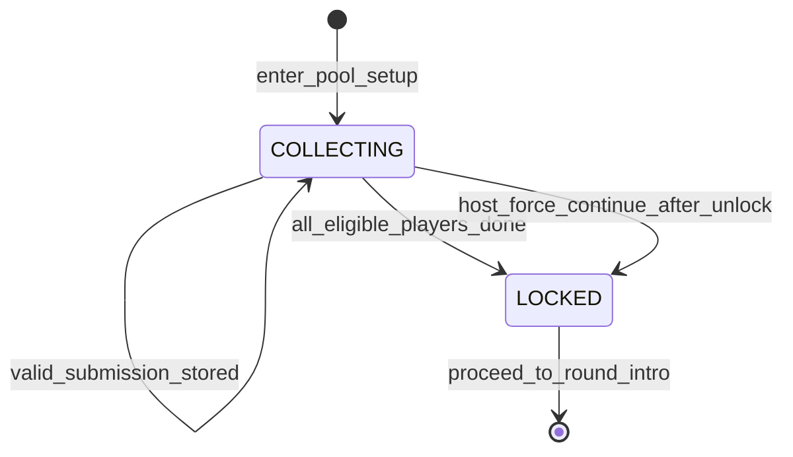

# Slice 7: Player-Created Prompt Pools
## Pre-game word submission phase — share math, pool lock, silent backfill

**Version:** 1.0
**Last Updated:** 2026-07-04
**Dependencies:**
- Slice 3 — Core Round Loop (`POOL_SETUP` phase hook `GameSession._enter_pool_setup()`, `PromptPools.set_custom_source()`, `SessionClient` RPC endpoint, phase deadline/broadcast machinery, `RoundRoot` phase-screen swap)
- Slice 2 — Lobby & Session Roster (pool-source lobby setting, roster/`PlayerState`)
- Skeleton (`TextFilter`, EventBus, constants)

**Provides:** `POOL_SETUP` phase implementation; per-player word submission with share math `ceil(round_count ÷ player_count)`; submission UI with per-pool progress; waiting state + host force-continue; pool lock semantics; silent built-in backfill on attrition.

Brief coverage: §8 (player-created content, pool lock, backfill).

---

## 1. Overview

When the host sets **prompt-pool source = player-created** in the lobby (one of the three always-tunable settings, §10) and presses Start, a `POOL_SETUP` phase runs before round 1 (§4 pre-game step 3). Every player submits an **equal share of words to each pool** (v1: animals and adjectives). Share = `ceil(round_count ÷ player_count)`, so the pools always contain at least `round_count` words each; surplus words simply go undrawn (§8). All words pass `TextFilter`. When everyone has submitted, the pools lock and the game proceeds into `ROUND_INTRO` exactly as in built-in mode. Words are **session-scoped** — they live only in host memory and are never persisted.

### Scope

**In Scope:**
- `_enter_pool_setup()` implementation in `GameSession` (replacing the Slice 3 fall-through stub)
- Share math with the brief's examples as test cases: 4p/16r→4, 4p/8r→2, 4p/14r→4 (§8)
- `pool_setup_screen` submission UI: per-pool word entry with per-pool progress, local `TextFilter` pre-check, per-pool submit
- Host-side validation and collection (`CustomPoolCollector`), per-player progress broadcast, waiting state until all players are done
- Host **force-continue** after a timeout (`POOL_SETUP_FORCE_AVAILABLE_SEC`, default **120 s**); unfilled shares are silently backfilled from the built-in pools
- Pool lock at game start: declared round count never changes; late joiners never submit or alter the pool (§8, §9)
- Silent built-in backfill whenever a custom pool runs short mid-game (attrition) — **never surfaced to players**
- Custom-pool draw semantics: draw **without replacement** (words are consumed; surplus goes undrawn)

**Out of Scope:**
- Persisting custom words anywhere (explicitly forbidden — session-scoped only)
- Editing/withdrawing words after submission (submitted = locked; keeps the phase moving)
- Player-authored **pool types** (types remain built-in content; custom words fill existing pools only)
- Moderation beyond `TextFilter` (public-lobby enforcement posture is Slice 13)
- Late-join mechanics themselves (Slice 9) — this slice only guarantees late joiners are excluded from submission and pool math

### User Flow (4 players, 14 rounds)

1. Host picks player-created source, 14 rounds, presses Start → all peers enter `POOL_SETUP`: "Submit **4** animals and **4** adjectives" (14÷4 = 3.5 → 4).
2. Each player types words (a blocked word gets an inline "that word isn't allowed") and submits each pool when its 4 entries are in.
3. The waiting panel shows everyone's progress; after 120 s the host's Force Continue button unlocks.
4. When all 4 players finish (or host force-continues), pools lock — 16 words per pool, 14 drawn, 2 undrawn — and Round 1 begins.

---

## 2. Data Models

### PoolSetupState (host-only, inside `CustomPoolCollector`)

**File: `res://game/prompts/custom_pool_collector.gd`**

| Field | Type | Required | Description |
|-------|------|----------|-------------|
| share_per_player | int | Yes | `ceili(float(round_count) / player_count)` — computed once at phase entry from the **locked** round count and the roster at Start |
| pool_ids | PackedStringArray | Yes | Pools the active `PoolType` draws from (v1: `["animals", "adjectives"]`) — derived from `PoolType.draws`, so future pool types get submission for free |
| submissions | Dictionary | Yes | `player_id → {pool_id → PackedStringArray}` — validated words only |
| eligible_player_ids | PackedStringArray | Yes | Snapshot of the roster at Start. Late joiners are never added (§8) |
| force_available_at_ms | int | Yes | Unix ms after which the host may force-continue |
| locked | bool | Yes | True once pools are handed to `PromptPools`; all further submissions dropped |

### Word validation rules (applied host-side; mirrored client-side for UX only)

| Rule | Constant / check | On failure |
|------|------------------|------------|
| Non-empty after trim | `strip_edges() != ""` | reject |
| Length cap | `len <= WORD_MAX_CHARS` (24) | reject |
| Single line | no `\n` | reject |
| Clean | `TextFilter.is_clean(word)` | reject (never auto-censor a prompt word — `***` aardvark isn't drawable) |
| Duplicates | allowed, both within and across players | accept |

Duplicates are accepted deliberately: two players submitting "sleepy" is normal party behavior, and Slice 3's exact-combo no-repeat already prevents identical prompts.

**Relationships:** `CustomPoolCollector` is owned by `GameSession` (host-only, session-scoped — freed with the session, satisfying "never persisted"). On lock it injects its word lists into `PromptPools` via `set_custom_source()`.

---

## 3. Event/Action Definitions

### RPCs (added to `SessionClient` — same node/path rules as Slice 3)

| RPC | Direction | Args | Validation | Effect |
|-----|-----------|------|------------|--------|
| `rpc_request_submit_words(pool_id: String, words: PackedStringArray)` | client → host (`any_peer`, reliable) | One pool's complete share | 5-step: (1) `multiplayer.is_server()` else return; (2) resolve sender via roster, unknown → drop; (3) phase == `POOL_SETUP` **and** not locked **and** sender in `eligible_player_ids` **and** `pool_id` in `pool_ids` **and** sender hasn't already submitted this pool **and** `words.size() == share_per_player` **and** every word passes the §2 rules; (4) store; if all eligible players have submitted all pools → lock + proceed; (5) broadcast updated `rpc_sync_pool_setup_progress` | Records one pool's words for the sender. Whole message rejected atomically if **any** word fails (client pre-check makes this rare) |
| `rpc_do_words_rejected(pool_id: String, reason: int)` | host → submitting peer (`authority`, `call_remote`, reliable) | `reason`: `NetIds.WordRejectReason` | n/a (host-originated) | Client UI re-enables that pool's editor with an inline error. Sent only when host validation disagrees with the client pre-check (tampered/outdated client) |
| `rpc_sync_pool_setup_progress(progress: Array)` | host → all (`authority`, `call_local`, reliable) | `[{"player_id": String, "pools_done": int, "pools_total": int}]` | authority decorator | Clients update the waiting panel; EventBus `pool_setup_progress_changed` |

Host's own submission bypasses RPC: the host UI calls `GameSession.submit_pool_words(local_player_id, pool_id, words)` directly — same validated entry point (pattern per Slice 3).

Force-continue is **not an RPC**: only the host can do it, and the host *is* the server — `pool_setup_screen` (host variant) calls `SessionClient.force_continue_pool_setup()` → `GameSession.force_lock_pools()` locally, guarded by `is_server()` + `now_ms >= force_available_at_ms`.

### `rpc_sync_phase(POOL_SETUP, data)` shape (extends the Slice 3 table)

| Key | Type | Description |
|-----|------|-------------|
| `share_per_player` | int | Words required per pool per player |
| `pool_ids` | PackedStringArray | Pools requiring submissions (display order) |
| `pool_display_names` | Dictionary | `pool_id → String` for labels ("Animals") |
| `force_available_at_ms` | int | Unix ms when the host's force-continue unlocks (drives the shared `PhaseTimer` display; **not** a phase deadline — the phase has no automatic end) |

### Constants (append to `core/constants/game_constants.gd` / `net_ids.gd`)

```gdscript
# game_constants.gd
const WORD_MAX_CHARS: int = 24
const POOL_SETUP_FORCE_AVAILABLE_SEC: float = 120.0  # host force-continue unlock

# net_ids.gd
enum WordRejectReason { NOT_CLEAN, BAD_LENGTH, WRONG_COUNT, ALREADY_SUBMITTED, LOCKED }
```

### EventBus signals (appended to `core/events/event_bus.gd`)

```gdscript
## Emitted on all peers when pool-setup progress updates. entries: [{player_id, pools_done, pools_total}].
signal pool_setup_progress_changed(progress: Array)
## Emitted locally on a submitter when the host rejects a pool submission.
signal pool_words_rejected(pool_id: String, reason: int)
```

(Phase entry/exit reuses Slice 3's `phase_changed`.)

---

## 4. Storage Schema Extensions

N/A — custom words are session-scoped by explicit requirement (§8 / task contract): they exist only inside the host's `CustomPoolCollector`/`PromptPools` for the life of the session and are never written to `user://` or anywhere else. No schema changes.

---

## 5. State Machines

### POOL_SETUP insertion into the Slice 3 machine

The Slice 3 diagram already routes `LOBBY → POOL_SETUP → ROUND_INTRO`; this slice implements the interior:



Sub-states live inside `CustomPoolCollector` (`locked: bool`); the public `NetIds.Phase` value remains `POOL_SETUP` throughout — no new Phase enum values.

### Transition Rules

| Current State | Trigger | New State | Validation | Side Effects |
|---------------|---------|-----------|------------|--------------|
| LOBBY | Start with `pool_source == PLAYER_CREATED` | POOL_SETUP (COLLECTING) | Slice 3 start gate; roster ≥ 3 | `eligible_player_ids` + `share_per_player` snapshotted; round count locked; phase broadcast with §3 data |
| COLLECTING | Valid `rpc_request_submit_words` | COLLECTING | 5-step (§3) | Words stored; progress broadcast |
| COLLECTING | Last eligible player completes last pool | LOCKED | All counts == share for all pools | `set_custom_source()` per pool; collector locked; `_begin_round(0)` |
| COLLECTING | Host force-continue | LOCKED | Host only; `now >= force_available_at_ms` | Submitted words injected as-is; missing shares are **not** synthesized — shortfall is covered lazily by silent backfill at draw time; `_begin_round(0)` |
| LOCKED | Any late `rpc_request_submit_words` | LOCKED | Step 3 fails (`LOCKED`) | Dropped silently (no rejection RPC — the game has moved on) |

**Pool lock invariants (§8):** the declared round count never changes after Start regardless of joins/leaves; late joiners (Slice 9) are absent from `eligible_player_ids` and can never submit; nothing any player does after LOCKED alters pool contents.

---

## 6. Business Logic

### CustomPoolCollector

**File: `res://game/prompts/custom_pool_collector.gd`**

**Purpose:** Host-only collection + validation of player-submitted words during `POOL_SETUP`.

**Dependencies:** `TextFilter`, `GameConstants`, `PoolType` (for `pool_ids`).

```gdscript
class_name CustomPoolCollector
extends RefCounted
## Host-only. Session-scoped: freed with the GameSession, never persisted.

var share_per_player: int
var pool_ids: PackedStringArray
var eligible_player_ids: PackedStringArray
var locked: bool = false
var _submissions: Dictionary = {}   # player_id -> {pool_id -> PackedStringArray}

static func compute_share(round_count: int, player_count: int) -> int:
    # §8: per-player share = round count ÷ player count, rounded up.
    return ceili(float(round_count) / float(player_count))

func submit(player_id: String, pool_id: String,
        words: PackedStringArray) -> int:
    # Returns OK (0) or a NetIds.WordRejectReason. Atomic: all words or none.
    if locked:
        return NetIds.WordRejectReason.LOCKED
    if not eligible_player_ids.has(player_id) or not pool_ids.has(pool_id):
        return NetIds.WordRejectReason.WRONG_COUNT   # shape-invalid; drop-tier
    if _submissions.get(player_id, {}).has(pool_id):
        return NetIds.WordRejectReason.ALREADY_SUBMITTED
    if words.size() != share_per_player:
        return NetIds.WordRejectReason.WRONG_COUNT
    for w: String in words:
        var trimmed := w.strip_edges()
        if trimmed.is_empty() or trimmed.length() > GameConstants.WORD_MAX_CHARS \
                or trimmed.contains("\n"):
            return NetIds.WordRejectReason.BAD_LENGTH
        if not TextFilter.is_clean(trimmed):
            return NetIds.WordRejectReason.NOT_CLEAN
    var mine: Dictionary = _submissions.get_or_add(player_id, {})
    mine[pool_id] = words
    return OK
```

Also: `is_complete() -> bool` (every eligible player has every pool in), `collected_words(pool_id) -> PackedStringArray` (union across players, joined_order then entry order), `progress() -> Array` (the `rpc_sync_pool_setup_progress` payload), `mark_departed(player_id)` (Slice 9 extension point — excuses a departed player from `is_complete`).

**Business rules:**
1. Share math is `compute_share()` — the brief's examples are pinned tests (4p/16r→4, 4p/8r→2, 4p/14r→4).
2. Rejection is whole-submission, with a `reason` back to the sender via `rpc_do_words_rejected` — except structurally invalid input (unknown pool, non-eligible sender, post-lock), which is dropped silently per cg §4.
3. `TextFilter` runs host-side on **every word** regardless of the client's pre-check — clients are untrusted (§13).

### GameSession extensions (replacing Slice 3 stubs)

**File: `res://game/session/game_session.gd`**

- `_enter_pool_setup()` — builds the collector (`compute_share(_settings.round_count, _judge_order.size())`, `pool_ids` from `_pool_type.draws`), sets `force_available_at_ms = now_ms + POOL_SETUP_FORCE_AVAILABLE_SEC * 1000`, enters `POOL_SETUP` (no deadline timer armed — the phase ends by completion or host action, never by clock).
- `submit_pool_words(player_id, pool_id, words) -> int` — validated entry point shared by RPC handler and host-local UI; on `OK` re-broadcasts progress and, if `is_complete()`, calls `_lock_pools_and_start()`.
- `force_lock_pools() -> void` — host-only, time-gated; calls `_lock_pools_and_start()` with whatever was collected.
- `_lock_pools_and_start()` — `collector.locked = true`; for each pool id: `_pools.set_custom_source(pool_id, collector.collected_words(pool_id))`; `_begin_round(0)`.

### PromptPools: custom-source draw + silent backfill

**File: `res://game/prompts/prompt_pools.gd`** (extends the Slice 3 implementation of `set_custom_source`)

```gdscript
func _draw_word(pool_id: String, rng: RandomNumberGenerator) -> String:
    var custom: Array = _custom_sources.get(pool_id, [])
    if not custom.is_empty():
        # Without replacement: each custom word is drawn at most once;
        # surplus words simply go undrawn (§8).
        return custom.pop_at(rng.randi_range(0, custom.size() - 1))
    # Silent backfill (§8): custom pool exhausted or short (attrition,
    # force-continue) -> draw from the built-in pool. NO player-visible
    # signal, log, toast, or UI difference — a dev-build print only.
    return _builtin_random_word(pool_id, rng)
```

**Business rules:**
1. Custom words draw **without replacement**; built-in backfill draws randomly (Slice 3 semantics). The exact-combo no-repeat check applies identically across custom, built-in, and mixed draws.
2. Backfill is invisible by design: no marker in UI, phase data, or the results bundle; debug-only `print_verbose` (not `push_warning`, which surfaces in editor output during dev LAN sessions).
3. With full participation, `share × player_count ≥ round_count` by ceil math — backfill only ever triggers on force-continue shortfall or attrition, exactly the §8 safety-net cases.

---

## 7. UI Components

### Pool Setup Screen

**File: `res://ui/round/pool_setup_screen.tscn` + `pool_setup_screen.gd`** (registered in `RoundRoot`'s phase→screen map for `POOL_SETUP`)

```
+---------------------------------------------------------+
|  Fill the pools!   Submit 4 words to each pool          |
+----------------------------+----------------------------+
| ANIMALS            2 / 4   | ADJECTIVES         0 / 4   |
| [ aardvark            ✓ ]  | [ ____________________ ]   |
| [ heron               ✓ ]  | [ ____________________ ]   |
| [ ____________________ ]   | [ ____________________ ]   |
| [ ____________________ ]   | [ ____________________ ]   |
| [ Submit animals ] (off)   | [ Submit adjectives ](off) |
+----------------------------+----------------------------+
| Waiting on: Sam (1/2), Priya (0/2)     Riley ✓  You ✓   |
| [host only]  [ Force continue ]  (unlocks in 1:32)      |
+---------------------------------------------------------+
```

**Behavior:**
- One column per `pool_id` (built dynamically from phase data — future pool types need no UI changes): `share_per_player` line-edit rows, a live per-pool progress label, and a Submit button enabled only when all rows are non-empty and locally clean (`TextFilter.is_clean`, length — inline errors; host re-validates regardless).
- After a pool submits, its column locks read-only with a ✓; on `pool_words_rejected` it unlocks with the reason ("That word isn't allowed" / "Too long" / …).
- Waiting panel driven by `pool_setup_progress_changed`; finished players get a ✓.
- **Host only:** Force Continue button, disabled until `force_available_at_ms` (countdown via the shared `PhaseTimer`), with a confirm dialog: "Start without everyone's words? Missing words will be filled in automatically." (Host-facing setup UI only — the *in-game* backfill remains unsurfaced to players.)

**User Interactions:**
| Action | Trigger | Result |
|--------|---------|--------|
| Type a word | Row edit | Local validation state updates; Submit enables when the column is full and clean |
| Submit pool | Per-pool button | `rpc_request_submit_words` (or direct call on host); column locks pending host verdict |
| Rejection arrives | `rpc_do_words_rejected` | Column re-enables with inline reason |
| Everyone done | Host detects completion | Phase advances to `ROUND_INTRO` on all peers |
| Force continue | Host, after unlock + confirm | Pools lock with shortfall; game starts |

### User Confirmation Checkpoints

**Blocking:**
- [ ] Full player-created flow, 3 instances: submit on all peers → auto-advance to Round 1 → prompts visibly use submitted words (this gates calling the slice functional — Chunk 10 playtest gate).
- [ ] Force-continue path: one player never submits; host button unlocks at 2:00, confirm, game starts, and rounds proceed with **no visible indication** of backfill.

**Batchable:**
- [ ] Blocked-word inline error reads clearly and doesn't lose other typed words.
- [ ] Progress panel updates live as other players submit.
- [ ] Non-divisible case (e.g. 4p/14r) shows "4" per pool and the game still ends after exactly 14 rounds.

---

## 8. State Management

No new autoloads. Client-side `POOL_SETUP` state lives in `SessionClient` (Slice 3's replica store), extended with:

```
{
  pool_setup: {
    share_per_player: int,
    pool_ids: PackedStringArray,
    pool_display_names: Dictionary,
    force_available_at_ms: int,
    progress: Array,                # last rpc_sync_pool_setup_progress payload
    my_submitted_pools: PackedStringArray   # local echo for UI locking
  }
}
```

Flow of truth: screen edits are purely local until Submit → host validates → progress rebroadcast → `EventBus.pool_setup_progress_changed` → waiting panel. The screen never infers completion locally; it advances only on the host's `phase_changed(ROUND_INTRO, …)`. Host-side authoritative state is `CustomPoolCollector` inside `GameSession` (host memory only).

---

## 9. Integration Points

### Dependencies (What This Slice Needs)

#### From Slice 3
- `GameSession._enter_pool_setup()` stub to replace; `_begin_round(0)` to hand off to
- `PromptPools.set_custom_source()` + draw pipeline (combo no-repeat spans mixed sources)
- `SessionClient` RPC endpoint + `rpc_sync_phase` data-shape table (this TDD adds the `POOL_SETUP` row)
- `RoundRoot` phase→screen map (add `POOL_SETUP → pool_setup_screen`)
- `PhaseTimer` shared component (force-continue countdown)

#### From Slice 2 / Skeleton
- Lobby setting `pool_source` (already one of the three always-tunable settings) — its `PLAYER_CREATED` option becomes selectable when this slice lands
- Roster snapshot at Start (`eligible_player_ids`), `roster.get_by_peer()`
- `TextFilter` (skeleton), `EventBus`, constants files

### Provides (What This Slice Offers)

#### For Future Slices
- **Slice 9 (Connectivity):** attrition safety is pre-absorbed — short pools self-heal via silent backfill; late joiners are structurally excluded (`eligible_player_ids` snapshot); `CustomPoolCollector.mark_departed(player_id)` (declared + tested here) lets Slice 9 un-gate completion when a player leaves mid-setup.
- **Slice 13 (Moderation):** all custom words already route through `TextFilter`; a stricter public-lobby blocklist is a data swap, not a code change.
- **Future pool types:** submission UI, share math, and collector are driven entirely by `PoolType.draws` — an "Animal Hybrid" type would automatically request only animal words.

### Integration Checklist
- [ ] `WordRejectReason` enum added to `net_ids.gd`; constants to `game_constants.gd`
- [ ] EventBus signals appended with doc comments
- [ ] RPCs added to `SessionClient` with 5-step handlers; TDD table kept in sync
- [ ] `POOL_SETUP` row added to Slice 3's phase-data table (cross-reference, both docs)
- [ ] `pool_setup_screen` registered in `RoundRoot`
- [ ] Lobby exposes the `PLAYER_CREATED` pool-source option
- [ ] Mirror-path tests; WHERE_WE_ARE updated

---

## 10. Edge Cases

### Player disconnects during POOL_SETUP without submitting
**Scenario:** 4 players, one closes the game mid-submission (pre-Slice 9 there is no rejoin).
**Handling:** Completion can no longer be reached naturally; the host force-continue path (unlocks at 120 s) is the escape hatch. Their missing share is covered by silent backfill at draw time. Round count is **unchanged** (locked at Start).
**Rationale:** §8 pool lock + safety net verbatim; a stuck waiting screen with a visible host escape beats any automatic guess.

### Simultaneous submissions
**Scenario:** Several players submit pools in the same instant; or the completing submission races the host's force-continue click.
**Handling:** The host processes RPCs serially; each submission is atomic (whole pool accepted or rejected). Whichever of {final submission, force-continue} the host processes first triggers `_lock_pools_and_start()`; the other finds `locked == true` and is dropped/ignored. Locking is idempotent — `_begin_round(0)` cannot run twice because the phase has already left `POOL_SETUP`.
**Rationale:** Same host-serialization argument as the Slice 3 pick-vs-deadline race.

### Duplicate submission of the same pool
**Scenario:** Client resends (retry logic, double-click, tampering) a pool it already submitted.
**Handling:** `ALREADY_SUBMITTED` → rejected; first submission stands. No edit-after-submit in v1.
**Rationale:** Idempotency keeps host state simple; the phase is short enough that editing isn't worth the sync complexity.

### Filter disagreement (tampered or stale client)
**Scenario:** A word passes the client pre-check but fails host-side `TextFilter`.
**Handling:** Whole submission rejected with `NOT_CLEAN`; sender's UI unlocks with the reason. Other players see no change (progress never went up).
**Rationale:** §13 — the host is the referee; the client check is UX sugar only.

### Attrition mid-game leaves a custom pool short
**Scenario:** (With Slice 9 live) enough players leave that a custom pool runs out before the declared final round — or force-continue started the game short.
**Handling:** `_draw_word()` silently backfills from the built-in pool; the exact-combo no-repeat guard still applies. No UI, log line, or results-bundle field reveals it.
**Rationale:** §8: "silently backfill … as a safety net" — surfacing it would only break the illusion for zero player benefit.

### Surplus words
**Scenario:** 4p/14r → 16 words per pool, 14 rounds.
**Handling:** Without-replacement draws leave the 2 leftovers undrawn; they vanish with the session (never persisted).
**Rationale:** §8 verbatim: "surplus words simply go undrawn."

### Host quits during POOL_SETUP
**Scenario:** Host closes the game while players are typing.
**Handling:** Identical to Slice 3's rule — no host migration in v1; all clients get `server_disconnected` → toast → main menu. Typed-but-unsubmitted words are lost (they were session-scoped anyway).
**Rationale:** Single consistent host-quit story across all phases.

### Clock skew on the force-continue countdown
**Scenario:** A client's clock is far off relative to `force_available_at_ms`.
**Handling:** Non-issue by construction: the countdown is rendered, and the gate evaluated, only on the **host's own** machine. Other clients just see the waiting panel.
**Rationale:** The only clock that matters here never leaves the machine it's compared on.

### Performance Considerations
Negligible: worst case is 8 players × 2 pools × a handful of short strings, a few KB total for the whole phase. No caching or batching needed.

---

## 11. Testing Strategy

All collector/share/backfill logic is host-side, RefCounted, and network-free — fully headless (GdUnit4).

### Unit Tests

**Location:** `res://tests/game/prompts/`, `res://tests/game/session/`

#### `tests/game/prompts/test_custom_pool_collector.gd`
- [ ] `test_share_4_players_16_rounds_is_4` (§8 example)
- [ ] `test_share_4_players_8_rounds_is_2` (§8 example)
- [ ] `test_share_4_players_14_rounds_is_4` (§8 example: 3.5 → 4)
- [ ] `test_share_more_cases` (3p/7r→3, 8p/8r→1, 5p/1r→1, 3p/3r→1)
- [ ] `test_submit_ok_stores_words_and_reports_progress`
- [ ] `test_submit_rejected_wrong_count_dirty_word_empty_overlong_multiline` (validation matrix, fixture blocklist)
- [ ] `test_submit_rejected_already_submitted_keeps_first`
- [ ] `test_submit_after_lock_rejected`
- [ ] `test_non_eligible_player_rejected` (late-joiner exclusion)
- [ ] `test_duplicate_words_across_players_accepted`
- [ ] `test_is_complete_only_when_all_players_all_pools`
- [ ] `test_mark_departed_ungates_completion` (Slice 9 extension point)

#### `tests/game/prompts/test_prompt_pools.gd` (extended)
- [ ] `test_custom_draw_without_replacement_consumes_words`
- [ ] `test_surplus_words_never_drawn` (16 words, 14 draws → exactly 2 remain)
- [ ] `test_backfill_from_builtin_when_custom_exhausted`
- [ ] `test_backfill_is_silent_no_marker_in_prompt` (Prompt carries no source field)
- [ ] `test_combo_no_repeat_across_custom_and_backfill_mix`

#### `tests/game/session/test_game_session.gd` (extended)
- [ ] `test_pool_setup_entered_with_player_created_source_and_no_deadline_timer`
- [ ] `test_all_submitted_locks_and_begins_round_zero`
- [ ] `test_force_lock_rejected_before_unlock_time` (injected clock)
- [ ] `test_force_lock_after_unlock_starts_with_shortfall`
- [ ] `test_lock_idempotent_under_submission_force_race`
- [ ] `test_round_count_unchanged_by_departures_during_setup`

### Integration Tests
- [ ] Headless end-to-end: 4 fake players, 14 rounds, player-created source; all submit 4+4; assert all 14 prompts use only submitted words (no backfill), 2 words per pool undrawn.
- [ ] Same but one player never submits + force-continue: game completes 14 rounds; backfilled prompts indistinguishable in every broadcast payload.

### UI/Component Tests
- [ ] `pool_setup_screen` smoke test with 2-pool phase data; columns generated from `pool_ids` (also with a 1-pool fixture, proving data-driven layout).
- [ ] Submit button disabled until column full and locally clean.

### Manual Testing Required
- [ ] The two **blocking** checkpoints in §7 (full flow; force-continue invisibility).
- [ ] The **batchable** list in §7 at slice completion.

---

## 12. Implementation Checklist

### Setup
- [ ] Add `WORD_MAX_CHARS`, `POOL_SETUP_FORCE_AVAILABLE_SEC` to `game_constants.gd`
- [ ] Add `WordRejectReason` enum to `net_ids.gd`
- [ ] Append EventBus signals (§3) with doc comments
- [ ] Enable the `PLAYER_CREATED` option in the lobby pool-source setting (Slice 2 UI)

### Business Logic (headless first, test-alongside)
- [ ] `game/prompts/custom_pool_collector.gd`: `compute_share`, `submit` validation chain, `is_complete`, `collected_words`, `mark_departed` + full test suite (share examples pinned)
- [ ] `PromptPools`: real `set_custom_source`, without-replacement draw, silent built-in backfill + tests (incl. mixed-source no-repeat)
- [ ] `GameSession`: replace `_enter_pool_setup()` stub; `submit_pool_words`, `force_lock_pools`, `_lock_pools_and_start`; no deadline timer for this phase + tests (races, idempotent lock, injected clock)
- [ ] Headless end-to-end integration tests green

### Networking
- [ ] `SessionClient`: `rpc_request_submit_words` (5-step), `rpc_do_words_rejected`, `rpc_sync_pool_setup_progress`; host-local direct path; `force_continue_pool_setup()` host guard
- [ ] `POOL_SETUP` phase-data assembly (§3 shape); update the phase-data table cross-reference in `TDD/03-core-round-loop.md`

### UI Layer
- [ ] `ui/round/pool_setup_screen.tscn/.gd`: dynamic per-pool columns, local pre-check + inline errors, per-pool submit/lock/✓, rejection re-unlock, waiting panel, host force-continue button + countdown + confirm dialog
- [ ] Register `POOL_SETUP → pool_setup_screen` in `RoundRoot`
- [ ] Scene smoke tests (2-pool and 1-pool fixtures)

### Verification
- [ ] Full test suite green, no regressions in Slice 3 suites
- [ ] 3-instance manual run: both blocking checkpoints

### User Confirmation
- [ ] **Blocking:** full player-created flow on LAN (Chunk 10 playtest gate)
- [ ] **Blocking:** force-continue with invisible backfill
- [ ] Batchable list presented and resolved; user confirms slice complete

### Documentation
- [ ] Update `WHERE_WE_ARE.md`, session log, Implementation Notes for Slice 7
- [ ] Decision log entry if the 120 s force-continue default is retuned in playtesting
- [ ] Mark Slice 7 status in `TDD/overview-of-slices.md`

---

**End of Slice 7: Player-Created Prompt Pools**
