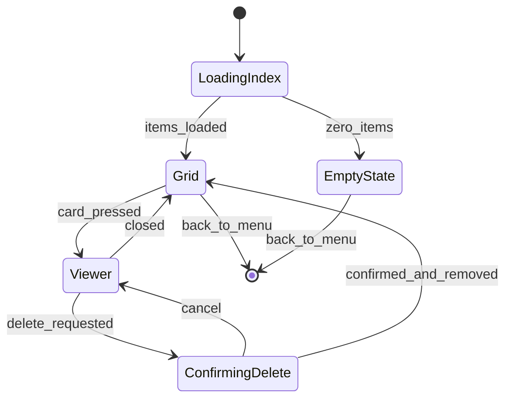

# Slice 8: Collection Browser & Export
## Scrollable grid of saved drawings with replay viewer, PNG export, social share (reveal-in-folder), and delete

**Version:** 1.0
**Last Updated:** 2026-07-04
**Dependencies:**
- Skeleton (`Save`, `Nav`, theme, EventBus)
- Slice 1 (`DrawingDoc`, `DocRasterizer`, `ReplayPlayer`, `ConfirmDialog`)
- Slice 4 (collection write path: `CollectionStore.add()`, `user://collection/` index format, thumbnail-on-save)

**Provides:** Collection screen (grid + viewer) reachable from the main menu, thumbnail cache management (`user://collection/thumbs/`), PNG export + social share to `user://exports/`, per-item delete, `Save` PNG helpers

---

## 1. Overview

The collection is the player's local gallery of drawings they saved via the in-game kudos/self-save actions (Slice 4). This slice adds the **read side**: a scrollable grid where each saved drawing shows its prompt, a click-to-view large mode that replays the strokes, and three per-item actions — **Export PNG**, **Social Share**, **Delete** (brief §15). Everything is local-first: there is no gallery service, no upload; "sharing" produces a PNG on disk and reveals it in the OS file manager so the player can post it themselves (brief §14).

Deliberately v1-simple per the brief: **no search, no tags, no folders.** Sorted newest-first, that's it.

### Scope

**In Scope:**
- `Collection` button on the main menu → collection screen (`Nav` route)
- Grid of cards: cached PNG thumbnail + prompt text (+ orientation-correct aspect), newest-first
- Thumbnail cache lifecycle: read from `user://collection/thumbs/`, regenerate any missing/corrupt thumb (the cache is disposable; DrawingDocs are the authoritative data — consistency guide §12)
- Viewer: large rasterized view, Replay button (Slice 1 `ReplayPlayer`), speed toggle, prompt + saved-date display
- Export PNG: flatten ops at internal resolution, upscale 2× nearest-neighbor, write to `user://exports/` (decision + justification in §6)
- Social Share: export (same pipeline) then `OS.shell_show_in_file_manager()` on the file
- Delete with `ConfirmDialog`: removes doc JSON + index entry + thumb PNG
- `Save.write_png` / `Save.read_png` / `Save.file_exists` service extensions (all `user://` file I/O stays inside `save_service.gd` — consistency guide §6)
- Empty state, corrupt-item handling, large-collection incremental loading

**Out of Scope (Other Slices / Later):**
- Writing new items into the collection (Slice 4 owns `add()`; this slice never creates items)
- Any network sharing, gallery, or cross-player browsing (explicitly rejected — brief §14)
- Search, tags, folders, multi-select, bulk actions (post-v1 per brief §15)
- Lifetime "drawings saved" stat counting (Slice 14 — counts saves, unaffected by deletes)
- In-round save UX (Slice 4)

### User Flows
1. **Browse:** Main menu → Collection → grid of drawings, each captioned with its prompt ("sleepy aardvark"). Scroll freely.
2. **Relive:** click a card → large view opens → press Replay → the drawing draws itself (capped ≤ ~10 s), skip anytime.
3. **Export:** in the viewer, press Export PNG → PNG written to `user://exports/` → toast with "Show in folder" action.
4. **Share:** press Share → same export, then the OS file manager opens with the PNG revealed, ready to drag into Discord/wherever.
5. **Delete:** press Delete → confirm dialog → item vanishes from grid; doc, index entry, and thumb are gone.

---

## 2. Data Models

### CollectionIndexEntry

**File: `game/collection/collection_index_entry.gd`** (introduced by Slice 4; shape restated here as the binding read contract)

```gdscript
class_name CollectionIndexEntry
extends RefCounted
## One row of user://collection/index.json (consistency guide §6:
## [{id, prompt, saved_at, orientation}]).

var id: String            # UUIDv4 (core/util/uuidv4.gd); doc file is <id>.json
var prompt: String        # display prompt, e.g. "sleepy aardvark"
var saved_at: int         # unix seconds, local clock at save time
var orientation: StringName  # &"landscape" | &"portrait" — for card aspect without loading the doc

static func from_dict(data: Dictionary) -> CollectionIndexEntry  # null on malformed row
func to_dict() -> Dictionary
```

**Fields:**
| Field | Type | Required | Description |
|-------|------|----------|-------------|
| id | String | Yes | Item id; keys the doc file and thumb file |
| prompt | String | Yes | Shown on card + viewer; already blocklist-filtered upstream |
| saved_at | int | Yes | Sort key (newest-first) + viewer date display |
| orientation | StringName | Yes | Card aspect + export dimensions without reading the doc |

### CollectionItemView (screen-local view model)

**File: `ui/collection/collection_screen.gd`** (inner class — not persisted)

```gdscript
class ItemView:
    var entry: CollectionIndexEntry
    var thumb: ImageTexture      # null until (lazily) loaded/generated
    var missing_doc: bool        # index row exists but <id>.json is gone/corrupt
```

**Relationships:** `ItemView.entry.id` → `user://collection/<id>.json` (a Slice 1 `DrawingDoc`) and `user://collection/thumbs/<id>.png`. No other model changes; `DrawingDoc` is consumed as-is from Slice 1.

---

## 3. Event/Action Definitions

**RPCs: N/A** — the collection is entirely local (brief §14: no central server holds player data). This screen is reachable only from the main menu, outside any session.

**EventBus additions: none.** Slice 4 already declares `collection_item_added(item_id: String)`; nothing outside this feature needs to react to browsing or deleting in v1 (Slice 14's achievements count *saves*, which deletes do not affect). All signals below are local (consistency guide §5).

### Local signals

| Owner | Signal | Params | Emitted when |
|-------|--------|--------|--------------|
| `CollectionCard` | `pressed` | `(item_id: String)` | Card clicked → screen opens viewer |
| `CollectionViewer` | `closed` | `()` | Back/close pressed → screen returns to grid |
| `CollectionViewer` | `export_requested` | `(item_id: String)` | Export PNG pressed |
| `CollectionViewer` | `share_requested` | `(item_id: String)` | Social Share pressed |
| `CollectionViewer` | `delete_requested` | `(item_id: String)` | Delete pressed (pre-confirmation) |
| `CollectionScreen` | `item_deleted` | `(item_id: String)` | Delete confirmed + files removed (grid refresh hook) |

---

## 4. Storage Schema Extensions

All under `user://`, all through `Save` (consistency guide §6). This slice **reads** the Slice 4 layout and **adds** two directories:

```
user://
└── collection/
    ├── index.json            # read here; written by Slice 4 add() and this slice's delete()
    ├── <uuid>.json           # DrawingDoc — read here; deleted here
    └── thumbs/               # THIS SLICE (cache dir; Slice 4 writes on save, we regenerate)
        └── <uuid>.png        # small PNG thumbnail
user://
└── exports/                  # THIS SLICE
    └── <slug>_<id8>.png      # exported/share PNGs, e.g. sleepy-aardvark_a1b2c3d4.png
```

### index.json (read contract, owned by Slice 4)

```json
{
  "v": 1,
  "items": [
    {"id": "…uuid…", "prompt": "sleepy aardvark", "saved_at": 1751600000, "orientation": "landscape"}
  ]
}
```

Wrapped in a versioned dict per consistency guide §6 versioning rule ("every persisted dict carries `v`"); the `items` array rows match the guide's `[{id, prompt, saved_at, orientation}]` shape. **Slice 4's TDD must ship exactly this envelope** (integration contract, §9).

### Thumbnails (`thumbs/<uuid>.png`)

| Property | Value | Rationale |
|----------|-------|-----------|
| Size | 256×192 (landscape) / 192×256 (portrait) | ~32% of internal res; crisp on a card, ~10–30 KB each |
| Generation | `DocRasterizer.rasterize(doc)` → `Image.resize(..., INTERPOLATE_BILINEAR)` → `Save.write_png` | one source of pixels (Slice 1) |
| Authority | **None — regenerable cache.** Missing/corrupt/wrong-size thumb → regenerate from the doc on demand; failure to write a thumb is a warning, never an error dialog | consistency guide §12 |

**Migrations:** none — new directories appear on first use (`Save` creates parents on write). Deleting `thumbs/` entirely is always safe.

### SaveService extensions (`core/save/save_service.gd`)

New methods (keeping the "no direct `FileAccess` outside save_service.gd" rule intact for PNGs):

```gdscript
func write_png(path: String, img: Image) -> Error       # atomic: temp + rename, like write_json
func read_png(path: String) -> Image                    # null on missing/corrupt (+ warning)
func file_exists(path: String) -> bool
func globalize(path: String) -> String                  # ProjectSettings.globalize_path wrapper for shell reveal
```

---

## 5. State Machines

### Collection screen state machine



### States

| State | Description | Terminal? |
|-------|-------------|-----------|
| LoadingIndex | Read index.json, spawn incremental card population | No |
| EmptyState | Friendly "nothing saved yet" panel + how-to hint | No |
| Grid | Scrollable grid; thumbs stream in lazily | No |
| Viewer | One item large; replay controls + actions | No |
| ConfirmingDelete | `ConfirmDialog` modal over the viewer | No |

### Viewer replay sub-state (delegated to Slice 1 `ReplayPlayer`)

| Current | Trigger | New | Side Effects |
|---------|---------|-----|--------------|
| Still (full raster shown) | Replay pressed | Playing | Blank canvas image; `ReplayPlayer.load_doc(doc, speed)`; advance each frame |
| Playing | Skip pressed / `finished` | Still | `skip_to_end()`; full raster shown |
| Playing | speed toggled | Playing | Restart not required — new multiplier applies via reload on next Replay press (keep v1 simple) |

---

## 6. Business Logic

### CollectionStore (extended)

**File: `game/collection/collection_store.gd`** — created by Slice 4 (write path); this slice **appends** the read/delete surface. Plain class (not an autoload) wrapping `Save`; UI never touches `Save` paths directly.

```gdscript
class_name CollectionStore
extends RefCounted

const INDEX_PATH := "collection/index.json"
const DOC_DIR := "collection/"
const THUMB_DIR := "collection/thumbs/"
const EXPORT_DIR := "exports/"

# ---- Slice 4 (write path, restated for contract clarity) ----
func add(doc: DrawingDoc, prompt: String) -> String     # returns new id; writes doc, index, thumb

# ---- Slice 8 additions ----
func list_entries() -> Array[CollectionIndexEntry]      # newest-first; malformed rows skipped + warned
func read_doc(id: String) -> DrawingDoc                 # null on missing/corrupt (DrawingDoc.from_dict rules)
func get_thumb(id: String, orientation: StringName) -> Image  # cached, else regenerate, else null
func delete(id: String) -> Error
func export_png(id: String) -> String                   # returns user:// path of written PNG, "" on failure
```

#### delete(id)
**Purpose:** remove an item everywhere, index-first so a crash mid-delete can only orphan files, never dangle index rows.
**Order (business rule):**
1. Remove row from in-memory index; `Save.write_json(INDEX_PATH, …)` — item is now gone from the player's view even if step 2/3 fail.
2. `Save.delete(DOC_DIR + id + ".json")`
3. `Save.delete(THUMB_DIR + id + ".png")`
4. Return OK if step 1 succeeded (file deletions best-effort; orphans are invisible and harmless — see §10).

#### get_thumb(id, orientation)
1. `Save.read_png(THUMB_DIR + id + ".png")` → if valid and dimensions match the expected thumb size for `orientation`, return it.
2. Else `read_doc(id)` → null? return null (card shows missing-art placeholder).
3. Else rasterize → resize → `Save.write_png` (best-effort) → return the image.

#### export_png(id) — resolution decision
**Decision: rasterize at internal resolution (800×600 / 600×800), then upscale 2× with nearest-neighbor → exported PNG is 1600×1200 / 1200×1600.**

**Justification:**
- Re-rasterizing ops at a true 2× resolution is rejected: brush stamps and especially **flood-fill topology are not scale-invariant** (a diagonal pixel pinch that stops a fill at 1× can leak at 2×), so a "hi-res" export could differ from what the judge and friends actually saw — violating the determinism principle (consistency guide, principle 4: rendering is resolution-independent at *display* time only, never raster time).
- Plain 1× is faithful but small for social feeds; 2× nearest-neighbor is pixel-exact (every source pixel becomes a 2×2 block), keeps the crisp hard-edged marker look the game renders with (no AA anywhere in the pipeline), and holds up when platforms re-compress.
- Constant: `EXPORT_SCALE := 2` in `game_constants.gd` (dev-tunable).

**Filename:** `<slug>_<id8>.png` where `slug` = prompt lowercased, non `[a-z0-9]` runs collapsed to `-`, max 40 chars, fallback `"drawing"` if empty after sanitizing; `id8` = first 8 chars of the uuid (collision-proof, human-findable). Existing file with the same name is overwritten (same id ⇒ same content).

#### Social Share
```gdscript
func share(id: String) -> void:   # CollectionScreen-level, not store
    var path: String = _store.export_png(id)
    if path.is_empty():
        _toast.show_error("Couldn't export that drawing.")
        return
    OS.shell_show_in_file_manager(Save.globalize(path))
```
v1 sharing **is** export + reveal-in-folder (brief §14: sharing is an export action; no network sharing infrastructure). If `shell_show_in_file_manager` fails on some Linux desktop, fall back to `OS.shell_open` on the containing directory (§10).

**Business rules:**
1. This slice never calls `add()` — read/delete only.
2. Thumbs are never trusted: any read failure silently falls back to regeneration.
3. All rasterization goes through `DocRasterizer` (no second pixel pipeline).
4. Deleting never touches lifetime stats (Slice 14 counts save events).

---

## 7. UI Components

### Collection Screen

**Files: `ui/collection/collection_screen.tscn` + `ui/collection/collection_screen.gd`**
**Route:** `Routes.COLLECTION`, button added to `ui/menu/main_menu_screen.tscn`.

**Layout:**
```
+---------------------------------------------------+
| [< Back]   My Collection            (item count)  |
+---------------------------------------------------+
| +--------+  +--------+  +--------+  +--------+    |
| | thumb  |  | thumb  |  | thumb  |  | thumb  |    |  ScrollContainer >
| |        |  |        |  |        |  |        |    |  GridContainer
| | sleepy |  | angry  |  | shiny  |  | bored  |    |  (cards, newest first)
| | aard.. |  | walrus |  | newt   |  | crab   |    |
| +--------+  +--------+  +--------+  +--------+    |
|   ...scrolls...                                   |
+---------------------------------------------------+
```

Empty state replaces the grid: *"No drawings yet. Give a kudos in-game, or flip on 'Save to collection' while drawing — they'll show up here."*

**User Interactions:**
| Action | Trigger | Result |
|--------|---------|--------|
| Open collection | Main menu → Collection | `Nav.goto(Routes.COLLECTION)`; index loads |
| Browse | scroll wheel/drag | Grid scrolls; off-screen thumbs keep streaming in |
| Open item | click card | Viewer opens over the grid |
| Back to menu | Back button / Esc | `Nav.goto(Routes.MENU)` |

### CollectionCard Component

**Files: `ui/collection/collection_card.tscn` + `.gd`**
**Props:** `entry: CollectionIndexEntry`; thumb texture set async by the screen.
**Layout:** thumbnail (aspect from `entry.orientation`, letterboxed in a uniform cell) above the prompt label (ellipsized, full prompt as tooltip). Placeholder art while thumb loads; "missing" placeholder + still-clickable if `missing_doc` (viewer then offers Delete as the only action).
**Outputs:** `pressed(item_id: String)`.

### CollectionViewer Component

**Files: `ui/collection/collection_viewer.tscn` + `.gd`** (full-screen overlay panel within the collection screen — not a `Nav` route, so Back is instant and grid scroll position survives)

**Layout:**
```
+---------------------------------------------------+
| [< Back]  "sleepy aardvark"        saved 2026-07-01|
+---------------------------------------------------+
|            +---------------------------+          |
|            |   drawing (large,         |          |
|            |   letterboxed, correct    |          |
|            |   orientation)            |          |
|            +---------------------------+          |
|      [Replay]  [Speed: 1x|2x]                     |
+---------------------------------------------------+
|        [Export PNG]   [Share]   [Delete]          |
+---------------------------------------------------+
```

**Props:** `entry: CollectionIndexEntry`, `doc: DrawingDoc` (loaded by the screen).
**Behavior:** shows the full raster immediately (`DocRasterizer.rasterize`); Replay wipes to background and drives `ReplayPlayer` (`advance` in `_process`); Skip = same button while playing (`skip_to_end`). Speed toggle 1×/2× applied on next Replay press (cap from Slice 1 always applies on top). Export/Share show a toast on success (`ui/shared/toast.tscn`): "Exported to exports folder — Show in folder" (toast action = same reveal call).
**Delete:** opens `ConfirmDialog` (Slice 1): *"Delete this drawing? This can't be undone."* → on confirm, screen calls `store.delete(id)`, closes viewer, removes card.

### User Confirmation Checkpoints

**Blocking:**
- [ ] **Export PNG opens correctly outside the game** (file exists at revealed location, correct dimensions 1600×1200/1200×1600, looks exactly like the in-game drawing): the share flow and any store-page marketing of the feature depend on this being right; verify once on the dev OS before building the share button on top of it.

**Batchable (queue for slice completion):**
- [ ] Grid scrolls smoothly with 100+ items; thumbs stream in without hitching
- [ ] Empty state reads well and points at the right in-game actions
- [ ] Viewer replay pacing feels good at 1× and 2×; Skip works mid-replay
- [ ] Share reveals the file in Finder/Explorer/Files on the dev OS
- [ ] Delete confirm wording; card removal animation-free but not jarring
- [ ] Portrait drawings display with correct aspect on cards and in viewer
- [ ] Missing-doc placeholder card behaves sanely (openable, deletable)

---

## 8. State Management

**No new autoloads** (consistency guide: autoload singletons are skeleton-level; features hold local state). The collection screen owns everything for its lifetime and is freed on navigation.

**State shape (owned by `CollectionScreen`):**
```
{
  store: CollectionStore,          # constructed in _ready
  items: Array[ItemView],          # newest-first, mirrors index
  screen_state: ScreenState,       # §5 machine (LOADING | EMPTY | GRID | VIEWER | CONFIRM_DELETE)
  viewer_item_id: String,          # "" when no viewer open
  thumb_queue: Array[String],      # ids awaiting lazy thumb load/regeneration
  replay: ReplayPlayer             # viewer-owned, null when Still
}
```

**Selectors/Computed:**
| Name | Purpose | Dependencies |
|------|---------|--------------|
| `sorted_items()` | newest-first grid order | `items[].entry.saved_at` |
| `is_empty()` | drives EmptyState vs Grid | `items.size()` |

**Actions:**
| Name | Purpose | Payload |
|------|---------|---------|
| `_load_index()` | populate `items`, enqueue all thumbs | — |
| `_pump_thumbs()` | per-frame: load/generate up to `THUMB_LOADS_PER_FRAME := 2` thumbs | — |
| `_open_viewer(id)` | read doc, switch state | `item_id` |
| `_confirm_delete(id)` | store.delete → remove ItemView → emit `item_deleted` | `item_id` |

EventBus is only *listened to* here if the screen is ever open when `collection_item_added` fires — impossible in v1 (menu-only access, saves happen in-session), so no subscription is added.

---

## 9. Integration Points

### Dependencies (What This Slice Needs)

#### From Skeleton
- `Save`: `read_json`/`write_json`/`delete`/`list_dir` + the new PNG helpers this slice adds to it
- `Nav`/`Routes`: `Routes.COLLECTION` registration; main-menu button
- `ui/shared/toast.tscn`: success/error toasts

#### From Slice 1
- `DrawingDoc.from_dict` (hardened parsing of possibly-corrupt saved docs)
- `DocRasterizer.rasterize` (viewer image, thumbs, export)
- `ReplayPlayer` (viewer replay incl. cap + `skip_to_end`)
- `ConfirmDialog` (delete confirmation)

#### From Slice 4 (binding read contract — Slice 4's TDD must match)
- `CollectionStore` class at `game/collection/collection_store.gd` with `add()` writing: doc to `collection/<id>.json`, index envelope `{"v":1,"items":[...]}` with rows `{id, prompt, saved_at, orientation}`, and a best-effort thumb to `collection/thumbs/<id>.png` at the §4 sizes
- `CollectionIndexEntry` model as in §2

### Provides (What This Slice Offers)

#### For Future Slices
- **`Save.write_png`/`read_png`/`file_exists`/`globalize`** — Slice 11 (house-avatar tooling, if needed) and any future image caching
- **`CollectionStore.list_entries`/`read_doc`/`delete`/`export_png`** — Slice 14 could surface counts ("N drawings in collection") without new I/O
- **`user://exports/` convention** — any future export surface (e.g. wrap-up "export winner" idea) writes here

### Integration Checklist
- [ ] `Routes.COLLECTION` added; main menu button wired
- [ ] `EXPORT_SCALE`, thumb sizes, `THUMB_LOADS_PER_FRAME` in `core/constants/game_constants.gd`
- [ ] No EventBus changes (verified none needed)
- [ ] No RPCs (offline feature)
- [ ] Save layout additions documented in consistency guide §6 tree (thumbs/ already listed; add exports/)
- [ ] Tests mirror-pathed under `tests/game/collection/`, `tests/ui/collection/`

---

## 10. Edge Cases

### Empty collection
**Scenario:** fresh install, or player deleted everything.
**Handling:** EmptyState panel with a hint pointing at kudos/save-toggle (the two save paths, brief §11/§6). Back button still present.
**Rationale:** teaches the save loop instead of showing a dead screen.

### Corrupt or missing doc behind an index row
**Scenario:** `<id>.json` deleted by the user, or corrupted (power loss, cloud-sync mangling).
**Handling:** card renders with a "missing drawing" placeholder (regeneration returns null); viewer for it shows the placeholder + prompt and offers **Delete only** (export/share/replay disabled). Never crashes (`DrawingDoc.from_dict` → null path).
**Rationale:** consistency guide §7 — bad save data degrades, never breaks; player gets a clean way to purge the husk.

### Corrupt/missing/stale thumbnail
**Scenario:** thumbs dir wiped, PNG truncated, or thumb size constants changed in an update.
**Handling:** dimension check fails → regenerate from doc → rewrite. Write failure → keep the in-memory texture for this session, warn in log.
**Rationale:** cache is explicitly non-authoritative (consistency guide §12).

### Orphaned files (doc/thumb without index row)
**Scenario:** crash between delete steps (§6 ordering), or user file tinkering.
**Handling:** invisible — the grid is index-driven. `list_entries()` logs a warning if `list_dir` shows unindexed doc files; no auto-GC in v1 (deleting user files heuristically is riskier than a few stray KB).
**Rationale:** index-first delete ordering makes orphans the *only* possible inconsistency, and they're harmless.

### Huge collections
**Scenario:** hundreds of items (a dedicated player saving for months).
**Handling:** cards created in batches per frame (`_pump_thumbs`, 2 thumbs/frame); thumbs are small PNGs (~10–30 KB) so memory stays modest (300 items ≈ under 60 MB textures worst-case; acceptable v1). No pagination.
**Rationale:** kudos-gated saving naturally limits growth (brief §11 — kudos=save was designed partly as collection-bloat control); engineering pagination now is premature.

### Replay of an empty doc
**Scenario:** player saved a blank drawing (auto-submit of an empty canvas that they kudos'd, or self-saved blank).
**Handling:** viewer shows the blank background; Replay finishes immediately (`ReplayPlayer` empty-doc behavior, Slice 1 §10); Export produces a blank PNG (legal).
**Rationale:** blank drawings are legitimate round artifacts ("who submitted nothing" is part of the comedy).

### Export destination unwritable
**Scenario:** disk full, permissions issue on `user://exports/`.
**Handling:** `export_png` returns ""; toast "Couldn't export that drawing." with no partial file (atomic temp+rename in `Save.write_png`).
**Rationale:** friendly failure per consistency guide §7 (no stack traces at players).

### `shell_show_in_file_manager` unsupported
**Scenario:** some Linux desktop environments don't honor file-reveal.
**Handling:** if the call errors, fall back to `OS.shell_open(Save.globalize(EXPORT_DIR))` (open the folder itself). Toast text stays the same.
**Rationale:** brief §2 — Linux is first-class; degrade to the nearest equivalent.

### Prompt with filesystem-hostile characters
**Scenario:** player-created prompts (Slice 7) like `"sl/eepy: aard*vark"` reach `saved` items.
**Handling:** slug sanitizer (§6) strips to `[a-z0-9-]`; empty result falls back to `"drawing"`. Display prompt is untouched.
**Rationale:** filenames must be safe on all three OSes; display fidelity preserved separately.

### Performance Considerations
- Rasterizing for thumb regeneration is the heavy path (full doc raster) — bounded to the lazy queue (2/frame) so a wiped thumbs dir repopulates over a few seconds without a frozen frame.
- Viewer rasterizes once per open; replay re-stamps incrementally (Slice 1 pipeline) — no per-frame full rasters.
- Export (raster + 2× upscale + PNG encode) runs synchronously; ~1–2 MP nearest upscale + encode is well under a second — acceptable with the toast as feedback.

---

## 11. Testing Strategy

Per `workflows/testing-protocol.md` — tests alongside implementation; blocking user test (§7) before building share on export.

### Unit Tests

**Location:** `tests/game/collection/`

#### CollectionStore read/delete (`test_collection_store.gd`)
- [ ] `list_entries` sorts newest-first; skips malformed rows (missing keys, wrong types) with warnings; empty/missing index → empty array
- [ ] `list_entries` rejects unknown index envelope version (`v: 99`) → empty + warning
- [ ] `read_doc` returns null for missing file, corrupt JSON, and valid-JSON-invalid-doc
- [ ] `delete` removes index row first; doc + thumb files gone; deleting a nonexistent id → OK (idempotent)
- [ ] `delete` with unwritable doc file still removes the index row (orphan tolerated)
- [ ] `get_thumb`: cache hit returns without touching the doc; wrong-size cached PNG triggers regeneration; missing doc returns null

#### Export (`test_collection_export.gd`)
- [ ] Exported PNG dimensions == internal × `EXPORT_SCALE` for both orientations
- [ ] Pixel fidelity: every 2×2 block equals the corresponding 1× raster pixel (nearest-neighbor invariant) on a golden doc
- [ ] Slug sanitizer: spaces→dashes, unicode/symbols stripped, 40-char truncation, empty→"drawing"
- [ ] Export of missing doc returns "" without writing anything

#### Save PNG helpers (`tests/core/save/test_save_service.gd` — extend)
- [ ] `write_png`/`read_png` round-trip; truncated PNG reads as null + warning; atomicity (no partial file on simulated failure)

### Integration Tests
- [ ] Seed a temp `user://` with 3 items via Slice 4 `add()` → screen logic loads 3 ItemViews → delete middle → index has 2, files gone, grid model updated
- [ ] Thumbs dir wiped → browsing regenerates all thumbs → hashes match freshly rasterized-and-resized references

### UI/Component Tests
- [ ] Scene smoke: `collection_screen.tscn`, `collection_card.tscn`, `collection_viewer.tscn` instantiate clean
- [ ] Empty state shows when store returns zero entries
- [ ] Card emits `pressed` with its id; viewer action signals fire
- [ ] Missing-doc item: viewer disables Export/Share/Replay, enables Delete

### Manual Testing Required
- [ ] **Blocking:** exported PNG verified outside the game (§7)
- [ ] Batchable list in §7 (scroll perf, share reveal, replay feel, empty state, portrait aspect)

---

## 12. Implementation Checklist

### Setup
- [ ] Add `Routes.COLLECTION`; main menu Collection button
- [ ] Constants: `EXPORT_SCALE := 2`, `THUMB_SIZE_LANDSCAPE := Vector2i(256, 192)`, `THUMB_SIZE_PORTRAIT := Vector2i(192, 256)`, `THUMB_LOADS_PER_FRAME := 2` in `game_constants.gd`
- [ ] Create `ui/collection/` scenes/scripts skeletons

### Data Layer
- [ ] `Save.write_png` / `read_png` / `file_exists` / `globalize` (+ tests, incl. atomicity)
- [ ] Extend `CollectionStore`: `list_entries`, `read_doc`, `get_thumb`, `delete`, `export_png` (+ unit tests green)
- [ ] Verify against Slice 4's shipped index envelope (run its writer tests against this reader)

### Business Logic
- [ ] Thumbnail regeneration pipeline (dimension check → raster → resize → rewrite)
- [ ] Export pipeline (raster → 2× nearest upscale → slug filename → atomic write) + fidelity tests
- [ ] Delete ordering (index-first) + idempotency tests

### UI Layer
- [ ] `CollectionScreen`: index load, incremental card population, thumb pump, empty state
- [ ] `CollectionCard`: aspect-correct thumb, prompt label + tooltip, placeholder states
- [ ] `CollectionViewer`: full raster display, Replay/Skip via `ReplayPlayer`, speed toggle, saved-date/prompt header
- [ ] Export + toast (with "Show in folder" action); Share = export + `shell_show_in_file_manager` (+ Linux fallback)
- [ ] Delete flow with `ConfirmDialog`; grid updates on `item_deleted`

### Testing
- [ ] All unit + integration tests green; scene smoke tests green
- [ ] Full suite pass (no regressions in Slices 1–7 tests)

### User Confirmation
- [ ] **Blocking:** exported PNG verified externally (dimensions + fidelity)
- [ ] Batchable checklist presented and confirmed (§7)
- [ ] User confirms slice complete

### Documentation
- [ ] Update WHERE_WE_ARE; Implementation Notes for Slice 8
- [ ] Decision Log: export-resolution decision (1× raster, 2× nearest upscale) recorded; any `shell_show_in_file_manager` platform quirks noted
- [ ] Consistency guide §6 tree updated with `user://exports/`

---

## Implementation Status

**Status:** COMPLETE (blocking export check owner-confirmed)
**Completed:** 2026-07-07
**Implementation Notes:** [08-collection-browser-export-implementation-notes.md](08-collection-browser-export-implementation-notes.md)

### Summary of Deviations
- Adapted to Slice 4's shipped store: static `CollectionStore` in `core/save/`, ISO-string `saved_at`, `source`/`session_drawing_id` row fields, 200 px long-edge thumbs (not 256×192)
- `Save.write_png` upgraded to atomic (exports are deliverables)
- Export toast is plain text (Toast has no action buttons); Share is the reveal path
- Screen state machine is visibility-driven, not an explicit enum
