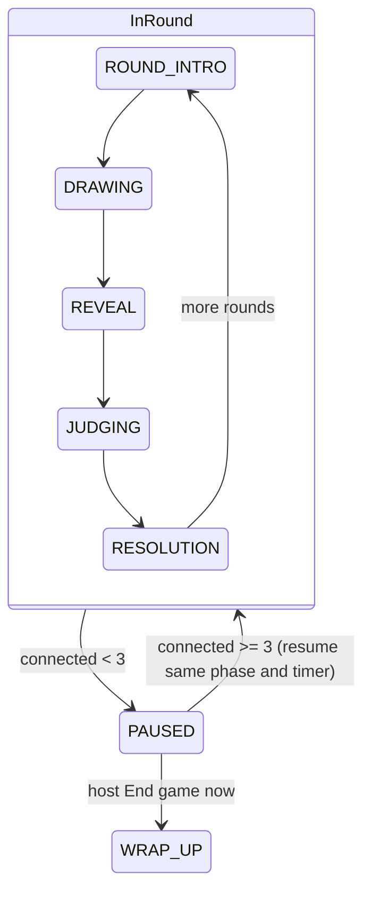

# Slice 9: Connectivity & Resilience
## Late join, disconnect/rejoin with score & kudos memory, below-minimum pause, anti-gaming toggle

**Version:** 1.0
**Last Updated:** 2026-07-04
**Dependencies:**
- Slice 3 (round state machine on `Session`, phase timers, judge rotation, `rpc_sync_phase`; transitively Slice 2's `Roster`/registration RPC)
- Slice 4 (standard kudos allotment math, kudos ledger fields, reaction stats retained per player)
**Provides:** Late-join mid-game, disconnect/quit handling in every phase, rejoin restoration keyed by `platform_id`, below-minimum pause + host end-game-now, `fluid_rejoin` anti-gaming toggle + judge-dodge safeguard, `is_public` settings flag, wrap-up input contract for Slice 10

---

## 1. Overview

This slice encodes design brief **§9** in full: fluid, forgiving connectivity that favors flow over strict fairness ("it's a goofy game"). Players can join a game already in progress, drop out (deliberately or not — treated identically), and come back with their score and kudos intact. If the roster falls below 3, the game freezes politely instead of dying. A simple, low-stakes safeguard deters judge-turn dodging when the fluid model is toggled off.

### Scope

**In Scope:**
- **Late join** (§9): mid-game joiner slots into rotation immediately behind the current judge; starts at 0 points while others (typically) have more; receives **half the standard kudos allotment, floored, minimum 1** (§11); never submits pool words and never alters the locked pool (§8)
- **Disconnect/quit** (identical handling, §9): involvement paused — skipped for judge, card hidden; a drawing **already submitted** into an in-progress round stays judged/kudos-able. **Rejoin** restores score; kudos granted/spent remembered keyed by `platform_id` — leave+rejoin never nets extra kudos (§11); rejoiner resumes their **original** rotation slot
- **Below-minimum pause** (§9): < 3 connected → freeze current phase + timer, "waiting for players…" overlay for all, host-only **End game now** button jumping to wrap-up with results so far; auto-resume at 3
- **Anti-gaming toggle** `fluid_rejoin`: default ON for private lobbies, OFF for public; `is_public` exists as a settings flag now (real public lobbies are Slice 13). When OFF, a simple judge-dodge safeguard applies (see §6)
- Precise per-phase drop rules (state-machine interactions, §5 below)
- Host-quit remains game-over for everyone (no host migration in v1)

**Out of Scope (Later Slices):**
- Wrap-up sequence content (Slice 10 — this slice defines and calls the **entry contract** `get_wrapup_input()`; until Slice 10 lands, early-end routes to Slice 3's placeholder end screen)
- Real public lobby listing/joining (Slice 13 — `is_public` is only a flag + default-picker here)
- Steam transport specifics (Slice 12 — everything here is keyed by `platform_id`, so it works identically once `platform_id` = SteamID64)
- Kick + per-game blocklist (Slice 13)
- Host migration (not in v1 at all)

### User Flows

1. **Late join:** Dana joins round 4 of 10 → sees "You're in! You'll draw starting next round" → is inserted behind the current judge → draws in round 5 with 0 points and 1–2 kudos.
2. **Drop & rejoin:** Bob's Wi-Fi dies during judging → his submitted drawing stays on the grid and wins (+2 to his remembered score) → he rejoins in round 6 → same score, same remaining kudos, same rotation slot.
3. **Pause:** two players quit a 4-player game → everyone sees "Waiting for players… (2/3)" over a frozen timer → a rejoin arrives → phase resumes with the remaining time.
4. **Host ends early / dodge deterred:** during a long pause the host clicks **End game now** → everyone jumps to wrap-up built from results so far. With fluid OFF, a player quitting 10 s before their judge turn keeps the slot; when it arrives with them absent they take the −1 no-pick penalty and the next connected player judges instead.

---

## 2. Data Models

### PlayerState extensions

**File: `res://game/session/roster.gd`** (extend `Roster.PlayerState` from Slice 2)

```gdscript
# --- Slice 9 additions ---
var joined_late: bool = false        # joined after game start (never submits pool words)
var disconnect_at_ms: int = -1       # Time.get_ticks_msec() on host at disconnect; -1 = connected
var dodge_suspect: bool = false      # fluid_rejoin OFF: flagged if they left near their judge turn
```

**Field notes:**

| Field | Type | Description |
|-------|------|-------------|
| joined_late | bool | Set at late-join registration; excluded from pool-word submission (Slice 7 checks this) |
| disconnect_at_ms | int | Host clock at drop; used for the dodge window test; reset to -1 on rejoin |
| dodge_suspect | bool | Set at disconnect time if OFF-mode dodge conditions met; cleared on rejoin |

**Roster behavior change (from Slice 2):** once `phase != LOBBY`, `remove_by_peer()` is **never** called. Disconnects call `mark_disconnected(peer_id)` instead: sets `is_connected = false`, `peer_id = 0`, stamps `disconnect_at_ms`. The entry — score, kudos_granted/spent, rotation slot, reaction stats (Slice 4) — is the "memory" §9 and §11 require. This memory is per-game, in host RAM only (see §4).

### Rotation model (owned by Slice 3, extended here)

Slice 3's rotation is an ordered `Array[String]` of `platform_id`s with a `rotation_cursor: int`. Slice 9 adds:

- `insert_after_cursor(platform_id)` — late-join placement: **immediately behind the current judge** (§9), i.e. the new player judges when the rotation comes all the way back around.
- Rotation entries are **never removed** on disconnect. `advance_to_next_judge()` skips entries whose player `is_connected == false` — except the OFF-mode forfeit case (§6).
- Rejoiners are **not** re-inserted; their original entry still exists, so a leave→rejoin cycle can never move a player closer to (or further from) their next judge turn. This single rule kills the "repeat my judge turn sooner" abuse for free, in both toggle states.

### GameSettings extensions

**File: `res://game/session/settings.gd`**

```gdscript
# --- Slice 9 additions ---
var is_public: bool = false      # flag only; real public lobbies land in Slice 13
var fluid_rejoin: bool = true    # §9 anti-gaming toggle
var fluid_rejoin_overridden: bool = false  # host touched the toggle

func apply_public_default() -> void:
	# Default: ON for private, OFF for public (§9). Host override wins.
	if not fluid_rejoin_overridden:
		fluid_rejoin = not is_public
```

`fluid_rejoin` and `is_public` are connectivity settings, host-tunable in the lobby regardless of mode preset (they are not part of the Slice 6 preset lock set — presets lock *game-feel* settings; brief §10 lists only draw-time/rounds/pool-source as the always-tunable trio, and §9 independently declares this toggle host-facing).

### New constants

**File: `res://core/constants/game_constants.gd`** (append)

```gdscript
const LATE_JOIN_ALLOTMENT_DIVISOR: int = 2   # half the standard allotment…
const LATE_JOIN_ALLOTMENT_MIN: int = 1       # …floored, minimum 1 (§11)
const JUDGE_DODGE_WINDOW_SEC: float = 30.0   # OFF-mode: leaving this close to your turn = suspect
```

---

## 3. Event/Action Definitions

### EventBus signals (append to `res://core/events/event_bus.gd`)

```gdscript
## A new player joined mid-game (active from the next round).
signal player_late_joined(peer_id: int, display_name: String)
## A player lost connection mid-game (entry retained, involvement paused).
signal player_dropped(platform_id: String, display_name: String)
## A previously dropped player is back; score and kudos restored.
signal player_rejoined(peer_id: int, display_name: String)
## Roster fell below minimum; phase + timer frozen on all peers.
signal game_paused(connected_count: int)
## Roster recovered; phase resumed. time_left_ms is the restored phase clock.
signal game_resumed(phase: int, time_left_ms: int)
```

(Slice 10 wrap-up entry reuses Slice 3's `phase_changed(WRAP_UP, data)` — no new signal.)

### RPCs

All on the `Session` autoload (`game/session/game_session.gd`).

| RPC | Direction | Args | Validation | Effect |
|-----|-----------|------|------------|--------|
| `rpc_request_register` *(extended from Slice 2)* | client → host | `platform_id: String`, `display_name: String` | 5-step; when `phase != LOBBY`: platform_id match → **rejoin** branch; no match → **late-join** branch (connected count < 8, identity sane) else reject | Rejoin: rebind peer to existing entry. Late join: new entry + rotation insert + half allotment. Both: `rpc_do_welcome_ingame` to sender, `rpc_sync_roster` + status to all; may trigger resume |
| `rpc_do_welcome_ingame` | host → new/returning peer | `snapshot: Dictionary` (shape below) | authority send only | Client reconstructs mid-game state and enters the correct phase screen (or pause overlay) |
| `rpc_sync_player_status` | host → all | `platform_id: String`, `peer_id: int`, `is_connected: bool`, `display_name: String` | authority send only | Update mirror flags; toast; emit `player_dropped` / `player_rejoined` / `player_late_joined` |
| `rpc_sync_pause` | host → all | `connected_count: int` | authority send only | Freeze phase UI + local timer display; show pause overlay; emit `game_paused` |
| `rpc_sync_resume` | host → all | `phase: int`, `time_left_ms: int` | authority send only | Hide overlay; restore timer from host value; emit `game_resumed` |
| `rpc_sync_phase` *(reused from Slice 3)* | host → all | `phase: int`, `data: Dictionary` | authority send only | Early end: host sends `WRAP_UP` with `get_wrapup_input()` as data |

**`rpc_do_welcome_ingame` snapshot shape:**

```gdscript
{
	"roster": Array[Dictionary],      # full PlayerState dicts (incl. disconnected entries)
	"settings": Dictionary,           # frozen game settings snapshot
	"phase": int, "paused": bool,     # PAUSED delivered as paused=true + underlying phase
	"time_left_ms": int,              # authoritative remaining phase time (0 if untimed)
	"round_index": int, "rounds_total": int, "current_judge_platform_id": String,
	"phase_data": Dictionary,         # per-phase payload, same shape rpc_sync_phase uses (Slice 3)
	"you": {"active_from_round": int, "kudos_remaining": int}
}
```

No client ever requests pause/resume/end — those are host-authoritative decisions triggered by roster changes or the host's own UI (host is the server; its buttons call `Session` methods directly, no RPC needed).

---

## 4. Storage Schema Extensions

**N/A — deliberate.** All resilience memory (scores, kudos granted/spent, rotation slots, dodge flags) is **per-game, host-RAM only**, keyed by `platform_id`. Nothing is written to `user://` (consistency guide §6 explicitly notes kudos memory is per-game, not in `profile.json`). If the host process dies, the game is over — there is no session resume-from-disk in v1, and no schema change here.

---

## 5. State Machines

### Pause as a wrapper state

`NetIds.Phase.PAUSED` (already in the skeleton enum) wraps whichever in-round phase was active. The host stores `(_paused_phase, _paused_time_left_ms)` and re-enters exactly there on resume.



### Pause rules

| Aspect | Rule |
|--------|------|
| Trigger | Host detects `roster.connected_count() < GameConstants.MIN_PLAYERS` while phase ∈ {ROUND_INTRO, DRAWING, REVEAL, JUDGING, RESOLUTION, POOL_SETUP} |
| Non-triggers | LOBBY (Slice 2 gate handles it) and WRAP_UP (game already over — sequence just plays out). A further drop while already paused just updates the overlay count — pause is idempotent |
| Timer freeze | Host stops the authoritative phase timer, records `time_left_ms`; clients freeze display on `rpc_sync_pause` |
| Resume | Any successful rejoin/late-join that brings connected ≥ 3 → `rpc_sync_resume(phase, time_left_ms)`; clients restart local countdown from the **host's** value (no drift) |
| Early end | Host-only button on the overlay → `Session.end_game_early()` → `rpc_sync_phase(WRAP_UP, get_wrapup_input())` |

### Per-phase drop-handling table (the §9 core)

What the **host** does when a player disconnects, by current phase (after the universal steps: `mark_disconnected`, `rpc_sync_player_status`, pause check):

| Phase | Dropped player was a DRAWER | Dropped player was the JUDGE |
|-------|------------------------------|------------------------------|
| LOBBY | Slice 2 behavior: removed from roster entirely | n/a (no judge yet) |
| POOL_SETUP (Slice 7) | Entry retained; Slice 7's share/backfill rules own the pool consequences (§8 silent backfill) | n/a |
| ROUND_INTRO | Nothing extra — they simply won't submit | Judge seat **holds** (they may return before drawing ends); see JUDGING row for the deadline |
| DRAWING | No submission will arrive at deadline → no card for them at reveal ("card hidden", §9). Their client can't submit anyway; host also ignores any stray submission from a non-connected peer | Drawing continues — drawers are unaffected (judge has no live view anyway, §4 of brief). If the judge returns before JUDGING ends, they pick as normal |
| REVEAL | **Submitted drawing stays** (§9): still shown, still reactable/kudos-able; kudos to it still credit the remembered score | Reveal continues (it's automated); judging deadline logic below applies |
| JUDGING | Card stays and remains pickable; if it **wins**, +2 goes to the remembered score | Window runs to its normal end (drawers still react/kudos, so the round isn't wasted). At window end with no pick: **no round winner**; the −1 no-pick penalty (§11) applies to the absent judge **only if** they are `dodge_suspect` under `fluid_rejoin == false`; with fluid ON the drop is forgiven (flow over fairness, §9) |
| RESOLUTION | Nothing extra; scores already applied to remembered entries | Same — resolution just displays |
| WRAP_UP | Sequence continues for the remaining players; no pause below minimum here | n/a |

**Future judge turns while disconnected:** `advance_to_next_judge()` skips disconnected entries (§9 "skipped for judge") — except the OFF-mode forfeit rule in §6.

---

## 6. Business Logic

### Late join

**File: `res://game/session/game_session.gd`** (extends the Slice 2 register handler's `phase != LOBBY` branch)

```gdscript
func _register_late_joiner(sender: int, platform_id: String, clean_name: String) -> void:
	var p: Roster.PlayerState = roster.register(sender, platform_id, clean_name)
	p.joined_late = true
	p.score = 0                                   # §9: starts behind, no compensation
	p.kudos_granted = late_join_allotment(_standard_allotment)  # §11: half, floored, min 1
	rotation.insert_after_cursor(platform_id)     # §9: immediately behind current judge
	p_active_from_round[platform_id] = round_index + 1
	rpc_do_welcome_ingame.rpc_id(sender, _build_ingame_snapshot(p))
	rpc_sync_roster.rpc(roster.to_dicts())
	rpc_sync_player_status.rpc(platform_id, sender, true, p.display_name)
	_check_resume()                               # a late join can end a pause
```

#### `late_join_allotment()`
```gdscript
static func late_join_allotment(standard: int) -> int:
	# §11: "half the standard allotment, floored at a minimum of 1"
	return maxi(GameConstants.LATE_JOIN_ALLOTMENT_MIN,
			standard / GameConstants.LATE_JOIN_ALLOTMENT_DIVISOR)  # int division floors
```
`_standard_allotment` is computed once at game start by Slice 4's formula (1 per 4 rounds, .5 rounds up, host-overridable) and cached — late joiners always get half of the **same** figure every original player got.
Examples: standard 1→1, 2→1, 3→1, 4→2, 5→2.

**Activation timing:** a late joiner becomes an active drawer at the **next** ROUND_INTRO (`active_from_round`). During the in-progress round they see the reveal/judging as a spectator and **may react and spend kudos immediately** (reactions/kudos are open to everyone incl. the judge, §11 — being able to participate instantly favors flow). They never submit pool words; the pool is locked (§8) and Slice 7's submission phase checks `joined_late`.

### Rejoin

```gdscript
func _register_rejoiner(sender: int, existing: Roster.PlayerState) -> void:
	existing.peer_id = sender
	existing.is_connected = true
	existing.disconnect_at_ms = -1
	existing.dodge_suspect = false   # score/kudos/rotation slot untouched — that IS the memory (§9, §11)
	rpc_do_welcome_ingame.rpc_id(sender, _build_ingame_snapshot(existing))
	rpc_sync_roster.rpc(roster.to_dicts())
	rpc_sync_player_status.rpc(existing.platform_id, sender, true, existing.display_name)
	_check_resume()
```

Kudos are **never re-granted**: remaining kudos = `kudos_granted - kudos_spent` from the retained entry, so leave/rejoin cycles net zero (§11). A rejoiner who arrives mid-DRAWING sits out the current round's drawing (they have no canvas state) and resumes fully next round; they can chat/react/kudos immediately.

### Disconnect

```gdscript
func _on_peer_disconnected(peer_id: int) -> void:
	if phase == NetIds.Phase.LOBBY:
		return _lobby_remove(peer_id)             # Slice 2 behavior unchanged
	var p: Roster.PlayerState = roster.get_by_peer(peer_id)
	if p == null:
		return                                    # never-registered peer
	roster.mark_disconnected(peer_id)             # keeps entry; stamps disconnect_at_ms
	if not settings.fluid_rejoin:
		p.dodge_suspect = _is_dodge(p)            # evaluated AT disconnect time
	rpc_sync_player_status.rpc(p.platform_id, 0, false, p.display_name)
	_apply_phase_drop_rules(p)                    # table in §5
	_check_pause()
```

### Anti-gaming safeguard (`fluid_rejoin == false`)

One simple mechanism (§9: "keep the safeguard simple"), built entirely from existing pieces:

```gdscript
func _is_dodge(p: Roster.PlayerState) -> bool:
	# Suspect if, at the moment of leaving, the player was the CURRENT judge,
	# was the NEXT judge, or their turn was due within JUDGE_DODGE_WINDOW_SEC
	# (i.e. current phase ends within the window and they're next).
	if rotation.current_judge_id() == p.platform_id:
		return true
	if rotation.next_connected_judge_id() == p.platform_id \
			and phase_time_left_sec() <= GameConstants.JUDGE_DODGE_WINDOW_SEC:
		return true
	return false
```

**Consequence:** a `dodge_suspect` keeps their rotation slot armed. When `advance_to_next_judge()` reaches their slot and they are still absent, the slot is **forfeited, not skipped**: they take the standard **−1 no-pick penalty** (§11's existing constant — no new scoring rule), the forfeit is announced in the round intro ("Bob dodged judging: −1"), and the next connected player judges that round instead. If they rejoin before the slot arrives, they judge normally and the flag clears. With `fluid_rejoin == true` (private default), none of this applies — disconnected players are skipped silently, penalty-free.

That's the whole safeguard: no bans, no timers beyond one window constant, perfect fairness explicitly not attempted (§9).

### Pause / resume / early end

```gdscript
func _check_pause() -> void:
	if _paused or phase in [NetIds.Phase.LOBBY, NetIds.Phase.WRAP_UP]:
		return
	if roster.connected_count() < GameConstants.MIN_PLAYERS:
		_paused = true
		_paused_phase = phase
		_paused_time_left_ms = _phase_timer_remaining_ms()   # authoritative freeze
		_stop_phase_timer()
		rpc_sync_pause.rpc(roster.connected_count())

func _check_resume() -> void:
	if _paused and roster.connected_count() >= GameConstants.MIN_PLAYERS:
		_paused = false
		_restart_phase_timer(_paused_time_left_ms)
		rpc_sync_resume.rpc(_paused_phase, _paused_time_left_ms)

func end_game_early() -> void:   # host UI only; not an RPC
	if not Net.is_host() or not _paused:
		return
	_paused = false
	rpc_sync_phase.rpc(NetIds.Phase.WRAP_UP, get_wrapup_input())
```

### Wrap-up input contract (Slice 10 integration, defined now)

```gdscript
func get_wrapup_input() -> Dictionary:
	return {
		"v": 1,
		"ended_early": bool,              # true when reached via End-game-now
		"rounds_played": int,             # completed rounds (partial round discarded)
		"rounds_planned": int,
		"players": Array[Dictionary],     # ALL roster entries incl. disconnected:
		                                  # {platform_id, display_name, score, is_connected,
		                                  #  joined_late, kudos_spent}
		"round_history": Array[Dictionary],  # Slice 3/4 per-round records (winner, prompt, kudos, reactions)
		"reaction_stats": Dictionary,     # Slice 4 aggregate emoji stats (superlative fuel)
	}
```

Rules Slice 10 must honor (declared here so both sides agree): disconnected players **appear** in standings with their remembered scores; negative scores sort below zero normally (§11); a partially-played round (e.g. paused mid-DRAWING then ended) contributes nothing. Until Slice 10 ships, `WRAP_UP` renders Slice 3's placeholder standings screen from this same dictionary.

---

## 7. UI Components

### Pause Overlay

**File: `res://ui/round/pause_overlay.tscn` + `pause_overlay.gd`**

```
+--------------------------------------------------+
|            (dimmed frozen phase screen)          |
|   +------------------------------------------+   |
|   |        Waiting for players… (2/3)        |   |
|   |   The game will resume when someone      |   |
|   |   joins or rejoins.                      |   |
|   |                                          |   |
|   |   [ End game now ]   <- host only        |   |
|   +------------------------------------------+   |
+--------------------------------------------------+
```

Shown/hidden by `game_paused`/`game_resumed`. Blocks input to the phase screen underneath (chat stays usable — people will want to grumble). **End game now** is visible only when `Net.is_host()`; it calls `Session.end_game_early()` after a one-click confirm ("End with results so far?").

### Status toasts

Reuse `ui/shared/toast.tscn`: "Dana joined the game!", "Bob disconnected", "Bob is back!", "Bob dodged judging: −1" (the last also appears in the round-intro screen via Slice 3's intro data).

### Late-joiner waiting view

**File: `res://ui/round/late_join_wait.tscn`** — shown when `active_from_round > round_index`: "You're in! You'll draw starting next round." over the spectator view of the current phase (reveal grid visible, reactions/kudos enabled).

### Lobby settings additions (extends Slice 2 panel)

- **Public lobby** checkbox (flag only; tooltip: "Listed publicly — coming with the lobby browser") — flipping it re-derives the fluid-rejoin default via `apply_public_default()` unless overridden
- **Fluid rejoin** toggle with tooltip ("ON: drop-in/drop-out friendly. OFF: leaving near your judge turn forfeits it (−1)")

### User Confirmation Checkpoints

**Blocking (later work in this slice depends on them):**
- [ ] 4-instance run: kill one client mid-DRAWING → others unaffected; victim's card absent at reveal; roster shows them greyed
- [ ] Drop to 2 connected → all peers freeze with overlay + counts; rejoin → phase resumes and the timer continues from the frozen value on every screen
- [ ] Rejoin restores score and remaining kudos exactly (spend 1 of 2, quit, rejoin → 1 remaining)
- [ ] Late join lands behind current judge and first draws in the following round

**Batchable (queue for slice completion):**
- [ ] Toasts for join/drop/rejoin read correctly and don't stack absurdly
- [ ] Judge drops during JUDGING: window completes, kudos still spendable, "no winner" resolution shows; fluid ON → no penalty
- [ ] `fluid_rejoin` OFF: quit as next-judge inside 30 s window, stay away → forfeit round shows the −1 and the next player judges
- [ ] Host End-game-now lands on the (placeholder until Slice 10) wrap-up with correct standings incl. a disconnected player
- [ ] Late joiner can react/kudos during the round they joined into
- [ ] Public checkbox flips the fluid-rejoin default; manual override sticks

---

## 8. State Management

Extensions to the **`Session`** autoload (no new autoloads):

```
Session (additions)
├── _paused: bool
├── _paused_phase: NetIds.Phase
├── _paused_time_left_ms: int
├── p_active_from_round: Dictionary[String, int]   # platform_id → round index (late joiners)
└── roster: entries persist across disconnects once phase != LOBBY
```

Client mirrors learn everything through `rpc_sync_player_status`, `rpc_sync_pause`, `rpc_sync_resume`, and (re)`rpc_sync_roster` — clients never infer pause locally from peer signals (a client can't know if *others* still see the host; consistency guide §5: no local guesses).

**Selectors:**

| Name | Purpose | Dependencies |
|------|---------|--------------|
| `Session.is_paused()` | Overlay + input gating | `_paused` |
| `Session.is_spectating_current_round()` | Late-join wait view | `p_active_from_round`, round_index |
| `Session.connected_count()` | Overlay counter | roster |

---

## 9. Integration Points

### Dependencies (What This Slice Needs)

#### From Skeleton
- `NetIds.Phase.PAUSED` (already in enum); `EventBus`; `GameConstants.MIN_PLAYERS`
- `Net` peer signals (`peer_disconnected`, `server_disconnected`)

#### From Slice 2
- `Roster`/`PlayerState` with `platform_id`, `is_connected`, kudos fields; `rpc_request_register` (extended, not duplicated); `rpc_sync_roster`; lobby settings panel

#### From Slice 3
- Phase machine + authoritative phase timer with `remaining_ms` access and stop/restart-at-value (**forward contract**: Slice 3's timer must expose this)
- Judge rotation (`current_judge_id`, `advance_to_next_judge`, cursor) — Slice 9 adds `insert_after_cursor` and the skip/forfeit rules
- `rpc_sync_phase(phase, data)` + per-phase `phase_data` shapes (reused in the welcome snapshot); `Scoring.apply_no_pick_penalty`

#### From Slice 4
- Standard allotment computed at game start (host-overridable); `kudos_granted/spent` ledger maintenance; reaction stats retained per platform_id (drops must not erase them — superlative fuel for Slice 10)

### Provides (What This Slice Offers)

#### For Future Slices
- **`get_wrapup_input()` contract** (§6): Slice 10's sole entry payload, for both natural end and early end
- **`is_public` flag + fluid default rule**: Slice 13 flips this into a real listed lobby; defaults already correct
- **Transport-agnostic rejoin**: keyed purely by `platform_id`, so Slice 12's SteamID identity gets resilience for free
- **`player_dropped`/`player_rejoined`/`game_paused`/`game_resumed` signals**: any UI (wrap-up, HUD) may subscribe

### Integration Checklist
- [ ] Constants added; no magic numbers in handlers
- [ ] EventBus signals appended with doc comments
- [ ] `rpc_request_register` branch replaced (Slice 2's `"in_progress"` reject deleted)
- [ ] Settings fields wired through `settings.gd` + lobby panel
- [ ] Slice 3 timer exposes freeze/restore (record deviation if its current shape differs)
- [ ] Mirror-path tests added

---

## 10. Edge Cases

### Host quits
**Scenario:** The host disconnects or closes the game.
**Handling:** No host migration in v1. Clients receive `server_disconnected` → toast "Host left — game over" → menu. Local collections/saves are unaffected.
**Rationale:** host-authoritative model (guide §4); migration cost is out of proportion for a party game.

### Everyone but the host leaves
**Scenario:** Host alone (1 connected).
**Handling:** Normal pause path (< 3). Host sees the overlay with End-game-now; can wait or end.
**Rationale:** uniform rule; the host is a player too.

### Roster full of ghosts
**Scenario:** 8 joined, 2 dropped, a new late-joiner arrives (6 connected, 8 entries).
**Handling:** Capacity checks use `connected_count()`, not entry count — the late joiner is admitted (7th connected). If one of the ghosts later rejoins, connected = 8: fine. A **second** new joiner at 8 connected is rejected `"full"`. Entry list may exceed 8; rotation skips ghosts.
**Rationale:** §3's max is about live players; memory entries must never block real ones.

### Rejoin attempt while their platform_id is already connected
**Scenario:** Duplicate/cloned identity, or a zombie connection not yet timed out.
**Handling:** Register handler step 3: if the matched entry `is_connected`, reject `"bad_identity"` and drop the new peer.
**Rationale:** never let identity claims evict a live player (§13 untrusted input).

### Judge drops and rejoins within the same round
**Scenario:** Judge disconnects during DRAWING, rejoins during JUDGING.
**Handling:** Their seat was held (no mid-round reassignment); on rejoin the welcome snapshot carries the JUDGING phase data, and they pick as normal within the remaining window.
**Rationale:** the round was never blocked on them (window runs regardless), so returning simply restores their power.

### Winner authored by a disconnected player
**Scenario:** Judge picks a card whose author dropped.
**Handling:** +2 to the remembered score; resolution shows the author's name greyed with "(disconnected)". Kudos likewise credit remembered scores.
**Rationale:** §9 explicit — submitted drawings stay fully in play.

### Kudos-save for a disconnected recipient
**Scenario:** Player kudos a drawing whose author is gone.
**Handling:** Normal: kudos save the drawing to the **giver's** local collection (Slice 4); the author's machine is irrelevant.
**Rationale:** collections are local-first (§14).

### Connection flapping
**Scenario:** A player disconnects/rejoins rapidly (bad Wi-Fi).
**Handling:** No cooldown — each cycle is cheap (rebind + snapshot ≤ a few KB); toast coalescing keeps UI calm. Dodge flags only evaluate near judge turns, so flapping is penalty-safe under OFF except exactly there — accepted.
**Rationale:** forgiving by design (§9); simplicity over throttling.

### Late join into the final round / into a pause
**Scenario:** Joiner arrives with 1 round left, or while paused.
**Handling:** Final round: admitted, spectates, may react/kudos, appears in standings at score 0 (they never get a card). While paused: admitted normally and counts toward resume.
**Rationale:** flow first; a joiner who "wasted" a join still gets the wrap-up show.

### Custom-pool attrition
**Scenario:** Player-created pool (Slice 7) and word authors keep leaving.
**Handling:** Nothing here — pool locked at start (§8); Slice 7's silent backfill covers shortfalls. Late joiners never touch pools.
**Rationale:** separation of concerns; §8 already legislates it.

### Performance Considerations
Welcome snapshots are the largest payload (roster + phase data incl. up to 7 drawing docs during REVEAL/JUDGING, typ. < 50 KB each per guide §12) — sent to one peer, once, reliable channel: negligible. Pause/resume are single tiny RPCs.

---

## 11. Testing Strategy

### Unit Tests

**Location:** `tests/game/session/`

#### `test_late_join.gd`
- [ ] `test_late_join_allotment_half_floored_min_one` (1→1, 2→1, 3→1, 4→2, 5→2, 10→5)
- [ ] `test_late_joiner_inserted_immediately_behind_current_judge`
- [ ] `test_late_joiner_starts_at_zero_score_and_is_flagged`
- [ ] `test_late_joiner_active_from_next_round`
- [ ] `test_late_joiner_excluded_from_pool_submission_set`

#### `test_rejoin.gd`
- [ ] `test_rejoin_restores_score_and_kudos_by_platform_id` (incl. negative score — §11 no floor)
- [ ] `test_rejoin_never_regrants_kudos` (grant 2, spend 1, drop, rejoin → remaining 1)
- [ ] `test_rejoin_keeps_original_rotation_slot`
- [ ] `test_rejoin_rejected_when_platform_id_already_connected`

#### `test_pause.gd`
- [ ] `test_pause_triggers_below_three_connected_in_round_phases_only`
- [ ] `test_pause_freezes_and_resume_restores_exact_time_left`
- [ ] `test_resume_requires_three_connected`
- [ ] `test_late_join_during_pause_counts_toward_resume`
- [ ] `test_end_game_early_produces_wrapup_input_with_ended_early_true`
- [ ] `test_wrapup_input_includes_disconnected_players_and_partial_round_discarded`

#### `test_dodge_guard.gd`
- [ ] `test_fluid_on_skips_disconnected_judge_without_penalty`
- [ ] `test_fluid_off_flags_current_judge_leaving`
- [ ] `test_fluid_off_flags_next_judge_leaving_inside_window_only`
- [ ] `test_forfeit_applies_minus_one_and_advances_to_next_connected`
- [ ] `test_rejoin_before_slot_clears_flag_and_judges_normally`
- [ ] `test_fluid_default_on_private_off_public_host_override_wins`

#### Drop rules (`test_drop_rules.gd`) — validators as plain functions
- [ ] `test_submitted_drawing_stays_judgeable_after_author_drop`; `test_unsubmitted_drawer_drop_yields_no_card`
- [ ] `test_absent_judge_no_pick_penalty_matrix` (fluid×suspect: only OFF+suspect penalized)

### Integration Tests
- [ ] Register handler branch routing: LOBBY→Slice 2 path, in-game+known id→rejoin, in-game+new id→late join, full→reject
- [ ] Welcome snapshot round-trips through a client mirror to the correct phase screen state

### UI/Component Tests
- [ ] `pause_overlay.tscn`, `late_join_wait.tscn` smoke-instantiate; End-now hidden for non-host

### Manual Testing Required
Multi-instance scenario script (add to `tools/` docs): see §7 blocking + batchable checkpoint lists.

---

## 12. Implementation Checklist

### Setup
- [ ] Constants (`LATE_JOIN_*`, `JUDGE_DODGE_WINDOW_SEC`) added; EventBus signals appended with doc comments

### Data Layer
- [ ] `PlayerState` fields: `joined_late`, `disconnect_at_ms`, `dodge_suspect` (+ serialization + defaults)
- [ ] `Roster.mark_disconnected()` / rebind-on-rejoin; in-game entries never removed
- [ ] `GameSettings`: `is_public`, `fluid_rejoin`, `apply_public_default()`
- [ ] Rotation: `insert_after_cursor()`, ghost-skip, forfeit hook
- [ ] Tests: rejoin/late-join/rotation units green

### Business Logic
- [ ] Register handler branches: rejoin / late join / full-reject (5-step preserved)
- [ ] `late_join_allotment()` + activation-round bookkeeping
- [ ] `_on_peer_disconnected` in-game path + per-phase drop rules (§5 table)
- [ ] Dodge evaluation at disconnect + forfeit-with-penalty at slot arrival
- [ ] Pause/resume with authoritative timer freeze/restore
- [ ] `end_game_early()` + `get_wrapup_input()` (contract shape + partial-round discard)
- [ ] Absent-judge window resolution (no winner; penalty matrix)
- [ ] Tests: pause/dodge/drop-rule units green

### UI Layer
- [ ] `pause_overlay.tscn/.gd` (host-only End button + confirm); `late_join_wait.tscn` spectator banner
- [ ] Join/drop/rejoin/forfeit toasts (with coalescing)
- [ ] Lobby settings: public checkbox + fluid toggle with default derivation; smoke tests

### Testing, Confirmation & Documentation
- [ ] Full suite green; RPC validators covered as plain functions
- [ ] Blocking user tests confirmed; batchable user tests presented and confirmed (§7)
- [ ] Update `WHERE_WE_ARE.md`; implementation notes
- [ ] Decision log: judge-seat-hold choice, late-join activation timing, any Slice 3 timer contract adjustments

---

**End of Slice 9: Connectivity & Resilience**

---

## Implementation Status

**Status:** COMPLETE (core-confirmed)
**Completed:** 2026-07-07 (session 7; owner blocking checks confirmed same day — "seems to be working!")
**Implementation Notes:** [09-connectivity-resilience-implementation-notes.md](09-connectivity-resilience-implementation-notes.md)

### Summary of Deviations
- Judge rotation is an explicit cursor on `GameSession` (Slice 3 shipped modulo, not the cursor this TDD assumed); late joiners insert before the cursor entry (= judge when the rotation wraps)
- Below-minimum pause rides the Slice 6 PAUSED pipeline with `NetIds.PauseReason` — the §3 `rpc_sync_pause/resume` RPCs were never needed
- `get_wrapup_input()` folded into the existing SessionResults bundle (`ended_early/rounds_played/rounds_planned/players` keys) — one shape for Slice 10
- Departure ordering rule added: pause check BEFORE all-ready re-evaluation / pool-completion locking (a below-minimum game never advances)
- Absent-judge window-end penalty consumes the dodge flag (never a double −1); judge seat holds against early JUDGING end (also fixes a latent Slice 17 gap)
- Mid-DRAWING rejoiners sit the round out host-enforced; `CustomPoolCollector.mark_returned` added for rejoiners during POOL_SETUP
- **Late joiners get the FULL standard kudos allotment** (owner decision 2026-07-07, supersedes §2/§6 and brief §11's half rule)
- EventBus status signals platform_id-keyed throughout; welcome snapshot replayed through `rpc_sync_phase` client-side
- New automated gate: `tools/verify_resilience.sh` (drop → pause → rejoin → resume → kept submission wins)
