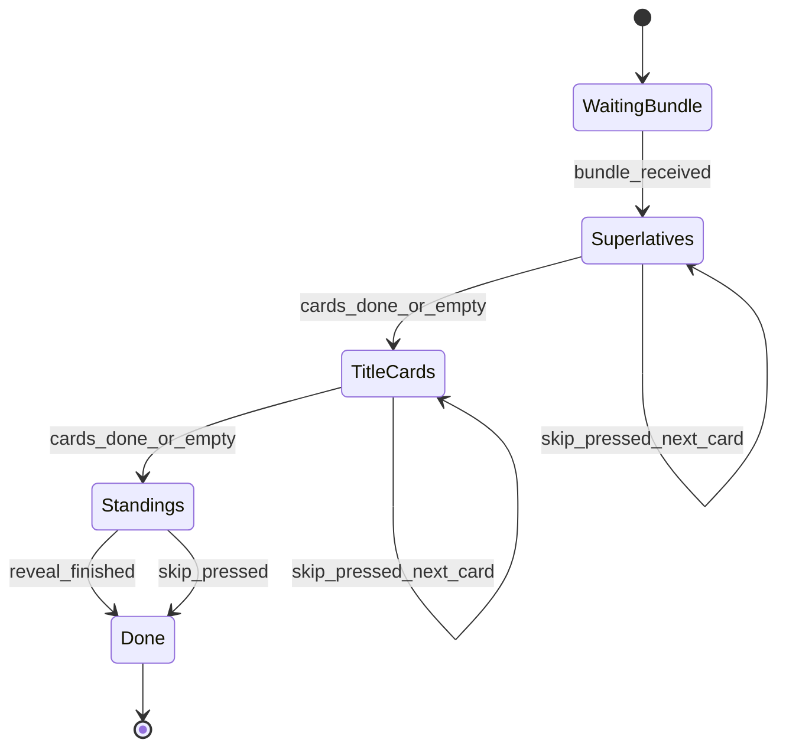

# Slice 10: End-Game Wrap-Up
## Superlatives, per-player title cards with evidence, title points, and final standings — the "your game, wrapped" closer

**Version:** 1.0
**Last Updated:** 2026-07-04
**Dependencies:**
- Slice 3 (round results handoff: per-round drawings, winners, scores; WRAP_UP phase entry after final resolution)
- Slice 4 (session reaction/kudos stats structure: per-drawing reaction counts + kudos, per-player kudos granted/spent)
- Slice 6 (`title_points_enabled` host setting, Custom mode only)
- Slice 9 (early-end entry path: host "end game" button during below-minimum pause)

**Provides:** `WrapUpCalculator` (host-side, headless-testable), wrap-up bundle format + `rpc_sync_wrap_up_bundle`, animated wrap-up sequence UI with per-player skip, `titles_awarded` / `game_ended` EventBus signals (consumed by Slice 14)

---

## 1. Overview

The wrap-up is the payoff for staying to the end (§11): a mildly animated closing sequence that plays after the final round (or after a host early-end, §9). The **host computes everything exactly once** into a single *wrap-up bundle* — superlatives, title cards, standings — broadcasts it, and each client plays the sequence locally at its own pace with a skip control. No further host coordination is needed after the broadcast; the wrap-up even survives a host disconnect mid-sequence.

Three acts:
1. **Superlatives** — one drawing award per Reaction enum value (e.g. most LAUGH = "Funniest Drawing").
2. **Title cards** — up to 8 computable per-player session titles (e.g. Hotshot, Worst Drawer), each shown with **evidence**: the drawing(s) that earned it. Every player gets **at most one** card; titles are per-game and awarded fresh (§11).
3. **Final standings** — 1st/2nd/3rd… including title/superlative points, handling negative scores and ties cleanly (§11: no floor, negatives are legal).

### Scope

**In Scope:**
- `WrapUpCalculator`: superlative mapping (all 6 reactions), v1 title set (8 titles) with exact computations, tie-breaks, and evidence selection
- Title/superlative points (`TITLE_POINTS_VALUE` backend constant, gated by `title_points_enabled`)
- Final standings with competition ranking, negatives, and ties
- Wrap-up bundle format + host→all sync RPC; evidence DrawingDocs embedded so late joiners/rejoiners can render everything
- Wrap-up sequence UI (superlative cards → title cards → standings) with local skip-ahead
- Early-end entry: sequence runs on whatever data exists; empty awards omitted gracefully
- EventBus signals for Slice 14 (titles earned, game ended, kudos summary)

**Out of Scope (Other Slices):**
- Persisting titles/stats to `user://stats.json` and Steam achievements (Slice 14)
- The below-minimum pause UI and the early-end button itself (Slice 9 — this slice only implements the entry point it calls)
- Return-to-lobby / play-again flow (Slice 3's existing post-game navigation is reused as-is)
- Social share of wrapped results (not in v1)

### User Flow

1. Final round resolution completes (or host presses Slice 9's "End game now"). Host computes the bundle and broadcasts it; all peers navigate to the wrap-up screen.
2. Superlative cards play one at a time (drawing shown with its award + reaction count, brief stroke-replay flourish).
3. Title cards play one per titled player (title name, player avatar/name, evidence drawing(s), stat line like "5 kudos received").
4. Standings panel animates in (3rd → 2nd → 1st, then the rest listed), showing score breakdowns including title points.
5. At any time a player can press **Skip ▸** to advance their own view; nobody else is affected.
6. From the standings, Slice 3's existing "Back to Lobby" / "Leave" controls apply.

---

## 2. Data Models

### WrapUpBundle (wire + in-memory Dictionary)

Computed once on the host, broadcast verbatim, never mutated afterwards.

```json
{
  "v": 1,
  "early_end": false,
  "rounds_completed": 8,
  "superlatives": [
    {"id": "funniest", "reaction": 0, "drawing_id": "d-uuid", "author_id": "platform-id",
     "count": 7, "round": 2, "prompt": "sleepy aardvark", "points": 1}
  ],
  "titles": [
    {"id": "hotshot", "player_id": "platform-id", "stat_value": 5,
     "stat_label": "5 kudos received", "evidence_drawing_ids": ["d-uuid"], "points": 1}
  ],
  "standings": [
    {"player_id": "platform-id", "display_name": "Alice", "rank": 1,
     "base_score": 8, "title_points": 2, "final_score": 10, "connected": true}
  ],
  "kudos": {"platform-id": {"granted": 2, "spent": 2}},
  "drawings": {"d-uuid": {"v": 1, "orientation": "landscape", "ops": ["..."], "prompt": "sleepy aardvark"}}
}
```

**Fields:**
| Field | Type | Required | Description |
|-------|------|----------|-------------|
| v | int | Yes | Bundle format version (1) |
| early_end | bool | Yes | True when entered via Slice 9's end-early path |
| rounds_completed | int | Yes | Rounds that reached RESOLUTION |
| superlatives | Array[Dictionary] | Yes | 0–6 entries, in Reaction enum order; empty entries omitted |
| titles | Array[Dictionary] | Yes | 0–8 entries in award (priority) order |
| standings | Array[Dictionary] | Yes | All rostered players (incl. disconnected), rank ascending |
| kudos | Dictionary | Yes | Per-player granted/spent summary (Slice 14 reads for spend-all detection) |
| drawings | Dictionary | Yes | Deduped `drawing_id → DrawingDoc` for every drawing referenced anywhere in the bundle |

`points` fields carry the value actually applied (0 when `title_points_enabled` is off) so clients render truthfully without re-deriving settings.

### Superlative mapping (v1)

One award per `NetIds.Reaction` value. Winner = the drawing with the **highest count of that reaction** across all revealed drawings this session.

| Reaction | Superlative id | Display name |
|----------|----------------|--------------|
| LAUGH | funniest | Funniest Drawing |
| LOVE | most_beloved | Most Beloved |
| WOW | most_impressive | Most Impressive |
| DISGUST | most_cursed | Most Cursed |
| CRY | biggest_tearjerker | Biggest Tearjerker |
| FIRE | straight_fire | Straight Fire |

**Tie-breaks (deterministic):** highest count → **earliest round** → earliest reveal-order index within that round. **Omission:** if the max count for a reaction is 0, that superlative is omitted (no award for nothing). A single drawing may win multiple superlatives.

### Title set (v1) — `TitleIds`

**File: `res://core/constants/title_ids.gd`** (`class_name TitleIds`, String constants — Slice 14 keys `titles_earned` off these ids).

Titles are evaluated in the fixed **priority order** below. Each title is awarded to the best **eligible** player — a player who does not already hold a title from an earlier row and meets the minimum. If no eligible player qualifies, the title is omitted. This guarantees **at most one card per player** and spreads cards across the table.

| # | id | Display name | Computation (host session data) | Minimum to qualify | Evidence drawing(s) |
|---|----|--------------|--------------------------------|--------------------|---------------------|
| 1 | hotshot | Hotshot | Most kudos received across own drawings | ≥ 1 kudos received | Own drawing with most kudos (tie: earlier round) |
| 2 | judges_darling | Judge's Darling | Most round wins (judge picks) | ≥ 2 wins | Winning drawings, earliest first, max 3 |
| 3 | peoples_champion | People's Champion | Most total reactions received AND zero round wins | ≥ 1 reaction received | Own most-reacted drawing (tie: earlier round) |
| 4 | generous_soul | Generous Soul | Most kudos spent | ≥ 1 kudos spent | Drawings they kudos'd, in spend order, max 3 |
| 5 | speed_demon | Speed Demon | Lowest mean finish fraction: (last op `ts` ÷ round draw-time), averaged over own submitted non-empty drawings | ≥ 2 non-empty drawings | Own drawing with lowest finish fraction |
| 6 | da_vinci | Da Vinci | Highest mean op count per submitted drawing | ≥ 2 drawings | Own drawing with most ops |
| 7 | minimalist | Minimalist | Lowest mean op count per submitted non-empty drawing | ≥ 2 non-empty drawings | Own drawing with fewest ops (> 0) |
| 8 | worst_drawer | Worst Drawer | Lowest total (reactions + kudos) received across own drawings | ≥ 1 submitted drawing | Own drawing with fewest reactions+kudos (tie: earlier round) |

**Player-level tie-break chain (all titles):** best stat per the title's direction → tied: player whose best evidence drawing is from the **earlier round** → still tied: **lower judge-rotation index** (host-known, deterministic). Stat comparisons on fractions/means use exact float comparison after computing in a fixed order (roster order) — same inputs always give the same award.

**Points:** each title card and each superlative awards `GameConstants.TITLE_POINTS_VALUE` (**+1**, backend code constant, never exposed in UI as a setting value) to the titled player / superlative drawing's author — applied only when `settings.title_points_enabled` is true (default true; toggleable only in Custom, §10/§11).

### Standings

`final_score = base_score + title_points` (title_points = sum of the player's title card + superlative points). **Standard competition ranking** (1, 2, 2, 4): sort by final_score descending; equal scores share the rank; display order among tied players = judge-rotation index. Negative scores sort and display naturally (e.g. "−3") — **no floor, no clamping** (§11).

---

## 3. Event/Action Definitions

### RPCs

Owned by `game/session/game_session.gd` (host) per consistency guide §4.

| RPC | Direction | Args | Validation | Effect |
|-----|-----------|------|------------|--------|
| `rpc_sync_wrap_up_bundle(bundle: Dictionary)` | host → all (`authority`, `call_local`, reliable) | Full WrapUpBundle | Clients: sender is authority; `bundle.v == 1`; required keys present, else drop + `push_warning` | Store bundle, emit `EventBus.wrap_up_started` / `titles_awarded` / `game_ended`, `Nav.goto(Routes.WRAP_UP)` |
| *(Slice 9)* `rpc_request_end_game()` | client(host UI) → host | — | Slice 9 owns: sender is host player, session paused below minimum | Host calls `GameSession.begin_wrap_up(true)` — the entry this slice implements |

No client→host RPC is added by this slice: the skip button is purely local, and the bundle is immutable after broadcast.

### EventBus Signals

**Append to `res://core/events/event_bus.gd`:**

```gdscript
## Emitted on all peers when the wrap-up bundle arrives; the local sequence starts.
signal wrap_up_started(bundle: Dictionary)
## Emitted on all peers immediately after wrap_up_started. Keys: platform_id (String),
## values: title id (String, see TitleIds). Players without a card are absent.
## Consumed by Slice 14 (titles_earned counters).
signal titles_awarded(titles_by_player: Dictionary)
## Emitted on all peers with the final standings and full bundle (kudos summary,
## rounds_completed). Consumed by Slice 14 (games_played, wins, spend-all-kudos).
signal game_ended(standings: Array, bundle: Dictionary)
## Emitted locally when this player's wrap-up sequence completes or is skipped to the end.
signal wrap_up_sequence_finished()
```

**Trigger order on every peer:** `wrap_up_started` → `titles_awarded` → `game_ended` (all synchronous within the sync-RPC handler, before the sequence animates). Slice 14 therefore gets its data even if the player quits mid-sequence.

---

## 4. Storage Schema Extensions

N/A — the wrap-up persists nothing. Session titles are ephemeral by design (§11); lifetime persistence of `titles_earned`, wins, and games played is Slice 14's `user://stats.json`, fed by this slice's EventBus signals. The bundle lives only in memory for the duration of the wrap-up screen.

---

## 5. State Machines

### Local wrap-up sequence (per client, UI-only)



| State | Description | Terminal? |
|-------|-------------|-----------|
| WaitingBundle | Screen loaded before/while bundle arrives (only reachable by a client whose `Nav` outran the RPC — normally instant) | No |
| Superlatives | Playing superlative cards in Reaction enum order (present ones only) | No |
| TitleCards | Playing title cards in priority order | No |
| Standings | Animating standings (3rd → 2nd → 1st → rest) | No |
| Done | Sequence complete; `wrap_up_sequence_finished` emitted; post-game buttons active | Yes |

### Transition Rules

| Current | Trigger | New | Validation | Side Effects |
|---------|---------|-----|------------|--------------|
| WaitingBundle | bundle stored | Superlatives | bundle valid | Begin first card; empty superlatives → immediately advance |
| Superlatives | card timer elapsed OR Skip | Superlatives / TitleCards | — | Skip finishes current card instantly, next press advances |
| TitleCards | card timer elapsed OR Skip | TitleCards / Standings | — | Same skip semantics |
| Standings | reveal tween done OR Skip | Done | — | Emit `wrap_up_sequence_finished`; show Slice 3 post-game buttons |

Empty phases (no superlatives, no titles) are passed through instantly — an early-end with zero data lands straight on Standings.

The **host-side** state contribution is a single transition: Slice 3's session machine enters `Phase.WRAP_UP` via `begin_wrap_up(early: bool)` (from final RESOLUTION or Slice 9's request), which is terminal for the session — no round phase follows.

---

## 6. Business Logic

### WrapUpCalculator

**File: `res://game/session/wrap_up_calculator.gd`** — `class_name WrapUpCalculator`, pure static functions, zero UI/network references (headless-testable per consistency guide §3/§9). Runs **host-only**, once.

**Inputs (from Slice 3/4 host session state — interface assumption, reconcile with those TDDs):**
- `round_results: Array[Dictionary]` — per revealed round: `{round: int, judge_id: String, prompt: String, drawings: Array[{drawing_id, author_id, doc, reveal_index}], winner_drawing_id: String}` (`""` = no pick / not yet picked)
- `reaction_stats: Dictionary` — `drawing_id → {reactions: Dictionary[int, int] (Reaction → count), kudos: int}` (Slice 4)
- `kudos_ledger: Dictionary` — `platform_id → {granted: int, spent: int, spent_on: Array[String] (drawing_ids, spend order)}` (Slice 4)
- `scores: Dictionary` — `platform_id → int` base scores (Slice 3 scoring)
- `roster_order: Array[String]` — platform_ids in judge-rotation order (tie-break key)
- `settings: GameSettings`, `draw_time_by_round: Dictionary[int, float]`

**Key Methods:**

```gdscript
static func compute_superlatives(round_results: Array[Dictionary],
        reaction_stats: Dictionary, points_on: bool) -> Array[Dictionary]

static func compute_titles(round_results: Array[Dictionary], reaction_stats: Dictionary,
        kudos_ledger: Dictionary, roster_order: Array[String],
        draw_time_by_round: Dictionary, points_on: bool) -> Array[Dictionary]

static func compute_standings(scores: Dictionary, superlatives: Array[Dictionary],
        titles: Array[Dictionary], roster_meta: Dictionary) -> Array[Dictionary]

static func build_bundle(/* all of the above */) -> Dictionary
```

**Business Rules:**
1. Only **revealed** drawings participate (a round contributes its drawings/reactions once its REVEAL completed; a win counts once the judge's pick was accepted by the host). Early end freezes counts at the moment of the end request.
2. A drawing submitted by a player who later disconnected still participates fully (§9 — "stays in that round"); disconnected players appear in titles and standings.
3. Superlatives computed first, then titles, then standings (title points feed standings; no computation reads final scores, so there is no circularity).
4. `points_on = settings.title_points_enabled` (Slice 6). When false, all `points` fields are 0 and standings use base scores only.
5. All iteration is in deterministic order (rounds ascending, reveal_index ascending, roster order) so the same inputs always produce byte-identical bundles.
6. Empty/insufficient data never errors: each superlative/title independently omits itself; `compute_standings` always returns every rostered player (even at 0 rounds completed).
7. `build_bundle` embeds each referenced DrawingDoc exactly once in `drawings` (deduped), each doc annotated with its prompt for card display.

### GameSession extension

**File: `res://game/session/game_session.gd`** (extends Slice 3's machine)

```gdscript
func begin_wrap_up(early: bool) -> void:
    # Host only. Called after final RESOLUTION, or by Slice 9's early-end request.
    if not multiplayer.is_server():
        return
    if _phase == NetIds.Phase.WRAP_UP:
        return  # idempotent — double entry (e.g. early-end raced with round end) is a no-op
    _phase = NetIds.Phase.WRAP_UP
    var bundle: Dictionary = WrapUpCalculator.build_bundle(
        _round_results, _reaction_stats, _kudos_ledger, _scores,
        roster.rotation_order(), settings, _draw_times, early)
    rpc_sync_wrap_up_bundle(bundle)  # call_local — host client path is identical
```

### Timing constants

**Append to `res://core/constants/game_constants.gd`:**

```gdscript
const TITLE_POINTS_VALUE: int = 1          # backend constant, not player-facing (§11)
const WRAPUP_SUPERLATIVE_CARD_SECONDS: float = 4.0
const WRAPUP_TITLE_CARD_SECONDS: float = 5.0
const WRAPUP_STANDINGS_STEP_SECONDS: float = 0.8
const WRAPUP_EVIDENCE_REPLAY_MAX_SECONDS: float = 3.0  # evidence replays are capped hard
const WRAPUP_TITLE_EVIDENCE_MAX: int = 3
```

---

## 7. UI Components

### WrapUp Screen

**File: `res://ui/wrapup/wrap_up_screen.tscn`** + `wrap_up_screen.gd` (route: `Routes.WRAP_UP`)

**Purpose:** Hosts the three-act sequence; owns the local sequence state machine (Section 5).

**Layout:**
```
+--------------------------------------------------+
|  "That's a wrap!"            [round count badge] |
+--------------------------------------------------+
|                                                  |
|            [ CardStage (centered) ]              |
|     superlative / title card / standings panel   |
|                                                  |
+--------------------------------------------------+
|  (progress dots ....)                 [ Skip ▸ ] |
+--------------------------------------------------+
```

**User Interactions:**
| Action | Trigger | Result |
|--------|---------|--------|
| Skip current card | Click **Skip ▸** (or Space) | Card animation completes instantly; second press advances |
| Finish sequence | Standings revealed / skipped | Post-game buttons (Slice 3's Back to Lobby / Leave) appear |

### SuperlativeCard Component

**File: `res://ui/wrapup/superlative_card.tscn`**
**Props:** superlative entry + resolved DrawingDoc. **Behavior:** award name banner, drawing rendered (short stroke-replay flourish via Slice 1's replay renderer, capped at `WRAPUP_EVIDENCE_REPLAY_MAX_SECONDS`), reaction emoji + count, prompt text, "+1" chip only when `points > 0`. Anonymous framing: shows the **author's** name small ("drawn by Alice") — the wrap-up is the one place authorship is celebrated.

### TitleCard Component

**File: `res://ui/wrapup/title_card.tscn`**
**Props:** title entry + player display info + evidence docs (max `WRAPUP_TITLE_EVIDENCE_MAX`). **Behavior:** title name, avatar chip (Slice 11 component; falls back per §11 chain), `stat_label` line, evidence drawings fanned side by side (static render — only superlatives get replay flourish, keeps title cards snappy), "+1" chip when applicable. Disconnected players render with a dimmed avatar and "(left early)" tag.

### StandingsPanel Component

**File: `res://ui/wrapup/standings_panel.tscn`**
**Behavior:** reveals 3rd, 2nd, 1st as podium steps, then remaining rows as a list. Each row: rank, avatar, name, `final_score` with breakdown tooltip (`base + title points`). Tied ranks show the same rank number; negative scores show a true minus sign. Winner row gets the confetti tween (mild — §1: fast and silly, not an award show).

### User Confirmation Checkpoints

- [ ] **Full wrap-up sequence** (batchable): after a 3-player game with reactions/kudos, sequence plays superlatives → titles → standings with sensible pacing
- [ ] **Skip button** (batchable): skipping on one client does not affect the others
- [ ] **Early-end wrap-up** (blocking — gates Slice 9 integration sign-off): end a game early in round 1 before any reveal; wrap-up lands directly on all-zero standings with no empty cards
- [ ] **Negative score display** (batchable): a judge with only no-pick penalties shows a negative score cleanly in standings

---

## 8. State Management

No new autoload. The bundle and sequence state live on the wrap-up screen (UI-local); host inputs live in `GameSession` (existing Slice 3/4 state).

**State Shape (wrap_up_screen.gd):**
```gdscript
var _bundle: Dictionary = {}
var _act: Act = Act.WAITING_BUNDLE        # local enum mirroring Section 5
var _card_index: int = 0
var _card_finished: bool = false          # skip semantics: finish, then advance
```

**Signal wiring:**
| Source | Signal | Consumer | Purpose |
|--------|--------|----------|---------|
| GameSession (via sync RPC) | `EventBus.wrap_up_started(bundle)` | wrap_up_screen | Start/refresh sequence |
| GameSession (via sync RPC) | `EventBus.titles_awarded(map)` | Slice 14 StatsService | Lifetime title counters |
| GameSession (via sync RPC) | `EventBus.game_ended(standings, bundle)` | Slice 14 StatsService | games_played / wins / kudos summary |
| wrap_up_screen | `EventBus.wrap_up_sequence_finished()` | Slice 3 post-game controls | Enable Back-to-Lobby/Leave |

Clients never derive wrap-up data locally — everything renders from the host bundle (consistency guide §5 rule).

---

## 9. Integration Points

### Dependencies (What This Slice Needs)

#### From Skeleton
- `EventBus`, `Nav`/`Routes` (new `WRAP_UP` route), `NetIds.Phase.WRAP_UP`, `NetIds.Reaction`, `game_constants.gd`

#### From Slice 3
- Round results structure (drawings per round, winner ids, base scores) and the final-round handoff that calls `begin_wrap_up(false)` — **interface assumption documented in Section 6; reconcile field names with the Slice 3 TDD**
- Post-game navigation (Back to Lobby / Leave)

#### From Slice 4
- `reaction_stats` per drawing and `kudos_ledger` per player (incl. spend order for Generous Soul evidence)

#### From Slice 6
- `GameSettings.title_points_enabled: bool` (default true; Custom-only toggle)

#### From Slice 9
- Early-end request path invoking `GameSession.begin_wrap_up(true)`

#### From Slices 1/5/11
- Stroke replay renderer (evidence flourish), drawing raster component, avatar chip

### Provides (For Future Slices)
- **`titles_awarded` / `game_ended` signals** — Slice 14's sole feed for titles, wins, games played, and spend-all-kudos detection (bundle `kudos` map)
- **WrapUpBundle format v1** — any future "share your wrap" export reads this

### Integration Checklist
- [ ] `TitleIds` constants file added; `TITLE_POINTS_VALUE` + timing constants in `game_constants.gd`
- [ ] Four EventBus signals appended with doc comments
- [ ] `rpc_sync_wrap_up_bundle` added to GameSession RPC group
- [ ] `Routes.WRAP_UP` registered; Slice 3's placeholder end screen replaced
- [ ] Slice 9's early-end button wired to `begin_wrap_up(true)`

---

## 10. Edge Cases

### Early end with zero completed reveals
**Scenario:** Host ends the game during round 1's drawing phase (§9 pause). No drawings revealed, no reactions.
**Handling:** All superlatives and titles omit themselves (minimums unmet); bundle contains standings only (all base scores, likely 0); sequence passes straight to Standings.
**Rationale:** "Wrap-up runs on whatever data exists" — an empty ceremony is worse than a short one.

### Ties (everywhere)
**Scenario:** Two drawings tie a superlative; two players tie a title stat; three players tie a final score.
**Handling:** Superlatives: earlier round, then earlier reveal index. Titles: stat → earlier evidence round → lower rotation index. Standings: shared competition rank (1, 2, 2, 4), display order by rotation index.
**Rationale:** Every tie-break is deterministic from host data; no RNG, so replaying the same inputs in tests yields identical bundles.

### Player holds the best stat for multiple titles
**Scenario:** The table's star would win Hotshot *and* Judge's Darling.
**Handling:** Priority order assigns Hotshot; Judge's Darling goes to the best eligible remaining player (or is omitted if none qualifies).
**Rationale:** "At most one card per player" spreads the spotlight — more players get a moment (§1: laughter over fairness).

### No-pick rounds and negative scores
**Scenario:** Multiple judges never picked; a player's final score is negative; *everyone* is negative.
**Handling:** No-pick rounds simply contribute no win. Ranking sorts negatives naturally; 1st place can be negative. Display always signs negatives; podium plays regardless.
**Rationale:** §11 — negatives are legal, no floor, handled "cleanly everywhere."

### Author of a superlative/evidence drawing left the game
**Scenario:** Most-cursed drawing's author disconnected in round 3.
**Handling:** Drawing still wins (docs are embedded in the bundle); card shows dimmed name; player appears in standings with their remembered score; title points still apply to them.
**Rationale:** §9 — submitted drawings stay eligible; the game remembers departed players.

### Host disconnects mid-sequence
**Scenario:** Host quits after broadcasting the bundle.
**Handling:** Clients already hold the full bundle (docs embedded); the sequence finishes locally. `server_disconnected` handling (Slice 9) is deferred until `wrap_up_sequence_finished`, then post-game options degrade to "Leave" only.
**Rationale:** The wrapped moment is the payoff — never cut it off when no further sync is needed.

### Late joiner / rejoiner missing earlier drawings
**Scenario:** A round-6 joiner never received rounds 1–5 drawings.
**Handling:** Non-issue by construction — the bundle embeds every referenced DrawingDoc.
**Rationale:** One reliable broadcast beats a cache-repair protocol.

### Speed Demon vs. empty canvases
**Scenario:** A player submits blank drawings (0 ops) — their "last op timestamp" is undefined.
**Handling:** Empty drawings are excluded from Speed Demon/Minimalist means and can never be evidence; a player with < 2 non-empty drawings is ineligible for those titles. Worst Drawer *does* count empty submissions (fitting).
**Rationale:** Avoids divide-by-nothing and rewards the joke title correctly.

### Performance Considerations
Worst case bundle: 8 players × (up to 6 superlative + 8 title-evidence sets, deduped) ≈ 20–30 DrawingDocs ≈ 1–1.5 MB over the reliable channel — sent **once**, acceptable. Cards pre-raster their drawings to `ImageTexture` on card entry (consistency guide §12); only the on-screen superlative runs a live replay.

---

## 11. Testing Strategy

### Unit Tests

**Location:** `res://tests/game/session/test_wrap_up_calculator.gd`

#### WrapUpCalculator
- [ ] `test_superlative_per_reaction_maps_to_max_count_drawing`
- [ ] `test_superlative_tie_breaks_earlier_round_then_reveal_index`
- [ ] `test_superlative_omitted_when_max_count_zero`
- [ ] `test_hotshot_most_kudos_received_with_evidence_drawing`
- [ ] `test_titles_priority_order_prevents_second_card_for_same_player`
- [ ] `test_title_passes_to_next_eligible_player_when_leader_already_titled`
- [ ] `test_title_omitted_when_no_player_meets_minimum`
- [ ] `test_peoples_champion_excluded_by_any_round_win`
- [ ] `test_speed_demon_ignores_empty_drawings_and_requires_two`
- [ ] `test_worst_drawer_counts_empty_submissions`
- [ ] `test_title_tie_breaks_stat_then_round_then_rotation_index`
- [ ] `test_points_zeroed_when_title_points_disabled`
- [ ] `test_standings_competition_ranking_with_ties_and_negatives`
- [ ] `test_standings_include_disconnected_players`
- [ ] `test_bundle_embeds_each_referenced_drawing_once`
- [ ] `test_empty_session_produces_standings_only_bundle`
- [ ] `test_same_inputs_produce_identical_bundle` (determinism)

#### RPC validation
- [ ] `test_sync_handler_rejects_wrong_version_bundle` (drop + warning, no crash)
- [ ] `test_begin_wrap_up_is_idempotent_on_double_entry`

### Integration Tests
- [ ] Simulated 4-player session record → `begin_wrap_up(false)` → all four EventBus signals fire in documented order with consistent payloads
- [ ] Early-end at various phases (mid-draw, mid-judging with pick made, mid-judging without pick) → win counted only when pick was accepted

### UI/Component Tests
- [ ] `wrap_up_screen.tscn`, all three card scenes instantiate without error (smoke)
- [ ] Sequence state machine: empty superlatives + empty titles fast-forwards to Standings

### Manual Testing Required
- [ ] 3-instance LAN game to completion: sequence plays on all peers; skip is per-peer (owner confirmation, batchable)
- [ ] Early-end from Slice 9 pause button lands in wrap-up (blocking — see Section 7 checkpoints)
- [ ] Host quit during a client's sequence: client sequence completes, then degrades gracefully

---

## 12. Implementation Checklist

### Setup
- [ ] Add `TitleIds` constants file; append wrap-up constants to `game_constants.gd`
- [ ] Append the four EventBus signals with doc comments
- [ ] Add `Routes.WRAP_UP`

### Business Logic (host)
- [ ] Implement `WrapUpCalculator.compute_superlatives` + tests
- [ ] Implement `compute_titles` (priority assignment, minimums, tie-break chain, evidence selection) + tests
- [ ] Implement `compute_standings` (ranking, negatives, disconnected players) + tests
- [ ] Implement `build_bundle` (dedup, prompt annotation, kudos summary, determinism test)
- [ ] Add `GameSession.begin_wrap_up(early)` + `rpc_sync_wrap_up_bundle` with client-side shape validation
- [ ] Wire final-round RESOLUTION → `begin_wrap_up(false)`; wire Slice 9 early-end → `begin_wrap_up(true)`

### UI Layer
- [ ] `wrap_up_screen` with sequence state machine + skip semantics
- [ ] `superlative_card` (replay flourish, capped), `title_card` (evidence fan, avatar chip), `standings_panel` (podium, ties, negatives)
- [ ] Replace Slice 3 placeholder end screen; hook post-game buttons to `wrap_up_sequence_finished`

### Testing
- [ ] All unit/integration tests above green; full suite green (no regressions)
- [ ] Multi-instance manual pass per Section 11

### User Confirmation
- [ ] Blocking: early-end wrap-up confirmed
- [ ] Batchable: sequence pacing, skip isolation, negative-score display confirmed

### Documentation
- [ ] Update WHERE_WE_ARE; Implementation Notes; Decision Log if bundle shape deviates after reconciling Slice 3/4 field names
