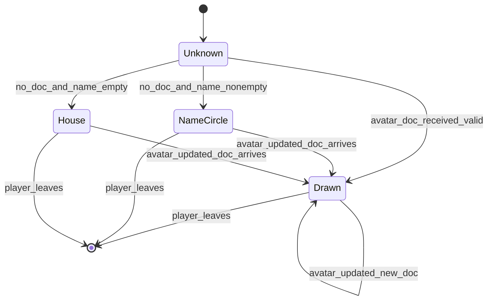

# Slice 11: Avatars
## Circular-canvas avatar editor, the three-step display fallback chain, roster avatar sync, and the shared AvatarChip component

**Version:** 1.0
**Last Updated:** 2026-07-04
**Dependencies:**
- Skeleton (`Save`, `Nav`, `Platform`, `Net`, EventBus, theme)
- Slice 1 (`DrawingCanvas` component incl. the circular-mask hook, `DrawingDoc`, `DocRasterizer`)
- Slice 2 — integration point only (roster/`PlayerState` sync owner gains avatar metadata; RPCs in §3 attach to the node that owns `rpc_sync_roster`)
- Slice 12 — stubbed (`Platform.get_display_name()` returns the dev name now, the Steam persona name once Slice 12 lands; no code change needed here)

**Provides:** Avatar editor screen (main menu), `user://avatar.json` persistence, `"avatar"` orientation for `DrawingDoc` (512×512 circular), avatar transmission via roster metadata + `avatar_updated` EventBus signal, `AvatarResolver` fallback chain, house avatar set (`res://` DrawingDocs), `ui/shared/avatar_chip.tscn` used by lobby/round/wrap-up screens

---

## 1. Overview

Players draw their own face. The avatar editor reuses the exact same drawing tools as the game canvas, but on a **circular** 512×512 canvas, accessed from the main menu (brief §6). The result is a normal `DrawingDoc` — stored locally at `user://avatar.json`, and sent to the host as roster metadata when joining a session so every peer can render it (kilobytes, like any drawing — brief §6 storage note, §14).

Displaying *any* player anywhere uses one **fallback chain** (brief §11):
1. Their drawn avatar (a synced `DrawingDoc`, rasterized + circle-masked locally on each peer).
2. A blank circle showing their platform display name (`Platform.get_display_name()` — dev name now, Steam username after Slice 12) in a clean theme font.
3. A random pre-drawn **house avatar** from a small set shipped as `res://` DrawingDocs — chosen deterministically from the player's stable id so all peers pick the same one with zero extra syncing.

This slice also ships the single shared component that renders that chain — `ui/shared/avatar_chip.tscn` — and retrofits it into the already-built lobby player list (Slice 2), in-round player displays (Slice 3), and wrap-up title cards / standings (Slice 10), replacing their plain name labels.

### Scope

**In Scope:**
- `&"avatar"` orientation added to `DrawingDoc` validation + `CANVAS_AVATAR := Vector2i(512, 512)` constant
- Circular mask mode of `DrawingCanvas` implemented and golden-tested (activating the Slice 1 hook: masked stamping, masked fill, circular display clip)
- Avatar editor screen: draw/edit, Save, Clear-avatar, live circular preview; rotate + save-to-collection controls hidden
- Persistence: `user://avatar.json` (plain DrawingDoc), corrupt-tolerant load
- Avatar sync: client sends its avatar doc after joining; host validates + rebroadcasts; snapshot to late joiners via the roster sync path
- `AvatarResolver` (fallback chain + deterministic house-avatar pick) and texture caching
- `AvatarChip` shared component + retrofit into lobby / round screens / wrap-up
- House avatar content: 6 pre-drawn DrawingDocs in `res://data/house_avatars/`

**Out of Scope (Other Slices / Later):**
- Steam persona names (Slice 12 swaps the `Platform` backend; the chain here just reads the facade)
- Avatar moderation/reporting (avatars are drawings; brief §13 accepts drawings as unmoderated, disclosed for public lobbies in Slice 13)
- Editing the avatar mid-session (editor is main-menu only; changes apply on next join — §10)
- Animated/replayed avatars (static raster only in v1; docs carry timestamps, so a "watch my avatar being drawn" flourish stays possible later)
- Avatar in Steam rich presence / overlays (post-v1)

### User Flows
1. **Create:** Main menu → Avatar → circular canvas → draw with brush/fill/undo/clear → Save → toast "Avatar saved"; menu shows the new avatar immediately.
2. **Be seen:** join a lobby → your avatar doc uploads to the host → everyone's lobby list shows your face; same chip follows you into rounds and the wrap-up.
3. **No avatar:** never drew one → others see a circle with your name; name unavailable too (edge) → one of the house doodles, consistently the same one everywhere.
4. **Remove:** editor → Clear avatar → confirm → `avatar.json` deleted → you're back to the name circle.

---

## 2. Data Models

### DrawingDoc: `"avatar"` orientation (extension of Slice 1 model)

No new drawing model — the avatar **is** a `DrawingDoc` (single canonical format, consistency guide §6). This slice extends the orientation domain:

| orientation | Internal resolution | Introduced by |
|-------------|--------------------|--------------|
| `"landscape"` | 800×600 | Slice 1 |
| `"portrait"` | 600×800 | Slice 1 |
| **`"avatar"`** | **512×512, circular mask** | **this slice** |

Changes in `game/drawing/drawing_doc.gd`: `from_dict` accepts `&"avatar"`; `canvas_size()` returns `GameConstants.CANVAS_AVATAR` for it. **No format version bump** — `"v": 1` is unchanged; orientation was always a string field and old readers never receive avatar docs through old code paths (avatar docs only flow through new Slice 11 surfaces).

Serialized example (`user://avatar.json` and the wire payload are byte-identical in shape):

```json
{
  "v": 1,
  "orientation": "avatar",
  "ops": [
    {"t": "fill", "c": 17, "x": 256, "y": 256},
    {"t": "stroke", "c": 4, "s": 2, "pts": [180.0,210.5, 181.2,212.0], "ts": [0.0, 0.033]}
  ]
}
```

### PlayerState extension (Slice 2 model, extended here)

**File: `game/session/roster.gd` (PlayerState inner class / companion)**

```gdscript
# Appended to PlayerState:
var avatar_doc: Dictionary = {}   # validated, serialized DrawingDoc; {} = none.
                                  # Kept as Dictionary (not DrawingDoc) on the roster:
                                  # it is relay data — host validates but never rasterizes.
```

### AvatarResolver resolution result

**File: `game/avatars/avatar_resolver.gd`**

```gdscript
class_name AvatarResolver
extends RefCounted

enum Kind { DRAWN, NAME_CIRCLE, HOUSE }

class Resolved:
    var kind: Kind
    var doc: DrawingDoc        # DRAWN and HOUSE; null for NAME_CIRCLE
    var display_name: String   # always set (tooltip everywhere; circle text for NAME_CIRCLE)
```

### Constants added

| Constant | File | Value | Rationale |
|----------|------|-------|-----------|
| `CANVAS_AVATAR` | `game_constants.gd` | `Vector2i(512, 512)` | fixed internal avatar resolution |
| `AVATAR_DOC_MAX_BYTES` | `game_constants.gd` | `32768` | wire/validation cap; typical avatar ≪ 10 KB |
| `AVATAR_MAX_OPS` | `game_constants.gd` | `512` | hostile-doc sanity cap (host-side) |
| `HOUSE_AVATAR_COUNT` | `game_constants.gd` | `6` | size of shipped set |
| `HOUSE_AVATAR_DIR` | `game_constants.gd` | `"res://data/house_avatars/"` | content location (`house_00.json` … `house_05.json`) |

---

## 3. Event/Action Definitions

### RPCs

Networking applies here (avatar docs travel to/from the host), so this slice documents RPCs per consistency guide §4. Both methods attach to **the session node that owns `rpc_sync_roster`** (established in Slice 2 — the persistent lobby/session controller; Slice 11 appends methods, it does not create a new networked node).

| RPC | Direction | Args | Validation | Effect |
|-----|-----------|------|------------|--------|
| `rpc_request_set_avatar` | client → host (`@rpc("any_peer", "call_remote", "reliable")`) | `avatar_doc: Dictionary` | (1) host authority check; (2) sender resolves to a roster entry; (3) serialized size ≤ `AVATAR_DOC_MAX_BYTES`; (4) `DrawingDoc.from_dict` non-null; (5) `orientation == &"avatar"`; (6) `ops.size() <= AVATAR_MAX_OPS`. Any failure → **drop silently** (consistency guide §4) | Host stores the dict on `PlayerState.avatar_doc`, then broadcasts `rpc_sync_avatar` to all peers |
| `rpc_sync_avatar` | host → all (`@rpc("authority", "call_local", "reliable")`) | `peer_id: int, avatar_doc: Dictionary` | Clients re-run `DrawingDoc.from_dict` locally before rasterizing (defense in depth — never rasterize unvalidated data even from the host) | Each peer updates its roster copy and emits `EventBus.avatar_updated(peer_id)`; chips re-render |

**Roster snapshot integration point (late join / initial join):** Slice 2's roster snapshot payload (the dictionary sent by `rpc_sync_roster` per player) gains one optional key: `"avatar": Dictionary` (omitted when empty, keeping the snapshot small). Receivers treat it exactly like an `rpc_sync_avatar` for that peer. This is the single place Slice 2's wire format is touched; note it in Slice 2's implementation notes when retrofitting.

**Send trigger (client side):** after the client's own roster entry is confirmed (Slice 2's joined/accepted signal), the client loads `user://avatar.json`; if a valid doc exists, it calls `rpc_request_set_avatar` once. No avatar → no call (absence means fallback; nothing to sync). Host player sets its own `PlayerState.avatar_doc` directly and broadcasts the same `rpc_sync_avatar` (host is also a player).

Host validation snippet (the 5-step pattern, consistency guide §4):

```gdscript
@rpc("any_peer", "call_remote", "reliable")
func rpc_request_set_avatar(avatar_doc: Dictionary) -> void:
    if not multiplayer.is_server():
        return
    var sender: int = multiplayer.get_remote_sender_id()
    var player: PlayerState = roster.get_by_peer(sender)
    if player == null:
        return
    if var_to_bytes(avatar_doc).size() > GameConstants.AVATAR_DOC_MAX_BYTES:
        return
    var doc: DrawingDoc = DrawingDoc.from_dict(avatar_doc)
    if doc == null or doc.orientation != &"avatar" or doc.ops.size() > GameConstants.AVATAR_MAX_OPS:
        return
    player.avatar_doc = avatar_doc
    rpc_sync_avatar.rpc(sender, avatar_doc)
```

### EventBus additions (`core/events/event_bus.gd`)

```gdscript
## Emitted on every peer when a player's avatar arrives or changes
## (rpc_sync_avatar or roster snapshot). peer_id may be the local player.
signal avatar_updated(peer_id: int)

## Emitted locally when the local player's avatar file is saved or cleared
## in the editor. Menu-screen chip refresh; no network implications.
signal local_avatar_changed()
```

### Local signals

| Owner | Signal | Params | Emitted when |
|-------|--------|--------|--------------|
| `AvatarEditorScreen` | `avatar_saved` | `()` | Save succeeded (drives toast + menu refresh via `local_avatar_changed`) |
| `AvatarChip` | *(none — display-only component)* | | |

---

## 4. Storage Schema Extensions

### `user://avatar.json` (new — this slice)

Exactly one `DrawingDoc` with `orientation: "avatar"` (§2 example). Written atomically via `Save.write_json("avatar.json", doc.to_dict())`; deleted by Clear-avatar (`Save.delete`). Already anticipated by the consistency guide §6 save tree.

| Property | Value |
|----------|-------|
| Read | `Save.read_json("avatar.json", {})` → `DrawingDoc.from_dict` → null ⇒ treated as "no avatar" (+ warning if the file existed but was invalid) |
| Empty-ops doc | **Never written** — Save is disabled until the doc has ≥ 1 op (§6 rule 3), so an existing file always contains a drawing |
| Version | Standard DrawingDoc `"v": 1` rules (Slice 1 §4) |

### `res://data/house_avatars/house_00.json` … `house_05.json` (new — shipped content, not user data)

Six hand-drawn avatar DrawingDocs (drawn in the finished editor by the developer, exported verbatim). Loaded read-only at first use, parsed with the same `DrawingDoc.from_dict` (a malformed shipped file is a `push_error` + skip — the resolver then has a smaller set; count sanity is unit-tested so this never ships).

### `user://profile.json`

**No change.** The save tree comment ("avatar meta") is satisfied by `avatar.json` itself — presence of the file *is* the meta. Avoid duplicated state that can desynchronize.

**Migrations:** none. New file locations only; absence of `avatar.json` is the ordinary "no avatar" state.

---

## 5. State Machines

The editor reuses the Slice 1 canvas input state machine unchanged. The slice-specific machine is the per-player avatar **display source** on each peer:



### States

| State | Description | Terminal? |
|-------|-------------|-----------|
| Unknown | Roster entry exists, resolution not yet run (one frame at most) | No |
| Drawn | Valid doc on the roster → rasterized circle-masked texture | No |
| NameCircle | No doc; display name non-empty → blank circle + name text | No |
| House | No doc, no name → deterministic house avatar | No |

### Transition Rules

| Current | Trigger | New | Validation | Side Effects |
|---------|---------|-----|------------|--------------|
| Unknown | resolver runs on roster entry | Drawn / NameCircle / House | local `from_dict` re-validation for Drawn | chip texture built + cached |
| NameCircle / House | `avatar_updated(peer_id)` with valid doc | Drawn | same | cache entry replaced; chips listening for that peer re-render |
| Drawn | `avatar_updated(peer_id)` (player re-sent — not possible mid-session in v1, kept for forward-compat) | Drawn | same | texture rebuilt |
| any | player leaves roster | — | — | chip freed by its owning list; cache entry evicted lazily (LRU) |

Downgrades (Drawn → NameCircle) never occur mid-session: the host has no "clear avatar" request in v1 (clearing applies at next join).

---

## 6. Business Logic

### AvatarResolver

**File: `game/avatars/avatar_resolver.gd`** (headless-testable; zero UI references — consistency guide §3 rule)

```gdscript
class_name AvatarResolver
extends RefCounted

## Resolves the display source for one player. avatar_doc: {} means none.
## display_name: from the roster (fed by Platform.get_display_name() at join —
## dev names now, Steam persona names once Slice 12 swaps the backend; this
## code never changes for that). platform_id: stable per-install id used for
## the deterministic house pick.
static func resolve(avatar_doc: Dictionary, display_name: String, platform_id: String) -> Resolved

## Deterministic house pick: hash(platform_id) % HOUSE_AVATAR_COUNT.
## Every peer computes the same index for the same player — no sync needed.
## Falls back to hash of display_name if platform_id is empty (dev edge).
static func house_index_for(platform_id: String) -> int

## Loads + caches the parsed house docs (lazy, once per run).
static func get_house_doc(index: int) -> DrawingDoc
```

**Business rules:**
1. Chain order is fixed: drawn → name circle → house (brief §11). A *valid* doc always wins; an invalid doc is identical to no doc.
2. Resolution is pure and local — no RPCs, no awaits; safe to call every time a chip binds.
3. **Empty docs are not avatars:** the editor refuses to save a zero-op doc (Save disabled), and the resolver treats a zero-op doc as none. Prevents accidental invisible/blank avatars.
4. House pick uses the **stable platform id**, not peer id — the same player gets the same house doodle across sessions and on every peer, and rejoin doesn't reshuffle their face.

### AvatarTextureCache

**File: `ui/shared/avatar_texture_cache.gd`** (static helper used by `AvatarChip`; UI-side because it produces textures)

```gdscript
class_name AvatarTextureCache
## Rasterize-once cache: key = hash of the serialized doc (or "house:<i>"),
## value = circle-masked ImageTexture at 512x512 (chips downscale via
## TextureRect). Small LRU (16 entries — max 8 players + house set).
static func get_texture(doc: DrawingDoc) -> ImageTexture
```

Pipeline: `DocRasterizer.rasterize(doc)` (512×512, mask applied during raster — Slice 1 hook, so fills can't leak outside the circle) → set alpha 0 outside the circle (display mask; same circle equation as the raster mask) → `ImageTexture`. One raster per unique doc per session; chips are cheap after that.

### Circular mask implementation (completing the Slice 1 hook)

**Files: `game/drawing/doc_rasterizer.gd` (mask honored), `ui/canvas/drawing_canvas.gd` (`MaskMode.CIRCLE`)**

- Mask image: 512×512, pixel inside iff `(x - 255.5)^2 + (y - 255.5)^2 <= 256^2` — one canonical constant-driven equation used by stamping, fill boundary, input clamping, and display alpha. Precomputed once.
- **Stamps:** pixels where mask is outside are not written.
- **Fill:** outside-mask pixels are treated as boundary (never enqueued, never recolored) — a fill seeded inside floods at most the circle; a fill op whose seed lies outside the mask is a validated-out impossibility from our editor but a no-op if it arrives in a doc (host validation only checks canvas bounds; determinism preserved because the rule is fixed).
- **Input:** pointer positions outside the circle clamp to the nearest in-circle point while stroking; clicks outside with fill tool are ignored.
- **Display:** the canvas TextureRect shows the masked raster over a theme-colored circle backing so the corners read as "not canvas".
- Golden tests at 512×512 (§11) — this is where the Slice 1 mask parameters earn their keep.

### Editor persistence logic

**File: `ui/avatars/avatar_editor_screen.gd`**

```gdscript
func _on_save_pressed() -> void:
    var doc: DrawingDoc = _canvas.get_doc()
    if doc.ops.is_empty():
        return                                   # button is disabled anyway; belt-and-braces
    if Save.write_json("avatar.json", doc.to_dict()) == OK:
        EventBus.local_avatar_changed.emit()
        _toast.show("Avatar saved")
    else:
        _toast.show_error("Couldn't save your avatar.")

func _on_clear_avatar_confirmed() -> void:
    Save.delete("avatar.json")
    _canvas.begin_drawing()                      # fresh circle
    EventBus.local_avatar_changed.emit()
```

Editor load: existing valid `avatar.json` → `_canvas.load_doc(doc)` so the player edits on top of their current avatar (ops append after the loaded ones — the doc keeps growing; acceptable v1, size cap warns via a "getting complex" toast at 80% of `AVATAR_MAX_OPS`).

---

## 7. UI Components

### Avatar Editor Screen

**Files: `ui/avatars/avatar_editor_screen.tscn` + `ui/avatars/avatar_editor_screen.gd`**
**Route:** `Routes.AVATAR_EDITOR`; "Avatar" button on the main menu (`ui/menu/main_menu_screen.tscn`) whose icon *is* the local player's current chip.

**Layout:**
```
+---------------------------------------------------+
| [< Back]        Draw your face                    |
+---------------------------------------------------+
|   [sizes][brush|fill][undo][clear]     (toolbar)  |
|                                                   |
|                .-----------.                      |
|              /               \    circular        |
|             |     canvas      |   512x512         |
|              \               /    letterboxed     |
|                '-----------'                      |
|                                                   |
|   [12-family palette row + shade expand]          |
+---------------------------------------------------+
|      [Clear avatar]                   [Save]      |
+---------------------------------------------------+
```

Embeds `DrawingCanvas` with: `mask_mode = CIRCLE`, internal size `CANVAS_AVATAR`, `show_rotate = false` (orientation is fixed), `show_save_toggle = false` (collection saving is a round concept). Same brush/fill/undo/clear tools — zero new tool code (brief §6: "the avatar editor reuses the exact same tools").

**User Interactions:**
| Action | Trigger | Result |
|--------|---------|--------|
| Draw/fill/undo/clear | as Slice 1 | ops on the avatar doc; strokes/fills clipped to the circle |
| Save | Save button (disabled while doc empty) | writes `avatar.json`, toast, `local_avatar_changed` |
| Clear avatar | Clear-avatar button → `ConfirmDialog` ("Remove your avatar? You'll show as your name instead.") | deletes file, resets canvas |
| Back | Back / Esc | `Nav.goto(Routes.MENU)`; **unsaved changes prompt** via `ConfirmDialog` if doc differs from last save |

### AvatarChip Component (shared)

**Files: `ui/shared/avatar_chip.tscn` + `ui/shared/avatar_chip.gd`**

**Purpose:** the one and only way any screen renders a player identity. Circle avatar (or fallback) + optional name label beside it.

**Props/Inputs:**
```gdscript
@export var chip_size: int = 48                 # px diameter; lobby 48, in-round 32, wrap-up 96
@export var show_name_label: bool = true        # name text beside the circle (off for tight in-round layouts)

## Bind from a roster entry (or raw values for wrap-up cards after session end).
func set_player(display_name: String, platform_id: String, avatar_doc: Dictionary) -> void
func set_peer(peer_id: int) -> void             # roster lookup + auto-refresh on EventBus.avatar_updated
```

**Behavior:**
- `DRAWN`/`HOUSE`: circle-masked texture from `AvatarTextureCache`, downscaled to `chip_size`.
- `NAME_CIRCLE`: theme-styled filled circle; text = display name auto-shrunk to fit, but below 48 px the circle shows the name's first two characters and the full name moves to the tooltip/label (a 9-character Steam name in a 32 px circle is noise, not identity — decision recorded for review).
- Tooltip always carries the full display name (also satisfies "don't rely on color/art alone", consistency guide §13).
- Subscribes to `EventBus.avatar_updated` only in `set_peer` mode; `set_player` mode is static (wrap-up uses end-of-game snapshot data).

**Retrofit targets (this slice edits these existing scenes):**
| Screen | Owner slice | Change |
|--------|-------------|--------|
| Lobby player list | 2 | name `Label` → `AvatarChip` (48 px, name on) |
| In-round roster strip / judge indicator | 3 | judge + player markers get chips (32 px, name off, tooltip on) |
| Reveal/judging grid | 3/5 | **no change** — drawings stay anonymous during rounds (brief §4); chips must NOT appear next to unjudged drawings |
| Wrap-up title cards + standings | 10 | chips (96 px on title cards, 48 px in standings) |
| Main menu | 0 | Avatar button shows the local chip |

### User Confirmation Checkpoints

**Blocking:**
- [ ] **Avatar sync across two instances** (draw avatar on instance A → both instances' lobby lists show it; instance B with no avatar shows name circle on both): the retrofit into round/wrap-up screens builds on this working, and it's the slice's only networked behavior.

**Batchable (queue for slice completion):**
- [ ] Drawing feel inside the circle (edge clamping doesn't fight the cursor)
- [ ] Fill stays inside the circle, including fills seeded near the rim
- [ ] Name-circle legibility at 32/48/96 px; two-character fallback feels right
- [ ] House avatars look intentional, and the same player always gets the same one
- [ ] Editor: load-existing-avatar, unsaved-changes prompt, Clear-avatar flow
- [ ] Chips in lobby/round/wrap-up sit well at their sizes; no anonymity leak on reveal/judging screens

---

## 8. State Management

**No new autoloads.** Avatar state lives in three places with clear ownership (consistency guide §5/§8):

| State | Owner | Sync |
|-------|-------|------|
| Local player's avatar doc | `user://avatar.json` via `Save` | read at editor open + at session join (send trigger, §3) |
| Every session player's `avatar_doc` | Roster (`PlayerState`, Slice 2 structure) — host-authoritative copy, replicated to peers | `rpc_sync_avatar` + roster snapshot |
| Rendered textures | `AvatarTextureCache` (static LRU, UI side) | derived; evict on overflow |

**Signal flow:**
```
join accepted ──> client reads avatar.json ──> rpc_request_set_avatar ──> host validates
      ┌──────────────────────────────────────────────────────────────────────┘
      └──> rpc_sync_avatar(peer_id, doc) ──> roster updated on each peer
                                          └──> EventBus.avatar_updated(peer_id)
                                                    └──> AvatarChips re-bind (set_peer mode)
editor Save/Clear ──> EventBus.local_avatar_changed ──> main-menu chip refreshes
```

Chips never poll; they render on bind and on the two EventBus signals. Simulation code (`game/`) never touches textures — `AvatarResolver` returns docs/kinds, the UI-side cache turns them into pixels (headless-testability preserved).

---

## 9. Integration Points

### Dependencies (What This Slice Needs)

#### From Skeleton
- `Platform.get_display_name()` / `get_platform_id()` — fallback #2 text and house-pick seed. **Slice 12 stub note:** today these return the dev `--name` arg / profile id; when Slice 12 lands the Steam backend returns the Steam persona name and SteamID — the chain picks up Steam names with **zero changes to this slice** (that is the whole point of the `Platform` facade)
- `Save` (avatar.json), `Nav`/`Routes` (editor route), EventBus, theme, `ui/shared/toast.tscn`

#### From Slice 1
- `DrawingCanvas` with `mask_mode`, `show_rotate`/`show_save_toggle` exports; `DrawingDoc` (+ orientation extension point), `DocRasterizer` mask parameter, `ConfirmDialog`

#### From Slice 2 (integration point)
- Roster/`PlayerState` + the session node owning `rpc_sync_roster`: gains `avatar_doc` field, the two RPCs (§3), and the optional `"avatar"` snapshot key. Also the "join accepted" signal used as the send trigger

#### From Slices 3 / 10 (retrofit surfaces)
- Existing player-list/judge-indicator/wrap-up scenes replace name labels with `AvatarChip` (§7 table)

### Provides (What This Slice Offers)

#### For Future Slices
- **`AvatarChip`** — any future surface showing a player (spectator lists, Slice 13 lobby browser rows showing host avatar) uses this; never re-implement the fallback chain
- **`avatar_updated(peer_id)`** — anything player-visual can refresh on it
- **`"avatar"` orientation + 512×512 circular raster path** — reusable for any future circular drawing surface
- **House avatar set** — Slice 13 could show them for placeholder/anonymized contexts

### Integration Checklist
- [ ] Constants added (`CANVAS_AVATAR`, caps, house dir/count)
- [ ] EventBus: `avatar_updated`, `local_avatar_changed` declared with doc comments
- [ ] RPCs added to the Slice 2 session node per §4 conventions; documented here (§3)
- [ ] Save schema: `user://avatar.json` live; consistency guide §6 tree already lists it
- [ ] `Routes.AVATAR_EDITOR` registered; main menu button wired
- [ ] Roster snapshot `"avatar"` key noted in Slice 2 implementation notes
- [ ] Tests mirror-pathed (`tests/game/avatars/`, `tests/ui/avatars/`, `tests/ui/shared/`)

---

## 10. Edge Cases

### Corrupt `avatar.json`
**Scenario:** truncated/hand-edited file, or a future-version doc from a newer build.
**Handling:** `from_dict` → null → treated as "no avatar" everywhere (editor opens blank, nothing is sent on join) + one `push_warning`. File is left untouched (a newer-version doc must survive a downgrade round-trip).
**Rationale:** consistency guide §6/§7 — never crash on bad saves, never destroy data we merely failed to read.

### Oversized or hostile avatar doc from a peer
**Scenario:** modified client sends a 5 MB doc, 10k ops, out-of-range palette indices, or `orientation: "landscape"`.
**Handling:** host validation (§3) drops it silently — no sync, no error to the sender. Other peers simply see that player's fallback. Receiving clients *also* re-validate before rasterizing (defense in depth).
**Rationale:** brief §13 — untrusted input, silent drop; a griefer gets nothing observable to iterate against.

### Player with drawn avatar rejected by host
**Scenario:** the local player's own doc failed host validation (e.g., built by an older/newer client).
**Handling:** the local player still sees their avatar locally in the menu (local file is fine), but in-session all peers — including themselves — render from roster state, which has no doc → name circle. In-session self-view uses roster data precisely so the player sees what others see.
**Rationale:** rendering self from local state would hide the desync; honest mirrors beat flattering ones.

### Empty display name AND no avatar
**Scenario:** fallback #2 has no text (empty `Platform.get_display_name()` — misconfigured dev run; defensive for Steam edge).
**Handling:** fallback #3, deterministic house pick seeded by platform id (or name-hash fallback if that's also empty — then effectively random but stable per run).
**Rationale:** brief §11 chain, made deterministic so all peers agree without a sync message.

### Duplicate display names / same platform id twice
**Scenario:** two dev instances launched without `--name`, both "Dev-1234"-ish, or copied profiles.
**Handling:** chips render identical name circles/house picks — cosmetic collision only; identity everywhere else is peer id. No dedup logic.
**Rationale:** dev-only oddity; Steam ids are unique in shipping builds.

### Editing the avatar mid-session
**Scenario:** player wants a new face during a game.
**Handling:** impossible by construction — the editor is a main-menu route and `Nav` never offers the menu mid-session. The avatar shown in a session is the one held at join; changes apply at the next join. (Re-send-on-change is forward-compatible: the `Drawn → Drawn` transition in §5 already tolerates it.)
**Rationale:** keeps mid-round identity stable for the judge/reveal flow; v1 simplicity.

### Late joiner and avatar timing
**Scenario:** player joins mid-game (Slice 9 flow) — do they see existing avatars, and vice versa?
**Handling:** both directions covered by design: the roster snapshot carries everyone's `"avatar"` docs to the joiner; the joiner's own `rpc_request_set_avatar` fires after acceptance and broadcasts to everyone.
**Rationale:** avatar transport rides the roster path; no separate late-join case to maintain.

### Anonymity during reveal/judging
**Scenario:** chips next to drawings would deanonymize the reveal (brief §4: drawings are shown anonymously).
**Handling:** hard rule in §7 — no `AvatarChip` in reveal/judging drawing grids. Chips appear only in roster strips, lobby, resolution (winner announcement *after* the pick is public), and wrap-up.
**Rationale:** the comedy depends on guessing who drew what.

### House avatar content failure
**Scenario:** a `house_XX.json` is malformed after an asset edit.
**Handling:** `push_error` + skip at load; `house_index_for` modulos over the *loaded* count. Unit test asserts all 6 parse, so CI catches it pre-ship.
**Rationale:** shipped-content bugs should scream in dev and degrade in prod.

### Performance Considerations
- One 512×512 raster per unique avatar per session (≤ 8 players + up to 6 house docs), cached — negligible.
- Avatar docs add ≤ 32 KB per player to join traffic (typical ≤ 10 KB) — well within the "drawings are kilobytes" budget (brief §6).
- Chip rebinding on `avatar_updated` touches only chips bound to that peer id.

---

## 11. Testing Strategy

Per `workflows/testing-protocol.md`; the multi-instance sync test is the blocking gate (§7).

### Unit Tests

**Location:** `tests/game/avatars/`, `tests/game/drawing/` (mask), `tests/game/session/` (validation)

#### Resolver (`test_avatar_resolver.gd`)
- [ ] Valid doc → `DRAWN` (doc passed through); empty dict → name path; invalid dict → name path (identical to none)
- [ ] Zero-op doc → treated as none (rule 3)
- [ ] Empty name + no doc → `HOUSE`; `house_index_for` deterministic (same input → same index; distributes across `[0, count)`)
- [ ] Empty platform id falls back to name hash; both empty → still returns a valid index
- [ ] All shipped house docs parse, count == `HOUSE_AVATAR_COUNT`, all `orientation == &"avatar"`

#### Circular mask goldens (`test_doc_rasterizer.gd` — extend Slice 1 suite)
- [ ] Golden hashes at 512×512: stroke crossing the rim (clipped exactly); fill seeded center (fills circle only); fill seeded near rim (no leak); full-canvas fill == perfect masked disc
- [ ] Mask determinism: serialize → parse → raster hash identical to live raster hash
- [ ] Corner pixels remain background/alpha in every golden

#### DrawingDoc orientation extension (`test_drawing_doc.gd` — extend)
- [ ] `"avatar"` accepted; `canvas_size()` == 512×512; fill seed bounds validated against 512×512
- [ ] Unknown orientation still rejected (regression)

#### Host validation (`test_avatar_validation.gd` — validator tested as a plain function, no live network, consistency guide §9)
- [ ] Accepts a typical valid avatar doc
- [ ] Rejects: oversize payload, `orientation != "avatar"`, ops > `AVATAR_MAX_OPS`, malformed doc, unknown sender (null roster entry) — each drops without error/mutation

### Integration Tests
- [ ] Editor logic headless: save writes valid `avatar.json`; reload → `load_doc` round-trip; clear deletes; save disabled on empty doc; corrupt existing file → opens blank + warning
- [ ] Roster flow (in-process, two fake peers): snapshot with `"avatar"` key populates `PlayerState.avatar_doc`; `avatar_updated` emitted with the right peer id

### UI/Component Tests
- [ ] Scene smoke: `avatar_editor_screen.tscn`, `avatar_chip.tscn` instantiate clean
- [ ] `AvatarChip.set_player` renders each of the three kinds without error at 32/48/96 px
- [ ] Chip in `set_peer` mode re-renders on `EventBus.avatar_updated` for its peer only

### Manual Testing Required
- [ ] **Blocking:** two-instance avatar sync (§7) — drawn avatar propagates; no-avatar peer shows name circle on both instances
- [ ] Batchable list in §7 (circle drawing feel, rim fills, name-circle legibility, house consistency, retrofit placements, anonymity check on reveal screens)

---

## 12. Implementation Checklist

### Setup
- [ ] Constants (§2 table) in `game_constants.gd`; `Routes.AVATAR_EDITOR`
- [ ] EventBus signals `avatar_updated` / `local_avatar_changed` with doc comments
- [ ] Create `game/avatars/`, `ui/avatars/`, `res://data/house_avatars/` folders

### Data Layer
- [ ] `DrawingDoc`: accept `&"avatar"`, `canvas_size()` mapping, bounds validation vs 512×512 (+ tests)
- [ ] `PlayerState.avatar_doc` field on the roster

### Circular mask (completes Slice 1 hook)
- [ ] Canonical circle-mask image + equation constants; `DocRasterizer` honors mask for stamps and fill boundary
- [ ] `DrawingCanvas` `MaskMode.CIRCLE`: input clamping, display clip, 512×512 SubViewport sizing
- [ ] Mask golden tests green (rim stroke, center/rim fills, round-trip hash)

### Business Logic
- [ ] `AvatarResolver` (+ house doc loader) with full unit suite
- [ ] `AvatarTextureCache` (hash-keyed LRU, circle alpha)
- [ ] Host validator + `rpc_request_set_avatar` / `rpc_sync_avatar` on the Slice 2 session node; roster snapshot `"avatar"` key; client send trigger on join-accepted
- [ ] Validation tests green (plain-function level)

### UI Layer
- [ ] `AvatarEditorScreen`: embedded masked canvas (rotate/save-toggle hidden), Save/Clear-avatar (+ confirms), load-existing, unsaved-changes prompt, toasts
- [ ] `AvatarChip`: three render kinds, sizes, tooltip, `set_peer` auto-refresh
- [ ] Main menu: Avatar button with live local chip (`local_avatar_changed` refresh)
- [ ] Retrofits: lobby list, in-round roster strip/judge indicator, wrap-up cards + standings (per §7 table); verify reveal/judging grids remain chip-free

### Content
- [ ] Draw + ship 6 house avatars as `house_00.json` … `house_05.json` (made in the finished editor); content parse test green

### Testing
- [ ] Full suite green including extended Slice 1 suites; no regressions in Slices 1–10 tests

### User Confirmation
- [ ] **Blocking:** two-instance avatar sync confirmed
- [ ] Batchable checklist presented and confirmed (§7)
- [ ] User confirms slice complete

### Documentation
- [ ] Update WHERE_WE_ARE; Implementation Notes for Slice 11
- [ ] Slice 2 implementation notes annotated (roster snapshot `"avatar"` key, RPC additions)
- [ ] Decision Log: name-circle two-character small-size fallback; deterministic house pick via platform-id hash; mid-session edit deferral
