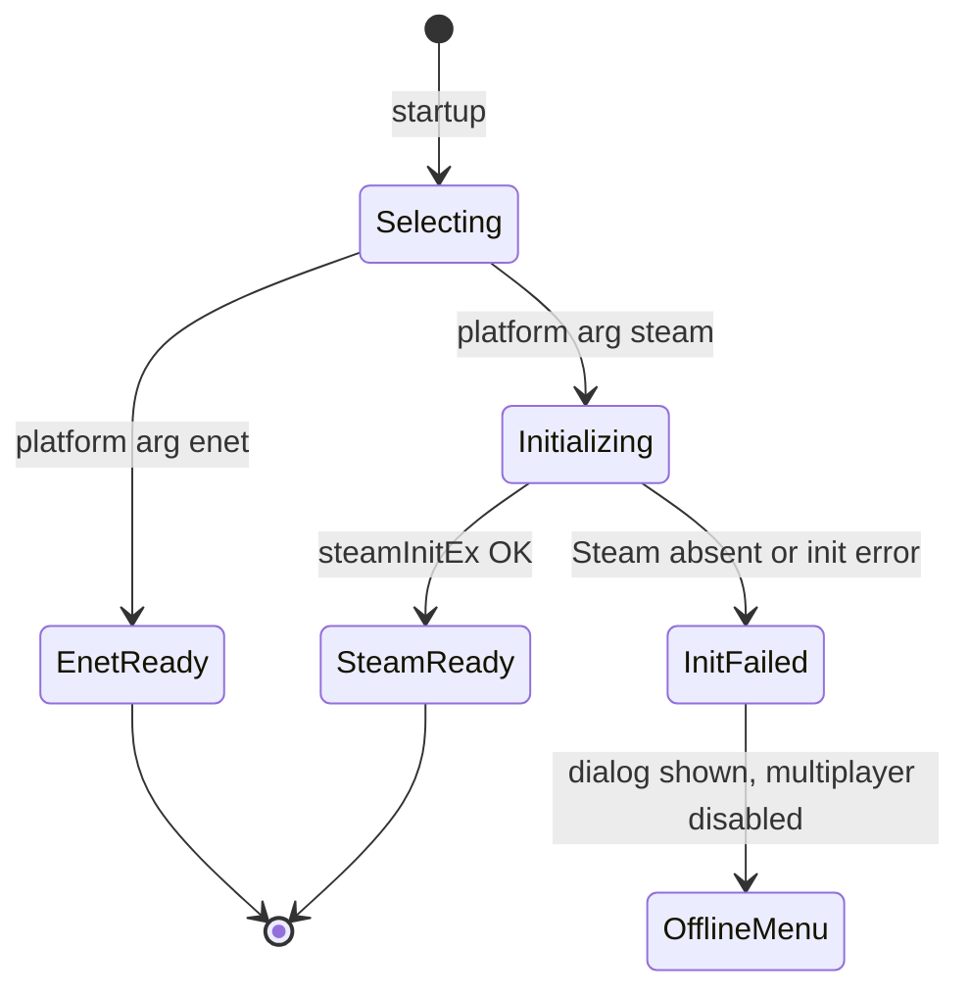
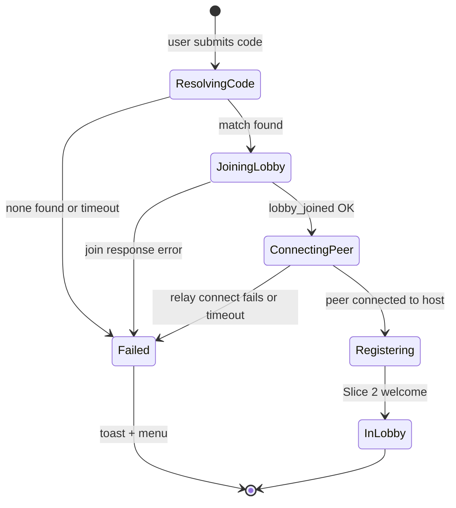

# Slice 12: Steam Platform Integration
## GodotSteam backend — identity, SDR relay transport, lobbies as room codes, invites, stats init

**Version:** 1.0
**Last Updated:** 2026-07-04
**Dependencies:**
- Slice 2 (lobby/registration flow, room-code display, `Session` handshake — reused unchanged over the new transport)
- Slice 3 (running game to verify end-to-end over Steam)
- Skeleton (PlatformService seam: `PlatformBackend`, `Platform` autoload, `Net`, backend selection via `--platform=`)
**Provides:** `SteamBackend` (identity + transport), Steam lobby ↔ room-code mapping, lobby metadata schema (consumed by Slice 13's browser), invite-to-game + join-from-friend, relay (SDR) networking with hidden IPs (§13), stats/achievements API initialization (definitions in Slice 14), init-failure fallback

---

## 1. Overview

This slice swaps the platform seam from the ENet dev backend to Steam for shipped builds (§2). Because Slices 2–11 were built against `PlatformBackend` + `Net`, this is an identity and transport substitution: Steam names/IDs flow into the existing roster, `SteamMultiplayerPeer` (GodotSteam GDExtension) replaces ENet beneath the same RPCs, and Steam lobbies become the carrier for room codes and invites. Relay networking (SDR) is what `SteamMultiplayerPeer` provides — peers connect via Valve's relays, so players' IPs stay hidden (§13).

**ENet remains the default dev/test path** (`--platform=enet`); all existing workflows (`tools/dev_run.sh`, multi-instance testing) are unchanged.

### Scope

**In Scope:**
- Install **GodotSteam GDExtension** into `addons/godotsteam` (no custom engine build), vendored/committed per skeleton policy
- Dev **App ID 480** (Spacewar): `steam_appid.txt` in dev; documented swap procedure for the real App ID (executed in Slice 15)
- `SteamBackend : PlatformBackend`: init, `get_display_name()`/`get_platform_id()` (Steam persona name / SteamID64), `create_host_peer`/`create_client_peer` via `SteamMultiplayerPeer` + Steam lobbies
- **Room codes on Steam:** generate a 5-char human code, store as lobby metadata; join-by-code = lobby search filtered on that metadata key
- **Lobby metadata schema** (mode, player counts, rounds, draw time, pool type, public flag, version) — defined now, consumed by Slice 13's browser
- **Steam invites:** invite-to-game via the overlay; join-from-friend / rich-presence connect string → resolves to lobby join (both cold-launch and while-running)
- Steamworks **stats/achievements API initialization only** (definitions + unlock wiring are Slice 14)
- Edge cases: Steam not running, init failure (error dialog + offline-multiplayer menu), lobby join failures

**Out of Scope (Later Slices):**
- Public lobby **browser UI**, filters, join list; kick/blocklist; 18+ notice (Slice 13 — it reads the metadata schema defined here)
- Achievement/stat **definitions** and unlock logic (Slice 14)
- Real App ID, depots, store assets, signing (Slice 15)
- Voice, Steam Cloud saves, Workshop — not in v1 at all
- Any change to gameplay RPCs (none needed — transport swap only)

### User Flows

1. **Host (Steam):** Main menu → Host → lobby created on Steam → lobby screen shows code `PYGMY` → friends join by code or invite.
2. **Join by code:** friend types `PYGMY` → lobby search finds it → joins Steam lobby → connects to host peer via relay → Slice 2 registration runs exactly as on ENet.
3. **Invite:** host clicks Invite → Steam overlay friend picker → friend accepts → their running game (or freshly launched game) resolves the lobby and joins.
4. **Join via friends list:** player right-clicks a friend in Steam → "Join Game" → rich presence connect string launches/routes into the same join flow.
5. **Steam down:** game launched without Steam running → friendly dialog → menu with multiplayer disabled (collection/avatar editor still work).

---

## 2. Data Models

### SteamBackend

**File: `res://core/platform/steam_backend.gd`** (skeleton stub filled in)

```gdscript
class_name SteamBackend
extends PlatformBackend

const APP_ID: int = 480   # Spacewar (dev). Real App ID swap: Slice 15 (see §9 notes).

var _lobby_id: int = 0
var _room_code: String = ""
var _init_ok: bool = false
```

### Room codes

- **Alphabet:** `23456789ABCDEFGHJKMNPQRSTUVWXYZ` (no `0/O/1/I/L` ambiguity), length 5 → ~33.5M combinations.
- Generated host-side at lobby creation (`RoomCode.generate()` in `core/util/room_code.gd`), stored as lobby metadata `aq_code`, displayed by the existing Slice 2 lobby screen (which already renders whatever code `Platform` reports — zero UI change).
- Join-by-code = Steam lobby-list request with a string filter on `aq_code` (+ `aq_proto` — see Edge Cases for collisions/version mismatches).

### Lobby metadata schema (contract for Slice 13's browser)

Written by the host at lobby creation and kept current on settings changes (`Steam.setLobbyData`). All values are strings (Steam metadata is string-only).

| Key | Example | Written when | Meaning |
|-----|---------|--------------|---------|
| `aq_proto` | `"1"` | create | Network/protocol version (`NetIds.PROTOCOL_VERSION`); joiners and searches must match exactly |
| `aq_code` | `"PYGMY"` | create | 5-char room code (search key) |
| `aq_name` | `"Alice's game"` | create | Display label: `"<host name>'s game"`, TextFilter-censored |
| `aq_mode` | `"default"` | create + settings change | Mode id: `default` / `streamlined` / `social` / `custom` (Slice 6 enum names, lowercase) |
| `aq_players` | `"4"` | roster change | Current **connected** player count (browser column, §12) |
| `aq_max_players` | `"8"` | create | Always `GameConstants.MAX_PLAYERS` |
| `aq_rounds` | `"12"` | create + settings change | Round count setting |
| `aq_draw_time` | `"45"` | create + settings change | Draw time in whole seconds |
| `aq_pool_type` | `"builtin"` | create + settings change | `builtin` / `player` (§12 "prompt-pool type" browser column) |
| `aq_public` | `"0"` | create + settings change | `"1"` = list in Slice 13's browser; `"0"` = hidden from it (still code/invite-joinable) |
| `aq_state` | `"lobby"` | phase change | `lobby` / `ingame` — browser shows joinable-in-progress state; late join (Slice 9) permits `ingame` joins |

**Lobby type note (important):** Steam lobby search only finds lobbies created as `LOBBY_TYPE_PUBLIC`. Therefore **all** lobbies are created Steam-`PUBLIC`; "private" in Animal Quickdraw means `aq_public == "0"` (excluded from our browser). Discovery still requires the 5-char code or an invite, which is the intended privacy bar for a party game (obscure but not cryptographic). Documented user-facing wording lands with Slice 13's notice work.

### New constants

**File: `res://core/constants/net_ids.gd`** (append)

```gdscript
const PROTOCOL_VERSION: String = "1"   # bump on any breaking RPC/payload change
```

**File: `res://core/constants/game_constants.gd`** (append)

```gdscript
const ROOM_CODE_LENGTH: int = 5
const ROOM_CODE_ALPHABET: String = "23456789ABCDEFGHJKMNPQRSTUVWXYZ"
const LOBBY_SEARCH_TIMEOUT_SEC: float = 10.0
```

---

## 3. Event/Action Definitions

### EventBus signals (append to `res://core/events/event_bus.gd`)

```gdscript
## Platform backend finished initializing. ok=false → multiplayer disabled this run.
signal platform_ready(ok: bool)
## The user accepted an invite / used "Join Game" while the app is running.
## The join flow should leave any current session and join this lobby.
signal invite_join_requested(lobby_id: int)
## Async lobby resolution for a room code finished. lobby_id == 0 → not found.
signal lobby_resolved(code: String, lobby_id: int)
```

### Gameplay RPCs

**N/A — this slice adds no gameplay RPCs.** It swaps the `MultiplayerPeer` beneath the existing Slice 2/3/9 RPC set, which runs byte-identically over `SteamMultiplayerPeer`. For completeness, the mandatory table:

| RPC | Direction | Args | Validation | Effect |
|-----|-----------|------|------------|--------|
| *(none added)* | — | — | — | Existing `rpc_request_*`/`rpc_sync_*`/`rpc_do_*` traffic is carried over Steam SDR instead of ENet |

### Steam callback → handler table (the slice's real event surface)

All connected in `SteamBackend`; GodotSteam exposes these as signals on the `Steam` singleton.

| Steam callback | Trigger | Handler behavior |
|----------------|---------|------------------|
| `lobby_created(result, lobby_id)` | Host's `createLobby` completes | On OK: store id, write full metadata set, set rich presence, finish `create_host_peer` await. On fail: error toast, abort host flow |
| `lobby_match_list(lobbies)` | `requestLobbyList` completes | Filter/pick per code-join rules; emit `lobby_resolved` |
| `lobby_joined(lobby_id, perms, locked, response)` | `joinLobby` completes | On OK: read owner → create client peer toward owner. On fail: map `response` to friendly reason (full/doesn't exist/etc.) |
| `lobby_chat_update(lobby_id, changed_id, making_change_id, state)` | Members join/leave lobby | Housekeeping only (game roster is authoritative via Slice 2); host clears lobby data if it becomes owner-less |
| `join_requested(lobby_id, friend_id)` | Friend invite accepted / overlay "Join Game" while app running | Emit `invite_join_requested(lobby_id)` |
| `lobby_data_update(...)` | Metadata changed | No-op in this slice (Slice 13's browser consumes) |
| `persona_state_change(...)` | Friend data loaded | No-op (names come from `getPersonaName` for self; remote names travel in-game via roster) |

Cold-launch invite: Steam starts the game with `+connect_lobby <id>` in the command line — parsed at startup (see §6), same join path.

---

## 4. Storage Schema Extensions

**N/A — no `user://` changes.**
- `platform_id` semantics: with the Steam backend active, `get_platform_id()` returns the SteamID64 string; the dev uuid in `user://profile.json` (Slice 2) is simply unused on this backend (kept for `--platform=enet` runs). No migration needed — the two backends never mix identities inside one session, and Slice 9's rejoin memory is per-game RAM.
- `steam_appid.txt` (containing `480`) lives next to the executable / project root — a **dev-environment file, not user data**. It is committed for dev convenience and **must be excluded from shipping builds** (Slice 15 checklist; a release with it present would boot as Spacewar).

---

## 5. State Machines

### Steam init lifecycle (per app run)



| State | Description | Terminal? |
|-------|-------------|-----------|
| Selecting | `Platform` reads `--platform=` (editor default `enet`; export release default `steam` per skeleton §3.2) | No |
| Initializing | `Steam.steamInitEx(APP_ID)`; callback pump started | No |
| SteamReady | Identity + lobby APIs live; `platform_ready(true)` | Yes |
| InitFailed | `platform_ready(false)`; Host/Join disabled with tooltip; collection/avatars fully usable | Yes |
| EnetReady | Dev path, unchanged | Yes |

**No silent fallback from steam→enet:** a failed Steam init never swaps transports implicitly (an "it worked but nobody could see IPs were exposed" class of surprise, §13). ENet is explicit-opt-in via flag only.

### Join-by-code flow (client)



`Registering → InLobby` is Slice 2's machine verbatim — Steam only replaces everything before `peer_connected`.

---

## 6. Business Logic

### Async backend contract amendment (skeleton deviation — must be logged)

The skeleton declared `create_host_peer/create_client_peer` as plain synchronous methods; Steam lobby creation/joining is callback-async. Resolution: the backend methods become **awaitable coroutines** (GDScript `await` works uniformly whether or not the callee suspends), and `Net.host()/join()` gain `await` on the backend call. `EnetBackend` is untouched except that callers now `await` it (returns immediately). This is the slice's one cross-cutting refactor; record it in `TDD/decision-log.md` and update the skeleton guide note.

```gdscript
# core/platform/platform_backend.gd (amended signatures — may suspend)
func create_host_peer(room_code_hint: String) -> MultiplayerPeer: return null
func create_client_peer(room_code: String) -> MultiplayerPeer: return null
func get_room_code() -> String: return ""     # NEW: code to display (ENet: the LOCAL code)
func open_invite_overlay() -> void: pass      # NEW: no-op unless supports_invites()
```

### SteamBackend

**File: `res://core/platform/steam_backend.gd`**

**Purpose:** Steam identity, lobby lifecycle, relay peer creation, invite plumbing, stats init.

**Key methods:**

#### `initialize() -> bool`
```gdscript
func initialize() -> bool:
	var res: Dictionary = Steam.steamInitEx(APP_ID)  # exact signature per pinned GodotSteam
	_init_ok = int(res.get("status", 1)) == 0
	if _init_ok:
		_connect_steam_signals()
		Steam.requestCurrentStats()   # stats/achievements API warm-up ONLY (defs: Slice 14)
	EventBus.platform_ready.emit(_init_ok)
	return _init_ok
```
`Platform` calls this during startup when the steam backend is selected, and pumps `Steam.run_callbacks()` every frame from `platform_service.gd::_process()` while the backend is active (nothing works without the pump).

#### `get_display_name() -> String` / `get_platform_id() -> String`
```gdscript
func get_display_name() -> String:
	return Steam.getPersonaName()          # roster still TextFilter-censors on host (§13)

func get_platform_id() -> String:
	return str(Steam.getSteamID())         # SteamID64 — Slice 9 rejoin key, stable per account
```

#### `create_host_peer(room_code_hint: String) -> MultiplayerPeer` *(coroutine)*
```gdscript
func create_host_peer(_hint: String) -> MultiplayerPeer:
	Steam.createLobby(Steam.LOBBY_TYPE_PUBLIC, GameConstants.MAX_PLAYERS)
	var result: Array = await Steam.lobby_created          # [result, lobby_id]
	if int(result[0]) != Steam.RESULT_OK:
		return null
	_lobby_id = int(result[1])
	_room_code = RoomCode.generate()
	_write_initial_metadata()                               # full schema table, §2
	Steam.setRichPresence("connect", "+connect_lobby %d" % _lobby_id)
	var peer := SteamMultiplayerPeer.new()
	return peer if peer.create_host(0) == OK else null      # virtual port 0; SDR relay
```

#### `create_client_peer(room_code: String) -> MultiplayerPeer` *(coroutine)*
```gdscript
func create_client_peer(room_code: String) -> MultiplayerPeer:
	var lobby_id: int = await _resolve_code(room_code)      # search on aq_code + aq_proto
	if lobby_id == 0:
		return null
	return await _join_lobby_and_connect(lobby_id)
```
`_resolve_code`: `addRequestLobbyListStringFilter("aq_code", code, LOBBY_COMPARISON_EQUAL)` + same for `aq_proto`, `requestLobbyList()`, await `lobby_match_list` (with `LOBBY_SEARCH_TIMEOUT_SEC` timeout → 0). Multiple hits: pick highest member count, then newest (see Edge Cases).
`_join_lobby_and_connect`: `joinLobby(lobby_id)` → await `lobby_joined` → on OK `var owner: int = Steam.getLobbyOwner(lobby_id)` → `peer.create_client(owner, 0)`. The relay handshake (SDR) is internal to `SteamMultiplayerPeer` — no IP is ever visible to either side (§13).

#### `open_invite_overlay() -> void`
```gdscript
func open_invite_overlay() -> void:
	if _lobby_id != 0:
		Steam.activateGameOverlayInviteDialog(_lobby_id)
```

#### `leave_cleanup() -> void`
Called from `Net.leave()`: `Steam.leaveLobby(_lobby_id)`, clear rich presence (`Steam.clearRichPresence()`), zero `_lobby_id`/`_room_code`.

**Business rules:**
1. Metadata writes happen **only on the host** (lobby owner) — `Session` calls `Platform.update_lobby_metadata(dict)` on settings/roster/phase changes; ENet backend implements it as a no-op.
2. `aq_proto` mismatches are treated as "not found", never as a joinable-then-crash.
3. All Steam string data entering UI (persona names, lobby names) passes `TextFilter.censor()` on the host like any other typed text (§13).

### Invite / join-request routing

**File: `res://core/platform/platform_service.gd`** (additions)

```gdscript
# While running: overlay "Join Game" / accepted invite
func _on_join_requested(lobby_id: int, _friend_id: int) -> void:
	EventBus.invite_join_requested.emit(lobby_id)

# Cold launch: Steam appends +connect_lobby <id>
func get_launch_lobby() -> int:
	var args: PackedStringArray = OS.get_cmdline_args()
	var idx: int = args.find("+connect_lobby")
	return int(args[idx + 1]) if idx != -1 and idx + 1 < args.size() else 0
```

The main menu (and `Session`) handle `invite_join_requested`: if currently in a session, prompt "Leave and join Alice's game?"; then run the join flow with the lobby id directly (skipping code resolution). `get_launch_lobby()` is checked once after `platform_ready(true)` at boot.

### Stats/achievements initialization (scope fence)

This slice: init only — `requestCurrentStats()` at startup and a `Platform.is_stats_ready() -> bool` flag (set on the `current_stats_received` callback). **No** achievement definitions, no `setAchievement`, no store/publish calls — that entire surface is Slice 14, which builds on this ready flag.

---

## 7. UI Components

Deliberately thin — the lobby/menu UIs already exist (Slice 2); this slice adds Steam affordances.

### Main menu additions

**File: `res://ui/menu/main_menu_screen.gd`** (modify)
- On `platform_ready(false)`: Host/Join buttons disabled with tooltip "Steam isn't running — restart Steam and try again"; one-time dialog (`ui/shared/` dialog component) explaining offline mode. Collection browser and avatar editor stay enabled (local-first, §14).
- On boot with `get_launch_lobby() != 0`: skip straight into the join flow with a "Joining friend's game…" spinner state.

### Lobby screen additions

**File: `res://ui/lobby/lobby_screen.gd`** (modify)
- Room code label now shows the Steam 5-char code (already data-driven from Slice 2 — displays `Platform.get_room_code()`).
- **Invite button**, visible when `Platform.supports_invites()`: calls `Platform.open_invite_overlay()`. Hidden entirely on ENet (dev) — no dead UI.
- Join dialog (menu): code field accepts 5-char codes, uppercases as-you-type; progress states "Finding lobby…" → "Connecting…" with `LOBBY_SEARCH_TIMEOUT_SEC` failure toast "Room PYGMY not found".

### User Confirmation Checkpoints

Testing reality (§11): full verification needs **two Steam accounts** (or a second machine with Spacewar) — these checkpoints are performed at chunk 15's playtest gate with a friend/second account. ENet remains the day-to-day test path.

**Blocking (transport must be proven before Slices 13/14 build on it):**
- [ ] Two Steam accounts: host creates lobby, second account joins by 5-char code, full Slice 3 round plays end-to-end over the relay
- [ ] Steam invite → accept on second account (game running) lands in the host's lobby
- [ ] "Join Game" from the Steam friends list with the game **closed** cold-launches into the lobby
- [ ] With Steam quit: game boots to offline menu with dialog; no crash, collection still opens

**Batchable (queue for slice completion):**
- [ ] Wrong/expired code → "not found" toast within the timeout, UI recovers
- [ ] Steam persona name appears in the roster (and censored if it trips the blocklist)
- [ ] Invite button absent when running `--platform=enet`
- [ ] Host quits → second account gets the Slice 2 host-quit toast (relay teardown clean)
- [ ] Lobby metadata visible in a Steamworks lobby debug dump matches the schema table (spot-check for Slice 13)

---

## 8. State Management

No new autoloads. Extensions to **`Platform`** (`core/platform/platform_service.gd`):

```
Platform (additions)
├── backend: PlatformBackend        # EnetBackend | SteamBackend (selected at boot)
├── is_steam: bool                  # convenience for UI affordances
├── is_stats_ready: bool            # Slice 14 gate
├── get_room_code() -> String       # forwards to backend
├── open_invite_overlay() -> void   # forwards; no-op on enet
├── update_lobby_metadata(d: Dictionary) -> void   # host-only; no-op on enet
└── _process(): Steam.run_callbacks() when is_steam
```

`Session` (Slice 2/9) is **unchanged** except for host-side calls to `Platform.update_lobby_metadata()` at: lobby create, settings change, roster change (`aq_players`), and phase change (`aq_state`). Backend selection default flips per skeleton §3.2: editor/dev → `enet`, export release → `steam` (both overridable by the explicit flag).

---

## 9. Integration Points

### Dependencies (What This Slice Needs)

#### From Skeleton
- `PlatformBackend` seam + `--platform=` selection (this slice fills the `steam_backend.gd` stub; amends the create-peer signatures to awaitable — logged deviation)
- `Net`: host/join/leave call sites gain `await` on backend peer creation; connection-signal relay unchanged

#### From Slice 2
- Registration handshake, roster, room-code display, join dialog — all reused verbatim over the new transport
- `TextFilter` on host for persona names / lobby name

#### From Slice 3
- A playable round loop to verify the transport end-to-end (chunk 15 playtest gate)

### Provides (What This Slice Offers)

#### For Future Slices
- **Lobby metadata schema** (§2 table): Slice 13's browser lists/filters on `aq_public`, `aq_mode`, `aq_players`/`aq_max_players`, `aq_rounds`, `aq_draw_time`, `aq_pool_type`, `aq_state` — schema frozen here; additive keys only
- **`is_stats_ready` + initialized Steamworks stats API**: Slice 14 defines/unlocks achievements on top
- **Relay transport + SteamID64 identity**: Slice 9's rejoin memory works across real disconnects (stable per-account key)
- **Invite/rich-presence plumbing**: Slice 13 reuses `invite_join_requested` for browser joins (same downstream flow)
- **Real App ID swap procedure** (Slice 15 executes): (1) replace `APP_ID` constant, (2) delete `steam_appid.txt` from the shipped depot, (3) set the App ID in Steamworks build config, (4) re-verify overlay/invites under the real App ID — kept as a checklist in Slice 15's TDD

### Integration Checklist

- [ ] `addons/godotsteam` vendored & committed; version pinned in decision log
- [ ] `PROTOCOL_VERSION`, room-code constants added
- [ ] EventBus signals appended with doc comments
- [ ] Backend await-amendment applied to `Net` + both backends; skeleton guide note updated
- [ ] `Session` host hooks call `update_lobby_metadata`
- [ ] Export presets: GDExtension binaries included for all three OSes (Win/macOS/Linux, §2)
- [ ] Mirror-path tests added

---

## 10. Edge Cases

### Steam not running / init failure
**Scenario:** `steamInitEx` fails (Steam closed, not logged in, missing binaries).
**Handling:** `platform_ready(false)` → dialog "Couldn't connect to Steam — multiplayer is unavailable. Restart Steam and relaunch." Menu stays usable for local features. No auto-fallback to ENet (see §5).
**Rationale:** predictable behavior; §13 forbids accidentally shipping a non-relay transport.

### Bad or stale room code
**Scenario:** Search returns zero lobbies (typo, host quit, expired).
**Handling:** `lobby_resolved(code, 0)` after result/timeout → toast "Room ___ not found" → join dialog stays open for retry.
**Rationale:** commonest user error; must be a two-second recovery.

### Code collision (two lobbies, same code)
**Scenario:** ~33.5M code space, but App ID 480 is shared with every GodotSteam dev on earth.
**Handling:** Searches always filter `aq_code` **and** `aq_proto`; among survivors pick highest `aq_players`, then newest. Colliding into a stranger's Spacewar lobby is prevented by the `aq_*` key requirement (their lobbies lack our metadata → excluded by the string filters).
**Rationale:** collisions are astronomically rare at our scale under the real App ID; under 480 the metadata filter is the actual firewall.

### Version mismatch
**Scenario:** Friend on an older build joins a newer host (or vice versa).
**Handling:** `aq_proto` filter → "not found"; invite path: after `joinLobby`, client compares lobby's `aq_proto` before creating the peer — mismatch → leave lobby + dialog "Your game versions don't match — update Animal Quickdraw."
**Rationale:** invite path bypasses search filters, so it needs its own check; a protocol mismatch mid-handshake is a confusing crash otherwise.

### Lobby full at Steam level
**Scenario:** 9th member tries to enter (invite spam or race).
**Handling:** Steam enforces `max_members = 8` — `lobby_joined` returns a full response → friendly toast. If a racer sneaks into the lobby but the game roster is full, Slice 2's `rpc_do_reject_join("full")` still fires — double gate.
**Rationale:** Steam's gate is advisory for us; the roster remains the authority (§13 untrusted input).

### Host quits (Steam lobby owner migration)
**Scenario:** Steam auto-migrates lobby ownership to another member when the owner leaves — but our game host (peer 1) is gone, so the session is dead regardless.
**Handling:** Clients get `server_disconnected` (existing Slice 2/9 path) → toast + menu; each client also `leaveLobby()` on teardown so the zombie lobby (now owned by a random member) empties and Steam garbage-collects it. Clients never try to "reconnect" to the migrated owner.
**Rationale:** no host migration in v1 (Slice 9); leaving the lobby promptly prevents ghost lobbies matching future code searches.

### Overlay disabled
**Scenario:** User has the Steam overlay off; `activateGameOverlayInviteDialog` silently does nothing.
**Handling:** Invite button also surfaces the room code prominently ("or share code: PYGMY") so there is always a manual path.
**Rationale:** overlay availability is outside our control; codes are the universal fallback.

### Invite while already in a session
**Scenario:** Player in game A accepts an invite to game B.
**Handling:** `invite_join_requested` → confirm dialog "Leave this game and join?"; on yes: clean `Session.leave()` (Slice 9 marks them disconnected in A; rejoin to A remains possible) then join B.
**Rationale:** accidental clicks shouldn't nuke a session without consent.

### Mid-game relay drop
**Scenario:** Transient SDR/network failure severs a client.
**Handling:** Surfaces as an ordinary peer disconnect → Slice 9 owns everything (drop rules, pause, rejoin by SteamID64). Rejoin = fresh code/invite join; because `platform_id` is the SteamID64, score/kudos restore just works.
**Rationale:** resilience layer is transport-agnostic by design; nothing Steam-specific to add.

### Spacewar side effects (dev only)
**Scenario:** Testing under App ID 480: overlay shows "Spacewar", other devs' lobbies exist, achievements panel is Valve's.
**Handling:** Accepted dev-only weirdness; metadata filters isolate our lobbies; note in dev docs. Real-App-ID verification happens in Slice 15.
**Rationale:** cost of not owning an App ID during development.

### Performance Considerations
Lobby search is one async request per join attempt; metadata writes are a handful of tiny strings on settings/roster changes (rate: human-scale). `run_callbacks()` per frame is Steam-standard and negligible. Game traffic itself is unchanged (< 50 KB drawing payloads, guide §12) and well within SDR comfort.

---

## 11. Testing Strategy

**Testing reality:** Steam APIs need a logged-in Steam client and, for multiplayer, **two accounts** (or a second machine on Spacewar). Therefore: logic that can be pure is factored pure and unit-tested; Steam-touching paths get a thin seam and a scripted **manual** protocol; **ENet stays the default automated/dev test path** — the full existing suite keeps running with `--platform=enet` untouched.

### Unit Tests

**Location:** `tests/core/platform/`, `tests/core/util/`

#### `test_room_code.gd`
- [ ] `test_generate_uses_only_allowed_alphabet_and_length_5`
- [ ] `test_generate_10k_samples_no_ambiguous_chars` (no `0 O 1 I L`)
- [ ] `test_normalize_uppercases_and_trims_user_input`

#### `test_lobby_metadata.gd` (pure builder/parser)
- [ ] `test_build_initial_metadata_contains_all_schema_keys`
- [ ] `test_metadata_values_are_all_strings`
- [ ] `test_settings_change_updates_only_dynamic_keys`
- [ ] `test_parse_tolerates_missing_keys_with_defaults` (Slice 13 will reuse the parser)
- [ ] `test_proto_mismatch_detected`

#### `test_launch_args.gd`
- [ ] `test_connect_lobby_arg_parsed` (`+connect_lobby 109775241` → id)
- [ ] `test_absent_or_malformed_arg_returns_zero`

#### `test_backend_selection.gd`
- [ ] `test_enet_flag_selects_enet_backend`
- [ ] `test_steam_flag_selects_steam_backend_class` (construction only — no init call)

### Integration Tests
- [ ] Existing full suite green under default (ENet) — proves the await-amendment didn't break dev transport
- [ ] `Net.host/join` await path works with a stub backend whose `create_*_peer` actually suspends one frame (coroutine contract test)

### UI/Component Tests
- [ ] Menu offline-mode state renders (buttons disabled + tooltip) when `platform_ready(false)` is emitted
- [ ] Invite button hidden when `supports_invites()` is false

### Manual Testing Required
Scripted two-account protocol (also the §7 blocking checkpoints): host/join by code, invite accept (running), cold-launch join, offline-Steam boot, host-quit teardown, blocklisted persona name. Record results in the session log; deviations in GodotSteam API names/signatures vs this document go to the decision log with the pinned version.

---

## 12. Implementation Checklist

### Setup
- [ ] Download GodotSteam GDExtension matching Godot 4.6; vendor into `addons/godotsteam` (all three OS binaries); commit; pin version in decision log
- [ ] `steam_appid.txt` (`480`) at project root; note added to Slice 15's exclusion list
- [ ] Constants: `PROTOCOL_VERSION`, room-code constants
- [ ] EventBus signals appended

### Platform layer
- [ ] Backend contract amendment: awaitable `create_*_peer`, `get_room_code()`, `open_invite_overlay()`; `Net.host/join` `await`; EnetBackend conformance (returns immediately, `get_room_code()` returns the LOCAL code)
- [ ] `core/util/room_code.gd` generator + normalizer (+ tests)
- [ ] `SteamBackend.initialize()` + callback pump in `Platform._process`
- [ ] Identity: `get_display_name` / `get_platform_id` (SteamID64)
- [ ] Host path: `createLobby` → metadata write → `SteamMultiplayerPeer.create_host(0)`; rich presence connect string
- [ ] Client path: code resolve (filters + timeout) → `joinLobby` → owner → `create_client(owner, 0)`
- [ ] Metadata builder/updater + `Platform.update_lobby_metadata`; `Session` host hooks (create/settings/roster/phase)
- [ ] Invite: `open_invite_overlay`, `join_requested` → `invite_join_requested`, cold-launch `+connect_lobby` parsing
- [ ] Leave cleanup: `leaveLobby` + `clearRichPresence` wired into `Net.leave()`
- [ ] Stats init: `requestCurrentStats()` + `is_stats_ready` flag (nothing more)

### UI Layer
- [ ] Offline-mode menu state + init-failure dialog
- [ ] Lobby Invite button (+ "share code" fallback text); join-dialog progress/timeout states
- [ ] Smoke tests

### Testing & Confirmation
- [ ] Unit suites above green; full ENet suite green (no regression)
- [ ] Manual two-account protocol executed; blocking checkpoints confirmed (§7)
- [ ] Batchable checkpoints presented and confirmed (§7)

### Documentation
- [ ] Update `WHERE_WE_ARE.md`; implementation notes (incl. exact GodotSteam API names used)
- [ ] Decision log: awaitable-backend amendment, GodotSteam version pin, lobby-type-PUBLIC privacy note
- [ ] Slice 15 handoff: App ID swap checklist + `steam_appid.txt` exclusion recorded

---

**End of Slice 12: Steam Platform Integration**
