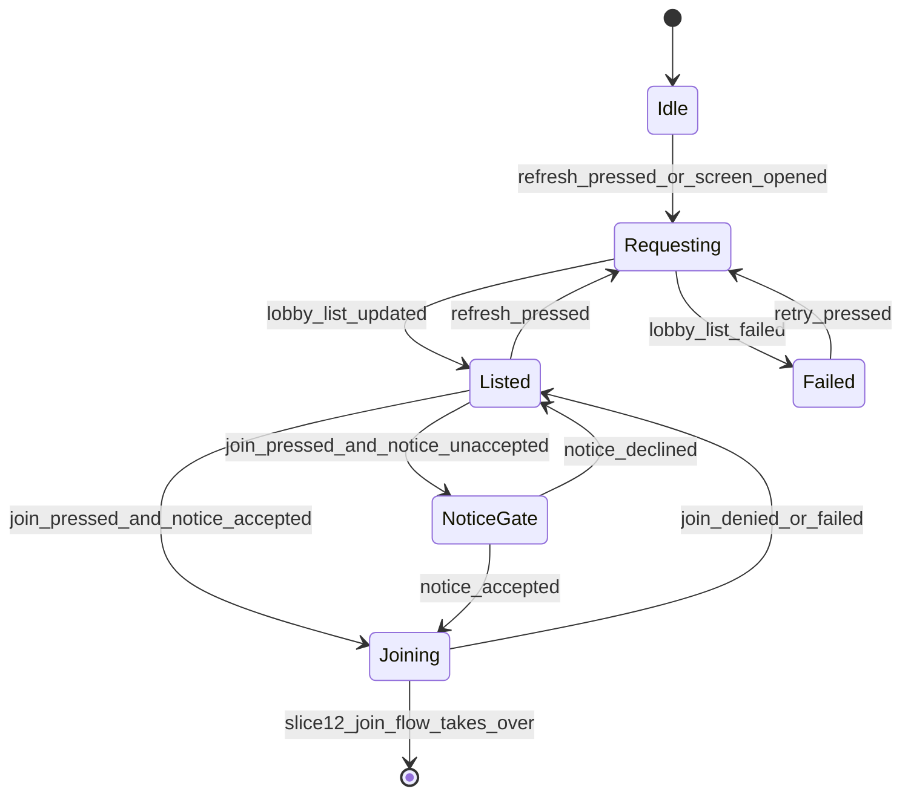

# Slice 13: Public Lobbies & Moderation
## Public lobby browser with filters, public/private flag, host kick + per-game blocklist, 18+ notice, text-blocklist enforcement audit

**Version:** 1.0
**Last Updated:** 2026-07-04
**Dependencies:**
- Slice 12 (Steam lobbies as room codes, lobby metadata schema, SteamMultiplayerPeer transport, `Platform`/SteamBackend lobby APIs)
- Slice 2 (lobby roster, join handshake this slice extends)
- Slice 9 (`fluid_rejoin_enabled` toggle whose default this slice flips for public lobbies)
- Skeleton (`TextFilter`, `Save`, `EventBus`)

**Provides:** Public lobby browser screen (list, filters, join, refresh), public/private visibility at creation, host kick with session-scoped blocklist and join-time enforcement, 18+/unmoderated notice (banner + accept-once-per-install dialog), TextFilter enforcement audit + tests, public-lobby anti-gaming default flip

---

## 1. Overview

This slice opens the game to strangers (§12) while keeping moderation honest about what it is: an indie game's "make casual malice annoying" tier (§13), not a trust-and-safety department. Concretely: a browsable list of public Steam lobbies with the facts a joiner cares about (mode, seats, rounds, draw time, pool type), a clearly labeled **unmoderated / 18+** disclosure, a host **kick** that actually sticks for the rest of that game, and a verification pass that every typed-text path in the shipped game goes through `TextFilter`.

### Scope

**In Scope:**
- Public lobby browser screen: Steam lobby list filtered to this game, row data from Slice 12 metadata, basic filters (mode, has-space), join button, rate-limited refresh
- Public/private flag at lobby creation (private = unlisted, join by code/invite only)
- Host kick from lobby **and** in-game roster; kicked `platform_id` on a per-game, session-scoped blocklist; join-time enforcement RPC path
- 18+/unmoderated notice: persistent browser banner + accept-once-per-install dialog before first public join (placeholder wording; legal pass in Slice 15)
- TextFilter enforcement audit: checklist + tests covering chat, captions, custom words, and any Slice 12 lobby-name field
- Anti-gaming default flip: `fluid_rejoin_enabled` defaults **OFF** in public lobbies (Slice 9's toggle, §9)

**Out of Scope (Other Slices / Not v1):**
- Matchmaking of any kind (§12 — explicitly none in v1)
- Persistent or global bans (kick blocklist is per-game only, §12)
- Reporting players to Steam / content reporting pipeline (not v1)
- Drawing moderation (accepted + disclosed, §13)
- Final legal wording of the notice (Slice 15 owner review)

### User Flows

**Browse & join:** Main menu → "Public Games" → browser lists open public lobbies → player filters to "Social, has space" → presses Join → (first time only) 18+ notice dialog → Accept → normal Slice 12 join flow.

**Host a public game:** Lobby creation (Slice 12 flow) gains a Public/Private selector (default **Private**) → public lobbies get listed metadata + `fluid_rejoin_enabled` default flipped off.

**Kick:** Host presses ⋮ → Kick on a roster row (lobby or in-game) → target sees "You were kicked by the host", returns to main menu → any rejoin attempt into that game is denied with the same message.

---

## 2. Data Models

### LobbyListing

**File: `res://ui/lobby/lobby_listing.gd`** — `class_name LobbyListing extends RefCounted`. Client-side parse of one Steam lobby's metadata into typed fields; malformed lobbies are dropped, never rendered half-empty.

```gdscript
class_name LobbyListing
extends RefCounted

var lobby_id: int = 0            # Steam lobby id
var mode: String = ""            # "default" | "streamlined" | "social" | "custom"
var players_cur: int = 0
var players_max: int = 0
var rounds: int = 0
var draw_time: int = 0           # seconds
var pool_type: String = ""       # e.g. "animal_adjective" (built-in) | "player_created"
var game_version: String = ""

static func from_lobby_metadata(lobby_id_in: int, meta: Dictionary) -> LobbyListing:
    # Returns null if any required key is missing/unparseable or version-incompatible.
    ...
```

### Steam lobby metadata (defined by Slice 12 — reproduced for reference)

This slice **consumes** the schema Slice 12 defines (key names below reconciled against `TDD/12-steam-integration.md` — 12 is authoritative if they ever drift):

| Key | Type (string-encoded) | Set by | Used here for |
|-----|----------------------|--------|---------------|
| `aq_proto` | String (protocol/compat version) | Slice 12 at creation | Compatibility filter (mismatch → hidden) |
| `aq_mode` | String | Host on settings change | Row display + mode filter |
| `aq_players` / `aq_max_players` | int | Host on roster change | Seats display + has-space filter |
| `aq_rounds` | int | Host on settings change | Row display |
| `aq_draw_time` | int (seconds) | Host on settings change | Row display |
| `aq_pool_type` | String | Host on settings change | Row display (§12 list requirement) |
| `aq_public` | "1" / "0" | This slice at creation | Public visibility (all Steam lobbies are search-public; `aq_public="0"` = unlisted, join by code/invite only — per Slice 12) |

### Session blocklist

Lives on the host inside `Roster` (Slice 2): `var _kick_blocklist: Array[String] = []` — **platform_ids** (not peer ids: peer ids change across reconnects; platform_id is the stable per-install identity from `PlatformBackend.get_platform_id()`, Steam ID under Slice 12). Session-scoped: created empty at lobby creation, discarded when the session ends. **Never persisted** (§12 — not a global ban).

### Join-deny reason extension

**Append to `res://core/constants/net_ids.gd`** (base enum owned by Slice 2/9):

```gdscript
enum JoinDenyReason { FULL, VERSION_MISMATCH, IN_PROGRESS_LOCKED, KICKED }  # KICKED added by Slice 13
```

---

## 3. Event/Action Definitions

### RPCs

The **kick has no `rpc_request_*`**: only the host may kick, and the host *is* the authority — host UI calls `GameSession.kick_player()` directly (a request RPC would only add a spoofable surface). The RPCs below are host-outbound plus one extended validation on an existing inbound handler.

| RPC | Direction | Args | Validation | Effect |
|-----|-----------|------|------------|--------|
| `rpc_do_kicked(reason: int)` | host → target peer (`authority`, `call_remote`, reliable) | `JoinDenyReason.KICKED` | Client: sender is authority | Target shows "kicked by host" dialog, `Net.leave()`, `Nav` to main menu |
| `rpc_sync_player_kicked(platform_id: String, display_name: String)` | host → all (`authority`, `call_local`, reliable) | Kicked player's identity | Client: sender is authority | Roster row removed, toast "\<name\> was kicked"; emits `EventBus.player_kicked` |
| `rpc_request_join_session(...)` *(existing — Slice 2/9)* | client → host | Slice 2/9 args incl. `platform_id` | **Extended step:** after existing checks, `if roster.is_blocklisted(platform_id): deny(KICKED)` | Blocklisted player receives the existing Slice 2/9 join-denied response with reason `KICKED` |

Host kick sequence (host-side, atomic): add `platform_id` to blocklist → `rpc_do_kicked(target)` → `multiplayer.multiplayer_peer.disconnect_peer(target_peer_id)` after a short grace (1s timer, in case the RPC is in flight) → roster removal via existing disconnect path → `rpc_sync_player_kicked`. Mid-game, the kicked player's already-submitted drawing **stays** in the current round (§9 rule applies; kicking removes the person, not the art) — but they are ineligible to rejoin, unlike a normal disconnect.

### EventBus Signals

**Append to `res://core/events/event_bus.gd`:**

```gdscript
## Emitted on all peers when the host kicks a player (after roster removal).
signal player_kicked(platform_id: String, display_name: String)
## Emitted locally when a public lobby list request completes. listings: Array[LobbyListing].
signal lobby_list_updated(listings: Array)
## Emitted locally when a lobby list request fails (Steam error / offline).
signal lobby_list_failed()
```

If Slice 12 already defines lobby-list signals on `Platform`, reuse those and drop the two list signals here — reconcile at implementation (Decision Log entry if changed).

---

## 4. Storage Schema Extensions

### profile.json extension

**File: `user://profile.json`** (via `Save`; existing file, add keys — no version bump needed, readers tolerate absent keys per consistency guide §6)

| Field | Type | Nullable | Default | Description |
|-------|------|----------|---------|-------------|
| `public_notice_accepted_v` | int | No | `0` | Highest notice-wording version the player accepted. `0` = never accepted |

The notice dialog shows when `public_notice_accepted_v < GameConstants.PUBLIC_NOTICE_VERSION` (currently `1`). Slice 15's legal pass bumps `PUBLIC_NOTICE_VERSION` if wording changes materially, which re-prompts everyone exactly once — accept-once-per-install, per wording version.

The kick blocklist is deliberately **not** stored here or anywhere on disk.

---

## 5. State Machines

### Public browser screen



| State | Description | Terminal? |
|-------|-------------|-----------|
| Idle | Screen opening, no data yet | No |
| Requesting | Steam lobby list request in flight (spinner; refresh disabled) | No |
| Listed | Rows rendered; filters + join active | No |
| Failed | Error panel with Retry (Steam offline, request failed) | No |
| NoticeGate | 18+ dialog modal over the list | No |
| Joining | Handed to Slice 12 join flow; deny (FULL/KICKED/...) returns to Listed with a toast | Yes (on success) |

### Transition Rules

| Current | Trigger | New | Validation | Side Effects |
|---------|---------|-----|------------|--------------|
| Idle/Listed/Failed | refresh | Requesting | ≥ `BROWSER_REFRESH_COOLDOWN_SECONDS` since last request | `Platform.request_lobby_list()` |
| Requesting | results | Listed | Parse rows via `LobbyListing.from_lobby_metadata`; drop nulls | Apply active filters, render |
| Listed | Join | NoticeGate / Joining | `public_notice_accepted_v >= PUBLIC_NOTICE_VERSION`? | Show dialog or start join |
| NoticeGate | Accept | Joining | — | Persist acceptance via `Save`, start join |
| NoticeGate | Decline | Listed | — | Nothing persisted |

---

## 6. Business Logic

### Kick + blocklist (Roster / GameSession extensions)

**File: `res://game/session/roster.gd`** (extends Slice 2)

```gdscript
func add_to_blocklist(platform_id: String) -> void:
    if platform_id != "" and not _kick_blocklist.has(platform_id):
        _kick_blocklist.append(platform_id)

func is_blocklisted(platform_id: String) -> bool:
    return _kick_blocklist.has(platform_id)
```

**File: `res://game/session/game_session.gd`**

```gdscript
func kick_player(target_peer_id: int) -> void:
    # Host-only, called directly from host UI (no request RPC by design).
    if not multiplayer.is_server():
        return
    if target_peer_id == 1:
        return  # host can never kick itself
    var player: PlayerState = roster.get_by_peer(target_peer_id)
    if player == null:
        return
    roster.add_to_blocklist(player.platform_id)
    rpc_id(target_peer_id, "rpc_do_kicked", NetIds.JoinDenyReason.KICKED)
    _start_kick_disconnect_timer(target_peer_id)   # force-disconnect after 1s grace
    rpc_sync_player_kicked(player.platform_id, player.display_name)
```

**Business Rules:**
1. Blocklist enforcement happens **only** on the host, inside the existing join handshake — a kicked client rejoining the *Steam* lobby is still rejected at the game-session layer (Steam lobbies have no per-user ban; the handshake is the real gate).
2. Kick during an active round: submitted drawing stays judged/reactable (§9); score row is retained (standings show them like any departed player); judge rotation skips them (existing Slice 9 behavior).
3. Kicking the current judge mid-round: reuse Slice 9's judge-drop handling (whatever it defines — skip/replace); this slice adds nothing special.
4. Blocklist is keyed on `platform_id` — a kicked player relaunching the game keeps the same Steam ID and stays blocked for that session.

### Public/private visibility

Lobby creation params (Slice 12 creation path) gain `is_public: bool` (default **false**):
- **Public:** Steam lobby type `PUBLIC` + `listed="1"` metadata.
- **Private:** Steam lobby type `FRIENDS_ONLY` (invites + join-by-code work; never in the browser) + `listed="0"`.

Visibility is fixed at creation in v1 (no mid-lobby flip — avoids notice/anti-gaming edge cases; revisit post-v1 if requested).

### Anti-gaming default flip (Slice 9 toggle)

```gdscript
# game/session/settings.gd (Slice 6/9 owned — this slice adds the visibility hook)
func apply_visibility_defaults(is_public: bool) -> void:
    if not fluid_rejoin_user_set:            # explicit host choice always wins
        fluid_rejoin_enabled = not is_public  # §9: ON private, OFF public
```

Called once at lobby creation. With fluid rejoin OFF, Slice 9's stricter public-lobby behavior applies (its own TDD defines the exact abuse guards, e.g. no judge-turn dodging via leave/rejoin).

### Browser service logic

Lives in the screen script (no autoload — the list is UI-local). Filtering is client-side over the returned rows (Steam-side filters are limited to string matches; we filter version via metadata match, everything else locally). Refresh rate limit: `BROWSER_REFRESH_COOLDOWN_SECONDS := 2.0` in `game_constants.gd`.

### TextFilter enforcement audit

The audit verifies the consistency-guide rule ("typed text passes through TextFilter before display/broadcast", guide §11) at **every** entry point, with host-side enforcement as the authority (client-side filtering is cosmetic; a modified client must still be caught by the host):

| # | Entry point | Slice that owns it | Client side | Host side (authoritative) |
|---|-------------|--------------------|-------------|---------------------------|
| 1 | Chat messages (incl. judge heckling) | 2/3 | `censor()` preview | `censor()` before broadcast |
| 2 | Drawing captions | 5 | `is_clean()` gate on submit | `censor()` on receipt before reveal |
| 3 | Player-created prompt words | 7 | `is_clean()` gate on submit | `is_clean()` → reject + resubmit prompt |
| 4 | Lobby name (only if Slice 12 exposes one) | 12 | `is_clean()` gate | Host sets metadata only after filtering |

Deliverables: the table above verified against actual code (grep for `TextFilter` call sites + each send path traced), plus the tests in Section 11. Any hole found is fixed **in this slice** and logged.

---

## 7. UI Components

### Public Browser Screen

**File: `res://ui/lobby/public_browser_screen.tscn`** + script (route: `Routes.PUBLIC_BROWSER`)

**Layout:**
```
+------------------------------------------------------------+
| < Back      PUBLIC GAMES                        [Refresh]  |
| [!] Public lobbies are UNMODERATED - 18+ / at your own risk|
+------------------------------------------------------------+
| Filters: Mode [All v]   [x] Has space                      |
+------------------------------------------------------------+
| Mode        Players  Rounds  Draw   Pool          |        |
| Social       4/8      12     45s    Built-in      | [Join] |
| Streamlined  7/8      16     20s    Built-in      | [Join] |
| Custom       3/6      10     60s    Player-made   | [Join] |
+------------------------------------------------------------+
| (empty state: "No open public games - host one!")          |
+------------------------------------------------------------+
```

**User Interactions:**
| Action | Trigger | Result |
|--------|---------|--------|
| Refresh | Button (disabled during request + cooldown) | New lobby list request |
| Filter | Mode dropdown / has-space checkbox | Re-filters current rows locally, instant |
| Join | Row button | Notice gate if unaccepted, else Slice 12 join flow |
| Back | Button | Main menu |

Full lobbies keep their row (information) with Join disabled unless "has space" filter hides them.

### PublicNoticeDialog Component

**File: `res://ui/lobby/public_notice_dialog.tscn`** — modal, `Accept` / `Go Back`. Body text from `GameConstants.PUBLIC_NOTICE_TEXT` (placeholder: *"Public games are played with strangers and are NOT moderated. Drawings and chat are player-created and may be offensive. 18+ — join at your own risk."* — **final wording: Slice 15 legal pass, §12**). Accept persists `public_notice_accepted_v`.

### Kick control (roster rows)

**Files:** extend `ui/lobby/` roster row + `ui/round/` in-game roster/scoreboard component (Slices 2/3).
Host-only ⋮ menu with **Kick** on every row except the host's own; confirmation dialog ("Kick \<name\>? They can't rejoin this game."). Non-host players never see the control. Kicked-player client shows a blocking dialog ("You were kicked by the host") over the main menu after disconnect.

### Public/Private selector

Extend the Slice 12 lobby-creation panel: two-option selector, default **Private**, with one-line explanations ("Private — invite & room code only" / "Public — listed for anyone; unmoderated, 18+").

### User Confirmation Checkpoints

- [ ] **Browser lists a real public lobby** (blocking — gates everything else in this slice): second Steam account/instance hosts public, first sees it with correct mode/seats/rounds/draw-time/pool-type
- [ ] **Private lobby is not listed** (blocking): same setup, private lobby absent from browser but joinable by code/invite
- [ ] **Kick end-to-end** (blocking): kicked client sees dialog + lands on menu; rejoin attempt denied with kicked message
- [ ] **Notice shows exactly once** (batchable): first public join prompts; second join does not; fresh `user://` prompts again
- [ ] **Filters** (batchable): mode + has-space behave as expected

---

## 8. State Management

No new autoloads. Browser state is screen-local (Section 5 machine); blocklist is host `Roster` state; notice acceptance is `Save`-backed profile state read through a small helper:

```gdscript
# ui/lobby/public_notice_gate.gd — class_name PublicNoticeGate (static helpers)
static func is_accepted() -> bool:
    var profile: Dictionary = Save.read_json("profile.json", {})
    return int(profile.get("public_notice_accepted_v", 0)) >= GameConstants.PUBLIC_NOTICE_VERSION

static func mark_accepted() -> void:
    var profile: Dictionary = Save.read_json("profile.json", {})
    profile["public_notice_accepted_v"] = GameConstants.PUBLIC_NOTICE_VERSION
    Save.write_json("profile.json", profile)
```

**Signal wiring:**
| Source | Signal | Consumer | Purpose |
|--------|--------|----------|---------|
| Platform/SteamBackend | `EventBus.lobby_list_updated / lobby_list_failed` | Browser screen | Render / error state |
| GameSession | `EventBus.player_kicked` | Lobby + round roster UIs, toast | Row removal + "was kicked" toast |
| Existing Slice 2/9 join-denied path | (reason `KICKED`) | Joining client UI | Kicked-rejoin denial message |

---

## 9. Integration Points

### Dependencies (What This Slice Needs)

#### From Skeleton
- `TextFilter` (audit target), `Save` (notice persistence), `EventBus`, `Nav`/`Routes`

#### From Slice 12
- Lobby creation path (gains `is_public`), lobby metadata schema + `request_lobby_list()` on the Steam backend, join-by-lobby flow the browser hands off to — **metadata key names in Section 2 are assumptions; reconcile with the Slice 12 TDD**
- `platform_id` = Steam ID via `PlatformBackend.get_platform_id()`

#### From Slice 2/9
- Join handshake (`rpc_request_join_session`) + `JoinDenyReason` enum (this slice appends `KICKED`)
- `fluid_rejoin_enabled` setting + `fluid_rejoin_user_set` tracking (Slice 9)

#### From Slices 3/5/7
- The typed-text paths under audit (chat, captions, custom words)

### Provides (For Future Slices)
- **`player_kicked` signal** — anything wanting kick telemetry later
- **`PublicNoticeGate` + `PUBLIC_NOTICE_VERSION`** — Slice 15 bumps the version after the legal wording pass
- **Public/private flag + browser** — Slice 15's full playtest matrix exercises both

### Integration Checklist
- [ ] `KICKED` appended to `JoinDenyReason`; browser/notice constants in `game_constants.gd`
- [ ] EventBus signals appended with doc comments
- [ ] Kick RPCs added to GameSession group; join handshake extended with blocklist check
- [ ] `Routes.PUBLIC_BROWSER` registered; main-menu "Public Games" button added
- [ ] Lobby creation panel gains Public/Private; `apply_visibility_defaults` called at creation
- [ ] TextFilter audit table verified against code; findings fixed + logged

---

## 10. Edge Cases

### Kicked player rejoins the Steam lobby anyway
**Scenario:** Steam lobbies can't ban per-user; the kicked client can re-enter the Steam lobby container.
**Handling:** The game-session handshake is the gate — join denied with `KICKED` every time; client shows "You were kicked from this game" and leaves the Steam lobby.
**Rationale:** One authoritative gate beats fighting Steam's lobby semantics (§13: annoy casual malice, don't chase perfection).

### Kick races an in-flight action
**Scenario:** Target's kudos/chat RPC arrives after the host blocklists them but before disconnect completes.
**Handling:** Existing 5-step validation already resolves sender → roster; the kick removes/flags the roster entry first, so late requests fail the lookup and are dropped silently.
**Rationale:** Consistency guide §4 — invalid input drops, never crashes.

### Host kicks during target's judge turn
**Scenario:** The judge gets kicked mid-round.
**Handling:** Delegated to Slice 9's judge-disconnect handling (same path as a drop); blocklist just prevents return.
**Rationale:** One code path for "judge vanished," regardless of why.

### Kick drops the roster below 3
**Scenario:** 3-player game, host kicks one.
**Handling:** Normal §9 below-minimum pause triggers ("waiting for players…", host end-early button). Confirmation dialog warns: "This will pause the game (below 3 players)."
**Rationale:** Kick is just a departure with a no-return flag; reuse the pause machinery.

### Metadata lies (stale or forged)
**Scenario:** A listed lobby's metadata says 3/8 but it's actually full, wrong version, or forged by a modified host.
**Handling:** Browser data is advisory only; the join handshake re-validates everything (version, capacity, blocklist). Deny reasons surface as toasts and the row refreshes.
**Rationale:** Treat lobby metadata like any client input — untrusted (§13).

### Steam offline / ENet dev backend
**Scenario:** Browser opened with `--platform=enet` or Steam down.
**Handling:** `supports_lobby_browser()` is false on EnetBackend → main-menu button disabled with tooltip ("Steam required"); if a live request fails, Failed state + Retry.
**Rationale:** Platform seam already models this (skeleton §3.2); no fake dev browser needed — kick/blocklist logic is still fully testable over ENet.

### Notice wording changes after acceptance
**Scenario:** Slice 15's legal pass rewrites the notice.
**Handling:** `PUBLIC_NOTICE_VERSION` bump → everyone re-prompted exactly once.
**Rationale:** Acceptance is of specific wording, not of the concept.

### Two players share a machine/install
**Scenario:** Kicked player's sibling plays from the same install (same platform_id under ENet dev; distinct Steam accounts ship distinct IDs).
**Handling:** Blocklist keys on platform_id — same install stays blocked for that game. Accepted.
**Rationale:** §13 tier: simple safeguard over identity forensics.

### Performance Considerations
Lobby list requests return ≤ 50 lobbies typically; parsing is trivial. Rows are plain containers (no drawings). Refresh cooldown (2s) prevents API spam. Kick adds no steady-state cost.

---

## 11. Testing Strategy

### Unit Tests

**Location:** `res://tests/game/session/`, `res://tests/ui/lobby/`

#### Blocklist & kick logic
- [ ] `test_kick_adds_platform_id_to_blocklist`
- [ ] `test_blocklisted_platform_id_denied_at_join_with_kicked_reason`
- [ ] `test_kick_host_self_is_noop`
- [ ] `test_kick_unknown_peer_is_noop`
- [ ] `test_blocklist_cleared_on_new_session`
- [ ] `test_normal_disconnect_not_blocklisted` (rejoin still allowed when fluid rejoin on)

#### Visibility & defaults
- [ ] `test_public_lobby_sets_listed_metadata_and_public_type`
- [ ] `test_private_lobby_not_listed`
- [ ] `test_fluid_rejoin_defaults_off_when_public_on_when_private`
- [ ] `test_explicit_host_choice_survives_visibility_default`

#### Listing parse & notice gate
- [ ] `test_listing_parse_drops_missing_or_malformed_metadata`
- [ ] `test_listing_parse_drops_version_mismatch`
- [ ] `test_notice_gate_unaccepted_by_default_and_persists_acceptance`
- [ ] `test_notice_reprompts_on_version_bump`

#### TextFilter audit tests (host-side authority)
- [ ] `test_chat_broadcast_path_censors_blocklisted_words`
- [ ] `test_caption_receipt_path_censors_before_reveal`
- [ ] `test_custom_word_submission_rejected_when_unclean`
- [ ] `test_lobby_name_filtered_before_metadata_set` (skip with reason if Slice 12 has no lobby name)

### Integration Tests
- [ ] Host kicks over live ENet: target receives `rpc_do_kicked`, is disconnected, roster syncs on remaining peer, rejoin denied
- [ ] Browser state machine: request → results → filter → join-denied returns to Listed

### UI/Component Tests
- [ ] Browser screen + notice dialog instantiate without error (smoke)
- [ ] Empty state renders when zero lobbies returned
- [ ] Kick control absent for non-host clients

### Manual Testing Required
- [ ] Two Steam accounts (Spacewar App ID 480): public lobby appears in browser with correct metadata; private does not — **blocking**
- [ ] Kick end-to-end incl. rejoin denial — **blocking**
- [ ] Notice once-per-install behavior — batchable
- [ ] Filters + refresh cooldown feel — batchable

---

## 12. Implementation Checklist

### Setup
- [ ] Append `KICKED` to `JoinDenyReason`; add `PUBLIC_NOTICE_VERSION`, `PUBLIC_NOTICE_TEXT` (placeholder), `BROWSER_REFRESH_COOLDOWN_SECONDS` to constants
- [ ] Append EventBus signals with doc comments
- [ ] Reconcile Slice 12 metadata key names + lobby-list API against its TDD (Decision Log if different)

### Business Logic
- [ ] `Roster` blocklist methods + join-handshake enforcement step
- [ ] `GameSession.kick_player` + `rpc_do_kicked` + `rpc_sync_player_kicked` + grace-disconnect timer
- [ ] Lobby creation `is_public` param → Steam lobby type + `listed` metadata
- [ ] `apply_visibility_defaults` wired at creation (fluid-rejoin flip)
- [ ] `LobbyListing.from_lobby_metadata` with strict parsing

### UI Layer
- [ ] `public_browser_screen` (list, filters, refresh, empty/failed states) + route + main-menu button (disabled on non-Steam backend)
- [ ] `public_notice_dialog` + `PublicNoticeGate` persistence
- [ ] Kick control on lobby + in-game roster rows (host-only) + confirmation + kicked-player dialog
- [ ] Public/Private selector on lobby creation panel

### TextFilter Audit
- [ ] Trace all four entry points in code; verify host-side filtering on each; fix any hole found in this slice
- [ ] Record audit result (table + call sites) in Implementation Notes

### Testing
- [ ] All unit/integration tests above green; full suite green
- [ ] Two-account Steam manual pass (blocking items)

### User Confirmation
- [ ] Blocking: browser listing, private unlisted, kick end-to-end confirmed
- [ ] Batchable: notice once, filters/refresh confirmed

### Documentation
- [ ] Update WHERE_WE_ARE; Implementation Notes (incl. audit record); Decision Log for any Slice 12 reconciliation
