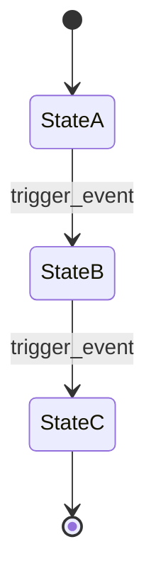

# Slice Contract Template

**Purpose:** This template defines the standard structure every slice document must follow to ensure consistency, completeness, and clear integration contracts. This template is framework-agnostic.

---

## Quick Reference Summary

**Use this section for quick refreshes. When starting a new slice, read the FULL document.**

### The 12 Required Sections
1. **Overview** - What it does, scope (in/out), user flows
2. **Data Models** - Classes, types, relationships
3. **Event/Action Definitions** - Event types, payloads, triggers
4. **Storage Schema Extensions** - Tables, indexes, migrations
5. **State Machines** - States, transitions, rules (if applicable)
6. **Business Logic** - Services, methods, business rules
7. **UI Components** - Screens, components, interactions
8. **State Management** - Providers/stores, state shape, actions
9. **Integration Points** - Dependencies, what this slice provides
10. **Edge Cases** - Unusual scenarios, conflict handling
11. **Testing Strategy** - Unit, integration, UI, manual tests
12. **Implementation Checklist** - Step-by-step tasks

### Entry Criteria (Before Starting)
- [ ] All dependency slices complete and tested
- [ ] Slice document reviewed for completeness
- [ ] User has confirmed slice design matches their vision

### Exit Criteria (Before Marking Complete)
- [ ] All implementation checklist items done
- [ ] All tests passing (unit, integration, UI)
- [ ] User has confirmed UI features work
- [ ] Implementation Notes document created
- [ ] WHERE_WE_ARE updated
- [ ] No regressions in existing functionality

### Document Header Format
```markdown
# Slice N: [Name]
## [One-line description]
**Version:** 1.0 | **Last Updated:** [Date]
**Dependencies:** [Prerequisite slices]
**Provides:** [Key capabilities]
```

### Implementation Status (Add When Complete)
```markdown
## Implementation Status
**Status:** COMPLETE | **Completed:** [Date]
**Implementation Notes:** [Link to notes document]
```

---

## Document Header

Every slice document must start with:

```markdown
# Slice N: [Slice Name]
## [One-line description]

**Version:** 1.0  
**Last Updated:** [Date]  
**Dependencies:** [List of prerequisite slices]  
**Provides:** [Key capabilities this slice delivers]
```

---

## Required Sections

### 1. Overview

**Purpose:** Provide high-level context and scope definition.

**Must include:**
- Summary of what the slice implements
- Scope section with explicit "In Scope" and "Out of Scope" lists
- User flows or key scenarios
- Design principles or philosophy (if applicable)

**Example:**
```markdown
## Overview

This slice implements [feature]. It provides [capability] while maintaining [constraint].

### Scope

**In Scope:**
- Feature A
- Feature B
- Integration with X

**Out of Scope (Later Slices):**
- Advanced feature C (Slice N+1)
- Feature D (future enhancement)
```

---

### 2. Data Models

**Purpose:** Define all new data structures introduced by this slice.

**Must include:**
- Class/type definitions or references
- Enums and constants
- Serialization requirements (if applicable)
- Data transfer objects (DTOs) if needed
- Model relationships and dependencies

**Template:**
```markdown
## Data Models

### [ModelName] Model

**File: `[TECH-STACK: path/to/model/file]`**

[TECH-STACK: Include your class/type definition here using your language's syntax]

**Fields:**
| Field | Type | Required | Description |
|-------|------|----------|-------------|
| id | string | Yes | Unique identifier |
| [field] | [type] | [Yes/No] | [Description] |

**Relationships:**
- [Describe relationships to other models]
```

---

### 3. Event/Action Definitions

**Purpose:** Document all new event types, actions, or state changes and their payloads.

**Must include:**
- Event/action type constant names
- Where to add them in the codebase
- Full payload structure with types
- When each event/action is triggered
- Any special handling notes

**Template:**
```markdown
## Event/Action Definitions

### Event Types

[TECH-STACK: Add to your constants/events file]

| Event Type | Constant Name | Description |
|------------|---------------|-------------|
| feature_created | featureCreated | Triggered when... |
| feature_updated | featureUpdated | Triggered when... |

### Event Payloads

#### feature_created

```json
{
  "entity_id": "uuid",
  "property": "value",
  "timestamp": "ISO 8601 string",
  "actor_id": "uuid"
}
```

**Triggered when:** [Describe trigger conditions]
**Handled by:** [List handlers/subscribers]
```

---

### 4. Storage Schema Extensions

**Purpose:** Define database table changes and additions.

**Must include:**
- New table/collection definitions
- Table modification instructions if extending existing tables
- Index definitions for query performance
- Migration considerations

**Template:**
```markdown
## Storage Schema Extensions

### [TableName] Table/Collection

**File: `[TECH-STACK: path/to/schema/file]`**

[TECH-STACK: Include your table/schema definition using your database/ORM syntax]

**Columns/Fields:**
| Column | Type | Nullable | Default | Description |
|--------|------|----------|---------|-------------|
| id | string/uuid | No | - | Primary key |
| [column] | [type] | [Yes/No] | [value] | [Description] |

**Indexes:**
| Index Name | Columns | Purpose |
|------------|---------|---------|
| idx_[table]_[column] | [column] | [Why this index is needed] |

**Migrations:**
[Describe any migration steps needed]
```

---

### 5. State Machines (if applicable)

**Purpose:** Document state transitions and business rules.

**Must include:**
- Mermaid state diagram
- State transition table with validation rules
- Terminal vs non-terminal states

**Template:**
```markdown
## State Machines

### [Entity] State Machine



### States

| State | Description | Terminal? |
|-------|-------------|-----------|
| StateA | [Description] | No |
| StateB | [Description] | No |
| StateC | [Description] | Yes |

### Transition Rules

| Current State | Trigger | New State | Validation | Side Effects |
|---------------|---------|-----------|------------|--------------|
| StateA | event_x | StateB | [Rules] | [What happens] |
| StateB | event_y | StateC | [Rules] | [What happens] |
```

---

### 6. Business Logic

**Purpose:** Detail the core service layer implementation.

**Must include:**
- Service class definitions
- Key method signatures and purposes
- Business rule implementations
- Integration with event/state systems
- Extension points for other slices

**Template:**
```markdown
## Business Logic

### [Feature] Service

**File: `[TECH-STACK: path/to/service/file]`**

**Purpose:** [What this service is responsible for]

**Dependencies:**
- [List dependencies this service requires]

**Key Methods:**

#### methodName()
**Signature:** [TECH-STACK: method signature in your language]
**Purpose:** [What this method does]
**Parameters:**
- `param1`: [Description]
**Returns:** [Return type and description]
**Throws/Errors:** [Error conditions]

**Business Rules:**
1. [Rule 1]
2. [Rule 2]

### State/Event Handler Extensions

[TECH-STACK: Describe how to extend your state management or event handling system]

**Add handler for:** `event_type_name`
**Handler behavior:** [Describe what the handler should do]
```

---

### 7. UI Components

**Purpose:** Document the user interface implementation.

**Must include:**
- Screen structure (mermaid diagram if complex)
- Key component descriptions
- File locations
- User interaction flows
- Responsive design considerations

**Template:**
```markdown
## UI Components

### [Screen Name] Screen

**File: `[TECH-STACK: path/to/screen/file]`**

**Purpose:** [What this screen displays/does]

**Layout:**
```
[ASCII or description of layout]
+------------------+
|     Header       |
+------------------+
|                  |
|   Main Content   |
|                  |
+------------------+
|     Footer       |
+------------------+
```

**User Interactions:**
| Action | Trigger | Result |
|--------|---------|--------|
| [Action] | [User does X] | [System does Y] |

### [Component Name] Component

**File: `[TECH-STACK: path/to/component/file]`**

**Purpose:** [What this component does]
**Props/Inputs:** [List inputs/props]
**Events/Outputs:** [List events/outputs]

### User Confirmation Checkpoints

[List any UI features that require explicit user testing before marking complete]

- [ ] [Feature 1]: User must confirm [specific behavior]
- [ ] [Feature 2]: User must confirm [specific behavior]
```

---

### 8. State Management

**Purpose:** Define state providers, stores, or reactive patterns.

**Must include:**
- State container/provider definitions
- State dependencies
- Reactive patterns used
- State access patterns

**Template:**
```markdown
## State Management

### [Feature] State

**File: `[TECH-STACK: path/to/state/file]`**

[TECH-STACK: Use your framework's state management pattern - Redux, Riverpod, Vuex, MobX, etc.]

**State Shape:**
```
[Describe the shape of your state]
{
  items: [],
  selectedId: null,
  isLoading: false,
  error: null
}
```

**Selectors/Computed:**
| Name | Purpose | Dependencies |
|------|---------|--------------|
| [name] | [What it computes] | [What state it depends on] |

**Actions/Mutations:**
| Name | Purpose | Payload |
|------|---------|---------|
| [name] | [What it does] | [Payload shape] |
```

---

### 9. Integration Points

**Purpose:** Define how this slice integrates with other slices and the skeleton.

**Must include:**
- Dependencies on skeleton components
- Dependencies on previous slices
- What future slices can depend on from this slice
- Extension hooks for future slices

**Template:**
```markdown
## Integration Points

### Dependencies (What This Slice Needs)

#### From Skeleton
- [Component]: [How it's used]
- [Service]: [How it's used]

#### From Slice N
- [Feature]: [How it's used]
- [Event]: [How it's consumed]

### Provides (What This Slice Offers)

#### For Future Slices
- **[Capability]**: [Description of what other slices can use]
- **[Event]**: [Event that other slices can subscribe to]

### Integration Checklist

- [ ] Event types added to constants
- [ ] State handlers registered
- [ ] Database tables created
- [ ] Routes added (if applicable)
- [ ] Navigation updated (if applicable)
```

---

### 10. Edge Cases

**Purpose:** Document important edge cases and how they're handled.

**Must include:**
- Unusual scenarios
- Conflict scenarios
- Offline behavior (if applicable)
- Data migration concerns
- Performance considerations

**Template:**
```markdown
## Edge Cases

### [Edge Case 1 Name]
**Scenario:** [Describe the situation]
**Handling:** [How the system responds]
**Rationale:** [Why this approach]

### [Edge Case 2 Name]
**Scenario:** [Describe the situation]
**Handling:** [How the system responds]
**Rationale:** [Why this approach]

### Conflict Resolution
[Describe how conflicts are resolved if applicable]

### Performance Considerations
[Describe any performance concerns and mitigations]
```

---

### 11. Testing Strategy

**Purpose:** Define what and how to test.

**Reference:** See `workflows/testing-protocol.md` for comprehensive testing practices including test-alongside development, when to run tests, and user confirmation requirements. The Testing Protocol should be followed during implementation.

**Must include:**
- Unit test categories and key scenarios
- Integration test requirements
- UI/component test requirements
- Performance test considerations

**Template:**
```markdown
## Testing Strategy

### Unit Tests

**Location:** `[TECH-STACK: path/to/tests]`

#### Service Layer Tests
- [ ] [Test scenario 1]
- [ ] [Test scenario 2]
- [ ] [Test error handling]

#### State Handler Tests
- [ ] [Event handling correctness]
- [ ] [State transition validation]

### Integration Tests

- [ ] [Integration flow 1]
- [ ] [Integration flow 2]

### UI/Component Tests

- [ ] [Component renders correctly]
- [ ] [User interactions work]
- [ ] [Loading states display]
- [ ] [Error states display]

### Manual Testing Required

[List any tests that require manual/user confirmation]

- [ ] [UI feature 1]: Requires user confirmation
- [ ] [UI feature 2]: Requires user confirmation
```

---

### 12. Implementation Checklist

**Purpose:** Provide a step-by-step checklist for implementing the slice.

**Must include:**
- Ordered list of implementation tasks
- File creation tasks
- Integration tasks
- Testing tasks
- Verification steps
- Documentation tasks

**Template:**
```markdown
## Implementation Checklist

### Setup
- [ ] Create feature folder structure
- [ ] Add constants/event types

### Data Layer
- [ ] Implement data models
- [ ] Create database tables/schema
- [ ] Write migrations (if needed)

### Business Logic
- [ ] Implement service layer
- [ ] Add state/event handlers
- [ ] Implement business rules

### State Management
- [ ] Create state containers/providers
- [ ] Implement selectors/computed values

### UI Layer
- [ ] Implement screens
- [ ] Implement components
- [ ] Wire up state management
- [ ] Add navigation/routing

### Testing
- [ ] Write unit tests for services
- [ ] Write unit tests for state handlers
- [ ] Write component/UI tests
- [ ] Write integration tests
- [ ] Run all tests - confirm passing

### User Confirmation
- [ ] User has tested [UI feature 1]
- [ ] User has tested [UI feature 2]
- [ ] User confirms slice is complete

### Documentation
- [ ] Update WHERE_WE_ARE
- [ ] Create Implementation Notes
- [ ] Update Decision Log (if deviations)
```

---

## Entry Criteria

Before starting a slice implementation:

1. **Dependencies complete**: All prerequisite slices must be implemented and tested
2. **Design reviewed**: Slice document reviewed for completeness and consistency
3. **Environment ready**: Development environment set up with all dependencies
4. **User alignment**: User has confirmed the slice design matches their vision

---

## Exit Criteria

A slice is complete when:

1. **All checklist items done**: Every item in implementation checklist checked off
2. **Tests passing**: All unit, integration, and UI tests pass
3. **Integration verified**: Slice integrates cleanly with existing slices
4. **User confirmation**: User has tested UI features and confirms they work
5. **Documentation updated**: Implementation Notes created, WHERE_WE_ARE updated
6. **No regressions**: Existing slice functionality still works
7. **Code reviewed**: Code follows Consistency & Integration Guide

---

## Dependency Declaration Format

When declaring dependencies, use this format:

```markdown
**Dependencies:** 
- Skeleton (database, event system)
- Slice 1 ([specific features used])
- Slice 2 ([specific features used])
```

Be specific about what is needed from each dependency.

---

## Change Management

If during implementation you discover the design needs changes:

1. **Document the issue**: Why does the design need to change?
2. **Confirm with user**: Does user agree with proposed change?
3. **Impact analysis**: How does this affect other slices?
4. **Update TDD**: Modify slice document to reflect decision
5. **Decision Log**: Create entry explaining the change
6. **Update checklist**: Adjust implementation checklist if needed

---

## Mermaid Diagram Guidelines

When creating diagrams:

- **No spaces in node IDs**: Use `camelCase` or `underscores`
- **No HTML tags**: Avoid `<br/>` and similar
- **Quote special characters**: Wrap labels with special chars in quotes
- **Clear, simple layouts**: Prefer clarity over complexity
- **Consistent styling**: Follow examples in existing slices

---

## Code Example Guidelines

When including code examples:

- **Complete enough**: Show full context, not fragments
- **Realistic**: Use actual file paths and structure
- **Commented**: Explain non-obvious logic
- **Consistent**: Follow project naming conventions
- **Placeholder markers**: Use `[TECH-STACK: description]` for framework-specific code
- **Forward references**: Use `// Implementation in Slice N` for dependencies on future work

---

## File Path Conventions

Always use complete file paths:

- Good: `[root]/features/tasks/services/task_service.[ext]`
- Bad: `task_service.[ext]`

This helps developers navigate the codebase without ambiguity.

---

## Terminology Consistency

Use consistent terminology throughout. Define your project's terms in the Consistency Guide:

**Common terms (adjust to your tech stack):**
- **Event/Action**: Immutable record of something that happened
- **State**: Current data derived from events/actions
- **Model**: Data structure
- **DTO**: Data Transfer Object
- **Service**: Business logic layer
- **Repository**: Data access layer
- **Store/Provider**: State management container
- **Component/Widget**: UI building block
- **Screen/Page/View**: Full-page UI container

---

## Implementation Notes Section

**Added to slice document after completion:**

When a slice is marked complete, an Implementation Notes document is created separately (see `documentation-procedures.md`), but a summary reference should be added to the original slice document:

```markdown
---

## Implementation Status

**Status:** COMPLETE
**Completed:** YYYY-MM-DD
**Implementation Notes:** [Link to implementation notes document]

### Summary of Deviations
- [Brief list of significant deviations, with links to full details]
```

---

## Final Notes

This template ensures:

- **Completeness**: Nothing important is forgotten
- **Consistency**: All slices have same structure
- **Traceability**: Easy to find information
- **Implementability**: Developers can build from docs alone
- **Verifiability**: Clear criteria for completion

Every slice should be self-contained enough that a developer or AI can implement it by reading only:
1. The slice document
2. The Skeleton Build Guide
3. The Consistency & Integration Guide
4. Dependency slice documents (for interfaces)

---

**End of Slice Contract Template**
