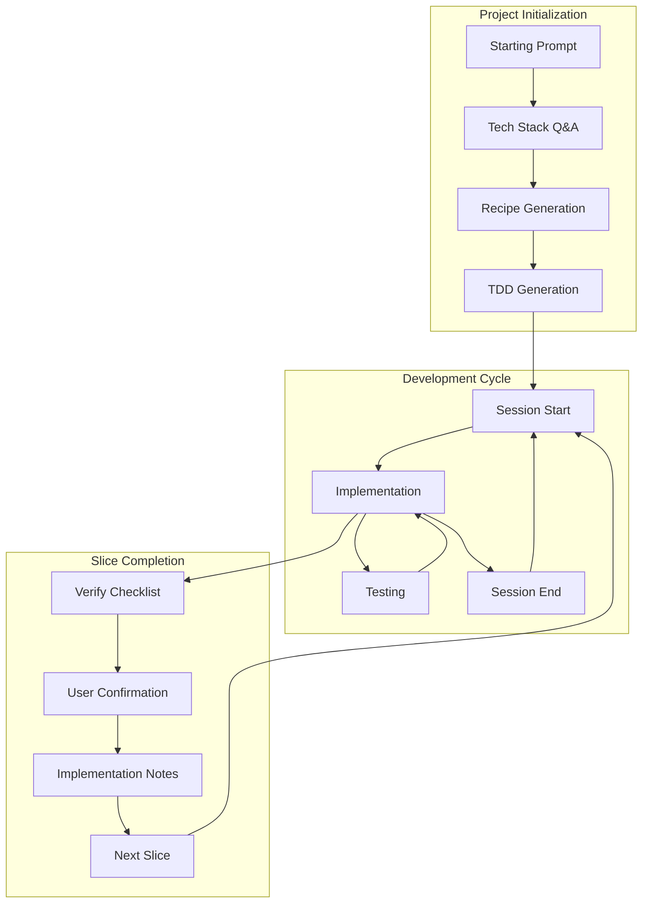

# 3 Pillars Development System

A framework-agnostic project management and documentation system for AI-assisted software development.

---

## Overview

The 3 Pillars system provides a structured approach to building software projects with AI assistance. It ensures:

- **Consistent documentation** across all projects
- **Seamless session continuity** - any AI can resume work from where the last left off
- **Clear progress tracking** - always know what's done and what's next
- **Comprehensive design documents** - developers can implement without guessing
- **Quality assurance** - built-in testing and user confirmation workflows

---

## System Components

### The 3 Pillars


| Pillar | File                                       | Purpose                                              |
| ------ | ------------------------------------------ | ---------------------------------------------------- |
| 1      | `pillars/01-documentation-procedures.md`   | How to create and maintain project documentation     |
| 2      | `pillars/02-slice-contract-template.md`    | Standard structure for feature slice TDDs            |
| 3      | `pillars/03-consistency-guide-template.md` | Template for project-specific patterns and standards |


### Workflows


| Workflow         | File                            | When to Use                            |
| ---------------- | ------------------------------- | -------------------------------------- |
| Session Start    | `workflows/session-start.md`    | Beginning of every development session |
| Session End      | `workflows/session-end.md`      | End of every development session       |
| Slice Completion | `workflows/slice-completion.md` | When finishing a feature slice         |
| Testing Protocol | `workflows/testing-protocol.md` | Throughout implementation              |


### Templates


| Template             | File                                         | Creates                        |
| -------------------- | -------------------------------------------- | ------------------------------ |
| WHERE_WE_ARE         | `templates/WHERE_WE_ARE.template.md`         | Project status tracker         |
| Session Log          | `templates/session-log.template.md`          | Individual session records     |
| Implementation Notes | `templates/implementation-notes.template.md` | Slice completion documentation |
| Recipe               | `templates/recipe.template.md`               | Pre-TDD project specification  |
| Decision Log         | `templates/decision-log.template.md`         | Design decision tracker        |
| Overview of Slices   | `templates/overview-of-slices.template.md`   | Slice summary and dependencies |


### Entry Point


| Document        | File                 | Purpose                 |
| --------------- | -------------------- | ----------------------- |
| Starting Prompt | `STARTING_PROMPT.md` | Initialize new projects |


---

## Quick Start

### Starting a New Project

1. **Copy the Starting Prompt** from `STARTING_PROMPT.md`
2. **Add your project description** (features, constraints, preferences)
3. **Provide to your AI assistant** along with the 3 Pillar documents
4. **Answer the AI's questions** about tech stack and features
5. **Review and approve** the generated documentation

### Resuming an Existing Project

1. **Provide to your AI:**
  - The 3 Pillar documents
  - `WHERE_WE_ARE.md` from your project
  - `Session-start.md` from the workflows folder
2. **Say:** "Let's keep working on the project"
3. **The AI will:**
  - Read WHERE_WE_ARE to understand current state
  - Confirm the next steps with you
  - Resume implementation

### Ending a Session

1. **Tell your AI:** "Are we done for today?"
2. **Provide the current date/time**
3. **The AI will:**
  - Create a session log
  - Update WHERE_WE_ARE
  - Confirm documentation is complete

---

## Key Concepts

### Skeleton and Slices

Projects are broken into:

- **Skeleton**: Core infrastructure, project structure, base systems
- **Vertical Slices**: Complete features implemented end-to-end

Slices are implemented in order based on dependencies. Each slice has its own Technical Design Document (TDD).

### WHERE_WE_ARE

The single source of truth for project status. Contains:

- Current active slice
- What we're working on
- Session history
- Next steps

Any AI can read this and understand exactly where to resume.

### Context Refresh Checkpoints

Long AI sessions can cause "context drift" where early instructions are forgotten. Checkpoints embedded in workflows remind the AI to re-read relevant documents at critical moments:

- Before writing documentation
- Before completing a slice
- Before making architectural decisions

### Implementation Notes

When a slice is complete, an Implementation Notes document captures:

- What was actually built (vs. what was planned)
- Deviations from the original design
- Lessons learned
- Known limitations

This creates a historical record of the real implementation.

---

## Folder Structure

When using this system, your project will have:

```
[project_root]/
├── WHERE_WE_ARE.md              # Project status (created after init)
├── TDD/                         # Technical Design Documents
│   ├── 00-skeleton-build-guide.md
│   ├── 01-slice-[name].md
│   ├── 02-slice-[name].md
│   ├── ...
│   ├── consistency-guide.md     # Filled-in from template
│   ├── overview-of-slices.md
│   ├── decision-log.md
│   └── logs/                    # Session logs
│       ├── YYYY-MM-DD-session-1.md
│       └── ...
└── [your source code]
```

---

## Workflow Diagram



---

## Best Practices

### For Project Owners

1. **Be specific in your project description** - Ambiguity leads to assumptions
2. **Answer AI questions thoughtfully** - These decisions shape the architecture
3. **Test UI features when asked** - Don't skip user confirmation
4. **Review generated TDDs** - Catch misunderstandings early
5. **Keep sessions reasonable length** - Documentation quality decreases in very long sessions

### For AI Assistants

1. **Always read WHERE_WE_ARE first** - It's the source of truth
2. **Follow the Consistency Guide** - Patterns exist for a reason
3. **Ask don't assume** - Especially for design decisions
4. **Write tests alongside code** - Not after
5. **Document sessions properly** - Enable seamless handoffs
6. **Honor Context Refresh Checkpoints** - Re-read documents when prompted

### For Teams

1. **Use consistent AI assistants** - Context carries over better
2. **Review session logs** - Understand what was done
3. **Keep WHERE_WE_ARE accurate** - It's everyone's reference
4. **Update Decision Log** - Future team members need context

---

## Reading Guidance & Context Refresh

AI assistants need guidance on how to read documentation efficiently without missing critical information. The full Reading Guidance is in `**pillars/01-documentation-procedures.md**` (Section 2).

**Key concepts:**

- **Core principle:** "When in doubt, read more."
- **Reading depth tiers:** Full (new work), Targeted (routine tasks), Glance (format checks)
- **Task-Specific Reading Map:** What to read for common tasks
- **Context Refresh Checkpoints:** Reminders to re-read documents during long sessions

This guidance ensures AI workers can be efficient on familiar tasks while still reading thoroughly when thoroughness is needed.

---

## Troubleshooting

### AI Doesn't Follow Procedures

- Remind it of the specific workflow document
- Quote the relevant section
- Ask it to re-read and confirm understanding

### WHERE_WE_ARE Seems Wrong

- Check the latest session log for context
- Manually update if needed
- Document the correction

### Slice Taking Too Long

- Break into smaller sub-objectives
- Document progress in WHERE_WE_ARE
- Consider splitting the slice

### Lost Context Between Sessions

- Ensure WHERE_WE_ARE was updated
- Check if session log was created
- Provide more context in next session start

### Documentation Becoming Stale

- Follow the maintenance schedule in Documentation Procedures
- Review during slice completions
- Update during natural breakpoints

---

## Customization

### Adding Project-Specific Workflows

If your project needs additional workflows:

1. Create new workflow in `workflows/` folder
2. Follow the existing format with CHECKPOINT blocks
3. Reference from relevant pillar documents
4. Add to this README's workflow table

### Modifying Templates

Templates can be extended for project needs:

1. Add new sections as needed
2. Keep required sections intact
3. Document changes in your project's README
4. Consider contributing improvements back

---

## Version History


| Version | Date   | Changes         |
| ------- | ------ | --------------- |
| 1.0     | [Date] | Initial release |


---

## Contributing

This system was developed through practical use. Improvements are welcome:

1. Document issues encountered
2. Propose solutions
3. Test changes on real projects
4. Share improvements

---

## License

[Specify your license]

---

**End of README**